This document explains the flow of the <SwmToken path="src/sentry/replays/endpoints/project_replay_clicks_index.py" pos="100:3:3" line-data="        def data_fn(offset, limit):">`data_fn`</SwmToken> function, which is responsible for parsing search queries and calling <SwmToken path="src/sentry/replays/endpoints/project_replay_clicks_index.py" pos="106:3:3" line-data="            return query_replay_clicks(">`query_replay_clicks`</SwmToken> with the appropriate parameters. It handles exceptions related to invalid search queries and constructs the necessary arguments for the <SwmToken path="src/sentry/replays/endpoints/project_replay_clicks_index.py" pos="106:3:3" line-data="            return query_replay_clicks(">`query_replay_clicks`</SwmToken> function.

The flow starts with the <SwmToken path="src/sentry/replays/endpoints/project_replay_clicks_index.py" pos="100:3:3" line-data="        def data_fn(offset, limit):">`data_fn`</SwmToken> function, which parses search queries and handles any exceptions that might occur. It then calls the <SwmToken path="src/sentry/replays/endpoints/project_replay_clicks_index.py" pos="106:3:3" line-data="            return query_replay_clicks(">`query_replay_clicks`</SwmToken> function with the necessary parameters. The <SwmToken path="src/sentry/replays/endpoints/project_replay_clicks_index.py" pos="106:3:3" line-data="            return query_replay_clicks(">`query_replay_clicks`</SwmToken> function performs the actual querying of replay clicks, translating search filters into conditions and constructing a Snuba query. The results are then processed and returned.

# Flow drill down

```mermaid
graph TD;
      subgraph src/sentry/replays
d9f9805c3130ee0da7e8a5dff84ccc1923ae7092cc765a74e1e6be55481869b1(data_fn):::mainFlowStyle --> abf2791fe2442ad0226bf749de4a53a0ffcadd7a451e471128602fbae9ddd49f(get):::mainFlowStyle
end

subgraph src/sentry/replays
abf2791fe2442ad0226bf749de4a53a0ffcadd7a451e471128602fbae9ddd49f(get):::mainFlowStyle --> bea3ddc38c415d432f3944c5da9db20ce13dddf9801476970d87dbbeb2b103e4(query_replay_clicks):::mainFlowStyle
end

subgraph src/sentry/replays
bea3ddc38c415d432f3944c5da9db20ce13dddf9801476970d87dbbeb2b103e4(query_replay_clicks):::mainFlowStyle --> f90a3daa7b3d4ff05cef6ea236ecbae75ca9b85593982de3a2b7202842f1b8fe(handle_search_filters):::mainFlowStyle
end

subgraph src/sentry/replays
f90a3daa7b3d4ff05cef6ea236ecbae75ca9b85593982de3a2b7202842f1b8fe(handle_search_filters):::mainFlowStyle --> 33abb9d4c0b00fba1096d9def23c8aa068937eca70cf66d00de18c979fe5ec1d(attempt_compressed_condition):::mainFlowStyle
end

subgraph src/sentry/replays
33abb9d4c0b00fba1096d9def23c8aa068937eca70cf66d00de18c979fe5ec1d(attempt_compressed_condition):::mainFlowStyle --> e8180dd1487e3ce108f37a5d31494c6d455b17868ab7a67e3b48db380c1b3c98(append):::mainFlowStyle
end

subgraph src/sentry/replays
e8180dd1487e3ce108f37a5d31494c6d455b17868ab7a67e3b48db380c1b3c98(append):::mainFlowStyle --> cc3e85653bed81c9ae282de594596043aedea568dc339dce6f078b06e0ab5b04(process_message):::mainFlowStyle
end

subgraph src/sentry/replays
cc3e85653bed81c9ae282de594596043aedea568dc339dce6f078b06e0ab5b04(process_message):::mainFlowStyle --> d62f99fa8fbea3e750b40546c8593d1ccd1ce1b18dd2db1987aa378960a894c2(parse_replay_actions):::mainFlowStyle
end

subgraph src/sentry/replays
d62f99fa8fbea3e750b40546c8593d1ccd1ce1b18dd2db1987aa378960a894c2(parse_replay_actions):::mainFlowStyle --> da16a2f1064468142a8ab3c700af8cbfd7641293461d643061e0b5f81ff1d002(get_user_actions):::mainFlowStyle
end

subgraph src/sentry/replays
da16a2f1064468142a8ab3c700af8cbfd7641293461d643061e0b5f81ff1d002(get_user_actions):::mainFlowStyle --> 92a09ed224033563bb07c0b082ca92195958a360e1a9afada649b30ccdf7c8f7(_handle_breadcrumb):::mainFlowStyle
end


      classDef mainFlowStyle color:#000000,fill:#7CB9F4
classDef rootsStyle color:#000000,fill:#00FFF4
classDef Style1 color:#000000,fill:#00FFAA
classDef Style2 color:#000000,fill:#FFFF00
classDef Style3 color:#000000,fill:#AA7CB9

%% Swimm:
%% graph TD;
%%       subgraph <SwmPath>[src/sentry/replays/](src/sentry/replays/)</SwmPath>
%% d9f9805c3130ee0da7e8a5dff84ccc1923ae7092cc765a74e1e6be55481869b1(data_fn):::mainFlowStyle --> abf2791fe2442ad0226bf749de4a53a0ffcadd7a451e471128602fbae9ddd49f(get):::mainFlowStyle
%% end
%% 
%% subgraph <SwmPath>[src/sentry/replays/](src/sentry/replays/)</SwmPath>
%% abf2791fe2442ad0226bf749de4a53a0ffcadd7a451e471128602fbae9ddd49f(get):::mainFlowStyle --> bea3ddc38c415d432f3944c5da9db20ce13dddf9801476970d87dbbeb2b103e4(query_replay_clicks):::mainFlowStyle
%% end
%% 
%% subgraph <SwmPath>[src/sentry/replays/](src/sentry/replays/)</SwmPath>
%% bea3ddc38c415d432f3944c5da9db20ce13dddf9801476970d87dbbeb2b103e4(query_replay_clicks):::mainFlowStyle --> f90a3daa7b3d4ff05cef6ea236ecbae75ca9b85593982de3a2b7202842f1b8fe(handle_search_filters):::mainFlowStyle
%% end
%% 
%% subgraph <SwmPath>[src/sentry/replays/](src/sentry/replays/)</SwmPath>
%% f90a3daa7b3d4ff05cef6ea236ecbae75ca9b85593982de3a2b7202842f1b8fe(handle_search_filters):::mainFlowStyle --> 33abb9d4c0b00fba1096d9def23c8aa068937eca70cf66d00de18c979fe5ec1d(attempt_compressed_condition):::mainFlowStyle
%% end
%% 
%% subgraph <SwmPath>[src/sentry/replays/](src/sentry/replays/)</SwmPath>
%% 33abb9d4c0b00fba1096d9def23c8aa068937eca70cf66d00de18c979fe5ec1d(attempt_compressed_condition):::mainFlowStyle --> e8180dd1487e3ce108f37a5d31494c6d455b17868ab7a67e3b48db380c1b3c98(append):::mainFlowStyle
%% end
%% 
%% subgraph <SwmPath>[src/sentry/replays/](src/sentry/replays/)</SwmPath>
%% e8180dd1487e3ce108f37a5d31494c6d455b17868ab7a67e3b48db380c1b3c98(append):::mainFlowStyle --> cc3e85653bed81c9ae282de594596043aedea568dc339dce6f078b06e0ab5b04(process_message):::mainFlowStyle
%% end
%% 
%% subgraph <SwmPath>[src/sentry/replays/](src/sentry/replays/)</SwmPath>
%% cc3e85653bed81c9ae282de594596043aedea568dc339dce6f078b06e0ab5b04(process_message):::mainFlowStyle --> d62f99fa8fbea3e750b40546c8593d1ccd1ce1b18dd2db1987aa378960a894c2(parse_replay_actions):::mainFlowStyle
%% end
%% 
%% subgraph <SwmPath>[src/sentry/replays/](src/sentry/replays/)</SwmPath>
%% d62f99fa8fbea3e750b40546c8593d1ccd1ce1b18dd2db1987aa378960a894c2(parse_replay_actions):::mainFlowStyle --> da16a2f1064468142a8ab3c700af8cbfd7641293461d643061e0b5f81ff1d002(get_user_actions):::mainFlowStyle
%% end
%% 
%% subgraph <SwmPath>[src/sentry/replays/](src/sentry/replays/)</SwmPath>
%% da16a2f1064468142a8ab3c700af8cbfd7641293461d643061e0b5f81ff1d002(get_user_actions):::mainFlowStyle --> 92a09ed224033563bb07c0b082ca92195958a360e1a9afada649b30ccdf7c8f7(_handle_breadcrumb):::mainFlowStyle
%% end
%% 
%% 
%%       classDef mainFlowStyle color:#000000,fill:#7CB9F4
%% classDef rootsStyle color:#000000,fill:#00FFF4
%% classDef Style1 color:#000000,fill:#00FFAA
%% classDef Style2 color:#000000,fill:#FFFF00
%% classDef Style3 color:#000000,fill:#AA7CB9
```



<SwmSnippet path="/src/sentry/replays/endpoints/project_replay_clicks_index.py" line="100">

---

## <SwmToken path="src/sentry/replays/endpoints/project_replay_clicks_index.py" pos="100:3:3" line-data="        def data_fn(offset, limit):">`data_fn`</SwmToken> Function

The <SwmToken path="src/sentry/replays/endpoints/project_replay_clicks_index.py" pos="100:3:3" line-data="        def data_fn(offset, limit):">`data_fn`</SwmToken> function is responsible for parsing search queries and calling <SwmToken path="src/sentry/replays/endpoints/project_replay_clicks_index.py" pos="106:3:3" line-data="            return query_replay_clicks(">`query_replay_clicks`</SwmToken> with the appropriate parameters. It handles exceptions related to invalid search queries and constructs the necessary arguments for the <SwmToken path="src/sentry/replays/endpoints/project_replay_clicks_index.py" pos="106:3:3" line-data="            return query_replay_clicks(">`query_replay_clicks`</SwmToken> function.

```python
        def data_fn(offset, limit):
            try:
                search_filters = parse_search_query(request.query_params.get("query", ""))
            except InvalidSearchQuery as e:
                raise ParseError(str(e))

            return query_replay_clicks(
                project_id=filter_params["project_id"][0],
                replay_id=replay_id,
                start=filter_params["start"],
                end=filter_params["end"],
                limit=limit,
                offset=offset,
                search_filters=search_filters,
                organization_id=project.organization.id,
            )
```

---

</SwmSnippet>

<SwmSnippet path="/src/sentry/replays/endpoints/project_replay_clicks_index.py" line="86">

---

## get Function

The <SwmToken path="src/sentry/replays/endpoints/project_replay_clicks_index.py" pos="86:3:3" line-data="    def get(self, request: Request, project: Project, replay_id: str) -&gt; Response:">`get`</SwmToken> function retrieves a collection of <SwmToken path="src/sentry/replays/endpoints/project_replay_clicks_index.py" pos="87:12:12" line-data="        &quot;&quot;&quot;Retrieve a collection of RRWeb DOM node-ids and the timestamp they were clicked.&quot;&quot;&quot;">`RRWeb`</SwmToken> DOM <SwmToken path="src/sentry/replays/endpoints/project_replay_clicks_index.py" pos="87:16:18" line-data="        &quot;&quot;&quot;Retrieve a collection of RRWeb DOM node-ids and the timestamp they were clicked.&quot;&quot;&quot;">`node-ids`</SwmToken> and the timestamp they were clicked. It checks for necessary features, validates the replay ID, and uses the <SwmToken path="src/sentry/replays/endpoints/project_replay_clicks_index.py" pos="100:3:3" line-data="        def data_fn(offset, limit):">`data_fn`</SwmToken> function to paginate the results. The <SwmToken path="src/sentry/replays/endpoints/project_replay_clicks_index.py" pos="100:3:3" line-data="        def data_fn(offset, limit):">`data_fn`</SwmToken> is defined within this function to capture the local scope variables like <SwmToken path="src/sentry/replays/endpoints/project_replay_clicks_index.py" pos="86:8:8" line-data="    def get(self, request: Request, project: Project, replay_id: str) -&gt; Response:">`request`</SwmToken> and <SwmToken path="src/sentry/replays/endpoints/project_replay_clicks_index.py" pos="93:1:1" line-data="        filter_params = self.get_filter_params(request, project)">`filter_params`</SwmToken>.

```python
    def get(self, request: Request, project: Project, replay_id: str) -> Response:
        """Retrieve a collection of RRWeb DOM node-ids and the timestamp they were clicked."""
        if not features.has(
            "organizations:session-replay", project.organization, actor=request.user
        ):
            return Response(status=404)

        filter_params = self.get_filter_params(request, project)

        try:
            replay_id = str(uuid.UUID(replay_id))
        except ValueError:
            return Response(status=404)

        def data_fn(offset, limit):
            try:
                search_filters = parse_search_query(request.query_params.get("query", ""))
            except InvalidSearchQuery as e:
                raise ParseError(str(e))

            return query_replay_clicks(
```

---

</SwmSnippet>

<SwmSnippet path="/src/sentry/replays/endpoints/project_replay_clicks_index.py" line="124">

---

## <SwmToken path="src/sentry/replays/endpoints/project_replay_clicks_index.py" pos="124:2:2" line-data="def query_replay_clicks(">`query_replay_clicks`</SwmToken> Function

The <SwmToken path="src/sentry/replays/endpoints/project_replay_clicks_index.py" pos="124:2:2" line-data="def query_replay_clicks(">`query_replay_clicks`</SwmToken> function performs the actual querying of replay clicks. It translates search filters into conditions, constructs a Snuba query, and returns the raw query results. This function is crucial for fetching click information based on the search filters and other parameters provided by <SwmToken path="src/sentry/replays/endpoints/project_replay_clicks_index.py" pos="100:3:3" line-data="        def data_fn(offset, limit):">`data_fn`</SwmToken>.

```python
def query_replay_clicks(
    project_id: int,
    replay_id: str,
    start: datetime.datetime,
    end: datetime.datetime,
    limit: int,
    offset: int,
    search_filters: SearchFilter,
    organization_id: int,
):
    """Query replay clicks.

    This query is atypical in that it does not aggregate by replay_id and it is not exposed as a
    user facing endpoint.  This query enables the replays client to fetch click information for
    queries that were written for the replays index endpoint.  In other words, we need to translate
    a list of conditions meant for an aggregated query into a list of conditions against a
    non-aggregated query.  This means most of our ANDs become logical ORs and negation queries do
    not logically filter any results.

    Why do most ANDs become logical ORs?  Our query has been pre-validated to contain the result.
    We know this replay matches the query now we just need to find the component parts that
```

---

</SwmSnippet>

<SwmSnippet path="/src/sentry/replays/endpoints/project_replay_clicks_index.py" line="197">

---

## <SwmToken path="src/sentry/replays/endpoints/project_replay_clicks_index.py" pos="197:2:2" line-data="def handle_search_filters(">`handle_search_filters`</SwmToken> Function

The <SwmToken path="src/sentry/replays/endpoints/project_replay_clicks_index.py" pos="197:2:2" line-data="def handle_search_filters(">`handle_search_filters`</SwmToken> function converts search filters into Snuba conditions. It processes each search filter, transforming them into conditions that can be used in the Snuba query. This function is called within <SwmToken path="src/sentry/replays/endpoints/project_replay_clicks_index.py" pos="106:3:3" line-data="            return query_replay_clicks(">`query_replay_clicks`</SwmToken> to handle the search filters passed from <SwmToken path="src/sentry/replays/endpoints/project_replay_clicks_index.py" pos="100:3:3" line-data="        def data_fn(offset, limit):">`data_fn`</SwmToken>.

```python
def handle_search_filters(
    search_config: dict[str, ColumnField | ComputedField | TagField],
    search_filters: list[SearchFilter | str | ParenExpression],
) -> list[Condition]:
    """Convert search filters to snuba conditions."""
    result: list[Condition] = []
    look_back = None
    for search_filter in search_filters:
        # SearchFilters are transformed into Conditions and appended to the result set.  If they
        # are top level filters they are implicitly AND'ed in the WHERE/HAVING clause.  Otherwise
        # explicit operators are used.
        if isinstance(search_filter, SearchFilter):
            try:
                condition = search_filter_to_condition(search_config, search_filter)
                if condition is None:
                    raise ParseError(f"Unsupported search field: {search_filter.key.name}")
            except OperatorNotSupported:
                raise ParseError(f"Invalid operator specified for `{search_filter.key.name}`")
            except CouldNotParseValue:
                raise ParseError(f"Could not parse value for `{search_filter.key.name}`")

```

---

</SwmSnippet>

<SwmSnippet path="/src/sentry/replays/lib/query.py" line="502">

---

## <SwmToken path="src/sentry/replays/lib/query.py" pos="502:2:2" line-data="def attempt_compressed_condition(">`attempt_compressed_condition`</SwmToken> Function

The <SwmToken path="src/sentry/replays/lib/query.py" pos="502:2:2" line-data="def attempt_compressed_condition(">`attempt_compressed_condition`</SwmToken> function optimizes query conditions by flattening nested OR statements. This improves query legibility and is used within <SwmToken path="src/sentry/replays/endpoints/project_replay_clicks_index.py" pos="197:2:2" line-data="def handle_search_filters(">`handle_search_filters`</SwmToken> to manage the conditions list.

```python
def attempt_compressed_condition(
    result: list[Expression],
    condition: Condition,
    condition_type: And | Or,
):
    """Unnecessary query optimization.

    Improves legibility for query debugging. Clickhouse would flatten these nested OR statements
    internally anyway.

    (block OR block) OR block => (block OR block OR block)
    """
    if isinstance(result[-1], condition_type):
        result[-1].conditions.append(condition)
    else:
        result.append(condition_type([result.pop(), condition]))
```

---

</SwmSnippet>

&nbsp;

*This is an auto-generated document by Swimm AI 🌊 and has not yet been verified by a human*

<SwmMeta version="3.0.0" repo-id="Z2l0aHViJTNBJTNBc2VudHJ5LWRlbW8tMSUzQSUzQVN3aW1tLURlbW8=" repo-name="sentry-demo-1" doc-type="flows"><sup>Powered by [Swimm](/)</sup></SwmMeta>
