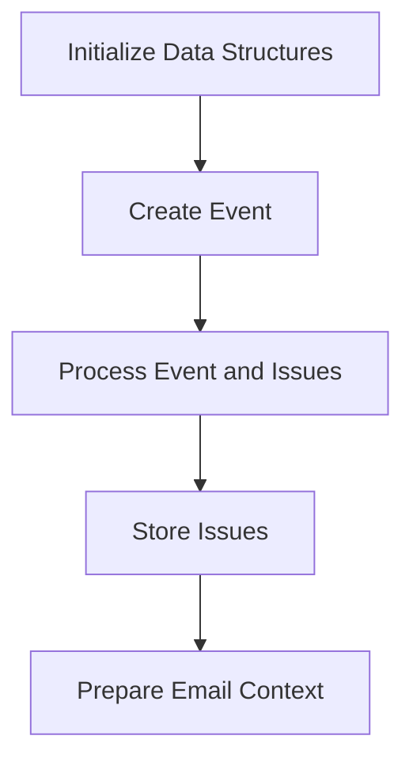

This document will cover the flow of retrieving and processing events and issues using the 'get' function. We'll cover:

1. Initializing necessary data structures
2. Creating and processing events
3. Handling and storing issues
4. Preparing the context for rendering an email preview.

Technical document: <SwmLink doc-title="get">[get](/.swm/overview-of-the-get-function-flow.10pdhtie.sw.md)</SwmLink>

# [Initializing necessary data structures](https://app.swimm.io/repos/Z2l0aHViJTNBJTNBc2VudHJ5LWRlbW8tMSUzQSUzQVN3aW1tLURlbW8=/docs/10pdhtie#handling-and-processing-events-and-issues)

The 'get' function begins by setting up an organization and project. This is essential for ensuring that all subsequent operations are associated with the correct organizational context. The organization and project are initialized with specific IDs and names, which are used to categorize and manage events and issues effectively.

# [Creating and processing events](https://app.swimm.io/repos/Z2l0aHViJTNBJTNBc2VudHJ5LWRlbW8tMSUzQSUzQVN3aW1tLURlbW8=/docs/10pdhtie#creating-a-generic-event)

Next, a generic event is created. This involves generating a unique event ID and processing the event along with any associated issue occurrences. The event creation is crucial for simulating real-world scenarios and debugging purposes. The event is then processed to ensure it is correctly categorized and any associated issues are identified.

# [Handling and storing issues](https://app.swimm.io/repos/Z2l0aHViJTNBJTNBc2VudHJ5LWRlbW8tMSUzQSUzQVN3aW1tLURlbW8=/docs/10pdhtie#processing-event-and-issue-occurrence)

The event and its associated issues are processed to ensure they are correctly stored and categorized. This involves validating the event ID, saving the event, and handling the issue occurrence. The issues are then stored in the system, ensuring they are available for future reference and analysis.

# [Preparing the context for rendering an email preview](https://app.swimm.io/repos/Z2l0aHViJTNBJTNBc2VudHJ5LWRlbW8tMSUzQSUzQVN3aW1tLURlbW8=/docs/10pdhtie#handling-and-processing-events-and-issues)

Finally, the context for rendering an email preview is prepared. This includes setting up the necessary data structures and context, such as the rule, group, event, and timezone. The email preview is then generated using the specified templates, ensuring that all relevant information is included.

&nbsp;

*This is an auto-generated document by Swimm AI 🌊 and has not yet been verified by a human*

<SwmMeta version="3.0.0" repo-id="Z2l0aHViJTNBJTNBc2VudHJ5LWRlbW8tMSUzQSUzQVN3aW1tLURlbW8=" repo-name="sentry-demo-1" doc-type="product-flows">Powered by [Swimm](/)</SwmMeta>
