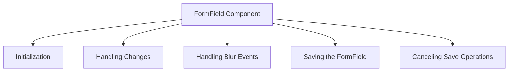

This document will cover the FormField Component, which includes:

1. Initialization of the FormField
2. Handling changes in the FormField
3. Handling blur events in the FormField
4. Saving the FormField
5. Canceling save operations in the FormField.

Technical document: <SwmLink doc-title="Overview of FormField Component">[Overview of FormField Component](/.swm/overview-of-formfield-component.g648wjaw.sw.md)</SwmLink>

# [Initialization of the FormField](https://app.swimm.io/repos/Z2l0aHViJTNBJTNBc2VudHJ5LWRlbW8tMSUzQSUzQVN3aW1tLURlbW8=/docs/g648wjaw#formfield-initialization)

The FormField component is initialized by setting up references, context, and state. This process involves registering the field within the form model and ensuring that the field descriptor is set and removed appropriately. This step is crucial for the proper functioning of the form field as it prepares the field for user interactions.

# [Handling Changes in the FormField](https://app.swimm.io/repos/Z2l0aHViJTNBJTNBc2VudHJ5LWRlbW8tMSUzQSUzQVN3aW1tLURlbW8=/docs/g648wjaw#handling-field-changes)

When a user changes the value of a form field, the handleChange function is triggered. This function updates the form model with the new value. It extracts the value from the event and calls the onChange prop and model.setValue to update the model. This ensures that the form model always has the latest value entered by the user.

# [Handling Blur Events in the FormField](https://app.swimm.io/repos/Z2l0aHViJTNBJTNBc2VudHJ5LWRlbW8tMSUzQSUzQVN3aW1tLURlbW8=/docs/g648wjaw#handling-field-blur)

When a form field loses focus, the handleBlur function is called. This function notifies the form model about the blur event. It extracts the value from the event, calls the onBlur prop, and invokes model.handleBlurField to handle the blur event in the model. This step is important to ensure that any changes made to the field are acknowledged by the form model.

# [Saving the FormField](https://app.swimm.io/repos/Z2l0aHViJTNBJTNBc2VudHJ5LWRlbW8tMSUzQSUzQVN3aW1tLURlbW8=/docs/g648wjaw#handling-save-field)

The handleSaveField function is responsible for saving the current value of the form field. It triggers the save operation by calling model.handleSaveField with the field name and its current value. This function ensures that the changes made to the form field are persisted.

# [Canceling Save Operations in the FormField](https://app.swimm.io/repos/Z2l0aHViJTNBJTNBc2VudHJ5LWRlbW8tMSUzQSUzQVN3aW1tLURlbW8=/docs/g648wjaw#canceling-save-field)

If a user decides to cancel the save operation, the handleCancelSaveField function is invoked. This function reverts the field value back to its initial state and updates the field state to hide the save button. This step is important to provide users with the flexibility to discard changes if needed.

&nbsp;

*This is an auto-generated document by Swimm AI 🌊 and has not yet been verified by a human*

<SwmMeta version="3.0.0" repo-id="Z2l0aHViJTNBJTNBc2VudHJ5LWRlbW8tMSUzQSUzQVN3aW1tLURlbW8=" repo-name="sentry-demo-1" doc-type="product-flows">Powered by [Swimm](/)</SwmMeta>
