This document explains the process of gathering attributes for groups. It involves fetching related objects, populating caches, and collecting various data points such as bookmarks, seen groups, subscriptions, and more.

The process starts by fetching related objects and populating caches for a list of groups. Then, it collects various data points like bookmarks, seen groups, and subscriptions. All this data is compiled into a dictionary for each group, making it easier to manage and access group-related information.

# Flow drill down

```mermaid
graph TD;
      subgraph src/sentry/api/serializers
0442d44a07907e39be20c2ce459410c11847d04a2ef27b205749f66a5e4ade5a(get_attrs):::mainFlowStyle --> fafc2ef2e300ed4114e63b8104d3f4150df614c0b2d959498ce3110d8404dc53(_resolve_resolutions):::mainFlowStyle
end

subgraph src/sentry/api/serializers
fafc2ef2e300ed4114e63b8104d3f4150df614c0b2d959498ce3110d8404dc53(_resolve_resolutions):::mainFlowStyle --> 28c48ea30004047eb7ecce03ba1a8b868835aeb68958357bab28e32981105fc2(serialize):::mainFlowStyle
end

subgraph src/sentry/api/serializers
28c48ea30004047eb7ecce03ba1a8b868835aeb68958357bab28e32981105fc2(serialize):::mainFlowStyle --> c23da29ff1af63ab794632e2c19616cb64e3cad435d766401c6e0951c3359e72(_get_status):::mainFlowStyle
end

subgraph src/sentry/api/serializers
c23da29ff1af63ab794632e2c19616cb64e3cad435d766401c6e0951c3359e72(_get_status):::mainFlowStyle --> 22905eef3a92457f137106c85db1f668e2bc47558a4448ea0358af9f5d99ed98(update):::mainFlowStyle
end


      classDef mainFlowStyle color:#000000,fill:#7CB9F4
classDef rootsStyle color:#000000,fill:#00FFF4
classDef Style1 color:#000000,fill:#00FFAA
classDef Style2 color:#000000,fill:#FFFF00
classDef Style3 color:#000000,fill:#AA7CB9

%% Swimm:
%% graph TD;
%%       subgraph <SwmPath>[src/sentry/api/serializers/](src/sentry/api/serializers/)</SwmPath>
%% 0442d44a07907e39be20c2ce459410c11847d04a2ef27b205749f66a5e4ade5a(get_attrs):::mainFlowStyle --> fafc2ef2e300ed4114e63b8104d3f4150df614c0b2d959498ce3110d8404dc53(_resolve_resolutions):::mainFlowStyle
%% end
%% 
%% subgraph <SwmPath>[src/sentry/api/serializers/](src/sentry/api/serializers/)</SwmPath>
%% fafc2ef2e300ed4114e63b8104d3f4150df614c0b2d959498ce3110d8404dc53(_resolve_resolutions):::mainFlowStyle --> 28c48ea30004047eb7ecce03ba1a8b868835aeb68958357bab28e32981105fc2(serialize):::mainFlowStyle
%% end
%% 
%% subgraph <SwmPath>[src/sentry/api/serializers/](src/sentry/api/serializers/)</SwmPath>
%% 28c48ea30004047eb7ecce03ba1a8b868835aeb68958357bab28e32981105fc2(serialize):::mainFlowStyle --> c23da29ff1af63ab794632e2c19616cb64e3cad435d766401c6e0951c3359e72(_get_status):::mainFlowStyle
%% end
%% 
%% subgraph <SwmPath>[src/sentry/api/serializers/](src/sentry/api/serializers/)</SwmPath>
%% c23da29ff1af63ab794632e2c19616cb64e3cad435d766401c6e0951c3359e72(_get_status):::mainFlowStyle --> 22905eef3a92457f137106c85db1f668e2bc47558a4448ea0358af9f5d99ed98(update):::mainFlowStyle
%% end
%% 
%% 
%%       classDef mainFlowStyle color:#000000,fill:#7CB9F4
%% classDef rootsStyle color:#000000,fill:#00FFF4
%% classDef Style1 color:#000000,fill:#00FFAA
%% classDef Style2 color:#000000,fill:#FFFF00
%% classDef Style3 color:#000000,fill:#AA7CB9
```



<SwmSnippet path="/src/sentry/api/serializers/models/group.py" line="192">

---

## Gathering Group Attributes

The <SwmToken path="src/sentry/api/serializers/models/group.py" pos="192:3:3" line-data="    def get_attrs(">`get_attrs`</SwmToken> function is responsible for gathering various attributes related to a list of groups. It populates caches, fetches related objects, and collects data such as bookmarks, seen groups, subscriptions, assignees, resolutions, and more. This data is then compiled into a dictionary for each group.

```python
    def get_attrs(
        self, item_list: Sequence[Group], user: Any, **kwargs: Any
    ) -> MutableMapping[Group, MutableMapping[str, Any]]:
        GroupMeta.objects.populate_cache(item_list)

        # Note that organization is necessary here for use in `_get_permalink` to avoid
        # making unnecessary queries.
        prefetch_related_objects(item_list, "project__organization")

        if user.is_authenticated and item_list:
            bookmarks = set(
                GroupBookmark.objects.filter(user_id=user.id, group__in=item_list).values_list(
                    "group_id", flat=True
                )
            )
            seen_groups = dict(
                GroupSeen.objects.filter(user_id=user.id, group__in=item_list).values_list(
                    "group_id", "last_seen"
                )
            )
            subscriptions = self._get_subscriptions(item_list, user)
```

---

</SwmSnippet>

<SwmSnippet path="/src/sentry/api/serializers/models/group.py" line="609">

---

## Resolving Resolutions

The <SwmToken path="src/sentry/api/serializers/models/group.py" pos="609:3:3" line-data="    def _resolve_resolutions(">`_resolve_resolutions`</SwmToken> function identifies groups that have been resolved and gathers resolution details. It fetches release resolutions and commit resolutions, which are then used to update the group's status and other related attributes.

```python
    def _resolve_resolutions(
        groups: Sequence[Group], user
    ) -> tuple[Mapping[int, Sequence[Any]], Mapping[int, Any]]:
        resolved_groups = [i for i in groups if i.status == GroupStatus.RESOLVED]
        if not resolved_groups:
            return {}, {}

        _release_resolutions = {
            i[0]: i[1:]
            for i in GroupResolution.objects.filter(group__in=resolved_groups).values_list(
                "group", "type", "release__version", "actor_id"
            )
        }

        # due to our laziness, and django's inability to do a reasonable join here
        # we end up with two queries
        commit_results = list(
            Commit.objects.extra(
                select={"group_id": "sentry_grouplink.group_id"},
                tables=["sentry_grouplink"],
                where=[
```

---

</SwmSnippet>

<SwmSnippet path="/src/sentry/api/serializers/models/group.py" line="316">

---

## Serializing Group Data

The <SwmToken path="src/sentry/api/serializers/models/group.py" pos="316:3:3" line-data="    def serialize(">`serialize`</SwmToken> function converts the group object and its attributes into a dictionary format suitable for API responses. It includes details such as the group's ID, title, status, assigned user, and other metadata.

```python
    def serialize(
        self, obj: Group, attrs: MutableMapping[str, Any], user: Any, **kwargs: Any
    ) -> BaseGroupSerializerResponse:
        status_details, status_label = self._get_status(attrs, obj)
        permalink = self._get_permalink(attrs, obj)
        is_subscribed, subscription_details = get_subscription_from_attributes(attrs)
        share_id = attrs["share_id"]
        group_dict = {
            "id": str(obj.id),
            "shareId": share_id,
            "shortId": obj.qualified_short_id,
            "title": obj.title,
            "culprit": obj.culprit,
            "permalink": permalink,
            "logger": obj.logger or None,
            "level": LOG_LEVELS.get(obj.level, "unknown"),
            "status": status_label,
            "statusDetails": status_details,
            "substatus": SUBSTATUS_TO_STR[obj.substatus] if obj.substatus else None,
            "isPublic": share_id is not None,
            "platform": obj.platform,
```

---

</SwmSnippet>

<SwmSnippet path="/src/sentry/api/serializers/models/group.py" line="390">

---

## Determining Group Status

The <SwmToken path="src/sentry/api/serializers/models/group.py" pos="390:3:3" line-data="    def _get_status(self, attrs: MutableMapping[str, Any], obj: Group):">`_get_status`</SwmToken> function determines the current status of a group based on its attributes and other conditions. It updates the status details and provides a status label that indicates whether the group is resolved, ignored, pending deletion, etc.

```python
    def _get_status(self, attrs: MutableMapping[str, Any], obj: Group):
        status = obj.status
        status_details = {}
        if attrs["ignore_until"]:
            snooze = attrs["ignore_until"]
            if snooze.is_valid(group=obj):
                # counts return the delta remaining when window is not set
                status_details.update(
                    {
                        "ignoreCount": (
                            snooze.count - (obj.times_seen - snooze.state["times_seen"])
                            if snooze.count and not snooze.window
                            else snooze.count
                        ),
                        "ignoreUntil": snooze.until,
                        "ignoreUserCount": (
                            snooze.user_count - (attrs["user_count"] - snooze.state["users_seen"])
                            if snooze.user_count
                            and not snooze.user_window
                            and not self._collapse("stats")
                            else snooze.user_count
```

---

</SwmSnippet>

<SwmSnippet path="/src/sentry/api/serializers/rest_framework/dashboard.py" line="565">

---

## Updating Dashboard

The <SwmToken path="src/sentry/api/serializers/rest_framework/dashboard.py" pos="565:3:3" line-data="    def update(self, instance, validated_data):">`update`</SwmToken> function updates a dashboard instance with validated data. It handles the creation, updating, and removal of widgets within the dashboard, ensuring that the dashboard's state is consistent with the provided data.

```python
    def update(self, instance, validated_data):
        """
        Update a dashboard, the connected widgets and queries

        - Widgets in the dashboard currently, but not in validated_data will be removed.
        - Widgets without ids will be created.
        - Widgets with matching IDs will be updated.
        - The order of the widgets will be updated based on the order in the request data.

        Only call save() on this serializer from within a transaction or
        bad things will happen
        """
        instance.title = validated_data.get("title", instance.title)
        instance.save()

        if "widgets" in validated_data:
            self.update_widgets(instance, validated_data["widgets"])

        self.update_dashboard_filters(instance, validated_data)

        schedule_update_project_configs(instance)
```

---

</SwmSnippet>

&nbsp;

*This is an auto-generated document by Swimm AI 🌊 and has not yet been verified by a human*

<SwmMeta version="3.0.0" repo-id="Z2l0aHViJTNBJTNBc2VudHJ5LWRlbW8tMSUzQSUzQVN3aW1tLURlbW8=" repo-name="sentry-demo-1" doc-type="flows"><sup>Powered by [Swimm](/)</sup></SwmMeta>
