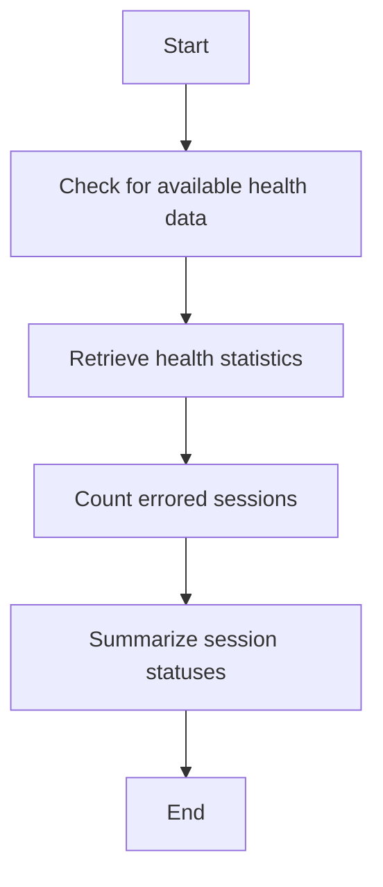

This document will cover the process of gathering health data for project releases. We'll cover:

1. Checking for available health data
2. Retrieving health statistics
3. Counting errored sessions
4. Summarizing session statuses.

Technical document: <SwmLink doc-title="Gathering Health Data for Project Releases">[Gathering Health Data for Project Releases](/.swm/gathering-health-data-for-project-releases.9eee553r.sw.md)</SwmLink>

# [Checking for available health data](https://app.swimm.io/repos/Z2l0aHViJTNBJTNBc2VudHJ5LWRlbW8tMSUzQSUzQVN3aW1tLURlbW8=/docs/9eee553r#check_has_health_data)

The first step in gathering health data for project releases is to check if health data is available for the given project releases. This involves verifying if there is any health data recorded for the project releases over the past 90 days. If no data is found, the process stops here. This step ensures that we only proceed with projects that have relevant health data, saving time and resources.

# [Retrieving health statistics](https://app.swimm.io/repos/Z2l0aHViJTNBJTNBc2VudHJ5LWRlbW8tMSUzQSUzQVN3aW1tLURlbW8=/docs/9eee553r#_get_health_stats_for_overview)

Once we have confirmed the availability of health data, the next step is to retrieve various health statistics. This includes metrics such as the number of users and sessions. These statistics provide a detailed view of the project's health, helping stakeholders understand user engagement and session activity. The data is structured in a way that makes it easy to analyze and interpret.

# [Counting errored sessions](https://app.swimm.io/repos/Z2l0aHViJTNBJTNBc2VudHJ5LWRlbW8tMSUzQSUzQVN3aW1tLURlbW8=/docs/9eee553r#_get_errored_sessions_for_overview)

After retrieving the general health statistics, we count the number of errored sessions. This includes sessions that have encountered errors, such as crashes or abnormal terminations. By identifying the number of errored sessions, we can gauge the stability and reliability of the project releases. This information is crucial for identifying and addressing issues that may affect user experience.

# [Summarizing session statuses](https://app.swimm.io/repos/Z2l0aHViJTNBJTNBc2VudHJ5LWRlbW8tMSUzQSUzQVN3aW1tLURlbW8=/docs/9eee553r#_get_session_by_status_for_overview)

The final step in the process is to summarize the statuses of all sessions. This involves categorizing sessions into different statuses such as 'init', 'abnormal', 'crashed', and 'errored'. By summarizing session statuses, we provide a comprehensive overview of the project's health, highlighting areas that may need attention. This summary helps stakeholders make informed decisions about the project's future development and maintenance.

&nbsp;

*This is an auto-generated document by Swimm AI 🌊 and has not yet been verified by a human*

<SwmMeta version="3.0.0" repo-id="Z2l0aHViJTNBJTNBc2VudHJ5LWRlbW8tMSUzQSUzQVN3aW1tLURlbW8=" repo-name="sentry-demo-1" doc-type="product-flows">Powered by [Swimm](/)</SwmMeta>
