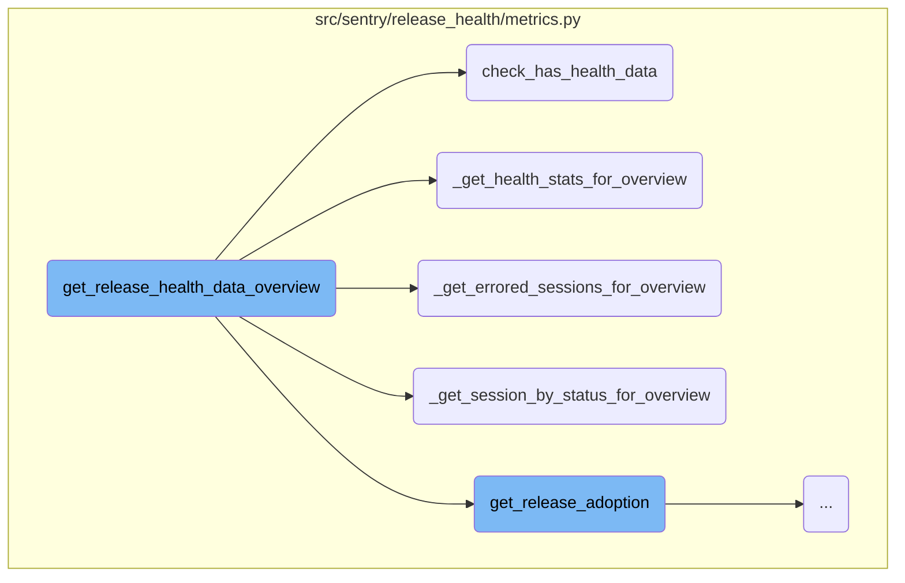
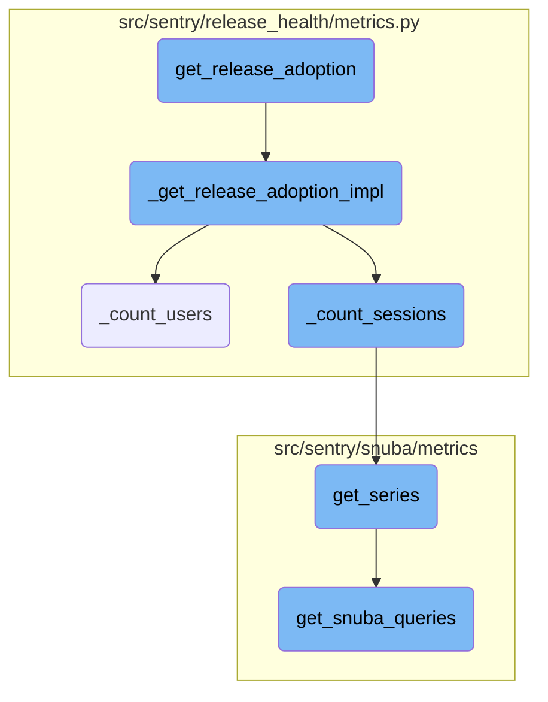

This document explains the process of gathering health data for project releases. The process involves checking for available health data, retrieving health statistics, counting errored sessions, and summarizing session statuses.

The flow starts by checking if health data is available for the given project releases. Then, it retrieves various health statistics, such as the number of errored sessions and the status of sessions. Finally, it compiles this data into an overview format that provides insights into the health of the project releases.

Here is a high level diagram of the flow, showing only the most important functions:

```mermaid
graph TD;
      subgraph src/sentry/release_health/metrics.py
bd946e57c8a75ee24db2fc50ee9c1eca3ce2586e07596375949a7d95af56c4e8(get_release_health_data_overview):::mainFlowStyle --> 6016b353d5f0f4167e79ab4def4066fd163a5d1fc97a778ea666a833f5d34c8e(check_has_health_data)
end

subgraph src/sentry/release_health/metrics.py
bd946e57c8a75ee24db2fc50ee9c1eca3ce2586e07596375949a7d95af56c4e8(get_release_health_data_overview):::mainFlowStyle --> aff6bc23216bc366c02e0b2ab1dce4ff5ff3da2dd8d6f622ce8890b7f5a7da6a(_get_health_stats_for_overview)
end

subgraph src/sentry/release_health/metrics.py
bd946e57c8a75ee24db2fc50ee9c1eca3ce2586e07596375949a7d95af56c4e8(get_release_health_data_overview):::mainFlowStyle --> 20298e202873ec252f8284467605e973ca5141756ebcc6144c6027a2153bf82d(_get_errored_sessions_for_overview)
end

subgraph src/sentry/release_health/metrics.py
bd946e57c8a75ee24db2fc50ee9c1eca3ce2586e07596375949a7d95af56c4e8(get_release_health_data_overview):::mainFlowStyle --> cedc401546a4fbbd8157c05edd91d4c72ddef4601c6d1efb04ac73e705b8dd16(_get_session_by_status_for_overview)
end

subgraph src/sentry/release_health/metrics.py
bd946e57c8a75ee24db2fc50ee9c1eca3ce2586e07596375949a7d95af56c4e8(get_release_health_data_overview):::mainFlowStyle --> 519378a9cbca7e75d358bf036979b6f85f977feebec79158140bdf7168fa8484(get_release_adoption):::mainFlowStyle
end

subgraph src/sentry/release_health/metrics.py
519378a9cbca7e75d358bf036979b6f85f977feebec79158140bdf7168fa8484(get_release_adoption):::mainFlowStyle --> ffec8104f8a82a115a5f8cdbcd25f76c67490c9628fced21872887f724a4fc43(_get_release_adoption_impl):::mainFlowStyle
end

subgraph src/sentry/release_health/metrics.py
ffec8104f8a82a115a5f8cdbcd25f76c67490c9628fced21872887f724a4fc43(_get_release_adoption_impl):::mainFlowStyle --> 25625a9483e5ed05941067c1af2f7f2def91531019ca18bc3b05492b89e9f889(_count_users)
end

subgraph src/sentry/release_health/metrics.py
ffec8104f8a82a115a5f8cdbcd25f76c67490c9628fced21872887f724a4fc43(_get_release_adoption_impl):::mainFlowStyle --> fd6c034ac36f8d8853479771cb8e6a55a09650175360aae5efbf79a7c0d6d591(_count_sessions):::mainFlowStyle
end

subgraph src/sentry/snuba/metrics
fd6c034ac36f8d8853479771cb8e6a55a09650175360aae5efbf79a7c0d6d591(_count_sessions):::mainFlowStyle --> 8b7dfb2384b18eb86c6bd433cfe8281dcfd665cd038938bba5731a71caad3d38(get_series):::mainFlowStyle
end

subgraph src/sentry/snuba/metrics
8b7dfb2384b18eb86c6bd433cfe8281dcfd665cd038938bba5731a71caad3d38(get_series):::mainFlowStyle --> 35d12040966934efdd76bd3363426bc13b8433a48d9753f7f3250c37f1369ff1(get_snuba_queries):::mainFlowStyle
end


      classDef mainFlowStyle color:#000000,fill:#7CB9F4
classDef rootsStyle color:#000000,fill:#00FFF4
classDef Style1 color:#000000,fill:#00FFAA
classDef Style2 color:#000000,fill:#FFFF00
classDef Style3 color:#000000,fill:#AA7CB9

%% Swimm:
%% graph TD;
%%       subgraph <SwmPath>[src/sentry/release_health/metrics.py](src/sentry/release_health/metrics.py)</SwmPath>
%% bd946e57c8a75ee24db2fc50ee9c1eca3ce2586e07596375949a7d95af56c4e8(get_release_health_data_overview):::mainFlowStyle --> 6016b353d5f0f4167e79ab4def4066fd163a5d1fc97a778ea666a833f5d34c8e(check_has_health_data)
%% end
%% 
%% subgraph <SwmPath>[src/sentry/release_health/metrics.py](src/sentry/release_health/metrics.py)</SwmPath>
%% bd946e57c8a75ee24db2fc50ee9c1eca3ce2586e07596375949a7d95af56c4e8(get_release_health_data_overview):::mainFlowStyle --> aff6bc23216bc366c02e0b2ab1dce4ff5ff3da2dd8d6f622ce8890b7f5a7da6a(_get_health_stats_for_overview)
%% end
%% 
%% subgraph <SwmPath>[src/sentry/release_health/metrics.py](src/sentry/release_health/metrics.py)</SwmPath>
%% bd946e57c8a75ee24db2fc50ee9c1eca3ce2586e07596375949a7d95af56c4e8(get_release_health_data_overview):::mainFlowStyle --> 20298e202873ec252f8284467605e973ca5141756ebcc6144c6027a2153bf82d(_get_errored_sessions_for_overview)
%% end
%% 
%% subgraph <SwmPath>[src/sentry/release_health/metrics.py](src/sentry/release_health/metrics.py)</SwmPath>
%% bd946e57c8a75ee24db2fc50ee9c1eca3ce2586e07596375949a7d95af56c4e8(get_release_health_data_overview):::mainFlowStyle --> cedc401546a4fbbd8157c05edd91d4c72ddef4601c6d1efb04ac73e705b8dd16(_get_session_by_status_for_overview)
%% end
%% 
%% subgraph <SwmPath>[src/sentry/release_health/metrics.py](src/sentry/release_health/metrics.py)</SwmPath>
%% bd946e57c8a75ee24db2fc50ee9c1eca3ce2586e07596375949a7d95af56c4e8(get_release_health_data_overview):::mainFlowStyle --> 519378a9cbca7e75d358bf036979b6f85f977feebec79158140bdf7168fa8484(get_release_adoption):::mainFlowStyle
%% end
%% 
%% subgraph <SwmPath>[src/sentry/release_health/metrics.py](src/sentry/release_health/metrics.py)</SwmPath>
%% 519378a9cbca7e75d358bf036979b6f85f977feebec79158140bdf7168fa8484(get_release_adoption):::mainFlowStyle --> ffec8104f8a82a115a5f8cdbcd25f76c67490c9628fced21872887f724a4fc43(_get_release_adoption_impl):::mainFlowStyle
%% end
%% 
%% subgraph <SwmPath>[src/sentry/release_health/metrics.py](src/sentry/release_health/metrics.py)</SwmPath>
%% ffec8104f8a82a115a5f8cdbcd25f76c67490c9628fced21872887f724a4fc43(_get_release_adoption_impl):::mainFlowStyle --> 25625a9483e5ed05941067c1af2f7f2def91531019ca18bc3b05492b89e9f889(_count_users)
%% end
%% 
%% subgraph <SwmPath>[src/sentry/release_health/metrics.py](src/sentry/release_health/metrics.py)</SwmPath>
%% ffec8104f8a82a115a5f8cdbcd25f76c67490c9628fced21872887f724a4fc43(_get_release_adoption_impl):::mainFlowStyle --> fd6c034ac36f8d8853479771cb8e6a55a09650175360aae5efbf79a7c0d6d591(_count_sessions):::mainFlowStyle
%% end
%% 
%% subgraph <SwmPath>[src/sentry/snuba/metrics/](src/sentry/snuba/metrics/)</SwmPath>
%% fd6c034ac36f8d8853479771cb8e6a55a09650175360aae5efbf79a7c0d6d591(_count_sessions):::mainFlowStyle --> 8b7dfb2384b18eb86c6bd433cfe8281dcfd665cd038938bba5731a71caad3d38(get_series):::mainFlowStyle
%% end
%% 
%% subgraph <SwmPath>[src/sentry/snuba/metrics/](src/sentry/snuba/metrics/)</SwmPath>
%% 8b7dfb2384b18eb86c6bd433cfe8281dcfd665cd038938bba5731a71caad3d38(get_series):::mainFlowStyle --> 35d12040966934efdd76bd3363426bc13b8433a48d9753f7f3250c37f1369ff1(get_snuba_queries):::mainFlowStyle
%% end
%% 
%% 
%%       classDef mainFlowStyle color:#000000,fill:#7CB9F4
%% classDef rootsStyle color:#000000,fill:#00FFF4
%% classDef Style1 color:#000000,fill:#00FFAA
%% classDef Style2 color:#000000,fill:#FFFF00
%% classDef Style3 color:#000000,fill:#AA7CB9
```



# Flow drill down

First, we'll zoom into this section of the flow:



<SwmSnippet path="/src/sentry/release_health/metrics.py" line="945">

---

## <SwmToken path="src/sentry/release_health/metrics.py" pos="945:3:3" line-data="    def get_release_health_data_overview(">`get_release_health_data_overview`</SwmToken>

The function <SwmToken path="src/sentry/release_health/metrics.py" pos="945:3:3" line-data="    def get_release_health_data_overview(">`get_release_health_data_overview`</SwmToken> orchestrates the process of gathering various health metrics for project releases. It calls several helper functions to fetch specific data points, such as health stats, errored sessions, and session statuses.

```python
    def get_release_health_data_overview(
        self,
        project_releases: Sequence[ProjectRelease],
        environments: Sequence[EnvironmentName] | None = None,
        summary_stats_period: StatsPeriod | None = None,
        health_stats_period: StatsPeriod | None = None,
        stat: Literal["users", "sessions"] | None = None,
        now: datetime | None = None,
    ) -> Mapping[ProjectRelease, ReleaseHealthOverview]:
        """Checks quickly for which of the given project releases we have
        health data available.  The argument is a tuple of `(project_id, release_name)`
        tuples.  The return value is a set of all the project releases that have health
        data.
        """
        if stat is None:
            stat = "sessions"
        assert stat in ("sessions", "users")

        if now is None:
            now = datetime.now(timezone.utc)

```

---

</SwmSnippet>

<SwmSnippet path="/src/sentry/release_health/metrics.py" line="535">

---

## <SwmToken path="src/sentry/release_health/metrics.py" pos="535:3:3" line-data="    def check_has_health_data(">`check_has_health_data`</SwmToken>

The function <SwmToken path="src/sentry/release_health/metrics.py" pos="535:3:3" line-data="    def check_has_health_data(">`check_has_health_data`</SwmToken> verifies if health data exists for the given releases. It performs a query over a 90-day period to determine the availability of health data.

```python
    def check_has_health_data(
        self,
        projects_list: Collection[ProjectOrRelease],
        now: datetime | None = None,
    ) -> set[ProjectOrRelease]:
        if now is None:
            now = datetime.now(timezone.utc)

        start = now - timedelta(days=90)

        projects_list = list(projects_list)

        if len(projects_list) == 0:
            return set()

        includes_releases = isinstance(projects_list[0], tuple)

        if includes_releases:
            project_ids: list[ProjectId] = [x[0] for x in projects_list]  # type: ignore[index]
        else:
            project_ids = projects_list  # type: ignore[assignment]
```

---

</SwmSnippet>

<SwmSnippet path="/src/sentry/release_health/metrics.py" line="886">

---

## <SwmToken path="src/sentry/release_health/metrics.py" pos="886:3:3" line-data="    def _get_health_stats_for_overview(">`_get_health_stats_for_overview`</SwmToken>

The function <SwmToken path="src/sentry/release_health/metrics.py" pos="886:3:3" line-data="    def _get_health_stats_for_overview(">`_get_health_stats_for_overview`</SwmToken> retrieves health statistics for the overview. It queries metrics based on user or session data and returns the results in a structured format.

```python
    def _get_health_stats_for_overview(
        projects: Sequence[Project],
        where: list[Condition],
        org_id: int,
        stat: OverviewStat,
        granularity: int,
        start: datetime,
        end: datetime,
        buckets: int,
    ) -> Mapping[ProjectRelease, list[list[int]]]:

        project_ids = [p.id for p in projects]

        metric_field = {
            "users": MetricField(metric_mri=SessionMRI.ALL_USER.value, alias="value", op=None),
            "sessions": MetricField(metric_mri=SessionMRI.ALL.value, alias="value", op=None),
        }[stat]

        groupby = [
            MetricGroupByField(field="release"),
            MetricGroupByField(field="project_id"),
```

---

</SwmSnippet>

<SwmSnippet path="/src/sentry/release_health/metrics.py" line="715">

---

## <SwmToken path="src/sentry/release_health/metrics.py" pos="715:3:3" line-data="    def _get_errored_sessions_for_overview(">`_get_errored_sessions_for_overview`</SwmToken>

The function <SwmToken path="src/sentry/release_health/metrics.py" pos="715:3:3" line-data="    def _get_errored_sessions_for_overview(">`_get_errored_sessions_for_overview`</SwmToken> counts the number of errored sessions, including fatal sessions but excluding preaggregated errored sessions.

```python
    def _get_errored_sessions_for_overview(
        projects: Sequence[Project],
        where: list[Condition],
        org_id: int,
        granularity: int,
        start: datetime,
        end: datetime,
    ) -> Mapping[tuple[int, str], int]:
        """
        Count of errored sessions, incl fatal (abnormal, crashed) sessions,
        excl errored *preaggregated* sessions
        """
        project_ids = [p.id for p in projects]

        select = [
            MetricField(metric_mri=SessionMRI.ERRORED_SET.value, alias="value", op=None),
        ]

        groupby = [
            MetricGroupByField(field="project_id"),
            MetricGroupByField(field="release"),
```

---

</SwmSnippet>

<SwmSnippet path="/src/sentry/release_health/metrics.py" line="769">

---

## <SwmToken path="src/sentry/release_health/metrics.py" pos="769:3:3" line-data="    def _get_session_by_status_for_overview(">`_get_session_by_status_for_overview`</SwmToken>

The function <SwmToken path="src/sentry/release_health/metrics.py" pos="769:3:3" line-data="    def _get_session_by_status_for_overview(">`_get_session_by_status_for_overview`</SwmToken> counts sessions by their status (init, abnormal, crashed, errored) for the overview.

```python
    def _get_session_by_status_for_overview(
        projects: Sequence[Project],
        where: list[Condition],
        org_id: int,
        granularity: int,
        start: datetime,
        end: datetime,
    ) -> Mapping[tuple[int, str, str], int]:
        """
        Counts of init, abnormal and crashed sessions, purpose-built for overview
        """
        project_ids = [p.id for p in projects]

        select = [
            MetricField(metric_mri=SessionMRI.ABNORMAL.value, alias="abnormal", op=None),
            MetricField(metric_mri=SessionMRI.CRASHED.value, alias="crashed", op=None),
            MetricField(metric_mri=SessionMRI.ALL.value, alias="init", op=None),
            MetricField(
                metric_mri=SessionMRI.ERRORED_PREAGGREGATED.value,
                alias="errored_preaggr",
                op=None,
```

---

</SwmSnippet>

Now, lets zoom into this section of the flow:



<SwmSnippet path="/src/sentry/release_health/metrics.py" line="225">

---

## Gathering Release Adoption Data

The function <SwmToken path="src/sentry/release_health/metrics.py" pos="225:3:3" line-data="    def get_release_adoption(">`get_release_adoption`</SwmToken> initiates the process of gathering release adoption data. It prepares the necessary parameters and calls <SwmToken path="src/sentry/release_health/metrics.py" pos="239:5:5" line-data="        return self._get_release_adoption_impl(now, org_id, project_releases, environments)">`_get_release_adoption_impl`</SwmToken> to perform the actual data retrieval.

```python
    def get_release_adoption(
        self,
        project_releases: Sequence[ProjectRelease],
        environments: Sequence[EnvironmentName] | None = None,
        now: datetime | None = None,
        org_id: OrganizationId | None = None,
    ) -> ReleasesAdoption:
        project_ids = list({x[0] for x in project_releases})
        if org_id is None:
            org_id = self._get_org_id(project_ids)

        if now is None:
            now = datetime.now(timezone.utc)

        return self._get_release_adoption_impl(now, org_id, project_releases, environments)
```

---

</SwmSnippet>

<SwmSnippet path="/src/sentry/release_health/metrics.py" line="242">

---

## Implementing Release Adoption Logic

The function <SwmToken path="src/sentry/release_health/metrics.py" pos="242:3:3" line-data="    def _get_release_adoption_impl(">`_get_release_adoption_impl`</SwmToken> handles the core logic for fetching release adoption data. It sets up common conditions and groupings for the queries and converts the results into a usable format.

```python
    def _get_release_adoption_impl(
        now: datetime,
        org_id: int,
        project_releases: Sequence[ProjectRelease],
        environments: Sequence[EnvironmentName] | None = None,
    ) -> ReleasesAdoption:
        start = now - timedelta(days=1)
        project_ids = [proj for proj, _rel in project_releases]
        projects = MetricsReleaseHealthBackend._get_projects(project_ids)

        def _get_common_where(total: bool) -> list[Condition]:
            where_common: list[Condition] = [
                filter_projects_by_project_release(project_releases),
            ]

            if environments is not None:
                where_common.append(
                    Condition(
                        lhs=Column("tags[environment]"),
                        op=Op.IN,
                        rhs=environments,
```

---

</SwmSnippet>

<SwmSnippet path="/src/sentry/release_health/metrics.py" line="323">

---

### Counting Users

The function <SwmToken path="src/sentry/release_health/metrics.py" pos="323:3:3" line-data="        def _count_users(total: bool, referrer: str) -&gt; dict[Any, int]:">`_count_users`</SwmToken> is responsible for counting unique users. It constructs a query to fetch user metrics and processes the results using <SwmToken path="src/sentry/release_health/metrics.py" pos="339:5:5" line-data="            raw_result = get_series(projects=projects, metrics_query=query, use_case_id=USE_CASE_ID)">`get_series`</SwmToken>.

```python
        def _count_users(total: bool, referrer: str) -> dict[Any, int]:
            select = [
                MetricField(metric_mri=SessionMRI.RAW_USER.value, alias="value", op="count_unique")
            ]
            query = DeprecatingMetricsQuery(
                org_id=org_id,
                start=start,
                end=now,
                project_ids=project_ids,
                select=select,
                groupby=_get_common_groupby(total),
                where=_get_common_where(total),
                granularity=Granularity(LEGACY_SESSIONS_DEFAULT_ROLLUP),
                include_series=False,
                include_totals=True,
            )
            raw_result = get_series(projects=projects, metrics_query=query, use_case_id=USE_CASE_ID)
            return _convert_results(raw_result["groups"], total)
```

---

</SwmSnippet>

<SwmSnippet path="/src/sentry/release_health/metrics.py" line="300">

---

### Counting Sessions

The function <SwmToken path="src/sentry/release_health/metrics.py" pos="300:3:3" line-data="        def _count_sessions(">`_count_sessions`</SwmToken> counts the total number of sessions. Similar to <SwmToken path="src/sentry/release_health/metrics.py" pos="323:3:3" line-data="        def _count_users(total: bool, referrer: str) -&gt; dict[Any, int]:">`_count_users`</SwmToken>, it builds a query and processes the results with <SwmToken path="src/sentry/release_health/metrics.py" pos="319:5:5" line-data="            raw_result = get_series(projects=projects, metrics_query=query, use_case_id=USE_CASE_ID)">`get_series`</SwmToken>.

```python
        def _count_sessions(
            total: bool, project_ids: Sequence[int], referrer: str
        ) -> dict[Any, int]:
            select = [
                MetricField(metric_mri=SessionMRI.ALL.value, alias="value", op=None),
            ]

            query = DeprecatingMetricsQuery(
                org_id=org_id,
                start=start,
                end=now,
                project_ids=project_ids,
                select=select,
                groupby=_get_common_groupby(total),
                where=_get_common_where(total),
                granularity=Granularity(LEGACY_SESSIONS_DEFAULT_ROLLUP),
                include_series=False,
                include_totals=True,
            )
            raw_result = get_series(projects=projects, metrics_query=query, use_case_id=USE_CASE_ID)

```

---

</SwmSnippet>

<SwmSnippet path="/src/sentry/snuba/metrics/datasource.py" line="897">

---

## Fetching Time Series Data

The function <SwmToken path="src/sentry/snuba/metrics/datasource.py" pos="897:2:2" line-data="def get_series(">`get_series`</SwmToken> retrieves time series data for the given metrics query. It handles the construction and execution of the query, as well as the processing of the results.

```python
def get_series(
    projects: Sequence[Project],
    metrics_query: DeprecatingMetricsQuery,
    use_case_id: UseCaseID,
    include_meta: bool = False,
    tenant_ids: dict[str, Any] | None = None,
) -> dict:
    """Get time series for the given query"""

    organization_id = projects[0].organization_id if projects else None
    tenant_ids = dict()
    if organization_id is not None:
        tenant_ids["organization_id"] = organization_id
    tenant_ids["use_case_id"] = use_case_id.value

    if metrics_query.interval is not None:
        interval = metrics_query.interval
    else:
        interval = metrics_query.granularity.granularity

    start, end, _num_intervals = to_intervals(metrics_query.start, metrics_query.end, interval)
```

---

</SwmSnippet>

<SwmSnippet path="/src/sentry/snuba/metrics/query_builder.py" line="1116">

---

## Building Snuba Queries

The function <SwmToken path="src/sentry/snuba/metrics/query_builder.py" pos="1116:3:3" line-data="    def get_snuba_queries(self):">`get_snuba_queries`</SwmToken> constructs the necessary Snuba queries based on the provided metrics query. It organizes the queries by entity and prepares them for execution.

```python
    def get_snuba_queries(self):
        metric_mri_to_obj_dict = {}
        fields_in_entities = {}

        for field in self._metrics_query.select:
            metric_field_obj = metric_object_factory(field.op, field.metric_mri)
            # `get_entity` is called the first, to fetch the entities of constituent metrics,
            # and validate especially in the case of SingularEntityDerivedMetric that it is
            # actually composed of metrics that belong to the same entity
            try:
                #  When we get to an instance of a MetricFieldBase where the entity is an
                #  instance of dict, we know it is from a composite entity derived metric, and
                #  we need to traverse down the constituent metrics dependency tree until we get
                #  to instances of SingleEntityDerivedMetric, and add those to our queries so
                #  that we are able to generate the original CompositeEntityDerivedMetric later
                #  on as a result of a post query operation on the results of the constituent
                #  SingleEntityDerivedMetric instances
                component_entities = metric_field_obj.get_entity(
                    projects=self._projects, use_case_id=self._use_case_id
                )
                if isinstance(component_entities, dict):
```

---

</SwmSnippet>

&nbsp;

*This is an auto-generated document by Swimm AI 🌊 and has not yet been verified by a human*

<SwmMeta version="3.0.0" repo-id="Z2l0aHViJTNBJTNBc2VudHJ5LWRlbW8tMSUzQSUzQVN3aW1tLURlbW8=" repo-name="sentry-demo-1" doc-type="flows"><sup>Powered by [Swimm](/)</sup></SwmMeta>
