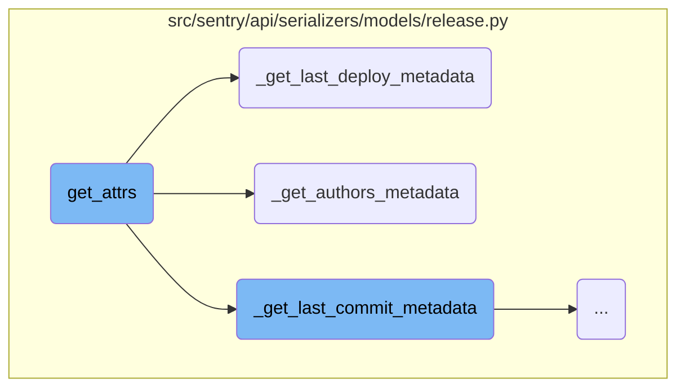

In this document, we will explain the process of gathering release attributes. The process involves collecting various pieces of data related to releases, such as adoption stages, health data, and metadata about the release, including information about the last commit, authors, and deployments.

The flow is straightforward and involves gathering different pieces of information about a release. First, it collects data about the adoption stages and health of the release. Then, it gathers metadata about the release, such as the last commit, the authors involved, and the deployments. This information is integrated from multiple sources to provide a comprehensive view of each release.

Here is a high level diagram of the flow, showing only the most important functions:

```mermaid
graph TD;
      subgraph src/sentry/api/serializers
b0b2db41410eeaa8ec247fdbb90358b5a8f53fad2a45a9f5973eccf3cafb0055(get_attrs):::mainFlowStyle --> f408b591b580d44d2bd1940299b55e43a8a8168525e2a1401981945ba0c0b483(_get_last_deploy_metadata)
end

subgraph src/sentry/api/serializers
b0b2db41410eeaa8ec247fdbb90358b5a8f53fad2a45a9f5973eccf3cafb0055(get_attrs):::mainFlowStyle --> 65a3b959717fcd1ad40c407f66483ce7c4a2c5af5901370d80deaeb735d9db87(_get_authors_metadata)
end

subgraph src/sentry/api/serializers
b0b2db41410eeaa8ec247fdbb90358b5a8f53fad2a45a9f5973eccf3cafb0055(get_attrs):::mainFlowStyle --> c67478ca18aa36e053a1eae78eeb37cb6b67bccbaa2ec26e56074835bd106617(_get_last_commit_metadata):::mainFlowStyle
end

subgraph src/sentry/api/serializers
c67478ca18aa36e053a1eae78eeb37cb6b67bccbaa2ec26e56074835bd106617(_get_last_commit_metadata):::mainFlowStyle --> 56d5d358acf064b5ff96d94bdd762617a41283081e5053ccad1efcc4aea30b4a(serialize):::mainFlowStyle
end

subgraph src/sentry/api/serializers
56d5d358acf064b5ff96d94bdd762617a41283081e5053ccad1efcc4aea30b4a(serialize):::mainFlowStyle --> 41905746e4ff5df55085c014961c5253ab18ab335e5f8a72546a4982a87f93fc(expose_version_info):::mainFlowStyle
end

subgraph src/sentry/api/serializers
41905746e4ff5df55085c014961c5253ab18ab335e5f8a72546a4982a87f93fc(expose_version_info):::mainFlowStyle --> 22905eef3a92457f137106c85db1f668e2bc47558a4448ea0358af9f5d99ed98(update):::mainFlowStyle
end

subgraph src/sentry/api/serializers
22905eef3a92457f137106c85db1f668e2bc47558a4448ea0358af9f5d99ed98(update):::mainFlowStyle --> 26182bf2067521355a22b294c4bfbc6ce61733b69de325a6ff0cbcfff1e25ad7(update_widgets)
end


      classDef mainFlowStyle color:#000000,fill:#7CB9F4
classDef rootsStyle color:#000000,fill:#00FFF4
classDef Style1 color:#000000,fill:#00FFAA
classDef Style2 color:#000000,fill:#FFFF00
classDef Style3 color:#000000,fill:#AA7CB9

%% Swimm:
%% graph TD;
%%       subgraph <SwmPath>[src/sentry/api/serializers/](src/sentry/api/serializers/)</SwmPath>
%% b0b2db41410eeaa8ec247fdbb90358b5a8f53fad2a45a9f5973eccf3cafb0055(get_attrs):::mainFlowStyle --> f408b591b580d44d2bd1940299b55e43a8a8168525e2a1401981945ba0c0b483(_get_last_deploy_metadata)
%% end
%% 
%% subgraph <SwmPath>[src/sentry/api/serializers/](src/sentry/api/serializers/)</SwmPath>
%% b0b2db41410eeaa8ec247fdbb90358b5a8f53fad2a45a9f5973eccf3cafb0055(get_attrs):::mainFlowStyle --> 65a3b959717fcd1ad40c407f66483ce7c4a2c5af5901370d80deaeb735d9db87(_get_authors_metadata)
%% end
%% 
%% subgraph <SwmPath>[src/sentry/api/serializers/](src/sentry/api/serializers/)</SwmPath>
%% b0b2db41410eeaa8ec247fdbb90358b5a8f53fad2a45a9f5973eccf3cafb0055(get_attrs):::mainFlowStyle --> c67478ca18aa36e053a1eae78eeb37cb6b67bccbaa2ec26e56074835bd106617(_get_last_commit_metadata):::mainFlowStyle
%% end
%% 
%% subgraph <SwmPath>[src/sentry/api/serializers/](src/sentry/api/serializers/)</SwmPath>
%% c67478ca18aa36e053a1eae78eeb37cb6b67bccbaa2ec26e56074835bd106617(_get_last_commit_metadata):::mainFlowStyle --> 56d5d358acf064b5ff96d94bdd762617a41283081e5053ccad1efcc4aea30b4a(serialize):::mainFlowStyle
%% end
%% 
%% subgraph <SwmPath>[src/sentry/api/serializers/](src/sentry/api/serializers/)</SwmPath>
%% 56d5d358acf064b5ff96d94bdd762617a41283081e5053ccad1efcc4aea30b4a(serialize):::mainFlowStyle --> 41905746e4ff5df55085c014961c5253ab18ab335e5f8a72546a4982a87f93fc(expose_version_info):::mainFlowStyle
%% end
%% 
%% subgraph <SwmPath>[src/sentry/api/serializers/](src/sentry/api/serializers/)</SwmPath>
%% 41905746e4ff5df55085c014961c5253ab18ab335e5f8a72546a4982a87f93fc(expose_version_info):::mainFlowStyle --> 22905eef3a92457f137106c85db1f668e2bc47558a4448ea0358af9f5d99ed98(update):::mainFlowStyle
%% end
%% 
%% subgraph <SwmPath>[src/sentry/api/serializers/](src/sentry/api/serializers/)</SwmPath>
%% 22905eef3a92457f137106c85db1f668e2bc47558a4448ea0358af9f5d99ed98(update):::mainFlowStyle --> 26182bf2067521355a22b294c4bfbc6ce61733b69de325a6ff0cbcfff1e25ad7(update_widgets)
%% end
%% 
%% 
%%       classDef mainFlowStyle color:#000000,fill:#7CB9F4
%% classDef rootsStyle color:#000000,fill:#00FFF4
%% classDef Style1 color:#000000,fill:#00FFAA
%% classDef Style2 color:#000000,fill:#FFFF00
%% classDef Style3 color:#000000,fill:#AA7CB9
```



# Flow drill down

First, we'll zoom into this section of the flow:



<SwmSnippet path="/src/sentry/api/serializers/models/release.py" line="418">

---

## Gathering Release Attributes

The <SwmToken path="src/sentry/api/serializers/models/release.py" pos="418:3:3" line-data="    def get_attrs(self, item_list, user, **kwargs):">`get_attrs`</SwmToken> function is responsible for collecting various attributes related to releases. It gathers data such as adoption stages, health data, and metadata about the release, including information about the last commit, authors, and deployments. This function integrates data from multiple sources to provide a comprehensive view of each release.

```python
    def get_attrs(self, item_list, user, **kwargs):
        project = kwargs.get("project")

        # Some code paths pass an environment object, other pass a list of
        # environment names.
        environment = kwargs.get("environment")
        environments = kwargs.get("environments")
        if not environments:
            if environment:
                environments = [environment.name]
            else:
                environments = None

        self.with_adoption_stages = kwargs.get("with_adoption_stages", False)
        with_health_data = kwargs.get("with_health_data", False)
        health_stat = kwargs.get("health_stat", None)
        health_stats_period = kwargs.get("health_stats_period")
        summary_stats_period = kwargs.get("summary_stats_period")
        no_snuba_for_release_creation = kwargs.get("no_snuba_for_release_creation")
        if with_health_data and no_snuba_for_release_creation:
            raise TypeError("health data requires snuba")
```

---

</SwmSnippet>

<SwmSnippet path="/src/sentry/api/serializers/models/release.py" line="185">

---

### Fetching Last Deploy Metadata

The <SwmToken path="src/sentry/api/serializers/models/release.py" pos="185:2:2" line-data="def _get_last_deploy_metadata(item_list, user):">`_get_last_deploy_metadata`</SwmToken> function retrieves metadata about the last deployment for each release. It constructs a dictionary where each release ID maps to its corresponding deployment metadata, including the latest commit and associated authors.

```python
def _get_last_deploy_metadata(item_list, user):
    """
    Returns a dictionary of release_id => deploy metadata,
    where each commit metadata dict contains last_deploy
    e.g.
    {
        1: {
            'latest_commit': <Commit id=1>,
            'authors': [<User id=1>, <User id=2>]
        },
        ...
    }
    """
    deploy_ids = {o.last_deploy_id for o in item_list if o.last_deploy_id}
    if deploy_ids:
        deploy_list = list(Deploy.objects.filter(id__in=deploy_ids))
        deploys = {d.id: c for d, c in zip(deploy_list, serialize(deploy_list, user))}
    else:
        deploys = {}

    result = {}
```

---

</SwmSnippet>

<SwmSnippet path="/src/sentry/api/serializers/models/release.py" line="110">

---

### Fetching Authors Metadata

The <SwmToken path="src/sentry/api/serializers/models/release.py" pos="110:2:2" line-data="def _get_authors_metadata(item_list, user):">`_get_authors_metadata`</SwmToken> function collects metadata about the authors of each release. It builds a dictionary where each release ID maps to an array of authors, providing detailed information about the contributors to the release.

```python
def _get_authors_metadata(item_list, user):
    """
    Returns a dictionary of release_id => authors metadata,
    where each commit metadata dict contains an array of
    authors.
    e.g.
    {
        1: {
            'authors': [<User id=1>, <User id=2>]
        },
        ...
    }
    """
    author_ids = set()
    for obj in item_list:
        author_ids.update(obj.authors)

    if author_ids:
        authors = list(CommitAuthor.objects.filter(id__in=author_ids))
    else:
        authors = []
```

---

</SwmSnippet>

Now, lets zoom into this section of the flow:

```mermaid
graph TD;
      subgraph src/sentry/api/serializers
c67478ca18aa36e053a1eae78eeb37cb6b67bccbaa2ec26e56074835bd106617(_get_last_commit_metadata):::mainFlowStyle --> 56d5d358acf064b5ff96d94bdd762617a41283081e5053ccad1efcc4aea30b4a(serialize):::mainFlowStyle
end

subgraph src/sentry/api/serializers
56d5d358acf064b5ff96d94bdd762617a41283081e5053ccad1efcc4aea30b4a(serialize):::mainFlowStyle --> 41905746e4ff5df55085c014961c5253ab18ab335e5f8a72546a4982a87f93fc(expose_version_info):::mainFlowStyle
end

subgraph src/sentry/api/serializers
41905746e4ff5df55085c014961c5253ab18ab335e5f8a72546a4982a87f93fc(expose_version_info):::mainFlowStyle --> 22905eef3a92457f137106c85db1f668e2bc47558a4448ea0358af9f5d99ed98(update):::mainFlowStyle
end


      classDef mainFlowStyle color:#000000,fill:#7CB9F4
classDef rootsStyle color:#000000,fill:#00FFF4
classDef Style1 color:#000000,fill:#00FFAA
classDef Style2 color:#000000,fill:#FFFF00
classDef Style3 color:#000000,fill:#AA7CB9

%% Swimm:
%% graph TD;
%%       subgraph <SwmPath>[src/sentry/api/serializers/](src/sentry/api/serializers/)</SwmPath>
%% c67478ca18aa36e053a1eae78eeb37cb6b67bccbaa2ec26e56074835bd106617(_get_last_commit_metadata):::mainFlowStyle --> 56d5d358acf064b5ff96d94bdd762617a41283081e5053ccad1efcc4aea30b4a(serialize):::mainFlowStyle
%% end
%% 
%% subgraph <SwmPath>[src/sentry/api/serializers/](src/sentry/api/serializers/)</SwmPath>
%% 56d5d358acf064b5ff96d94bdd762617a41283081e5053ccad1efcc4aea30b4a(serialize):::mainFlowStyle --> 41905746e4ff5df55085c014961c5253ab18ab335e5f8a72546a4982a87f93fc(expose_version_info):::mainFlowStyle
%% end
%% 
%% subgraph <SwmPath>[src/sentry/api/serializers/](src/sentry/api/serializers/)</SwmPath>
%% 41905746e4ff5df55085c014961c5253ab18ab335e5f8a72546a4982a87f93fc(expose_version_info):::mainFlowStyle --> 22905eef3a92457f137106c85db1f668e2bc47558a4448ea0358af9f5d99ed98(update):::mainFlowStyle
%% end
%% 
%% 
%%       classDef mainFlowStyle color:#000000,fill:#7CB9F4
%% classDef rootsStyle color:#000000,fill:#00FFF4
%% classDef Style1 color:#000000,fill:#00FFAA
%% classDef Style2 color:#000000,fill:#FFFF00
%% classDef Style3 color:#000000,fill:#AA7CB9
```



<SwmSnippet path="/src/sentry/api/serializers/models/release.py" line="170">

---

## <SwmToken path="src/sentry/api/serializers/models/release.py" pos="158:2:2" line-data="def _get_last_commit_metadata(item_list, user):">`_get_last_commit_metadata`</SwmToken>

The <SwmToken path="src/sentry/api/serializers/models/release.py" pos="158:2:2" line-data="def _get_last_commit_metadata(item_list, user):">`_get_last_commit_metadata`</SwmToken> function retrieves the metadata for the last commit associated with each item in the <SwmToken path="src/sentry/api/serializers/models/release.py" pos="170:16:16" line-data="    commit_ids = {o.last_commit_id for o in item_list if o.last_commit_id}">`item_list`</SwmToken>. It first collects the <SwmToken path="src/sentry/api/serializers/models/release.py" pos="170:8:8" line-data="    commit_ids = {o.last_commit_id for o in item_list if o.last_commit_id}">`last_commit_id`</SwmToken> from each item and queries the <SwmToken path="src/sentry/api/serializers/models/release.py" pos="172:7:7" line-data="        commit_list = list(Commit.objects.filter(id__in=commit_ids).select_related(&quot;author&quot;))">`Commit`</SwmToken> model to get the corresponding commit objects. These commit objects are then serialized and mapped to their respective <SwmToken path="src/sentry/api/serializers/models/release.py" pos="170:8:8" line-data="    commit_ids = {o.last_commit_id for o in item_list if o.last_commit_id}">`last_commit_id`</SwmToken>. Finally, the function constructs a dictionary where each item is mapped to its last commit metadata.

```python
    commit_ids = {o.last_commit_id for o in item_list if o.last_commit_id}
    if commit_ids:
        commit_list = list(Commit.objects.filter(id__in=commit_ids).select_related("author"))
        commits = {c.id: d for c, d in zip(commit_list, serialize(commit_list, user))}
    else:
        commits = {}

    result = {}
    for item in item_list:
        result[item] = {
            "last_commit": commits.get(item.last_commit_id),
        }
    return result
```

---

</SwmSnippet>

<SwmSnippet path="/src/sentry/api/serializers/models/release.py" line="562">

---

## serialize

The <SwmToken path="src/sentry/api/serializers/models/release.py" pos="562:3:3" line-data="    def serialize(self, obj, attrs, user, **kwargs) -&gt; ReleaseSerializerResponse:">`serialize`</SwmToken> function converts a release object into a dictionary format that can be easily consumed by other parts of the application or external systems. It includes various attributes of the release such as <SwmToken path="src/sentry/api/serializers/models/release.py" pos="564:2:2" line-data="            &quot;id&quot;: obj.id,">`id`</SwmToken>, <SwmToken path="src/sentry/api/serializers/models/release.py" pos="565:2:2" line-data="            &quot;version&quot;: obj.version,">`version`</SwmToken>, <SwmToken path="src/sentry/api/serializers/models/release.py" pos="566:2:2" line-data="            &quot;status&quot;: ReleaseStatus.to_string(obj.status),">`status`</SwmToken>, and <SwmToken path="src/sentry/api/serializers/models/release.py" pos="571:2:2" line-data="            &quot;dateReleased&quot;: obj.date_released,">`dateReleased`</SwmToken>. Additionally, it incorporates metadata like <SwmToken path="src/sentry/api/serializers/models/release.py" pos="577:2:2" line-data="            &quot;lastCommit&quot;: attrs.get(&quot;last_commit&quot;),">`lastCommit`</SwmToken> and <SwmToken path="src/sentry/api/serializers/models/release.py" pos="580:2:2" line-data="            &quot;authors&quot;: attrs.get(&quot;authors&quot;, []),">`authors`</SwmToken> from the attributes passed to it. This serialized data is crucial for presenting release information in a structured and comprehensive manner.

```python
    def serialize(self, obj, attrs, user, **kwargs) -> ReleaseSerializerResponse:
        d: ReleaseSerializerResponse = {
            "id": obj.id,
            "version": obj.version,
            "status": ReleaseStatus.to_string(obj.status),
            "shortVersion": obj.version,
            "versionInfo": expose_version_info(obj.version_info),
            "ref": obj.ref,
            "url": obj.url,
            "dateReleased": obj.date_released,
            "dateCreated": obj.date_added,
            "data": obj.data,
            "newGroups": attrs["new_groups"],
            "owner": attrs["owner"],
            "commitCount": obj.commit_count,
            "lastCommit": attrs.get("last_commit"),
            "deployCount": obj.total_deploys,
            "lastDeploy": attrs.get("last_deploy"),
            "authors": attrs.get("authors", []),
            "projects": [_expose_project(p) for p in attrs.get("projects", [])],
            "firstEvent": attrs.get("first_seen"),
```

---

</SwmSnippet>

<SwmSnippet path="/src/sentry/api/serializers/models/release.py" line="30">

---

## <SwmToken path="src/sentry/api/serializers/models/release.py" pos="30:2:2" line-data="def expose_version_info(info):">`expose_version_info`</SwmToken>

The <SwmToken path="src/sentry/api/serializers/models/release.py" pos="30:2:2" line-data="def expose_version_info(info):">`expose_version_info`</SwmToken> function extracts and formats version information from the provided <SwmToken path="src/sentry/api/serializers/models/release.py" pos="30:4:4" line-data="def expose_version_info(info):">`info`</SwmToken> dictionary. It handles both raw and parsed version data, organizing it into a structured format that includes details like <SwmToken path="src/sentry/api/serializers/models/release.py" pos="37:2:2" line-data="                &quot;major&quot;: info[&quot;version_parsed&quot;][&quot;major&quot;],">`major`</SwmToken>, <SwmToken path="src/sentry/api/serializers/models/release.py" pos="38:2:2" line-data="                &quot;minor&quot;: info[&quot;version_parsed&quot;][&quot;minor&quot;],">`minor`</SwmToken>, <SwmToken path="src/sentry/api/serializers/models/release.py" pos="39:2:2" line-data="                &quot;patch&quot;: info[&quot;version_parsed&quot;][&quot;patch&quot;],">`patch`</SwmToken>, and <SwmToken path="src/sentry/api/serializers/models/release.py" pos="41:2:2" line-data="                &quot;buildCode&quot;: info[&quot;version_parsed&quot;][&quot;build_code&quot;],">`buildCode`</SwmToken>. This function ensures that version information is consistently represented across the application.

```python
def expose_version_info(info):
    if info is None:
        return None
    version = {"raw": info["version_raw"]}
    if info["version_parsed"]:
        version.update(
            {
                "major": info["version_parsed"]["major"],
                "minor": info["version_parsed"]["minor"],
                "patch": info["version_parsed"]["patch"],
                "pre": info["version_parsed"]["pre"],
                "buildCode": info["version_parsed"]["build_code"],
                "components": info["version_parsed"]["components"],
            }
        )
    return {
        "package": info["package"],
        "version": version,
        "description": info["description"],
        "buildHash": info["build_hash"],
    }
```

---

</SwmSnippet>

<SwmSnippet path="/src/sentry/api/serializers/rest_framework/dashboard.py" line="565">

---

## update

The <SwmToken path="src/sentry/api/serializers/rest_framework/dashboard.py" pos="565:3:3" line-data="    def update(self, instance, validated_data):">`update`</SwmToken> function is responsible for updating a dashboard instance along with its associated widgets and queries. It handles the creation, updating, and deletion of widgets based on the provided <SwmToken path="src/sentry/api/serializers/rest_framework/dashboard.py" pos="565:11:11" line-data="    def update(self, instance, validated_data):">`validated_data`</SwmToken>. The function ensures that the dashboard's state is synchronized with the input data, maintaining the correct order and configuration of widgets.

```python
    def update(self, instance, validated_data):
        """
        Update a dashboard, the connected widgets and queries

        - Widgets in the dashboard currently, but not in validated_data will be removed.
        - Widgets without ids will be created.
        - Widgets with matching IDs will be updated.
        - The order of the widgets will be updated based on the order in the request data.

        Only call save() on this serializer from within a transaction or
        bad things will happen
        """
        instance.title = validated_data.get("title", instance.title)
        instance.save()

        if "widgets" in validated_data:
            self.update_widgets(instance, validated_data["widgets"])

        self.update_dashboard_filters(instance, validated_data)

        schedule_update_project_configs(instance)
```

---

</SwmSnippet>

&nbsp;

*This is an auto-generated document by Swimm AI 🌊 and has not yet been verified by a human*

<SwmMeta version="3.0.0" repo-id="Z2l0aHViJTNBJTNBc2VudHJ5LWRlbW8tMSUzQSUzQVN3aW1tLURlbW8=" repo-name="sentry-demo-1" doc-type="flows"><sup>Powered by [Swimm](/)</sup></SwmMeta>
