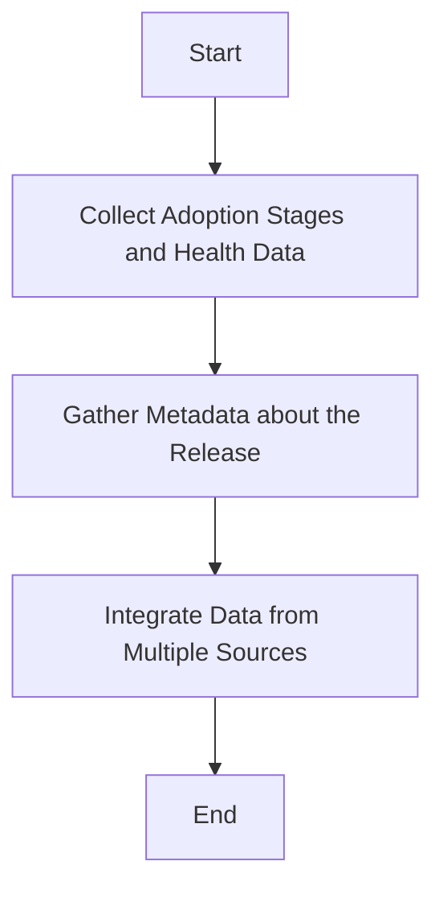

This document will cover the process of gathering release attributes, which includes:

1. Collecting adoption stages and health data
2. Gathering metadata about the release
3. Integrating data from multiple sources.

Technical document: <SwmLink doc-title="Gathering Release Attributes">[Gathering Release Attributes](/.swm/gathering-release-attributes.6banb79i.sw.md)</SwmLink>

# [Collecting Adoption Stages and Health Data](https://app.swimm.io/repos/Z2l0aHViJTNBJTNBc2VudHJ5LWRlbW8tMSUzQSUzQVN3aW1tLURlbW8=/docs/6banb79i#gathering-release-attributes)

The first step in gathering release attributes involves collecting data about the adoption stages and health of the release. Adoption stages refer to the different phases a release goes through, such as initial rollout, full deployment, and stable release. Health data includes metrics like error rates, performance issues, and user feedback. This information helps in understanding how widely the release has been adopted and its overall stability.

# [Gathering Metadata about the Release](https://app.swimm.io/repos/Z2l0aHViJTNBJTNBc2VudHJ5LWRlbW8tMSUzQSUzQVN3aW1tLURlbW8=/docs/6banb79i#fetching-last-deploy-metadata)

The next step is to gather metadata about the release. This includes information about the last commit, the authors involved, and the deployments. The metadata provides a detailed view of the release history, including who contributed to it and when it was last deployed. This information is crucial for tracking changes and understanding the context of the release.

# [Integrating Data from Multiple Sources](https://app.swimm.io/repos/Z2l0aHViJTNBJTNBc2VudHJ5LWRlbW8tMSUzQSUzQVN3aW1tLURlbW8=/docs/6banb79i#fetching-authors-metadata)

The final step is to integrate data from multiple sources to provide a comprehensive view of each release. This involves combining the adoption stages, health data, and metadata into a single, unified dataset. By integrating data from various sources, we can present a holistic view of the release, making it easier to identify issues and track progress.

&nbsp;

*This is an auto-generated document by Swimm AI 🌊 and has not yet been verified by a human*

<SwmMeta version="3.0.0" repo-id="Z2l0aHViJTNBJTNBc2VudHJ5LWRlbW8tMSUzQSUzQVN3aW1tLURlbW8=" repo-name="sentry-demo-1" doc-type="product-flows">Powered by [Swimm](/)</SwmMeta>
