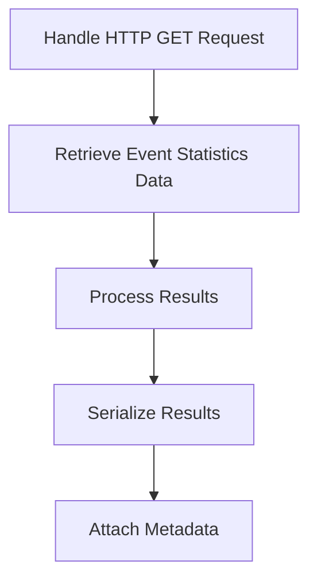

This document will cover the process of generating trending event statistics, which includes:

1. Handling HTTP GET requests
2. Retrieving event statistics data
3. Serializing the results and attaching metadata.

Technical document: <SwmLink doc-title="Generating Trending Event Statistics">[Generating Trending Event Statistics](/.swm/generating-trending-event-statistics.r4r3rkqi.sw.md)</SwmLink>

# [Handling HTTP GET Requests](https://app.swimm.io/repos/Z2l0aHViJTNBJTNBc2VudHJ5LWRlbW8tMSUzQSUzQVN3aW1tLURlbW8=/docs/r4r3rkqi#get)

The process begins when an HTTP GET request is made to retrieve trending events data. This request is validated to ensure it includes the necessary parameters. If the request is valid, it proceeds to fetch the required data. This step is crucial as it initiates the entire flow of generating trending event statistics.

# [Retrieving Event Statistics Data](https://app.swimm.io/repos/Z2l0aHViJTNBJTNBc2VudHJ5LWRlbW8tMSUzQSUzQVN3aW1tLURlbW8=/docs/r4r3rkqi#get_event_stats_data)

Once the GET request is validated, the next step is to retrieve the event statistics data. This involves constructing the necessary query parameters and making a request to the data source. The data retrieved includes various metrics and statistics related to the events. This step is essential as it gathers the raw data needed for further processing.

# [Processing Results](https://app.swimm.io/repos/Z2l0aHViJTNBJTNBc2VudHJ5LWRlbW8tMSUzQSUzQVN3aW1tLURlbW8=/docs/r4r3rkqi#get_stats_data_for_trending_events)

After retrieving the event statistics data, the results are processed to generate statistics for trending events. This involves iterating through the results, extracting relevant statistics for each event, and organizing them in a structured format. This step ensures that the data is ready for serialization and further analysis.

# [Serializing Results](https://app.swimm.io/repos/Z2l0aHViJTNBJTNBc2VudHJ5LWRlbW8tMSUzQSUzQVN3aW1tLURlbW8=/docs/r4r3rkqi#serialize_multiple_axis)

The processed results are then serialized. Serialization involves converting the data into a format that can be easily transmitted and stored. This step is important as it prepares the data for the final step of attaching metadata.

# [Attaching Metadata](https://app.swimm.io/repos/Z2l0aHViJTNBJTNBc2VudHJ5LWRlbW8tMSUzQSUzQVN3aW1tLURlbW8=/docs/r4r3rkqi#handle_results_with_meta)

The final step in the process is attaching metadata to the serialized results. Metadata includes additional information that provides context to the data, such as timestamps and event identifiers. This step ensures that the data is enriched with all necessary information for further analysis and reporting.

&nbsp;

*This is an auto-generated document by Swimm AI 🌊 and has not yet been verified by a human*

<SwmMeta version="3.0.0" repo-id="Z2l0aHViJTNBJTNBc2VudHJ5LWRlbW8tMSUzQSUzQVN3aW1tLURlbW8=" repo-name="sentry-demo-1" doc-type="product-flows">Powered by [Swimm](/)</SwmMeta>
