This document explains the process of generating statistics for trending events. It involves several steps, including handling HTTP GET requests, retrieving event statistics data, and serializing the results.

The process starts with handling an HTTP GET request to retrieve trending events data. It then retrieves event statistics based on the provided parameters and processes the results to generate statistics for trending events. Finally, it serializes the results and attaches metadata to ensure the data is in a consistent format for further analysis.

# Flow drill down

```mermaid
graph TD;
      subgraph src/sentry/api
efc433b7fad3e962b077197c6078bcee37587d03f0aff5e2ae2ae7ad727c3f44(get_stats_data_for_trending_events):::mainFlowStyle --> b245e962791f363f0b697a74e8bc080509f97e80b49986017b6f00c2c7fe19a2(get):::mainFlowStyle
end

subgraph src/sentry/api
b245e962791f363f0b697a74e8bc080509f97e80b49986017b6f00c2c7fe19a2(get):::mainFlowStyle --> 9a7c498c62bb10bd14cfa8e6b88481cb1758fe0fe619fac236b1dfc4f2bc9964(get_event_stats_data):::mainFlowStyle
end

subgraph src/sentry/api
9a7c498c62bb10bd14cfa8e6b88481cb1758fe0fe619fac236b1dfc4f2bc9964(get_event_stats_data):::mainFlowStyle --> a4f25188cdb1c709695d3a93e7176ddb7bd151b9a322e0836404ad0986b5f514(get_snuba_params)
end

subgraph src/sentry/api
9a7c498c62bb10bd14cfa8e6b88481cb1758fe0fe619fac236b1dfc4f2bc9964(get_event_stats_data):::mainFlowStyle --> 6bfd0761a315100cfb455cd63eee604e1d6ebf8e2957d5881bc086457f48801e(serialize_multiple_axis):::mainFlowStyle
end

subgraph src/sentry/api
6bfd0761a315100cfb455cd63eee604e1d6ebf8e2957d5881bc086457f48801e(serialize_multiple_axis):::mainFlowStyle --> 76555db3c36df80d8ce698d10ee1f95e79e25496e48ce2c0e3a19dce410f1dcd(handle_results_with_meta):::mainFlowStyle
end

subgraph src/sentry/api
76555db3c36df80d8ce698d10ee1f95e79e25496e48ce2c0e3a19dce410f1dcd(handle_results_with_meta):::mainFlowStyle --> 9335165d6fb85d88094c6bb73f9e154b223f793b29b1af6be9aa07d145132b65(handle_data):::mainFlowStyle
end


      classDef mainFlowStyle color:#000000,fill:#7CB9F4
classDef rootsStyle color:#000000,fill:#00FFF4
classDef Style1 color:#000000,fill:#00FFAA
classDef Style2 color:#000000,fill:#FFFF00
classDef Style3 color:#000000,fill:#AA7CB9

%% Swimm:
%% graph TD;
%%       subgraph <SwmPath>[src/sentry/api/](src/sentry/api/)</SwmPath>
%% efc433b7fad3e962b077197c6078bcee37587d03f0aff5e2ae2ae7ad727c3f44(get_stats_data_for_trending_events):::mainFlowStyle --> b245e962791f363f0b697a74e8bc080509f97e80b49986017b6f00c2c7fe19a2(get):::mainFlowStyle
%% end
%% 
%% subgraph <SwmPath>[src/sentry/api/](src/sentry/api/)</SwmPath>
%% b245e962791f363f0b697a74e8bc080509f97e80b49986017b6f00c2c7fe19a2(get):::mainFlowStyle --> 9a7c498c62bb10bd14cfa8e6b88481cb1758fe0fe619fac236b1dfc4f2bc9964(get_event_stats_data):::mainFlowStyle
%% end
%% 
%% subgraph <SwmPath>[src/sentry/api/](src/sentry/api/)</SwmPath>
%% 9a7c498c62bb10bd14cfa8e6b88481cb1758fe0fe619fac236b1dfc4f2bc9964(get_event_stats_data):::mainFlowStyle --> a4f25188cdb1c709695d3a93e7176ddb7bd151b9a322e0836404ad0986b5f514(get_snuba_params)
%% end
%% 
%% subgraph <SwmPath>[src/sentry/api/](src/sentry/api/)</SwmPath>
%% 9a7c498c62bb10bd14cfa8e6b88481cb1758fe0fe619fac236b1dfc4f2bc9964(get_event_stats_data):::mainFlowStyle --> 6bfd0761a315100cfb455cd63eee604e1d6ebf8e2957d5881bc086457f48801e(serialize_multiple_axis):::mainFlowStyle
%% end
%% 
%% subgraph <SwmPath>[src/sentry/api/](src/sentry/api/)</SwmPath>
%% 6bfd0761a315100cfb455cd63eee604e1d6ebf8e2957d5881bc086457f48801e(serialize_multiple_axis):::mainFlowStyle --> 76555db3c36df80d8ce698d10ee1f95e79e25496e48ce2c0e3a19dce410f1dcd(handle_results_with_meta):::mainFlowStyle
%% end
%% 
%% subgraph <SwmPath>[src/sentry/api/](src/sentry/api/)</SwmPath>
%% 76555db3c36df80d8ce698d10ee1f95e79e25496e48ce2c0e3a19dce410f1dcd(handle_results_with_meta):::mainFlowStyle --> 9335165d6fb85d88094c6bb73f9e154b223f793b29b1af6be9aa07d145132b65(handle_data):::mainFlowStyle
%% end
%% 
%% 
%%       classDef mainFlowStyle color:#000000,fill:#7CB9F4
%% classDef rootsStyle color:#000000,fill:#00FFF4
%% classDef Style1 color:#000000,fill:#00FFAA
%% classDef Style2 color:#000000,fill:#FFFF00
%% classDef Style3 color:#000000,fill:#AA7CB9
```



<SwmSnippet path="/src/sentry/api/endpoints/organization_events_trends_v2.py" line="310">

---

## <SwmToken path="src/sentry/api/endpoints/organization_events_trends_v2.py" pos="310:3:3" line-data="        def get_stats_data_for_trending_events(results):">`get_stats_data_for_trending_events`</SwmToken>

The function <SwmToken path="src/sentry/api/endpoints/organization_events_trends_v2.py" pos="310:3:3" line-data="        def get_stats_data_for_trending_events(results):">`get_stats_data_for_trending_events`</SwmToken> processes the results to generate statistics for trending events. It first initializes an empty dictionary <SwmToken path="src/sentry/api/endpoints/organization_events_trends_v2.py" pos="311:1:1" line-data="            trending_transaction_names_stats = {}">`trending_transaction_names_stats`</SwmToken>. If the request includes a <SwmToken path="src/sentry/api/endpoints/organization_events_trends_v2.py" pos="312:10:10" line-data="            if request.GET.get(&quot;withTimeseries&quot;, False):">`withTimeseries`</SwmToken> parameter, it directly assigns <SwmToken path="src/sentry/api/endpoints/organization_events_trends_v2.py" pos="313:5:5" line-data="                trending_transaction_names_stats = stats_data">`stats_data`</SwmToken> to this dictionary. Otherwise, it iterates through the results, extracting and parsing relevant statistics data for each transaction and project combination. If a mismatch occurs, it logs a warning. Finally, it returns a dictionary containing the processed events and statistics.

```python
        def get_stats_data_for_trending_events(results):
            trending_transaction_names_stats = {}
            if request.GET.get("withTimeseries", False):
                trending_transaction_names_stats = stats_data
            else:
                for t in results["data"]:
                    transaction_name = t["transaction"]
                    project = t["project"]
                    t_p_key = f"{project},{transaction_name}"
                    if t_p_key in stats_data:
                        selected_stats_data = stats_data[t_p_key]
                        idx = next(
                            i
                            for i, data in enumerate(selected_stats_data["data"])
                            if data[0] >= snuba_params.start_date.timestamp()
                        )
                        parsed_stats_data = selected_stats_data["data"][idx:]
                        selected_stats_data["data"] = parsed_stats_data
                        trending_transaction_names_stats[t_p_key] = selected_stats_data
                    else:
                        logger.warning(
```

---

</SwmSnippet>

<SwmSnippet path="/src/sentry/api/endpoints/organization_events_trends_v2.py" line="75">

---

## get

The <SwmToken path="src/sentry/api/endpoints/organization_events_trends_v2.py" pos="75:3:3" line-data="    def get(self, request: Request, organization) -&gt; Response:">`get`</SwmToken> function handles the HTTP GET request to retrieve trending events data. It includes several helper functions such as <SwmToken path="src/sentry/api/endpoints/organization_events_trends_v2.py" pos="95:3:3" line-data="        def get_top_events(user_query, snuba_params, event_limit, referrer):">`get_top_events`</SwmToken>, <SwmToken path="src/sentry/api/endpoints/organization_events_trends_v2.py" pos="115:3:3" line-data="        def generate_top_transaction_query(events):">`generate_top_transaction_query`</SwmToken>, <SwmToken path="src/sentry/api/endpoints/organization_events_trends_v2.py" pos="125:3:3" line-data="        def get_timeseries(top_events, _, rollup, zerofill_results):">`get_timeseries`</SwmToken>, <SwmToken path="src/sentry/api/endpoints/organization_events_trends_v2.py" pos="228:3:3" line-data="        def get_event_stats_metrics(_, user_query, snuba_params, rollup, zerofill_results, __):">`get_event_stats_metrics`</SwmToken>, <SwmToken path="src/sentry/api/endpoints/organization_events_trends_v2.py" pos="252:3:3" line-data="        def format_start_end(data):">`format_start_end`</SwmToken>, and <SwmToken path="src/sentry/api/endpoints/organization_events_trends_v2.py" pos="307:3:3" line-data="        def paginate_trending_events(offset, limit):">`paginate_trending_events`</SwmToken>. These helpers collectively fetch and format the top events, generate queries, and paginate the results. The <SwmToken path="src/sentry/api/endpoints/organization_events_trends_v2.py" pos="310:3:3" line-data="        def get_stats_data_for_trending_events(results):">`get_stats_data_for_trending_events`</SwmToken> function is called within this flow to process the final results.

```python
    def get(self, request: Request, organization) -> Response:
        if not self.has_feature(organization, request):
            return Response(status=404)

        try:
            snuba_params = self.get_snuba_params(request, organization)
        except NoProjects:
            return Response([])

        trend_type = request.GET.get("trendType", REGRESSION)
        if trend_type not in TREND_TYPES:
            raise ParseError(detail=f"{trend_type} is not a supported trend type")

        trend_function = request.GET.get("trendFunction", "p50()")

        selected_columns = ["project_id", "transaction"]

        query = request.GET.get("query")
        query_source = self.get_request_source(request)

        def get_top_events(user_query, snuba_params, event_limit, referrer):
```

---

</SwmSnippet>

<SwmSnippet path="/src/sentry/api/bases/organization_events.py" line="388">

---

## <SwmToken path="src/sentry/api/bases/organization_events.py" pos="388:3:3" line-data="    def get_event_stats_data(">`get_event_stats_data`</SwmToken>

The <SwmToken path="src/sentry/api/bases/organization_events.py" pos="388:3:3" line-data="    def get_event_stats_data(">`get_event_stats_data`</SwmToken> function retrieves event statistics data based on the provided parameters. It constructs the necessary query columns and parameters, handles errors, and makes the Snuba query. The results are then serialized and returned. This function is crucial for fetching and formatting the event statistics that are later processed by <SwmToken path="src/sentry/api/endpoints/organization_events_trends_v2.py" pos="310:3:3" line-data="        def get_stats_data_for_trending_events(results):">`get_stats_data_for_trending_events`</SwmToken>.

```python
    def get_event_stats_data(
        self,
        request: Request,
        organization: Organization,
        get_event_stats: Callable[
            [Sequence[str], str, SnubaParams, int, bool, timedelta | None], SnubaTSResult
        ],
        top_events: int = 0,
        query_column: str = "count()",
        snuba_params: SnubaParams | None = None,
        query: str | None = None,
        allow_partial_buckets: bool = False,
        zerofill_results: bool = True,
        comparison_delta: timedelta | None = None,
        additional_query_column: str | None = None,
        dataset: Any | None = None,
    ) -> dict[str, Any]:
        with handle_query_errors():
            with sentry_sdk.start_span(
                op="discover.endpoint", description="base.stats_query_creation"
            ):
```

---

</SwmSnippet>

<SwmSnippet path="/src/sentry/api/bases/organization_events.py" line="91">

---

## <SwmToken path="src/sentry/api/bases/organization_events.py" pos="91:3:3" line-data="    def get_snuba_params(">`get_snuba_params`</SwmToken>

The <SwmToken path="src/sentry/api/bases/organization_events.py" pos="91:3:3" line-data="    def get_snuba_params(">`get_snuba_params`</SwmToken> function generates the parameters required for making Snuba queries. It validates the request, extracts filter parameters, and constructs a <SwmToken path="src/sentry/api/bases/organization_events.py" pos="97:5:5" line-data="    ) -&gt; SnubaParams:">`SnubaParams`</SwmToken> object. This function ensures that the queries are correctly parameterized and adhere to the organization's settings.

```python
    def get_snuba_params(
        self,
        request: Request,
        organization: Organization,
        check_global_views: bool = True,
        quantize_date_params: bool = True,
    ) -> SnubaParams:
        """Returns params to make snuba queries with"""
        with sentry_sdk.start_span(op="discover.endpoint", description="filter_params(dataclass)"):
            if (
                len(self.get_field_list(organization, request))
                + len(self.get_equation_list(organization, request))
                > MAX_FIELDS
            ):
                raise ParseError(
                    detail=f"You can view up to {MAX_FIELDS} fields at a time. Please delete some and try again."
                )

            filter_params: dict[str, Any] = self.get_filter_params(request, organization)
            if quantize_date_params:
                filter_params = self.quantize_date_params(request, filter_params)
```

---

</SwmSnippet>

<SwmSnippet path="/src/sentry/api/bases/organization_events.py" line="566">

---

## <SwmToken path="src/sentry/api/bases/organization_events.py" pos="566:3:3" line-data="    def serialize_multiple_axis(">`serialize_multiple_axis`</SwmToken>

The <SwmToken path="src/sentry/api/bases/organization_events.py" pos="566:3:3" line-data="    def serialize_multiple_axis(">`serialize_multiple_axis`</SwmToken> function serializes the event results for multiple axes. It iterates through the query columns, serializes each axis, and handles metadata. This function is essential for formatting the results when multiple metrics are requested.

```python
    def serialize_multiple_axis(
        self,
        request: Request,
        organization: Organization,
        serializer: BaseSnubaSerializer,
        event_result: SnubaTSResult,
        snuba_params: SnubaParams,
        columns: Sequence[str],
        query_columns: Sequence[str],
        allow_partial_buckets: bool,
        zerofill_results: bool = True,
        dataset: Any | None = None,
    ) -> dict[str, Any]:
        # Return with requested yAxis as the key
        result = {}
        equations = 0
        meta = self.handle_results_with_meta(
            request,
            organization,
            snuba_params.project_ids,
            event_result.data,
```

---

</SwmSnippet>

<SwmSnippet path="/src/sentry/api/bases/organization_events.py" line="290">

---

## <SwmToken path="src/sentry/api/bases/organization_events.py" pos="290:3:3" line-data="    def handle_results_with_meta(">`handle_results_with_meta`</SwmToken>

The <SwmToken path="src/sentry/api/bases/organization_events.py" pos="290:3:3" line-data="    def handle_results_with_meta(">`handle_results_with_meta`</SwmToken> function processes the results and attaches metadata. It calls <SwmToken path="src/sentry/api/bases/organization_events.py" pos="300:7:7" line-data="            data = self.handle_data(request, organization, project_ids, results.get(&quot;data&quot;))">`handle_data`</SwmToken> to format the data and constructs the metadata dictionary. This function ensures that the results are enriched with additional information required for further processing.

```python
    def handle_results_with_meta(
        self,
        request: Request,
        organization: Organization,
        project_ids: Sequence[int],
        results: dict[str, Any],
        standard_meta: bool | None = False,
        dataset: Any | None = None,
    ) -> dict[str, Any]:
        with sentry_sdk.start_span(op="discover.endpoint", description="base.handle_results"):
            data = self.handle_data(request, organization, project_ids, results.get("data"))
            meta = results.get("meta", {})
            fields_meta = meta.get("fields", {})

            if standard_meta:
                isMetricsData = meta.pop("isMetricsData", False)
                isMetricsExtractedData = meta.pop("isMetricsExtractedData", False)
                discoverSplitDecision = meta.pop("discoverSplitDecision", None)
                fields, units = self.handle_unit_meta(fields_meta)
                meta = {
                    "fields": fields,
```

---

</SwmSnippet>

<SwmSnippet path="/src/sentry/api/bases/organization_events.py" line="332">

---

## <SwmToken path="src/sentry/api/bases/organization_events.py" pos="332:3:3" line-data="    def handle_data(">`handle_data`</SwmToken>

The <SwmToken path="src/sentry/api/bases/organization_events.py" pos="332:3:3" line-data="    def handle_data(">`handle_data`</SwmToken> function formats the raw results by handling specific fields like <SwmToken path="src/sentry/api/bases/organization_events.py" pos="346:4:6" line-data="        if &quot;transaction.status&quot; in first_row:">`transaction.status`</SwmToken> and <SwmToken path="src/sentry/api/bases/organization_events.py" pos="354:4:4" line-data="        if &quot;issue&quot; in fields:  # Look up the short ID and return that in the results">`issue`</SwmToken>. It also removes unnecessary fields and ensures that the results are in a consistent format. This function is a key step in preparing the data for serialization and further analysis.

```python
    def handle_data(
        self,
        request: Request,
        organization: Organization,
        project_ids: Sequence[int],
        results: Sequence[Any] | None,
    ) -> Sequence[Any] | None:
        if not results:
            return results

        first_row = results[0]

        # TODO(mark) move all of this result formatting into discover.query()
        # once those APIs are used across the application.
        if "transaction.status" in first_row:
            for row in results:
                if "transaction.status" in row and type(row["transaction.status"]) is int:
                    row["transaction.status"] = SPAN_STATUS_CODE_TO_NAME.get(
                        row["transaction.status"]
                    )

```

---

</SwmSnippet>

&nbsp;

*This is an auto-generated document by Swimm AI 🌊 and has not yet been verified by a human*

<SwmMeta version="3.0.0" repo-id="Z2l0aHViJTNBJTNBc2VudHJ5LWRlbW8tMSUzQSUzQVN3aW1tLURlbW8=" repo-name="sentry-demo-1" doc-type="flows"><sup>Powered by [Swimm](/)</sup></SwmMeta>
