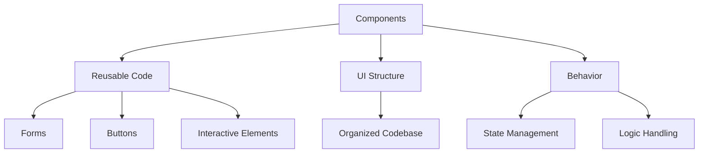

# Introduction

Components are reusable pieces of code that define the structure and behavior of the user interface in the browser. They are used to create and manage different parts of the web application, such as forms, buttons, and other interactive elements. Components help in organizing the codebase by breaking down the UI into smaller, manageable parts.

# Why Components are Used

Components are essential for creating and managing different parts of a web application. They help in organizing the codebase by breaking down the UI into smaller, manageable parts. This modular approach makes the code easier to maintain and scale.

# How to Use Components

Components can be styled using CSS-in-JS libraries like `styled-components` to ensure consistent design across the application. They can also handle state and logic, making them essential for building dynamic and responsive web applications.

<SwmSnippet path="/static/app/views/insights/browser/webVitals/components/webVitalsDetailPanel.tsx" line="166">

---

This line shows how a component can be used to display a performance score description.

```tsx
                "A number rating how impactful a performance improvement on this page would be to your application's [webVital] Performance Score.",
```

---

</SwmSnippet>

<SwmSnippet path="/static/app/views/insights/browser/webVitals/components/webVitalDescription.tsx" line="51">

---

This line demonstrates how a component can be used to describe a web vital metric.

```tsx
    'Largest Contentful Paint (LCP) measures the render time for the largest content to appear in the viewport. This may be in any form from the document object model (DOM), such as images, SVGs, or text blocks. It’s the largest pixel area in the viewport, thus most visually defining. LCP helps developers understand how long it takes to see the main content on the page.'
```

---

</SwmSnippet>

<SwmSnippet path="/static/app/views/insights/browser/webVitals/components/webVitalMeters.tsx" line="103">

---

This line illustrates how a component can be used to provide additional information about performance scores.

```tsx
                          {t('Find out how performance scores are calculated here.')}
```

---

</SwmSnippet>

<SwmSnippet path="/static/app/views/insights/browser/webVitals/components/tables/pagePerformanceTable.tsx" line="172">

---

This line shows how a component can be used to rate the impact of performance improvements.

```tsx
                  "A number rating how impactful a performance improvement on this page would be to your application's overall Performance Score."
```

---

</SwmSnippet>

# Components Endpoints

Components can also be used as endpoints to render specific parts of the application based on certain conditions.

## Recommendations

The <SwmToken path="static/app/views/insights/browser/webVitals/components/recommendations.tsx" pos="12:4:4" line-data="export function Recommendations({">`Recommendations`</SwmToken> function is an endpoint that takes a <SwmToken path="static/app/views/insights/browser/webVitals/components/recommendations.tsx" pos="13:1:1" line-data="  transaction,">`transaction`</SwmToken> and a <SwmToken path="static/app/views/insights/browser/webVitals/components/webVitalsDetailPanel.tsx" pos="166:37:37" line-data="                &quot;A number rating how impactful a performance improvement on this page would be to your application&#39;s [webVital] Performance Score.&quot;,">`webVital`</SwmToken> as parameters. It uses a switch statement to determine which component to render based on the <SwmToken path="static/app/views/insights/browser/webVitals/components/webVitalsDetailPanel.tsx" pos="166:37:37" line-data="                &quot;A number rating how impactful a performance improvement on this page would be to your application&#39;s [webVital] Performance Score.&quot;,">`webVital`</SwmToken> value. For example, if the <SwmToken path="static/app/views/insights/browser/webVitals/components/webVitalsDetailPanel.tsx" pos="166:37:37" line-data="                &quot;A number rating how impactful a performance improvement on this page would be to your application&#39;s [webVital] Performance Score.&quot;,">`webVital`</SwmToken> is 'fcp', it renders the <SwmToken path="static/app/views/insights/browser/webVitals/components/recommendations.tsx" pos="25:4:4" line-data="      return &lt;FcpRecommendations transaction={transaction} /&gt;;">`FcpRecommendations`</SwmToken> component with the provided <SwmToken path="static/app/views/insights/browser/webVitals/components/recommendations.tsx" pos="13:1:1" line-data="  transaction,">`transaction`</SwmToken>.

<SwmSnippet path="/static/app/views/insights/browser/webVitals/components/recommendations.tsx" line="12">

---

The <SwmToken path="static/app/views/insights/browser/webVitals/components/recommendations.tsx" pos="12:4:4" line-data="export function Recommendations({">`Recommendations`</SwmToken> function uses a switch statement to render different components based on the <SwmToken path="static/app/views/insights/browser/webVitals/components/recommendations.tsx" pos="14:1:1" line-data="  webVital,">`webVital`</SwmToken> value.

```tsx
export function Recommendations({
  transaction,
  webVital,
}: {
  transaction: string;
  webVital: WebVitals;
}) {
  switch (webVital) {
    case 'lcp':
      return null;
    case 'cls':
      return null;
    case 'fcp':
      return <FcpRecommendations transaction={transaction} />;
    case 'ttfb':
      return null;
    default:
      return null;
  }
}
```

---

</SwmSnippet>

## <SwmToken path="static/app/views/insights/browser/webVitals/components/recommendations.tsx" pos="25:4:4" line-data="      return &lt;FcpRecommendations transaction={transaction} /&gt;;">`FcpRecommendations`</SwmToken>

The <SwmToken path="static/app/views/insights/browser/webVitals/components/recommendations.tsx" pos="25:4:4" line-data="      return &lt;FcpRecommendations transaction={transaction} /&gt;;">`FcpRecommendations`</SwmToken> function is an endpoint that queries for resources related to the given <SwmToken path="static/app/views/insights/browser/webVitals/components/recommendations.tsx" pos="13:1:1" line-data="  transaction,">`transaction`</SwmToken> that are blocking the rendering process. It uses the <SwmToken path="static/app/views/insights/browser/webVitals/components/recommendations.tsx" pos="35:12:12" line-data="  const {data, isPending} = useResourcesQuery({">`useResourcesQuery`</SwmToken> hook to fetch data and then renders a list of recommendations to eliminate render-blocking resources. If the query is pending or returns no data, it renders nothing.

<SwmSnippet path="/static/app/views/insights/browser/webVitals/components/recommendations.tsx" line="33">

---

The <SwmToken path="static/app/views/insights/browser/webVitals/components/recommendations.tsx" pos="33:2:2" line-data="function FcpRecommendations({transaction}: {transaction: string}) {">`FcpRecommendations`</SwmToken> function fetches data related to render-blocking resources and renders a list of recommendations.

```tsx
function FcpRecommendations({transaction}: {transaction: string}) {
  const query = `transaction:"${transaction}" resource.render_blocking_status:blocking`;
  const {data, isPending} = useResourcesQuery({
    query,
    sort: {field: `avg(${SpanMetricsField.SPAN_SELF_TIME})`, kind: 'desc'},
    defaultResourceTypes: ['resource.script', 'resource.css', 'resource.img'],
    limit: 7,
    referrer: 'api.performance.browser.web-vitals.fcp-recommendations',
  });
  if (isPending || !data || data.length < 1) {
    return null;
  }
  return (
    <RecommendationsContainer>
      <RecommendationsHeader />
      <ul>
        <RecommendationSubHeader>
          {t('Eliminate render blocking resources')}
        </RecommendationSubHeader>
        <ResourceList>
          {data.map(
```

---

</SwmSnippet>

&nbsp;

*This is an auto-generated document by Swimm AI 🌊 and has not yet been verified by a human*

<SwmMeta version="3.0.0" repo-id="Z2l0aHViJTNBJTNBc2VudHJ5LWRlbW8tMSUzQSUzQVN3aW1tLURlbW8=" repo-name="sentry-demo-1" doc-type="overview"><sup>Powered by [Swimm](/)</sup></SwmMeta>
