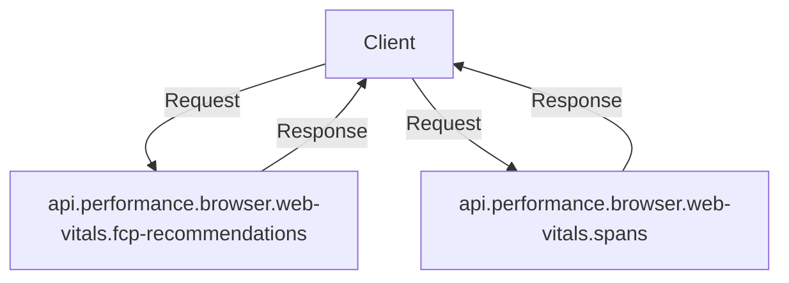

# Getting Started with Browser Insights

Browser Insights in Sentry allows you to track and categorize errors and performance metrics based on the browser type. This document will guide you through the essential components and functions used to implement Browser Insights.

## Browser Types

The <SwmToken path="static/app/views/insights/browser/webVitals/components/browserTypeSelector.tsx" pos="12:3:3" line-data="import {BrowserType} from &#39;sentry/views/insights/browser/webVitals/utils/queryParameterDecoders/browserType&#39;;">`BrowserType`</SwmToken> enum defines the different browser types that can be used for filtering data. This is crucial for categorizing and analyzing errors and performance metrics based on the browser type.

## Filtering Data by Browser Type

In the insights section, various utilities and components are available to filter, sort, and display data based on the browser type. The <SwmToken path="static/app/views/insights/browser/webVitals/components/browserTypeSelector.tsx" pos="75:6:6" line-data="export default function BrowserTypeSelector() {">`BrowserTypeSelector`</SwmToken> component uses <SwmToken path="static/app/views/insights/browser/webVitals/components/browserTypeSelector.tsx" pos="89:4:4" line-data="      options={browserOptions ?? []}">`browserOptions`</SwmToken> to provide a menu for filtering browsers.

<SwmSnippet path="/static/app/views/insights/browser/webVitals/components/browserTypeSelector.tsx" line="88">

---

The <SwmToken path="static/app/views/insights/browser/webVitals/components/browserTypeSelector.tsx" pos="75:6:6" line-data="export default function BrowserTypeSelector() {">`BrowserTypeSelector`</SwmToken> component uses <SwmToken path="static/app/views/insights/browser/webVitals/components/browserTypeSelector.tsx" pos="89:4:4" line-data="      options={browserOptions ?? []}">`browserOptions`</SwmToken> to provide a menu for filtering browsers.

```tsx
      menuTitle={'Filter Browsers'}
      options={browserOptions ?? []}
      onChange={(selectedOptions: SelectOption<string>[]) => {
```

---

</SwmSnippet>

## Fetching Categorized Interaction Samples

The <SwmToken path="static/app/views/insights/browser/webVitals/queries/useInteractionsCategorizedSamplesQuery.tsx" pos="17:4:4" line-data="export function useInteractionsCategorizedSamplesQuery({">`useInteractionsCategorizedSamplesQuery`</SwmToken> function utilizes the browser types to fetch categorized interaction samples. This function is essential for retrieving data that is specific to different browser types.

<SwmSnippet path="/static/app/views/insights/browser/webVitals/queries/useInteractionsCategorizedSamplesQuery.tsx" line="17">

---

The <SwmToken path="static/app/views/insights/browser/webVitals/queries/useInteractionsCategorizedSamplesQuery.tsx" pos="17:4:4" line-data="export function useInteractionsCategorizedSamplesQuery({">`useInteractionsCategorizedSamplesQuery`</SwmToken> function utilizes the browser types to fetch categorized interaction samples.

```tsx
export function useInteractionsCategorizedSamplesQuery({
  transaction,
  enabled,
  browserTypes,
  subregions,
}: Props) {
```

---

</SwmSnippet>

## Decoding Browser Type Values

The <SwmToken path="static/app/views/insights/browser/webVitals/utils/queryParameterDecoders/browserType.tsx" pos="20:6:6" line-data="export default function decode(">`decode`</SwmToken> function in <SwmToken path="static/app/views/insights/browser/webVitals/components/browserTypeSelector.tsx" pos="12:21:21" line-data="import {BrowserType} from &#39;sentry/views/insights/browser/webVitals/utils/queryParameterDecoders/browserType&#39;;">`queryParameterDecoders`</SwmToken> ensures that the browser type values are valid and correctly interpreted. This step is crucial for maintaining data integrity and accuracy.

<SwmSnippet path="/static/app/views/insights/browser/webVitals/utils/queryParameterDecoders/browserType.tsx" line="3">

---

The <SwmToken path="static/app/views/insights/browser/webVitals/utils/queryParameterDecoders/browserType.tsx" pos="20:6:6" line-data="export default function decode(">`decode`</SwmToken> function ensures that the browser type values are valid and correctly interpreted.

```tsx
// TODO: include both "Google Chrome" and "Chrome" when filtering by Chrome browser
// Taken from: https://github.com/getsentry/relay/blob/ed2fc8c85b2732011e8262f4f598fa2c9857571d/relay-dynamic-config/src/defaults.rs#L146
```

---

</SwmSnippet>

## Browser Endpoints

Browser endpoints are used to fetch specific data related to browser performance metrics. Two key endpoints are <SwmToken path="static/app/views/insights/browser/webVitals/components/recommendations.tsx" pos="40:5:17" line-data="    referrer: &#39;api.performance.browser.web-vitals.fcp-recommendations&#39;,">`api.performance.browser.web-vitals.fcp-recommendations`</SwmToken> and <SwmToken path="static/app/views/insights/browser/webVitals/queries/useInpSpanSamplesWebVitalsQuery.tsx" pos="79:2:12" line-data="    &#39;api.performance.browser.web-vitals.spans&#39;">`api.performance.browser.web-vitals.spans`</SwmToken>.

### FCP Recommendations Endpoint

The <SwmToken path="static/app/views/insights/browser/webVitals/components/recommendations.tsx" pos="40:5:17" line-data="    referrer: &#39;api.performance.browser.web-vitals.fcp-recommendations&#39;,">`api.performance.browser.web-vitals.fcp-recommendations`</SwmToken> endpoint is used to fetch recommendations for improving the First Contentful Paint (FCP) metric. The <SwmToken path="static/app/views/insights/browser/webVitals/components/recommendations.tsx" pos="33:2:2" line-data="function FcpRecommendations({transaction}: {transaction: string}) {">`FcpRecommendations`</SwmToken> function constructs a query to identify render-blocking resources and uses the <SwmToken path="static/app/views/insights/browser/webVitals/components/recommendations.tsx" pos="35:12:12" line-data="  const {data, isPending} = useResourcesQuery({">`useResourcesQuery`</SwmToken> hook to fetch the relevant data.

<SwmSnippet path="/static/app/views/insights/browser/webVitals/components/recommendations.tsx" line="33">

---

The <SwmToken path="static/app/views/insights/browser/webVitals/components/recommendations.tsx" pos="33:2:2" line-data="function FcpRecommendations({transaction}: {transaction: string}) {">`FcpRecommendations`</SwmToken> function constructs a query to identify render-blocking resources and uses the <SwmToken path="static/app/views/insights/browser/webVitals/components/recommendations.tsx" pos="35:12:12" line-data="  const {data, isPending} = useResourcesQuery({">`useResourcesQuery`</SwmToken> hook to fetch the relevant data.

```tsx
function FcpRecommendations({transaction}: {transaction: string}) {
  const query = `transaction:"${transaction}" resource.render_blocking_status:blocking`;
  const {data, isPending} = useResourcesQuery({
    query,
    sort: {field: `avg(${SpanMetricsField.SPAN_SELF_TIME})`, kind: 'desc'},
    defaultResourceTypes: ['resource.script', 'resource.css', 'resource.img'],
    limit: 7,
    referrer: 'api.performance.browser.web-vitals.fcp-recommendations',
  });
```

---

</SwmSnippet>

### Spans Endpoint

The <SwmToken path="static/app/views/insights/browser/webVitals/queries/useInpSpanSamplesWebVitalsQuery.tsx" pos="79:2:12" line-data="    &#39;api.performance.browser.web-vitals.spans&#39;">`api.performance.browser.web-vitals.spans`</SwmToken> endpoint is used to fetch indexed span data related to browser interactions. The <SwmToken path="static/app/views/insights/browser/webVitals/queries/useInteractionsCategorizedSamplesQuery.tsx" pos="1:3:3" line-data="import {useInpSpanSamplesWebVitalsQuery} from &#39;sentry/views/insights/browser/webVitals/queries/useInpSpanSamplesWebVitalsQuery&#39;;">`useInpSpanSamplesWebVitalsQuery`</SwmToken> function constructs a search query with various filters and sorts, and uses the <SwmToken path="static/app/views/insights/browser/webVitals/queries/useInpSpanSamplesWebVitalsQuery.tsx" pos="56:16:16" line-data="  const {data, isPending, ...rest} = useSpansIndexed(">`useSpansIndexed`</SwmToken> hook to fetch the data.

<SwmSnippet path="/static/app/views/insights/browser/webVitals/queries/useInpSpanSamplesWebVitalsQuery.tsx" line="56">

---

The <SwmToken path="static/app/views/insights/browser/webVitals/queries/useInteractionsCategorizedSamplesQuery.tsx" pos="1:3:3" line-data="import {useInpSpanSamplesWebVitalsQuery} from &#39;sentry/views/insights/browser/webVitals/queries/useInpSpanSamplesWebVitalsQuery&#39;;">`useInpSpanSamplesWebVitalsQuery`</SwmToken> function constructs a search query with various filters and sorts, and uses the <SwmToken path="static/app/views/insights/browser/webVitals/queries/useInpSpanSamplesWebVitalsQuery.tsx" pos="56:16:16" line-data="  const {data, isPending, ...rest} = useSpansIndexed(">`useSpansIndexed`</SwmToken> hook to fetch the data.

```tsx
  const {data, isPending, ...rest} = useSpansIndexed(
    {
      search: mutableSearch,
      sorts: [sort],
      fields: [
        SpanIndexedField.INP,
        SpanIndexedField.INP_SCORE,
        SpanIndexedField.INP_SCORE_WEIGHT,
        SpanIndexedField.TOTAL_SCORE,
        SpanIndexedField.ID,
        SpanIndexedField.TIMESTAMP,
        SpanIndexedField.PROFILE_ID,
        SpanIndexedField.REPLAY_ID,
        SpanIndexedField.USER,
        SpanIndexedField.ORIGIN_TRANSACTION,
        SpanIndexedField.PROJECT,
        SpanIndexedField.BROWSER_NAME,
        SpanIndexedField.SPAN_SELF_TIME,
        SpanIndexedField.SPAN_DESCRIPTION,
      ],
      enabled,
```

---

</SwmSnippet>

&nbsp;

*This is an auto-generated document by Swimm AI 🌊 and has not yet been verified by a human*

<SwmMeta version="3.0.0" repo-id="Z2l0aHViJTNBJTNBc2VudHJ5LWRlbW8tMSUzQSUzQVN3aW1tLURlbW8=" repo-name="sentry-demo-1" doc-type="overview"><sup>Powered by [Swimm](/)</sup></SwmMeta>
