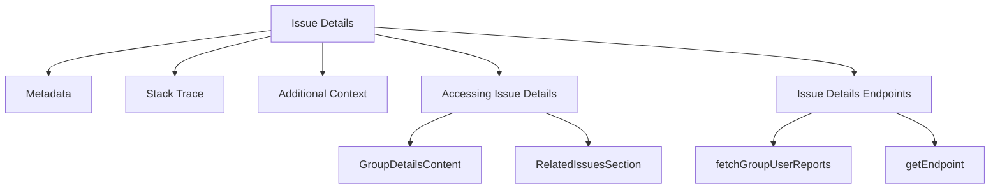

# Getting Started with Detailed Issue Information

Issue details provide comprehensive information about a specific issue encountered in the application. This includes metadata such as the issue's status, the user who reported it, and the environment in which it occurred. The details also encompass the stack trace, which helps in identifying the exact point of failure in the code. Additional context like suspect commits and tags are included to assist in diagnosing and resolving the issue. The issue details are accessible through various views and components, ensuring that developers have all necessary information at their disposal.

## Metadata

Metadata includes the issue's status, the user who reported it, and the environment in which it occurred.

## Stack Trace

The stack trace helps in identifying the exact point of failure in the code.

## Additional Context

Additional context like suspect commits and tags are included to assist in diagnosing and resolving the issue.

## Main Functions

There are several main functions in this folder. Some of them are <SwmToken path="static/app/views/issueDetails/groupDetails.tsx" pos="668:2:2" line-data="function GroupDetailsContent({">`GroupDetailsContent`</SwmToken>, <SwmToken path="static/app/views/issueDetails/groupRelatedIssues/index.tsx" pos="58:2:2" line-data="function RelatedIssuesSection({">`RelatedIssuesSection`</SwmToken>, `useIssueDetailsHeader`, and `TraceDataSection`. We will dive a little into <SwmToken path="static/app/views/issueDetails/groupDetails.tsx" pos="668:2:2" line-data="function GroupDetailsContent({">`GroupDetailsContent`</SwmToken> and <SwmToken path="static/app/views/issueDetails/groupRelatedIssues/index.tsx" pos="58:2:2" line-data="function RelatedIssuesSection({">`RelatedIssuesSection`</SwmToken>.

<SwmSnippet path="/static/app/views/issueDetails/groupDetails.tsx" line="668">

---

### <SwmToken path="static/app/views/issueDetails/groupDetails.tsx" pos="668:2:2" line-data="function GroupDetailsContent({">`GroupDetailsContent`</SwmToken>

The <SwmToken path="static/app/views/issueDetails/groupDetails.tsx" pos="668:2:2" line-data="function GroupDetailsContent({">`GroupDetailsContent`</SwmToken> function is responsible for rendering the main content of the issue details page. It includes various components such as tabs for different sections, headers, and event details. This function ensures that all relevant information about the issue is displayed in an organized manner.

```tsx
function GroupDetailsContent({
  children,
  group,
  project,
  loadingEvent,
  eventError,
  event,
  refetchData,
}: GroupDetailsContentProps) {
  const organization = useOrganization();
  const router = useRouter();

  const {currentTab, baseUrl} = getCurrentRouteInfo({group, event, router, organization});
  const groupReprocessingStatus = getGroupReprocessingStatus(group);

  const environments = useEnvironmentsFromUrl();

  const hasStreamlinedUI = useHasStreamlinedUI();

  useTrackView({group, event, project, tab: currentTab});
```

---

</SwmSnippet>

<SwmSnippet path="/static/app/views/issueDetails/groupRelatedIssues/index.tsx" line="58">

---

### <SwmToken path="static/app/views/issueDetails/groupRelatedIssues/index.tsx" pos="58:2:2" line-data="function RelatedIssuesSection({">`RelatedIssuesSection`</SwmToken>

The <SwmToken path="static/app/views/issueDetails/groupRelatedIssues/index.tsx" pos="58:2:2" line-data="function RelatedIssuesSection({">`RelatedIssuesSection`</SwmToken> function fetches and displays a list of issues related to the current issue. It uses the <SwmToken path="static/app/views/issueDetails/groupRelatedIssues/index.tsx" pos="69:5:5" line-data="  } = useApiQuery&lt;RelatedIssuesResponse&gt;(">`useApiQuery`</SwmToken> hook to retrieve related issues from the API and provides links to view these issues in detail. This section helps in understanding the broader context of the issue by showing other issues that might be connected.

```tsx
function RelatedIssuesSection({
  groupId,
  orgSlug,
  relationType,
}: RelatedIssuesSectionProps) {
  // Fetch the list of related issues
  const {
    isPending,
    isError,
    data: relatedIssues,
    refetch,
  } = useApiQuery<RelatedIssuesResponse>(
    [`/issues/${groupId}/related-issues/?type=${relationType}`],
    {
      staleTime: 0,
    }
  );

  const traceMeta = relationType === 'trace_connected' ? relatedIssues?.meta : undefined;
  const issues = relatedIssues?.data ?? [];
  const query = `issue.id:[${issues}]`;
```

---

</SwmSnippet>

## Issue Details Endpoints

Issue Details Endpoints provide the necessary API endpoints to fetch detailed information about issues.

<SwmSnippet path="/static/app/views/issueDetails/utils.tsx" line="37">

---

### <SwmToken path="static/app/views/issueDetails/utils.tsx" pos="37:4:4" line-data="export function fetchGroupUserReports(">`fetchGroupUserReports`</SwmToken>

The <SwmToken path="static/app/views/issueDetails/utils.tsx" pos="37:4:4" line-data="export function fetchGroupUserReports(">`fetchGroupUserReports`</SwmToken> function is used to fetch user reports for a specific issue group. It constructs a URL using the organization slug and group ID, and makes a request to the `/organizations/{orgSlug}/issues/{groupId}/user-reports/` endpoint.

```tsx
export function fetchGroupUserReports(
  orgSlug: string,
  groupId: string,
  query: Record<string, string>
) {
  const api = new Client();

  return api.requestPromise(`/organizations/${orgSlug}/issues/${groupId}/user-reports/`, {
    includeAllArgs: true,
    query,
  });
```

---

</SwmSnippet>

<SwmSnippet path="/static/app/views/issueDetails/groupMerged/index.tsx" line="82">

---

### <SwmToken path="static/app/views/issueDetails/groupMerged/index.tsx" pos="82:1:1" line-data="  getEndpoint() {">`getEndpoint`</SwmToken>

The <SwmToken path="static/app/views/issueDetails/groupMerged/index.tsx" pos="82:1:1" line-data="  getEndpoint() {">`getEndpoint`</SwmToken> function constructs the URL for fetching merged issues related to a specific group. It uses the organization slug and group ID to create the endpoint `/organizations/{organization.slug}/issues/{groupId}/hashes/` with query parameters.

```tsx
  getEndpoint() {
    const {params, location, organization} = this.props;
    const {groupId} = params;

    const queryParams = {
      ...location.query,
      limit: 50,
      query: this.state.query,
    };

    return `/organizations/${organization.slug}/issues/${groupId}/hashes/?${qs.stringify(
      queryParams
    )}`;
```

---

</SwmSnippet>

&nbsp;

*This is an auto-generated document by Swimm AI 🌊 and has not yet been verified by a human*

<SwmMeta version="3.0.0" repo-id="Z2l0aHViJTNBJTNBc2VudHJ5LWRlbW8tMSUzQSUzQVN3aW1tLURlbW8=" repo-name="sentry-demo-1" doc-type="overview"><sup>Powered by [Swimm](/)</sup></SwmMeta>
