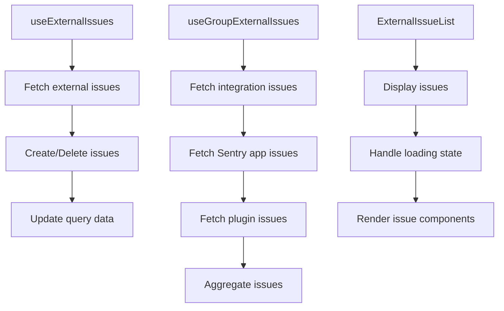

# Getting Started with External Issues List in Group

The External Issues List aggregates issues from various external sources such as integrations, plugins, and Sentry apps. It provides a unified view of all related issues within the Sentry application. This functionality is implemented using various hooks and components that interact with the Sentry API and other external services.

<SwmSnippet path="/static/app/components/group/externalIssuesList/useExternalIssues.tsx" line="25">

---

# Fetching External Issues

The function <SwmToken path="static/app/components/group/externalIssuesList/useExternalIssues.tsx" pos="25:4:4" line-data="export function useExternalIssues({group, organization}: UseExternalIssuesOptions) {">`useExternalIssues`</SwmToken> fetches external issues for a given group and organization using the Sentry API. It uses the <SwmToken path="static/app/components/group/externalIssuesList/useExternalIssues.tsx" pos="27:17:17" line-data="  const {isPending, data = []} = useApiQuery&lt;PlatformExternalIssue[]&gt;(">`useApiQuery`</SwmToken> hook to make an API call and retrieve the data.

```tsx
export function useExternalIssues({group, organization}: UseExternalIssuesOptions) {
  const queryClient = useQueryClient();
  const {isPending, data = []} = useApiQuery<PlatformExternalIssue[]>(
    getExternalIssuesQueryKey({group, organization}),
    {staleTime: 60_000}
  );
```

---

</SwmSnippet>

<SwmSnippet path="/static/app/components/group/externalIssuesList/useExternalIssues.tsx" line="32">

---

The <SwmToken path="static/app/components/group/externalIssuesList/useExternalIssues.tsx" pos="25:4:4" line-data="export function useExternalIssues({group, organization}: UseExternalIssuesOptions) {">`useExternalIssues`</SwmToken> function also provides methods to create and delete external issues, updating the query data accordingly.

```tsx
  const onCreateExternalIssue = useCallback(
    (issue: PlatformExternalIssue) => {
      setApiQueryData<PlatformExternalIssue[]>(
        queryClient,
        getExternalIssuesQueryKey({group, organization}),
        existingIssues => [...existingIssues, issue]
      );
    },
```

---

</SwmSnippet>

<SwmSnippet path="/static/app/components/group/externalIssuesList/hooks/useGroupExternalIssues.tsx" line="21">

---

# Aggregating Issues

The function <SwmToken path="static/app/components/group/externalIssuesList/hooks/useGroupExternalIssues.tsx" pos="21:6:6" line-data="export default function useGroupExternalIssues({">`useGroupExternalIssues`</SwmToken> aggregates external issues from integrations, plugins, and Sentry apps. It fetches issues from different sources and combines them into a single list.

```tsx
export default function useGroupExternalIssues({
  group,
  event,
  project,
}: Props): GroupIntegrationIssueResult {
  const issueTrackingFilter = useIssueTrackingFilter();

  const {
    integrations: realIntegrations,
    linkedIssues: integrationLinkedIssues,
    isLoading: isLoadingIntegrations,
  } = useIntegrationExternalIssues({group});

  const {
    isLoading: isLoadingSentryApp,
    integrations: sentryAppIntegrations,
    linkedIssues: sentryAppLinkedIssues,
  } = useSentryAppExternalIssues({group, event});

  const {integrations: pluginIntegrations, linkedIssues: pluginLinkedIssues} =
    usePluginExternalIssues({group, project});
```

---

</SwmSnippet>

<SwmSnippet path="/static/app/components/group/externalIssuesList/index.tsx" line="32">

---

# Displaying Issues

The component <SwmToken path="static/app/components/group/externalIssuesList/index.tsx" pos="32:6:6" line-data="export default function ExternalIssueList({group, event, project}: Props) {">`ExternalIssueList`</SwmToken> displays the aggregated external issues in the user interface. It handles the loading state and renders the issue components accordingly.

```tsx
export default function ExternalIssueList({group, event, project}: Props) {
  const organization = useOrganization();
  const {isLoading, actions} = useExternalIssueData({
    group,
    event,
    project,
  });

  if (isLoading) {
    return (
      <SidebarSection.Wrap data-test-id="linked-issues">
        <SidebarSection.Title>{t('Issue Tracking')}</SidebarSection.Title>
        <SidebarSection.Content>
          <Placeholder height="120px" />
        </SidebarSection.Content>
      </SidebarSection.Wrap>
    );
  }

  const renderers: Record<ExternalIssueType, (props) => ReactNode> = {
    'sentry-app-issue': ({sentryApp, ...props}: SentryAppIssueComponent['props']) => (
```

---

</SwmSnippet>

# Main Functions

Several main functions are used to manage external issues. These include <SwmToken path="static/app/components/group/externalIssuesList/useExternalIssues.tsx" pos="25:4:4" line-data="export function useExternalIssues({group, organization}: UseExternalIssuesOptions) {">`useExternalIssues`</SwmToken>, <SwmToken path="static/app/components/group/externalIssuesList/hooks/useGroupExternalIssues.tsx" pos="32:5:5" line-data="  } = useIntegrationExternalIssues({group});">`useIntegrationExternalIssues`</SwmToken>, <SwmToken path="static/app/components/group/externalIssuesList/hooks/useGroupExternalIssues.tsx" pos="21:6:6" line-data="export default function useGroupExternalIssues({">`useGroupExternalIssues`</SwmToken>, and <SwmToken path="static/app/components/group/externalIssuesList/index.tsx" pos="32:6:6" line-data="export default function ExternalIssueList({group, event, project}: Props) {">`ExternalIssueList`</SwmToken>.

<SwmSnippet path="/static/app/components/group/externalIssuesList/useExternalIssues.tsx" line="32">

---

The <SwmToken path="static/app/components/group/externalIssuesList/useExternalIssues.tsx" pos="25:4:4" line-data="export function useExternalIssues({group, organization}: UseExternalIssuesOptions) {">`useExternalIssues`</SwmToken> function also provides methods to create and delete external issues, updating the query data accordingly.

```tsx
  const onCreateExternalIssue = useCallback(
    (issue: PlatformExternalIssue) => {
      setApiQueryData<PlatformExternalIssue[]>(
        queryClient,
        getExternalIssuesQueryKey({group, organization}),
        existingIssues => [...existingIssues, issue]
      );
    },
```

---

</SwmSnippet>

<SwmSnippet path="/static/app/components/group/externalIssuesList/hooks/useSentryAppExternalIssues.tsx" line="16">

---

# <SwmToken path="static/app/components/group/externalIssuesList/hooks/useSentryAppExternalIssues.tsx" pos="16:4:4" line-data="export function useSentryAppExternalIssues({">`useSentryAppExternalIssues`</SwmToken>

The <SwmToken path="static/app/components/group/externalIssuesList/hooks/useSentryAppExternalIssues.tsx" pos="16:4:4" line-data="export function useSentryAppExternalIssues({">`useSentryAppExternalIssues`</SwmToken> function fetches and manages external issues linked to Sentry apps. It uses the Sentry API to retrieve external issues and integrates them into the Sentry application.

```tsx
export function useSentryAppExternalIssues({
  group,
  event,
}: {
  event: Event;
  group: Group;
}): GroupIntegrationIssueResult {
  const api = useApi();
  const organization = useOrganization();
  const {
    data: externalIssues,
    isLoading,
    onDeleteExternalIssue,
  } = useExternalIssues({
    group,
    organization,
  });
  const sentryAppComponents = useSentryAppComponentsStore({componentType: 'issue-link'});
  const sentryAppInstallations = useLegacyStore(SentryAppInstallationStore);

  const result: GroupIntegrationIssueResult = {
```

---

</SwmSnippet>

&nbsp;

*This is an auto-generated document by Swimm AI 🌊 and has not yet been verified by a human*

<SwmMeta version="3.0.0" repo-id="Z2l0aHViJTNBJTNBc2VudHJ5LWRlbW8tMSUzQSUzQVN3aW1tLURlbW8=" repo-name="sentry-demo-1" doc-type="overview"><sup>Powered by [Swimm](/)</sup></SwmMeta>
