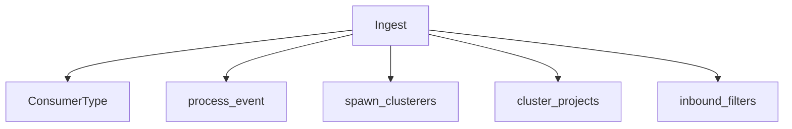
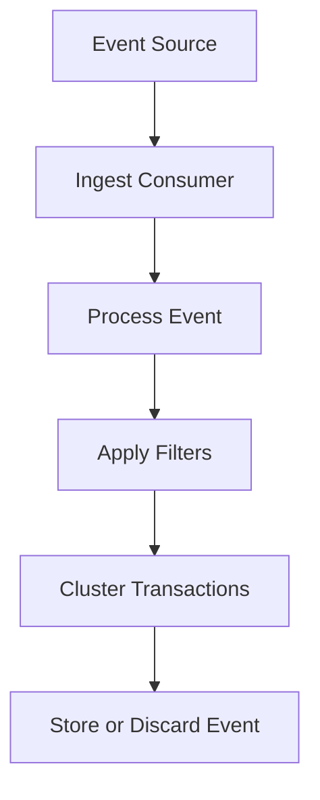
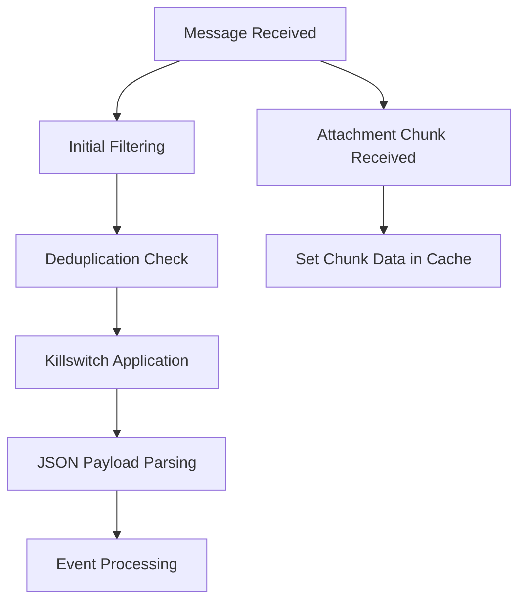

# Getting Started with Ingestion Process

Ingest refers to the process of consuming and processing various types of events and data within the application. This document will guide you through the different components involved in the ingestion process, including consumer types, event processing, clustering, and filters.

## Consumer Types

The <SwmToken path="src/sentry/ingest/types.py" pos="1:2:2" line-data="class ConsumerType:">`ConsumerType`</SwmToken> class defines different types of ingestion consumers, such as those for simple events, events with attachments, transaction events, and user feedback.

<SwmSnippet path="/src/sentry/ingest/types.py" line="1">

---

The <SwmToken path="src/sentry/ingest/types.py" pos="1:2:2" line-data="class ConsumerType:">`ConsumerType`</SwmToken> class defines the types of ingestion consumers. It includes consumers for simple events, events with attachments, transaction events, and user feedback.

```python
class ConsumerType:
    """
    Defines the types of ingestion consumers
    """

    Events = "events"  # consumes simple events ( from the Events topic)
    Attachments = "attachments"  # consumes events with attachments ( from the Attachments topic)
    Transactions = "transactions"  # consumes transaction events ( from the Transactions topic)
    Feedback = "feedback"  # consumes user feedback ( from the ingest-feedback-events topic)
```

---

</SwmSnippet>

## Event Processing

The <SwmToken path="src/sentry/ingest/consumer/processors.py" pos="56:8:8" line-data="@trace_func(name=&quot;ingest_consumer.process_event&quot;)">`process_event`</SwmToken> function is responsible for initial filtering and deserialization of the message payload. It checks for deduplication, applies killswitches, and parses the JSON payload. This function ensures that events are processed correctly and avoids reprocessing already handled events.

## Clustering

The `spawn_clusterers` and `cluster_projects` functions handle the clustering of transaction names, which is part of the ingestion process.

## Filters

Various filters are applied to events during the ingestion process to determine if they should be processed further or discarded.



## Ingest Endpoints

Ingest endpoints are crucial for managing the ingestion process. They handle the reception and processing of events and attachments.

### <SwmToken path="src/sentry/ingest/consumer/processors.py" pos="229:8:8" line-data="@trace_func(name=&quot;ingest_consumer.process_attachment_chunk&quot;)">`process_attachment_chunk`</SwmToken>

The <SwmToken path="src/sentry/ingest/consumer/processors.py" pos="229:8:8" line-data="@trace_func(name=&quot;ingest_consumer.process_attachment_chunk&quot;)">`process_attachment_chunk`</SwmToken> function handles the processing of individual attachment chunks. It sets the chunk data in the attachment cache with a specified timeout. This function is crucial for managing large attachments that are uploaded in multiple chunks.

<SwmSnippet path="/src/sentry/ingest/consumer/processors.py" line="229">

---

The <SwmToken path="src/sentry/ingest/consumer/processors.py" pos="229:8:8" line-data="@trace_func(name=&quot;ingest_consumer.process_attachment_chunk&quot;)">`process_attachment_chunk`</SwmToken> function processes individual attachment chunks and sets the chunk data in the attachment cache.

```python
@trace_func(name="ingest_consumer.process_attachment_chunk")
@metrics.wraps("ingest_consumer.process_attachment_chunk")
def process_attachment_chunk(message: IngestMessage) -> None:
    payload = message["payload"]
    event_id = message["event_id"]
    project_id = message["project_id"]
    id = message["id"]
    chunk_index = message["chunk_index"]
    cache_key = cache_key_for_event({"event_id": event_id, "project": project_id})
    attachment_cache.set_chunk(
        key=cache_key, id=id, chunk_index=chunk_index, chunk_data=payload, timeout=CACHE_TIMEOUT
    )
```

---

</SwmSnippet>



&nbsp;

*This is an auto-generated document by Swimm AI 🌊 and has not yet been verified by a human*

<SwmMeta version="3.0.0" repo-id="Z2l0aHViJTNBJTNBc2VudHJ5LWRlbW8tMSUzQSUzQVN3aW1tLURlbW8=" repo-name="sentry-demo-1" doc-type="overview"><sup>Powered by [Swimm](/)</sup></SwmMeta>
