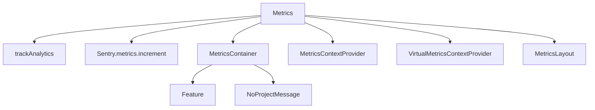

# Introduction

Metrics refer to the various measurements and data points collected to monitor and analyze the performance and behavior of the application. They are used to track custom metrics, which are specific to the application's needs and provide insights into different aspects of its performance.

# Initializing Metrics Tracking

The <SwmToken path="static/app/views/metrics/utils/useMetricsIntervalParam.tsx" pos="17:13:13" line-data="import {useUpdateQuery} from &#39;sentry/utils/metrics&#39;;">`metrics`</SwmToken> component initializes the metrics tracking by calling functions like `trackAnalytics` and <SwmToken path="static/app/views/metrics/context.tsx" pos="319:1:5" line-data="        Sentry.metrics.increment(&#39;ddm.enhance.range-undefined&#39;);">`Sentry.metrics.increment`</SwmToken> to log page views and visits.

# Ensuring Metrics Feature Availability

The `MetricsContainer` component ensures that the custom metrics feature is enabled for the organization and displays an alert if the feature is not accessible.

# Managing Metrics Context

The <SwmToken path="static/app/views/metrics/context.tsx" pos="267:4:4" line-data="export function MetricsContextProvider({children}: {children: React.ReactNode}) {">`MetricsContextProvider`</SwmToken> and `VirtualMetricsContextProvider` components are used to manage the context and state related to metrics within the application.

# Rendering Metrics Layout

The `MetricsLayout` component is responsible for rendering the layout and structure of the metrics-related views.

# Vertical Metrics

For historical reasons, font files include three different sets of metrics (`win`, `typo`, and `hhea`). These metrics have been modified to standardize rendering across operating systems and browsers. The modified metrics are: `win` ascent: 840, `win` descent: 250, `typo` ascent: 840, `typo` descent: -250, `hhea` ascent: 935, `hhea` descent: -230.

# Customizing Metrics Interval

The <SwmToken path="static/app/views/metrics/utils/useMetricsIntervalParam.tsx" pos="93:4:4" line-data="export function useMetricsIntervalParam() {">`useMetricsIntervalParam`</SwmToken> function defines interval options for metrics, allowing customization of the time intervals for which metrics are tracked.

<SwmSnippet path="/static/app/views/metrics/utils/useMetricsIntervalParam.tsx" line="25">

---

The <SwmToken path="static/app/views/metrics/utils/useMetricsIntervalParam.tsx" pos="93:4:4" line-data="export function useMetricsIntervalParam() {">`useMetricsIntervalParam`</SwmToken> function defines interval options for metrics, allowing customization of the time intervals for which metrics are tracked.

```tsx
const ALL_INTERVAL_OPTIONS = [
  {value: '1m', label: t('1 minute')},
  {value: '5m', label: t('5 minutes')},
  {value: '15m', label: t('15 minutes')},
  {value: '30m', label: t('30 minutes')},
  {value: '1h', label: t('1 hour')},
  {value: '4h', label: t('4 hours')},
  {value: '1d', label: t('1 day')},
  {value: '1w', label: t('1 week')},
  {value: '4w', label: t('1 month')},
];
```

---

</SwmSnippet>

# Main Functions

There are several main functions related to metrics. Some of them are <SwmToken path="static/app/views/metrics/utils/useMetricsIntervalParam.tsx" pos="93:4:4" line-data="export function useMetricsIntervalParam() {">`useMetricsIntervalParam`</SwmToken>, <SwmToken path="static/app/views/metrics/utils/useMetricsIntervalParam.tsx" pos="80:4:4" line-data="export function validateInterval(">`validateInterval`</SwmToken>, and <SwmToken path="static/app/views/metrics/context.tsx" pos="267:4:4" line-data="export function MetricsContextProvider({children}: {children: React.ReactNode}) {">`MetricsContextProvider`</SwmToken>. We will dive a little into <SwmToken path="static/app/views/metrics/utils/useMetricsIntervalParam.tsx" pos="93:4:4" line-data="export function useMetricsIntervalParam() {">`useMetricsIntervalParam`</SwmToken> and <SwmToken path="static/app/views/metrics/utils/useMetricsIntervalParam.tsx" pos="80:4:4" line-data="export function validateInterval(">`validateInterval`</SwmToken>.

## <SwmToken path="static/app/views/metrics/utils/useMetricsIntervalParam.tsx" pos="93:4:4" line-data="export function useMetricsIntervalParam() {">`useMetricsIntervalParam`</SwmToken>

The <SwmToken path="static/app/views/metrics/utils/useMetricsIntervalParam.tsx" pos="93:4:4" line-data="export function useMetricsIntervalParam() {">`useMetricsIntervalParam`</SwmToken> function is a custom hook that manages the interval parameter for metrics. It uses various other hooks like <SwmToken path="static/app/views/metrics/utils/useMetricsIntervalParam.tsx" pos="94:9:9" line-data="  const {datetime} = usePageFilters().selection;">`usePageFilters`</SwmToken>, <SwmToken path="static/app/views/metrics/utils/useMetricsIntervalParam.tsx" pos="95:9:9" line-data="  const {interval} = useLocationQuery({fields: {interval: decodeScalar}});">`useLocationQuery`</SwmToken>, and <SwmToken path="static/app/views/metrics/utils/useMetricsIntervalParam.tsx" pos="96:9:9" line-data="  const {widgets} = useMetricsContext();">`useMetricsContext`</SwmToken> to get the necessary data and context. It also provides a way to update the interval parameter and ensures that the interval is validated and set correctly.

<SwmSnippet path="/static/app/views/metrics/utils/useMetricsIntervalParam.tsx" line="93">

---

The <SwmToken path="static/app/views/metrics/utils/useMetricsIntervalParam.tsx" pos="93:4:4" line-data="export function useMetricsIntervalParam() {">`useMetricsIntervalParam`</SwmToken> function is a custom hook that manages the interval parameter for metrics.

```tsx
export function useMetricsIntervalParam() {
  const {datetime} = usePageFilters().selection;
  const {interval} = useLocationQuery({fields: {interval: decodeScalar}});
  const {widgets} = useMetricsContext();
  const updateQuery = useUpdateQuery();

  const hasSetMetric = useMemo(
    () =>
      widgets.some(
        widget => isMetricsQueryWidget(widget) && parseMRI(widget.mri)!.type === 's'
      ),
    [widgets]
  );

  const handleIntervalChange = useCallback(
    (newInterval: string) => {
      updateQuery({interval: newInterval}, {replace: true});
    },
    [updateQuery]
  );
```

---

</SwmSnippet>

## <SwmToken path="static/app/views/metrics/utils/useMetricsIntervalParam.tsx" pos="80:4:4" line-data="export function validateInterval(">`validateInterval`</SwmToken>

The <SwmToken path="static/app/views/metrics/utils/useMetricsIntervalParam.tsx" pos="80:4:4" line-data="export function validateInterval(">`validateInterval`</SwmToken> function is used to validate the interval parameter. It checks if the interval is a valid period and if it is included in the current interval options. If the interval is not valid, it returns the second most granular option or the first available option.

<SwmSnippet path="/static/app/views/metrics/utils/useMetricsIntervalParam.tsx" line="80">

---

The <SwmToken path="static/app/views/metrics/utils/useMetricsIntervalParam.tsx" pos="80:4:4" line-data="export function validateInterval(">`validateInterval`</SwmToken> function is used to validate the interval parameter.

```tsx
export function validateInterval(
  interval: string,
  options: {label: string; value: string; disabled?: boolean}[]
) {
  const isPeriod = !!parseStatsPeriod(interval);
  const enabledOptions = options.filter(option => !option.disabled);
  const currentIntervalValues = enabledOptions.map(option => option.value);
  return isPeriod && currentIntervalValues.includes(interval)
    ? interval
    : // Take the 2nd most granular option if available
      enabledOptions[1]?.value ?? enabledOptions[0].value;
}
```

---

</SwmSnippet>

## <SwmToken path="static/app/views/metrics/context.tsx" pos="267:4:4" line-data="export function MetricsContextProvider({children}: {children: React.ReactNode}) {">`MetricsContextProvider`</SwmToken>

The <SwmToken path="static/app/views/metrics/context.tsx" pos="267:4:4" line-data="export function MetricsContextProvider({children}: {children: React.ReactNode}) {">`MetricsContextProvider`</SwmToken> component manages the context and state related to metrics within the application. It uses various hooks and state variables to keep track of metrics samples, highlighted sample IDs, and whether custom or performance metrics are available. It also provides functions to add, update, duplicate, and remove widgets.

<SwmSnippet path="/static/app/views/metrics/context.tsx" line="284">

---

The <SwmToken path="static/app/views/metrics/context.tsx" pos="267:4:4" line-data="export function MetricsContextProvider({children}: {children: React.ReactNode}) {">`MetricsContextProvider`</SwmToken> component manages the context and state related to metrics within the application.

```tsx
  const {widgets, updateWidget, addWidget, removeWidget, duplicateWidget, setWidgets} =
    useMetricWidgets(defaultQuery);

  const [metricsSamples, setMetricsSamples] = useState<
    MetricsSamplesResults<Field>['data'] | undefined
  >();

  const [highlightedSampleId, setHighlightedSampleId] = useState<string | undefined>();

  const hasCustomMetrics = useMemo(() => {
    return meta.some(m => isCustomMetric(m));
  }, [meta]);

  const hasPerformanceMetrics = useMemo(() => {
    return meta.some(m => isPerformanceMetric(m));
  }, [meta]);

  const handleSetSelectedWidgetIndex = useCallback(
    (value: number) => {
      if (!isMultiChartMode) {
        return;
```

---

</SwmSnippet>

# Metrics APIs

Metrics APIs provide various functionalities to interact with metrics data.

## <SwmToken path="static/app/views/metrics/metricsApiChangeAlert.tsx" pos="10:4:4" line-data="export function MetricsApiChangeAlert() {">`MetricsApiChangeAlert`</SwmToken>

The <SwmToken path="static/app/views/metrics/metricsApiChangeAlert.tsx" pos="10:4:4" line-data="export function MetricsApiChangeAlert() {">`MetricsApiChangeAlert`</SwmToken> component displays an alert about upcoming changes to the Metrics API. It uses the <SwmToken path="static/app/views/metrics/metricsApiChangeAlert.tsx" pos="11:12:12" line-data="  const {isDismissed, dismiss} = useDismissAlert({">`useDismissAlert`</SwmToken> hook to manage the alert's dismissed state and provides a link to the <SwmToken path="static/app/views/metrics/metricsApiChangeAlert.tsx" pos="34:36:36" line-data="        &#39;There are upcoming changes to the Metrics API that may affect your usage. Read the [link:FAQs] for more details.&#39;,">`FAQs`</SwmToken> for more details.

<SwmSnippet path="/static/app/views/metrics/metricsApiChangeAlert.tsx" line="10">

---

The <SwmToken path="static/app/views/metrics/metricsApiChangeAlert.tsx" pos="10:4:4" line-data="export function MetricsApiChangeAlert() {">`MetricsApiChangeAlert`</SwmToken> component displays an alert about upcoming changes to the Metrics API.

```tsx
export function MetricsApiChangeAlert() {
  const {isDismissed, dismiss} = useDismissAlert({
    key: LOCAL_STORAGE_KEY,
  });

  if (isDismissed) {
    return null;
  }

  return (
    <Alert
      type="warning"
      showIcon
      trailingItems={
        <Button
          aria-label={t('Dismiss banner')}
          icon={<IconClose />}
          onClick={dismiss}
          size="zero"
          borderless
        />
```

---

</SwmSnippet>

## <SwmToken path="static/app/views/metrics/dashboardImportModal.tsx" pos="35:2:2" line-data="        &lt;DashboardImportModal {...deps} /&gt;">`DashboardImportModal`</SwmToken>

The <SwmToken path="static/app/views/metrics/dashboardImportModal.tsx" pos="35:2:2" line-data="        &lt;DashboardImportModal {...deps} /&gt;">`DashboardImportModal`</SwmToken> component handles the import of dashboards. It uses the <SwmToken path="static/app/views/metrics/context.tsx" pos="31:15:15" line-data="import {useVirtualizedMetricsMeta} from &#39;sentry/utils/metrics/useMetricsMeta&#39;;">`useMetricsMeta`</SwmToken> hook to fetch custom metrics metadata and provides functionality to parse and create dashboards based on the imported JSON data.

<SwmSnippet path="/static/app/views/metrics/dashboardImportModal.tsx" line="31">

---

The <SwmToken path="static/app/views/metrics/dashboardImportModal.tsx" pos="35:2:2" line-data="        &lt;DashboardImportModal {...deps} /&gt;">`DashboardImportModal`</SwmToken> component handles the import of dashboards.

```tsx
export function openDashboardImport(organization: Organization) {
  return openModal(
    deps => (
      <OrganizationContext.Provider value={organization}>
        <DashboardImportModal {...deps} />
      </OrganizationContext.Provider>
    ),
    {modalCss}
  );
}

type FormState = {
  dashboard: string;
  importResult: ParseResult | null;
  isValid: boolean;
  step: 'initial' | 'importing' | 'add-widgets';
};

function DashboardImportModal({Header, Body, Footer}: ModalRenderProps) {
  const api = useApi();
  const router = useRouter();
```

---

</SwmSnippet>

&nbsp;

*This is an auto-generated document by Swimm AI 🌊 and has not yet been verified by a human*

<SwmMeta version="3.0.0" repo-id="Z2l0aHViJTNBJTNBc2VudHJ5LWRlbW8tMSUzQSUzQVN3aW1tLURlbW8=" repo-name="sentry-demo-1" doc-type="overview"><sup>Powered by [Swimm](/)</sup></SwmMeta>
