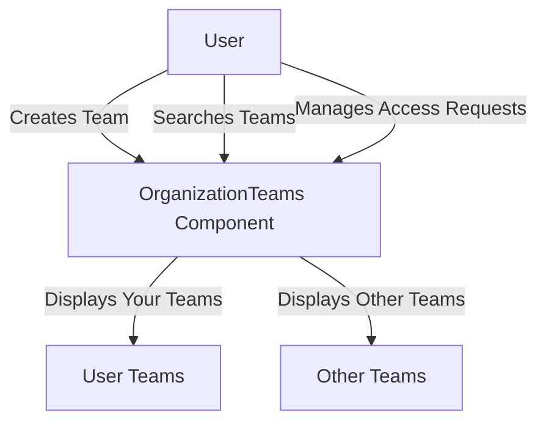

# Overview

Organization teams are groups within an organization that manage and collaborate on projects. In the settings, organization teams can be created, searched, and managed by users with the appropriate access permissions.

<SwmSnippet path="/static/app/views/settings/organizationTeams/organizationTeams.tsx" line="74">

---

# Searching and Filtering Teams

The component allows for searching and filtering teams based on user input. The <SwmToken path="static/app/views/settings/organizationTeams/organizationTeams.tsx" pos="75:3:3" line-data="  function handleSearch(query: string) {">`handleSearch`</SwmToken> function updates the search query and filters the teams accordingly.

```tsx
  const debouncedSearch = debounce(onSearch, DEFAULT_DEBOUNCE_DURATION);
  function handleSearch(query: string) {
    setTeamQuery(query);
    debouncedSearch(query);
  }
```

---

</SwmSnippet>

<SwmSnippet path="/static/app/views/settings/organizationTeams/organizationTeams.tsx" line="80">

---

# Displaying Teams

Teams are displayed in two categories: 'Your Teams' and 'Other Teams'. The <SwmToken path="static/app/views/settings/organizationTeams/organizationTeams.tsx" pos="84:12:12" line-data="  const [userTeams, otherTeams] = partition(filteredTeams, team =&gt; team.isMember);">`partition`</SwmToken> function is used to separate teams the user is a member of from other teams.

```tsx
  const {slug: orgSlug, orgRole, orgRoleList, teamRoleList} = organization;
  const filteredTeams = teams.filter(team =>
    `#${team.slug}`.toLowerCase().includes(teamQuery.toLowerCase())
  );
  const [userTeams, otherTeams] = partition(filteredTeams, team => team.isMember);
```

---

</SwmSnippet>

<SwmSnippet path="/static/app/views/settings/organizationTeams/organizationTeams.tsx" line="91">

---

# Managing Access Requests

Access requests to join teams can be managed within this component. The <SwmToken path="static/app/views/settings/organizationTeams/organizationTeams.tsx" pos="91:2:2" line-data="      &lt;OrganizationAccessRequests">`OrganizationAccessRequests`</SwmToken> component handles the display and management of these requests.

```tsx
      <OrganizationAccessRequests
        orgSlug={organization.slug}
        requestList={requestList}
        onRemoveAccessRequest={onRemoveAccessRequest}
      />
```

---

</SwmSnippet>

# Main Functions

There are several main functions related to organization teams. Some of them are <SwmToken path="static/app/views/settings/organizationTeams/organizationTeams.tsx" pos="37:2:2" line-data="function OrganizationTeams({">`OrganizationTeams`</SwmToken>, <SwmToken path="static/app/views/settings/organizationTeams/organizationTeams.tsx" pos="45:9:9" line-data="  const {initiallyLoaded} = useTeams({provideUserTeams: true});">`useTeams`</SwmToken>, and <SwmToken path="static/app/actionCreators/modal.tsx" pos="93:6:6" line-data="export async function openCreateTeamModal(options: CreateTeamModalOptions) {">`openCreateTeamModal`</SwmToken>. We will dive a little into these functions.

<SwmSnippet path="/static/app/views/settings/organizationTeams/organizationTeams.tsx" line="37">

---

## <SwmToken path="static/app/views/settings/organizationTeams/organizationTeams.tsx" pos="37:2:2" line-data="function OrganizationTeams({">`OrganizationTeams`</SwmToken>

The <SwmToken path="static/app/views/settings/organizationTeams/organizationTeams.tsx" pos="37:2:2" line-data="function OrganizationTeams({">`OrganizationTeams`</SwmToken> function handles the display and management of organization teams. It includes the ability to create new teams if the user has <SwmToken path="static/app/views/settings/organizationTeams/organizationTeams.tsx" pos="51:12:14" line-data="  const canCreateTeams = access.has(&#39;project:admin&#39;);">`project:admin`</SwmToken> access, search and filter teams based on user input, and manage access requests to join teams.

```tsx
function OrganizationTeams({
  organization,
  access,
  features,
  requestList,
  onRemoveAccessRequest,
}: Props) {
  const [teamQuery, setTeamQuery] = useState('');
  const {initiallyLoaded} = useTeams({provideUserTeams: true});
  const {teams, onSearch, loadMore, hasMore, fetching} = useTeams();

  if (!organization) {
    return null;
  }
  const canCreateTeams = access.has('project:admin');

  const action = (
    <Button
      priority="primary"
      size="sm"
      disabled={!canCreateTeams}
```

---

</SwmSnippet>

<SwmSnippet path="/static/app/utils/useTeams.tsx" line="148">

---

## <SwmToken path="static/app/views/settings/organizationTeams/organizationTeams.tsx" pos="45:9:9" line-data="  const {initiallyLoaded} = useTeams({provideUserTeams: true});">`useTeams`</SwmToken>

The <SwmToken path="static/app/views/settings/organizationTeams/organizationTeams.tsx" pos="45:9:9" line-data="  const {initiallyLoaded} = useTeams({provideUserTeams: true});">`useTeams`</SwmToken> hook provides teams from the <SwmToken path="static/app/utils/useTeams.tsx" pos="152:11:11" line-data=" * Provides teams from the TeamStore">`TeamStore`</SwmToken> and allows for selecting specific slugs to ensure they are loaded, as well as searching for more slugs that may not be in the <SwmToken path="static/app/utils/useTeams.tsx" pos="156:3:3" line-data=" * TeamsStore.">`TeamsStore`</SwmToken>.

```tsx
// TODO: Paging for items which have already exist in the store is not
// correctly implemented.

/**
 * Provides teams from the TeamStore
 *
 * This hook also provides a way to select specific slugs to ensure they are
 * loaded, as well as search (type-ahead) for more slugs that may not be in the
 * TeamsStore.
 *
 * NOTE: It is NOT guaranteed that all teams for an organization will be
 * loaded, so you should use this hook with the intention of providing specific
 * slugs, or loading more through search.
 *
 * @deprecated use the alternatives to this hook (except for search and pagination)
 * new alternatives:
 * - useTeamsById({ids: []}) - get teams by id
 * - useTeamsById({slugs: []}) - get teams by slug
 * - useTeamsById() - just reading from the teams store
 * - useUserTeams() - same as `provideUserTeams: true`
 *
```

---

</SwmSnippet>

<SwmSnippet path="/static/app/actionCreators/modal.tsx" line="93">

---

## <SwmToken path="static/app/actionCreators/modal.tsx" pos="93:6:6" line-data="export async function openCreateTeamModal(options: CreateTeamModalOptions) {">`openCreateTeamModal`</SwmToken>

The <SwmToken path="static/app/actionCreators/modal.tsx" pos="93:6:6" line-data="export async function openCreateTeamModal(options: CreateTeamModalOptions) {">`openCreateTeamModal`</SwmToken> function is used to open a modal for creating a new team. It imports the <SwmToken path="static/app/actionCreators/modal.tsx" pos="94:18:18" line-data="  const mod = await import(&#39;sentry/components/modals/createTeamModal&#39;);">`createTeamModal`</SwmToken> component and opens it with the provided options.

```tsx
export async function openCreateTeamModal(options: CreateTeamModalOptions) {
  const mod = await import('sentry/components/modals/createTeamModal');
  const {default: Modal} = mod;

  openModal(deps => <Modal {...deps} {...options} />);
}
```

---

</SwmSnippet>

# Organization Teams Endpoints

Endpoints for managing organization teams

<SwmSnippet path="/static/app/views/settings/organizationTeams/teamDetails.tsx" line="35">

---

## <SwmToken path="static/app/views/settings/organizationTeams/teamDetails.tsx" pos="35:1:1" line-data="    joinTeam(">`joinTeam`</SwmToken>

The <SwmToken path="static/app/views/settings/organizationTeams/teamDetails.tsx" pos="35:1:1" line-data="    joinTeam(">`joinTeam`</SwmToken> function is used to request access to join a team. It sends a request to the API with the organization ID and team ID. If the request is successful, a success message is displayed; otherwise, an error message is shown.

```tsx
    joinTeam(
      api,
      {
        orgId: orgSlug,
        teamId: teamSlug,
      },
      {
        success: () => {
          addSuccessMessage(
            tct('You have requested access to [team]', {
              team: `#${teamSlug}`,
            })
          );
          setRequesting(false);
        },
        error: () => {
          addErrorMessage(
            tct('Unable to request access to [team]', {
              team: `#${teamSlug}`,
            })
          );
```

---

</SwmSnippet>

<SwmSnippet path="/static/app/views/settings/organizationTeams/allTeamsRow.tsx" line="133">

---

## <SwmToken path="static/app/views/settings/organizationTeams/allTeamsRow.tsx" pos="133:1:1" line-data="    leaveTeam(">`leaveTeam`</SwmToken>

The <SwmToken path="static/app/views/settings/organizationTeams/allTeamsRow.tsx" pos="133:1:1" line-data="    leaveTeam(">`leaveTeam`</SwmToken> function is used to leave a team. It sends a request to the API with the organization ID and team ID. If the request is successful, a success message is displayed and the projects are reloaded; otherwise, an error message is shown.

```tsx
    leaveTeam(
      api,
      {
        orgId: organization.slug,
        teamId: team.slug,
      },
      {
        success: () => {
          this.setState({
            loading: false,
            error: false,
          });
          addSuccessMessage(
            tct('You have left [team]', {
              team: `#${team.slug}`,
            })
          );

          // Reload ProjectsStore
          this.reloadProjects();
        },
```

---

</SwmSnippet>

&nbsp;

*This is an auto-generated document by Swimm AI 🌊 and has not yet been verified by a human*

<SwmMeta version="3.0.0" repo-id="Z2l0aHViJTNBJTNBc2VudHJ5LWRlbW8tMSUzQSUzQVN3aW1tLURlbW8=" repo-name="sentry-demo-1" doc-type="overview"><sup>Powered by [Swimm](/)</sup></SwmMeta>
