```mermaid
classDiagram
 OrganizationStats --> DeprecatedAsyncComponent
 UsageStatsOrganization --> DeprecatedAsyncComponent
 OrganizationStats : +get dataCategoryInfo()
 OrganizationStats : +get dataCategory()
 OrganizationStats : +get dataCategoryName()
 OrganizationStats : +get dataDatetime()
 OrganizationStats : +get clientDiscard()
 OrganizationStats : +get chartTransform()
 OrganizationStats : +get tableSort()
 OrganizationStats : +get tableQuery()
 OrganizationStats : +get tableCursor()
 OrganizationStats : +get projectIds()
 OrganizationStats : +get isSingleProject()
 OrganizationStats : +getNextLocations()
 OrganizationStats : +setStateOnUrl()
 OrganizationStats : +renderProjectPageControl()
 OrganizationStats : +renderUsageStatsOrg()
 OrganizationStats : +render()
 UsageStatsOrganization : +componentDidUpdate()
 UsageStatsOrganization : +getEndpoints()
 UsageStatsOrganization : +projectDetails()
 UsageStatsOrganization : +endpointPath()
 UsageStatsOrganization : +endpointQueryDatetime()
 UsageStatsOrganization : +endpointQuery()
 UsageStatsOrganization : +chartData()
 UsageStatsOrganization : +chartTransform()

%% Swimm:
%% classDiagram
%%  <SwmToken path="static/app/views/organizationStats/index.spec.tsx" pos="14:3:3" line-data="import {OrganizationStats, PAGE_QUERY_PARAMS} from &#39;sentry/views/organizationStats&#39;;">`OrganizationStats`</SwmToken> --> <SwmToken path="static/app/views/organizationStats/usageStatsOrg.tsx" pos="96:8:8" line-data="  getEndpoints(): ReturnType&lt;DeprecatedAsyncComponent[&#39;getEndpoints&#39;]&gt; {">`DeprecatedAsyncComponent`</SwmToken>
%%  <SwmToken path="static/app/views/organizationStats/usageStatsOrg.tsx" pos="68:2:2" line-data="class UsageStatsOrganization&lt;">`UsageStatsOrganization`</SwmToken> --> <SwmToken path="static/app/views/organizationStats/usageStatsOrg.tsx" pos="96:8:8" line-data="  getEndpoints(): ReturnType&lt;DeprecatedAsyncComponent[&#39;getEndpoints&#39;]&gt; {">`DeprecatedAsyncComponent`</SwmToken>
%%  <SwmToken path="static/app/views/organizationStats/index.spec.tsx" pos="14:3:3" line-data="import {OrganizationStats, PAGE_QUERY_PARAMS} from &#39;sentry/views/organizationStats&#39;;">`OrganizationStats`</SwmToken> : +get dataCategoryInfo()
%%  <SwmToken path="static/app/views/organizationStats/index.spec.tsx" pos="14:3:3" line-data="import {OrganizationStats, PAGE_QUERY_PARAMS} from &#39;sentry/views/organizationStats&#39;;">`OrganizationStats`</SwmToken> : +get dataCategory()
%%  <SwmToken path="static/app/views/organizationStats/index.spec.tsx" pos="14:3:3" line-data="import {OrganizationStats, PAGE_QUERY_PARAMS} from &#39;sentry/views/organizationStats&#39;;">`OrganizationStats`</SwmToken> : +get dataCategoryName()
%%  <SwmToken path="static/app/views/organizationStats/index.spec.tsx" pos="14:3:3" line-data="import {OrganizationStats, PAGE_QUERY_PARAMS} from &#39;sentry/views/organizationStats&#39;;">`OrganizationStats`</SwmToken> : +get dataDatetime()
%%  <SwmToken path="static/app/views/organizationStats/index.spec.tsx" pos="14:3:3" line-data="import {OrganizationStats, PAGE_QUERY_PARAMS} from &#39;sentry/views/organizationStats&#39;;">`OrganizationStats`</SwmToken> : +get clientDiscard()
%%  <SwmToken path="static/app/views/organizationStats/index.spec.tsx" pos="14:3:3" line-data="import {OrganizationStats, PAGE_QUERY_PARAMS} from &#39;sentry/views/organizationStats&#39;;">`OrganizationStats`</SwmToken> : +get <SwmToken path="static/app/views/organizationStats/usageStatsOrg.tsx" pos="173:3:5" line-data="  get chartTransform(): {chartTransform: ChartDataTransform} {">`chartTransform()`</SwmToken>
%%  <SwmToken path="static/app/views/organizationStats/index.spec.tsx" pos="14:3:3" line-data="import {OrganizationStats, PAGE_QUERY_PARAMS} from &#39;sentry/views/organizationStats&#39;;">`OrganizationStats`</SwmToken> : +get tableSort()
%%  <SwmToken path="static/app/views/organizationStats/index.spec.tsx" pos="14:3:3" line-data="import {OrganizationStats, PAGE_QUERY_PARAMS} from &#39;sentry/views/organizationStats&#39;;">`OrganizationStats`</SwmToken> : +get tableQuery()
%%  <SwmToken path="static/app/views/organizationStats/index.spec.tsx" pos="14:3:3" line-data="import {OrganizationStats, PAGE_QUERY_PARAMS} from &#39;sentry/views/organizationStats&#39;;">`OrganizationStats`</SwmToken> : +get tableCursor()
%%  <SwmToken path="static/app/views/organizationStats/index.spec.tsx" pos="14:3:3" line-data="import {OrganizationStats, PAGE_QUERY_PARAMS} from &#39;sentry/views/organizationStats&#39;;">`OrganizationStats`</SwmToken> : +get projectIds()
%%  <SwmToken path="static/app/views/organizationStats/index.spec.tsx" pos="14:3:3" line-data="import {OrganizationStats, PAGE_QUERY_PARAMS} from &#39;sentry/views/organizationStats&#39;;">`OrganizationStats`</SwmToken> : +get isSingleProject()
%%  <SwmToken path="static/app/views/organizationStats/index.spec.tsx" pos="14:3:3" line-data="import {OrganizationStats, PAGE_QUERY_PARAMS} from &#39;sentry/views/organizationStats&#39;;">`OrganizationStats`</SwmToken> : +getNextLocations()
%%  <SwmToken path="static/app/views/organizationStats/index.spec.tsx" pos="14:3:3" line-data="import {OrganizationStats, PAGE_QUERY_PARAMS} from &#39;sentry/views/organizationStats&#39;;">`OrganizationStats`</SwmToken> : +setStateOnUrl()
%%  <SwmToken path="static/app/views/organizationStats/index.spec.tsx" pos="14:3:3" line-data="import {OrganizationStats, PAGE_QUERY_PARAMS} from &#39;sentry/views/organizationStats&#39;;">`OrganizationStats`</SwmToken> : +renderProjectPageControl()
%%  <SwmToken path="static/app/views/organizationStats/index.spec.tsx" pos="14:3:3" line-data="import {OrganizationStats, PAGE_QUERY_PARAMS} from &#39;sentry/views/organizationStats&#39;;">`OrganizationStats`</SwmToken> : +renderUsageStatsOrg()
%%  <SwmToken path="static/app/views/organizationStats/index.spec.tsx" pos="14:3:3" line-data="import {OrganizationStats, PAGE_QUERY_PARAMS} from &#39;sentry/views/organizationStats&#39;;">`OrganizationStats`</SwmToken> : +render()
%%  <SwmToken path="static/app/views/organizationStats/usageStatsOrg.tsx" pos="68:2:2" line-data="class UsageStatsOrganization&lt;">`UsageStatsOrganization`</SwmToken> : +componentDidUpdate()
%%  <SwmToken path="static/app/views/organizationStats/usageStatsOrg.tsx" pos="68:2:2" line-data="class UsageStatsOrganization&lt;">`UsageStatsOrganization`</SwmToken> : +getEndpoints()
%%  <SwmToken path="static/app/views/organizationStats/usageStatsOrg.tsx" pos="68:2:2" line-data="class UsageStatsOrganization&lt;">`UsageStatsOrganization`</SwmToken> : +projectDetails()
%%  <SwmToken path="static/app/views/organizationStats/usageStatsOrg.tsx" pos="68:2:2" line-data="class UsageStatsOrganization&lt;">`UsageStatsOrganization`</SwmToken> : +endpointPath()
%%  <SwmToken path="static/app/views/organizationStats/usageStatsOrg.tsx" pos="68:2:2" line-data="class UsageStatsOrganization&lt;">`UsageStatsOrganization`</SwmToken> : +endpointQueryDatetime()
%%  <SwmToken path="static/app/views/organizationStats/usageStatsOrg.tsx" pos="68:2:2" line-data="class UsageStatsOrganization&lt;">`UsageStatsOrganization`</SwmToken> : +endpointQuery()
%%  <SwmToken path="static/app/views/organizationStats/usageStatsOrg.tsx" pos="68:2:2" line-data="class UsageStatsOrganization&lt;">`UsageStatsOrganization`</SwmToken> : +chartData()
%%  <SwmToken path="static/app/views/organizationStats/usageStatsOrg.tsx" pos="68:2:2" line-data="class UsageStatsOrganization&lt;">`UsageStatsOrganization`</SwmToken> : +chartTransform()
```

# Overview

Organization stats provide a comprehensive view of the usage data that Sentry has received across the entire organization. The <SwmToken path="static/app/views/organizationStats/index.spec.tsx" pos="14:3:3" line-data="import {OrganizationStats, PAGE_QUERY_PARAMS} from &#39;sentry/views/organizationStats&#39;;">`OrganizationStats`</SwmToken> component is responsible for rendering this data, including various statistics and metrics.

# <SwmToken path="static/app/views/organizationStats/index.spec.tsx" pos="14:3:3" line-data="import {OrganizationStats, PAGE_QUERY_PARAMS} from &#39;sentry/views/organizationStats&#39;;">`OrganizationStats`</SwmToken> Component

The <SwmToken path="static/app/views/organizationStats/index.spec.tsx" pos="14:3:3" line-data="import {OrganizationStats, PAGE_QUERY_PARAMS} from &#39;sentry/views/organizationStats&#39;;">`OrganizationStats`</SwmToken> component utilizes several query parameters such as <SwmToken path="static/app/views/organizationStats/usageStatsOrg.tsx" pos="120:1:1" line-data="            statsPeriod: dataDatetime.period || DEFAULT_STATS_PERIOD,">`statsPeriod`</SwmToken>, <SwmToken path="static/app/views/organizationStats/usageStatsOrg.tsx" pos="85:3:3" line-data="      prevDateTime.start !== currDateTime.start ||">`start`</SwmToken>, <SwmToken path="static/app/views/organizationStats/usageStatsOrg.tsx" pos="86:3:3" line-data="      prevDateTime.end !== currDateTime.end ||">`end`</SwmToken>, <SwmToken path="static/app/views/organizationStats/usageStatsOrg.tsx" pos="88:3:3" line-data="      prevDateTime.utc !== currDateTime.utc ||">`utc`</SwmToken>, <SwmToken path="static/app/views/organizationStats/usageStatsOrg.tsx" pos="41:1:1" line-data="  dataCategory: DataCategoryInfo[&#39;plural&#39;];">`dataCategory`</SwmToken>, <SwmToken path="static/app/views/organizationStats/usageStatsOrg.tsx" pos="49:1:1" line-data="    transform?: ChartDataTransform;">`transform`</SwmToken>, `sort`, <SwmToken path="static/app/views/organizationStats/usageStatsOrg.tsx" pos="97:16:16" line-data="    return [[&#39;orgStats&#39;, this.endpointPath, {query: this.endpointQuery}]];">`query`</SwmToken>, `cursor`, `spikeCursor`, and <SwmToken path="static/app/views/organizationStats/usageStatsOrg.tsx" pos="46:1:1" line-data="    clientDiscard?: boolean;">`clientDiscard`</SwmToken> to filter and display the relevant data. It includes methods to handle data categories, date-time parameters, and project-specific data.

# <SwmToken path="static/app/views/organizationStats/usageStatsOrg.tsx" pos="68:2:2" line-data="class UsageStatsOrganization&lt;">`UsageStatsOrganization`</SwmToken> Component

The <SwmToken path="static/app/views/organizationStats/usageStatsOrg.tsx" pos="68:2:2" line-data="class UsageStatsOrganization&lt;">`UsageStatsOrganization`</SwmToken> class extends <SwmToken path="static/app/views/organizationStats/usageStatsOrg.tsx" pos="96:8:8" line-data="  getEndpoints(): ReturnType&lt;DeprecatedAsyncComponent[&#39;getEndpoints&#39;]&gt; {">`DeprecatedAsyncComponent`</SwmToken> and is used to fetch and display organization-level statistics. It includes methods to update the component based on changes in props, fetch data from the endpoint, and transform the data for chart display. The <SwmToken path="static/app/views/organizationStats/usageStatsOrg.tsx" pos="68:2:2" line-data="class UsageStatsOrganization&lt;">`UsageStatsOrganization`</SwmToken> class also handles the rendering of various statistics cards and charts, providing a detailed breakdown of the organization's usage data.

# Component Update

The <SwmToken path="static/app/views/organizationStats/usageStatsOrg.tsx" pos="72:1:1" line-data="  componentDidUpdate(prevProps: UsageStatsOrganizationProps) {">`componentDidUpdate`</SwmToken> method updates the component based on changes in props such as date-time parameters and project IDs.

<SwmSnippet path="/static/app/views/organizationStats/usageStatsOrg.tsx" line="72">

---

The <SwmToken path="static/app/views/organizationStats/usageStatsOrg.tsx" pos="72:1:1" line-data="  componentDidUpdate(prevProps: UsageStatsOrganizationProps) {">`componentDidUpdate`</SwmToken> method updates the component based on changes in props such as date-time parameters and project IDs.

```tsx
  componentDidUpdate(prevProps: UsageStatsOrganizationProps) {
    const {
      dataDatetime: prevDateTime,
      projectIds: prevProjectIds,
      dataCategoryApiName: prevDataCategoryApiName,
    } = prevProps;
    const {
      dataDatetime: currDateTime,
      projectIds: currProjectIds,
      dataCategoryApiName: currentDataCategoryApiName,
    } = this.props;

    if (
      prevDateTime.start !== currDateTime.start ||
      prevDateTime.end !== currDateTime.end ||
      prevDateTime.period !== currDateTime.period ||
      prevDateTime.utc !== currDateTime.utc ||
      prevDataCategoryApiName !== currentDataCategoryApiName ||
      !isEqual(prevProjectIds, currProjectIds)
    ) {
      this.reloadData();
```

---

</SwmSnippet>

<SwmSnippet path="/static/app/views/organizationStats/usageStatsOrg.tsx" line="96">

---

The <SwmToken path="static/app/views/organizationStats/usageStatsOrg.tsx" pos="96:1:1" line-data="  getEndpoints(): ReturnType&lt;DeprecatedAsyncComponent[&#39;getEndpoints&#39;]&gt; {">`getEndpoints`</SwmToken> method defines the endpoint to fetch organization statistics data.

```tsx
  getEndpoints(): ReturnType<DeprecatedAsyncComponent['getEndpoints']> {
    return [['orgStats', this.endpointPath, {query: this.endpointQuery}]];
  }
```

---

</SwmSnippet>

# Endpoint Path

The <SwmToken path="static/app/views/organizationStats/usageStatsOrg.tsx" pos="97:12:12" line-data="    return [[&#39;orgStats&#39;, this.endpointPath, {query: this.endpointQuery}]];">`endpointPath`</SwmToken> method constructs the API endpoint path using the organization slug.

<SwmSnippet path="/static/app/views/organizationStats/usageStatsOrg.tsx" line="105">

---

The <SwmToken path="static/app/views/organizationStats/usageStatsOrg.tsx" pos="105:3:3" line-data="  get endpointPath() {">`endpointPath`</SwmToken> method constructs the API endpoint path using the organization slug.

```tsx
  get endpointPath() {
    const {organization} = this.props;
    return `/organizations/${organization.slug}/stats_v2/`;
```

---

</SwmSnippet>

# Query Parameters

The <SwmToken path="static/app/views/organizationStats/usageStatsOrg.tsx" pos="97:21:21" line-data="    return [[&#39;orgStats&#39;, this.endpointPath, {query: this.endpointQuery}]];">`endpointQuery`</SwmToken> method constructs the query parameters for the API request, including date-time parameters, project IDs, and data category.

<SwmSnippet path="/static/app/views/organizationStats/usageStatsOrg.tsx" line="125">

---

The <SwmToken path="static/app/views/organizationStats/usageStatsOrg.tsx" pos="125:3:3" line-data="  get endpointQuery() {">`endpointQuery`</SwmToken> method constructs the query parameters for the API request, including date-time parameters, project IDs, and data category.

```tsx
  get endpointQuery() {
    const {dataDatetime, projectIds, dataCategoryApiName} = this.props;

    const queryDatetime = this.endpointQueryDatetime;

    return {
      ...queryDatetime,
      interval: getSeriesApiInterval(dataDatetime),
      groupBy: ['outcome', 'reason'],
      project: projectIds,
      field: ['sum(quantity)'],
      category: dataCategoryApiName,
    };
```

---

</SwmSnippet>

# Chart Data Transformation

The <SwmToken path="static/app/views/organizationStats/usageStatsOrg.tsx" pos="140:3:3" line-data="  get chartData(): {">`chartData`</SwmToken> method transforms the fetched data into a format suitable for chart display.

<SwmSnippet path="/static/app/views/organizationStats/usageStatsOrg.tsx" line="140">

---

The <SwmToken path="static/app/views/organizationStats/usageStatsOrg.tsx" pos="140:3:3" line-data="  get chartData(): {">`chartData`</SwmToken> method transforms the fetched data into a format suitable for chart display.

```tsx
  get chartData(): {
    cardStats: {
      accepted?: string;
      filtered?: string;
      invalid?: string;
      rateLimited?: string;
      total?: string;
    };
    chartDateEnd: string;
    chartDateEndDisplay: string;
    chartDateInterval: IntervalPeriod;
    chartDateStart: string;
    chartDateStartDisplay: string;
    chartDateTimezoneDisplay: string;
    chartDateUtc: boolean;
    chartStats: ChartStats;
    chartSubLabels: TooltipSubLabel[];
    chartTransform: ChartDataTransform;
    dataError?: Error;
  } {
    return {
```

---

</SwmSnippet>

# Organization Stats Endpoints

The endpoint `/organizations/{organization.slug}/stats_v2/` is used to fetch the statistics for a specific organization. This endpoint is utilized in the <SwmToken path="static/app/views/organizationStats/index.spec.tsx" pos="14:3:3" line-data="import {OrganizationStats, PAGE_QUERY_PARAMS} from &#39;sentry/views/organizationStats&#39;;">`OrganizationStats`</SwmToken> component to retrieve and display various usage metrics and statistics.

<SwmSnippet path="/static/app/views/organizationStats/index.spec.tsx" line="35">

---

The endpoint `/organizations/{organization.slug}/stats_v2/` is used to fetch the statistics for a specific organization.

```tsx
  const endpoint = `/organizations/${organization.slug}/stats_v2/`;
```

---

</SwmSnippet>

# <SwmToken path="static/app/views/organizationStats/types.tsx" pos="6:4:4" line-data="export interface UsageSeries extends SeriesApi {">`UsageSeries`</SwmToken> Interface

The <SwmToken path="static/app/views/organizationStats/types.tsx" pos="6:4:4" line-data="export interface UsageSeries extends SeriesApi {">`UsageSeries`</SwmToken> interface extends <SwmToken path="static/app/views/organizationStats/types.tsx" pos="6:8:8" line-data="export interface UsageSeries extends SeriesApi {">`SeriesApi`</SwmToken> and represents the raw response from the API endpoint. It includes properties such as <SwmToken path="static/app/views/organizationStats/usageStatsOrg.tsx" pos="86:3:3" line-data="      prevDateTime.end !== currDateTime.end ||">`end`</SwmToken> and <SwmToken path="static/app/views/organizationStats/usageStatsOrg.tsx" pos="85:3:3" line-data="      prevDateTime.start !== currDateTime.start ||">`start`</SwmToken> to define the time range for the usage data.

<SwmSnippet path="/static/app/views/organizationStats/types.tsx" line="6">

---

The <SwmToken path="static/app/views/organizationStats/types.tsx" pos="6:4:4" line-data="export interface UsageSeries extends SeriesApi {">`UsageSeries`</SwmToken> interface extends <SwmToken path="static/app/views/organizationStats/types.tsx" pos="6:8:8" line-data="export interface UsageSeries extends SeriesApi {">`SeriesApi`</SwmToken> and represents the raw response from the API endpoint. It includes properties such as <SwmToken path="static/app/views/organizationStats/types.tsx" pos="9:1:1" line-data="  end: string;">`end`</SwmToken> and <SwmToken path="static/app/views/organizationStats/types.tsx" pos="10:1:1" line-data="  start: string;">`start`</SwmToken> to define the time range for the usage data.

```tsx
export interface UsageSeries extends SeriesApi {
  // index signature is present because we often send this
  // data to sentry as part of the event context.
  end: string;
  start: string;
}
```

---

</SwmSnippet>

&nbsp;

*This is an auto-generated document by Swimm AI 🌊 and has not yet been verified by a human*

<SwmMeta version="3.0.0" repo-id="Z2l0aHViJTNBJTNBc2VudHJ5LWRlbW8tMSUzQSUzQVN3aW1tLURlbW8=" repo-name="sentry-demo-1" doc-type="overview"><sup>Powered by [Swimm](/)</sup></SwmMeta>
