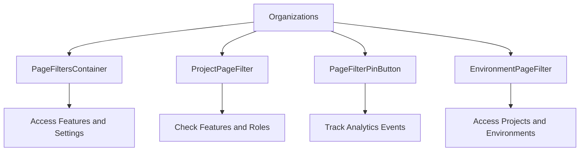

# Getting Started with Organizations in Components

Organizations in Sentry represent a group or company using the platform. They manage users, teams, and projects within Sentry. This document will guide you through how organizations are utilized in various components such as `PageFiltersContainer`, <SwmToken path="static/app/components/organizations/projectPageFilter/index.tsx" pos="81:4:4" line-data="export function ProjectPageFilter({">`ProjectPageFilter`</SwmToken>, `PageFilterPinButton`, and <SwmToken path="static/app/components/organizations/environmentPageFilter/index.tsx" pos="50:4:4" line-data="export function EnvironmentPageFilter({">`EnvironmentPageFilter`</SwmToken>.

## PageFiltersContainer Component

In the `PageFiltersContainer` component, the <SwmToken path="static/app/components/organizations/projectPageFilter/index.tsx" pos="98:3:3" line-data="  const organization = useOrganization();">`organization`</SwmToken> constant is used to access the organization's features and settings. This includes determining if global views are enabled and initializing URL state with the organization's data.

## <SwmToken path="static/app/components/organizations/projectPageFilter/index.tsx" pos="81:4:4" line-data="export function ProjectPageFilter({">`ProjectPageFilter`</SwmToken> Component

In the <SwmToken path="static/app/components/organizations/projectPageFilter/index.tsx" pos="81:4:4" line-data="export function ProjectPageFilter({">`ProjectPageFilter`</SwmToken> component, the <SwmToken path="static/app/components/organizations/projectPageFilter/index.tsx" pos="98:3:3" line-data="  const organization = useOrganization();">`organization`</SwmToken> constant is used to check the organization's features and roles. This includes checking if multiple projects can be viewed simultaneously and if the user has the necessary permissions to view non-member projects.

<SwmSnippet path="/static/app/components/organizations/projectPageFilter/index.tsx" line="95">

---

The <SwmToken path="static/app/components/organizations/projectPageFilter/index.tsx" pos="81:4:4" line-data="export function ProjectPageFilter({">`ProjectPageFilter`</SwmToken> function uses the <SwmToken path="static/app/components/organizations/projectPageFilter/index.tsx" pos="98:3:3" line-data="  const organization = useOrganization();">`organization`</SwmToken> constant to check the organization's features and roles, such as whether multiple projects can be viewed simultaneously and if the user has the necessary permissions.

```tsx
}: ProjectPageFilterProps) {
  const router = useRouter();
  const routes = useRoutes();
  const organization = useOrganization();

  const allowMultiple = organization.features.includes('global-views');

  const {projects, initiallyLoaded: projectsLoaded} = useProjects();
  const [memberProjects, otherProjects] = useMemo(
    () => partition(projects, project => project.isMember),
    [projects]
  );

  const showNonMemberProjects = useMemo(() => {
    const {isSuperuser} = ConfigStore.get('user');
    const isOrgAdminOrManager =
      organization.orgRole === 'owner' || organization.orgRole === 'manager';
    const isOpenMembership = organization.features.includes('open-membership');

    return isSuperuser || isOrgAdminOrManager || isOpenMembership;
  }, [organization.orgRole, organization.features]);
```

---

</SwmSnippet>

## <SwmToken path="static/app/components/organizations/environmentPageFilter/index.tsx" pos="50:4:4" line-data="export function EnvironmentPageFilter({">`EnvironmentPageFilter`</SwmToken> Component

In the <SwmToken path="static/app/components/organizations/environmentPageFilter/index.tsx" pos="50:4:4" line-data="export function EnvironmentPageFilter({">`EnvironmentPageFilter`</SwmToken> component, the <SwmToken path="static/app/components/organizations/projectPageFilter/index.tsx" pos="98:3:3" line-data="  const organization = useOrganization();">`organization`</SwmToken> constant is used to access the organization's projects and environments. This allows users to filter data based on their organization's configuration, including handling superuser access and project-specific environments.

<SwmSnippet path="/static/app/components/organizations/environmentPageFilter/index.tsx" line="62">

---

The <SwmToken path="static/app/components/organizations/environmentPageFilter/index.tsx" pos="50:4:4" line-data="export function EnvironmentPageFilter({">`EnvironmentPageFilter`</SwmToken> function uses the <SwmToken path="static/app/components/organizations/environmentPageFilter/index.tsx" pos="65:3:3" line-data="  const organization = useOrganization();">`organization`</SwmToken> constant to access the organization's projects and environments, allowing users to filter data based on their organization's configuration.

```tsx
  ...selectProps
}: EnvironmentPageFilterProps) {
  const router = useRouter();
  const organization = useOrganization();

  const {projects, initiallyLoaded: projectsLoaded} = useProjects();

  const {
    selection: {projects: projectPageFilterValue, environments: envPageFilterValue},
    isReady: pageFilterIsReady,
    desyncedFilters,
  } = usePageFilters();

  const environments = useMemo<string[]>(() => {
    const isSuperuser = isActiveSuperuser();

    const unsortedEnvironments = projects.flatMap(project => {
      const projectId = parseInt(project.id, 10);
      // Include environments from:
      // - all projects if the user is a superuser
      // - the requested projects
```

---

</SwmSnippet>

## Organization APIs

Organization APIs provide various functionalities to interact with organizations. One such function is <SwmToken path="static/app/components/organizations/projectPageFilter/index.spec.tsx" pos="17:14:14" line-data="const {organization, projects, router} = initializeOrg({">`initializeOrg`</SwmToken>.

<SwmSnippet path="/static/app/components/organizations/projectPageFilter/index.spec.tsx" line="17">

---

The <SwmToken path="static/app/components/organizations/projectPageFilter/index.spec.tsx" pos="17:14:14" line-data="const {organization, projects, router} = initializeOrg({">`initializeOrg`</SwmToken> function sets up an organization with specific features and projects, returning an object containing the organization, projects, and router.

```tsx
const {organization, projects, router} = initializeOrg({
  organization: {features: ['global-views', 'open-membership']},
  projects: [
    {id: '1', slug: 'project-1', isMember: true},
    {id: '2', slug: 'project-2', isMember: true},
    {id: '3', slug: 'project-3', isMember: false},
  ],
  router: {
    location: {
      pathname: '/organizations/org-slug/issues/',
      query: {},
    },
    params: {},
  },
});
```

---

</SwmSnippet>

&nbsp;

*This is an auto-generated document by Swimm AI 🌊 and has not yet been verified by a human*

<SwmMeta version="3.0.0" repo-id="Z2l0aHViJTNBJTNBc2VudHJ5LWRlbW8tMSUzQSUzQVN3aW1tLURlbW8=" repo-name="sentry-demo-1" doc-type="overview"><sup>Powered by [Swimm](/)</sup></SwmMeta>
