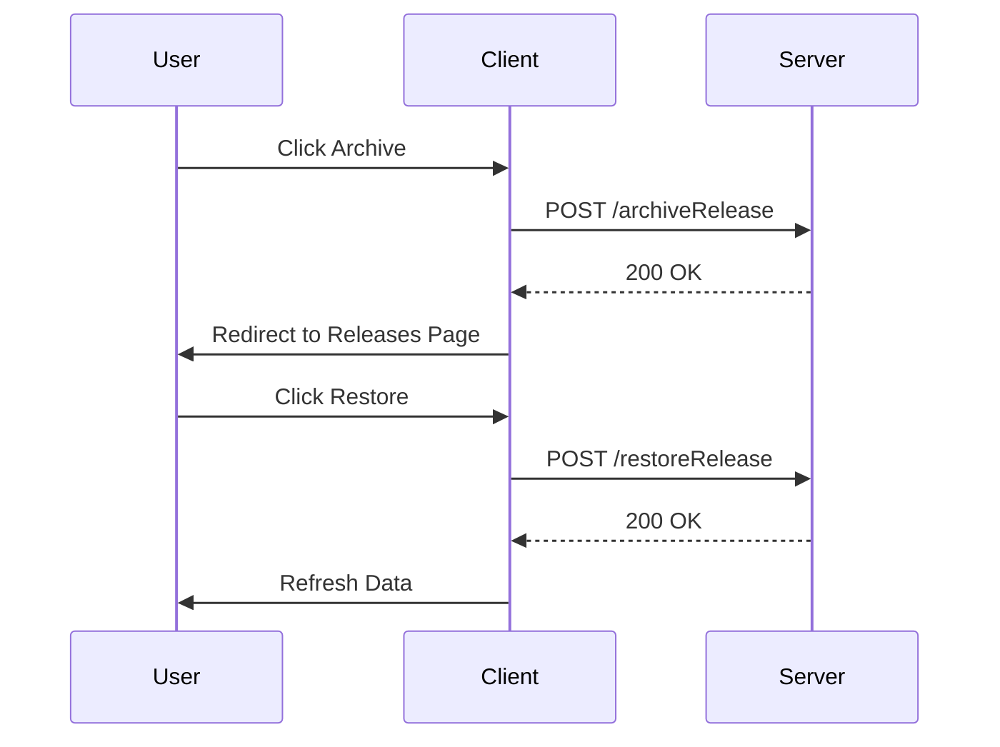

# Release Information

The detail section provides comprehensive information about a specific release, including the release version, creation date, first and last events, and associated source maps.

<SwmSnippet path="/static/app/views/releases/detail/overview/releaseComparisonChart/index.spec.tsx" line="14">

---

The file <SwmPath>[static/app/views/releases/detail/overview/releaseComparisonChart/index.spec.tsx](static/app/views/releases/detail/overview/releaseComparisonChart/index.spec.tsx)</SwmPath> contains tests for the release comparison chart, which is part of the release detail view.

```tsx
describe('Releases > Detail > Overview > ReleaseComparison', () => {
```

---

</SwmSnippet>

# Suspect Commits

The detail section includes links to suspect commits, which are changes in the codebase that might have introduced issues. These links help developers quickly identify and address potential problems.

# Performance Summary

The detail section provides a summary of the release's performance, including metrics like failure count, transactions per minute, and slow transactions. This helps in monitoring the release's impact on the application's performance.

# Detail Endpoints

Detail endpoints are functions that allow you to interact with specific releases, such as archiving or restoring them.

## <SwmToken path="static/app/views/releases/detail/header/releaseActions.tsx" pos="45:3:3" line-data="      await archiveRelease(new Client(), {">`archiveRelease`</SwmToken>

The <SwmToken path="static/app/views/releases/detail/header/releaseActions.tsx" pos="45:3:3" line-data="      await archiveRelease(new Client(), {">`archiveRelease`</SwmToken> function is used to archive a specific release. It sends a request to the server to mark the release as archived and then redirects the user to the releases page.

<SwmSnippet path="/static/app/views/releases/detail/header/releaseActions.tsx" line="43">

---

The function <SwmToken path="static/app/views/releases/detail/header/releaseActions.tsx" pos="43:5:5" line-data="  async function handleArchive() {">`handleArchive`</SwmToken> in <SwmPath>[static/app/views/releases/detail/header/releaseActions.tsx](static/app/views/releases/detail/header/releaseActions.tsx)</SwmPath> demonstrates how the <SwmToken path="static/app/views/releases/detail/header/releaseActions.tsx" pos="45:3:3" line-data="      await archiveRelease(new Client(), {">`archiveRelease`</SwmToken> function is called and how the user is redirected upon success.

```tsx
  async function handleArchive() {
    try {
      await archiveRelease(new Client(), {
        orgSlug: organization.slug,
        projectSlug,
        releaseVersion: release.version,
      });
      browserHistory.push(normalizeUrl(`/organizations/${organization.slug}/releases/`));
    } catch {
      // do nothing, action creator is already displaying error message
    }
  }
```

---

</SwmSnippet>

## <SwmToken path="static/app/views/releases/detail/header/releaseActions.tsx" pos="58:3:3" line-data="      await restoreRelease(new Client(), {">`restoreRelease`</SwmToken>

The <SwmToken path="static/app/views/releases/detail/header/releaseActions.tsx" pos="58:3:3" line-data="      await restoreRelease(new Client(), {">`restoreRelease`</SwmToken> function is used to restore a previously archived release. It sends a request to the server to mark the release as active again and then refreshes the data.

<SwmSnippet path="/static/app/views/releases/detail/header/releaseActions.tsx" line="56">

---

The function <SwmToken path="static/app/views/releases/detail/header/releaseActions.tsx" pos="56:5:5" line-data="  async function handleRestore() {">`handleRestore`</SwmToken> in <SwmPath>[static/app/views/releases/detail/header/releaseActions.tsx](static/app/views/releases/detail/header/releaseActions.tsx)</SwmPath> demonstrates how the <SwmToken path="static/app/views/releases/detail/header/releaseActions.tsx" pos="58:3:3" line-data="      await restoreRelease(new Client(), {">`restoreRelease`</SwmToken> function is called and how the data is refreshed upon success.

```tsx
  async function handleRestore() {
    try {
      await restoreRelease(new Client(), {
        orgSlug: organization.slug,
        projectSlug,
        releaseVersion: release.version,
      });
      refetchData();
    } catch {
      // do nothing, action creator is already displaying error message
    }
  }
```

---

</SwmSnippet>

&nbsp;

*This is an auto-generated document by Swimm AI 🌊 and has not yet been verified by a human*

<SwmMeta version="3.0.0" repo-id="Z2l0aHViJTNBJTNBc2VudHJ5LWRlbW8tMSUzQSUzQVN3aW1tLURlbW8=" repo-name="sentry-demo-1" doc-type="overview"><sup>Powered by [Swimm](/)</sup></SwmMeta>
