```mermaid
classDiagram
 NotificationActionSerializer --> trigger_type
 NotificationActionSerializer --> service_type
 NotificationActionSerializer --> integration_id
 NotificationActionSerializer --> target_identifier
 NotificationActionSerializer --> target_display
 NotificationActionSerializer --> projects
 SentryAppSerializer --> name
 SentryAppSerializer --> author
 SentryAppSerializer --> scopes
 SentryAppSerializer --> status
 SentryAppSerializer --> events
 SentryAppSerializer --> features
 SentryAppSerializer --> schema
 SentryAppSerializer --> webhookUrl
 SentryAppSerializer --> redirectUrl
 SentryAppSerializer --> isInternal
 SentryAppSerializer --> isAlertable
 SentryAppSerializer --> overview
 SentryAppSerializer --> verifyInstall
 SentryAppSerializer --> allowedOrigins

%% Swimm:
%% classDiagram
%%  <SwmToken path="src/sentry/api/serializers/rest_framework/notification_action.py" pos="44:2:2" line-data="class NotificationActionSerializer(CamelSnakeModelSerializer):">`NotificationActionSerializer`</SwmToken> --> <SwmToken path="src/sentry/api/serializers/rest_framework/notification_action.py" pos="49:1:1" line-data="    trigger_type = serializers.CharField(">`trigger_type`</SwmToken>
%%  <SwmToken path="src/sentry/api/serializers/rest_framework/notification_action.py" pos="44:2:2" line-data="class NotificationActionSerializer(CamelSnakeModelSerializer):">`NotificationActionSerializer`</SwmToken> --> <SwmToken path="src/sentry/api/serializers/rest_framework/notification_action.py" pos="52:1:1" line-data="    service_type = serializers.CharField(">`service_type`</SwmToken>
%%  <SwmToken path="src/sentry/api/serializers/rest_framework/notification_action.py" pos="44:2:2" line-data="class NotificationActionSerializer(CamelSnakeModelSerializer):">`NotificationActionSerializer`</SwmToken> --> <SwmToken path="src/sentry/api/serializers/rest_framework/notification_action.py" pos="60:1:1" line-data="    integration_id = serializers.IntegerField(">`integration_id`</SwmToken>
%%  <SwmToken path="src/sentry/api/serializers/rest_framework/notification_action.py" pos="44:2:2" line-data="class NotificationActionSerializer(CamelSnakeModelSerializer):">`NotificationActionSerializer`</SwmToken> --> <SwmToken path="src/sentry/api/serializers/rest_framework/notification_action.py" pos="36:1:1" line-data="    target_identifier: str">`target_identifier`</SwmToken>
%%  <SwmToken path="src/sentry/api/serializers/rest_framework/notification_action.py" pos="44:2:2" line-data="class NotificationActionSerializer(CamelSnakeModelSerializer):">`NotificationActionSerializer`</SwmToken> --> <SwmToken path="src/sentry/api/serializers/rest_framework/notification_action.py" pos="37:1:1" line-data="    target_display: str">`target_display`</SwmToken>
%%  <SwmToken path="src/sentry/api/serializers/rest_framework/notification_action.py" pos="44:2:2" line-data="class NotificationActionSerializer(CamelSnakeModelSerializer):">`NotificationActionSerializer`</SwmToken> --> projects
%%  <SwmToken path="src/sentry/api/serializers/rest_framework/sentry_app.py" pos="71:2:2" line-data="class SentryAppSerializer(Serializer):">`SentryAppSerializer`</SwmToken> --> name
%%  <SwmToken path="src/sentry/api/serializers/rest_framework/sentry_app.py" pos="71:2:2" line-data="class SentryAppSerializer(Serializer):">`SentryAppSerializer`</SwmToken> --> author
%%  <SwmToken path="src/sentry/api/serializers/rest_framework/sentry_app.py" pos="71:2:2" line-data="class SentryAppSerializer(Serializer):">`SentryAppSerializer`</SwmToken> --> scopes
%%  <SwmToken path="src/sentry/api/serializers/rest_framework/sentry_app.py" pos="71:2:2" line-data="class SentryAppSerializer(Serializer):">`SentryAppSerializer`</SwmToken> --> status
%%  <SwmToken path="src/sentry/api/serializers/rest_framework/sentry_app.py" pos="71:2:2" line-data="class SentryAppSerializer(Serializer):">`SentryAppSerializer`</SwmToken> --> events
%%  <SwmToken path="src/sentry/api/serializers/rest_framework/sentry_app.py" pos="71:2:2" line-data="class SentryAppSerializer(Serializer):">`SentryAppSerializer`</SwmToken> --> features
%%  <SwmToken path="src/sentry/api/serializers/rest_framework/sentry_app.py" pos="71:2:2" line-data="class SentryAppSerializer(Serializer):">`SentryAppSerializer`</SwmToken> --> schema
%%  <SwmToken path="src/sentry/api/serializers/rest_framework/sentry_app.py" pos="71:2:2" line-data="class SentryAppSerializer(Serializer):">`SentryAppSerializer`</SwmToken> --> <SwmToken path="src/sentry/api/serializers/rest_framework/sentry_app.py" pos="81:1:1" line-data="    webhookUrl = URLField(required=False, allow_null=True, allow_blank=True)">`webhookUrl`</SwmToken>
%%  <SwmToken path="src/sentry/api/serializers/rest_framework/sentry_app.py" pos="71:2:2" line-data="class SentryAppSerializer(Serializer):">`SentryAppSerializer`</SwmToken> --> <SwmToken path="src/sentry/api/serializers/rest_framework/sentry_app.py" pos="82:1:1" line-data="    redirectUrl = URLField(required=False, allow_null=True, allow_blank=True)">`redirectUrl`</SwmToken>
%%  <SwmToken path="src/sentry/api/serializers/rest_framework/sentry_app.py" pos="71:2:2" line-data="class SentryAppSerializer(Serializer):">`SentryAppSerializer`</SwmToken> --> <SwmToken path="src/sentry/api/serializers/rest_framework/sentry_app.py" pos="83:1:1" line-data="    isInternal = serializers.BooleanField(required=False, default=False)">`isInternal`</SwmToken>
%%  <SwmToken path="src/sentry/api/serializers/rest_framework/sentry_app.py" pos="71:2:2" line-data="class SentryAppSerializer(Serializer):">`SentryAppSerializer`</SwmToken> --> <SwmToken path="src/sentry/api/serializers/rest_framework/sentry_app.py" pos="84:1:1" line-data="    isAlertable = serializers.BooleanField(required=False, default=False)">`isAlertable`</SwmToken>
%%  <SwmToken path="src/sentry/api/serializers/rest_framework/sentry_app.py" pos="71:2:2" line-data="class SentryAppSerializer(Serializer):">`SentryAppSerializer`</SwmToken> --> overview
%%  <SwmToken path="src/sentry/api/serializers/rest_framework/sentry_app.py" pos="71:2:2" line-data="class SentryAppSerializer(Serializer):">`SentryAppSerializer`</SwmToken> --> <SwmToken path="src/sentry/api/serializers/rest_framework/sentry_app.py" pos="86:1:1" line-data="    verifyInstall = serializers.BooleanField(required=False, default=True)">`verifyInstall`</SwmToken>
%%  <SwmToken path="src/sentry/api/serializers/rest_framework/sentry_app.py" pos="71:2:2" line-data="class SentryAppSerializer(Serializer):">`SentryAppSerializer`</SwmToken> --> <SwmToken path="src/sentry/api/serializers/rest_framework/sentry_app.py" pos="87:1:1" line-data="    allowedOrigins = serializers.ListField(">`allowedOrigins`</SwmToken>
```

# Introduction

The Rest framework in the serializers module is used to convert complex data types, such as querysets and model instances, into native Python data types that can then be easily rendered into JSON, XML, or other content types. It also provides deserialization, allowing parsed data to be converted back into complex types, after first validating the incoming data.

<SwmSnippet path="/src/sentry/api/serializers/rest_framework/mentions.py" line="3">

---

# Importing Rest Framework

The Rest framework is imported to define serializers for the <SwmToken path="src/sentry/api/serializers/rest_framework/mentions.py" pos="7:6:6" line-data="from sentry.models.organizationmember import OrganizationMember">`organizationmember`</SwmToken> model.

```python
from collections.abc import Sequence

from rest_framework import serializers

from sentry.models.organizationmember import OrganizationMember
```

---

</SwmSnippet>

<SwmSnippet path="/src/sentry/api/serializers/rest_framework/environment.py" line="1">

---

# Handling Validation

The <SwmToken path="src/sentry/api/serializers/rest_framework/environment.py" pos="5:0:0" line-data="ValidationError = serializers.ValidationError">`ValidationError`</SwmToken> from Rest framework is used to handle validation errors in the <SwmToken path="src/sentry/api/serializers/rest_framework/environment.py" pos="3:6:6" line-data="from sentry.models.environment import Environment">`environment`</SwmToken> model.

```python
from rest_framework import serializers

from sentry.models.environment import Environment

ValidationError = serializers.ValidationError
```

---

</SwmSnippet>

<SwmSnippet path="/src/sentry/api/serializers/rest_framework/metrics_usage.py" line="1">

---

# Serializing Complex Data

Serializers are used to convert complex data types like <SwmToken path="src/sentry/api/serializers/rest_framework/metrics_usage.py" pos="5:10:10" line-data="from sentry.models.dashboard_widget import DashboardWidget">`DashboardWidget`</SwmToken> and <SwmToken path="src/sentry/api/serializers/rest_framework/metrics_usage.py" pos="4:12:12" line-data="from sentry.incidents.models.alert_rule import AlertRule">`AlertRule`</SwmToken> into native Python data types.

```python
from rest_framework import serializers

from sentry.api.serializers.rest_framework.dashboard import DashboardWidgetQuerySerializer
from sentry.incidents.models.alert_rule import AlertRule
from sentry.models.dashboard_widget import DashboardWidget
```

---

</SwmSnippet>

# Main Functions

There are several main functions in this folder. Some of them are serializers, <SwmToken path="src/sentry/api/serializers/rest_framework/group_notes.py" pos="2:8:8" line-data="from rest_framework.serializers import ListField">`ListField`</SwmToken>, Serializer, and <SwmToken path="src/sentry/api/serializers/rest_framework/environment.py" pos="5:0:0" line-data="ValidationError = serializers.ValidationError">`ValidationError`</SwmToken>. We will dive a little into serializers and <SwmToken path="src/sentry/api/serializers/rest_framework/group_notes.py" pos="2:8:8" line-data="from rest_framework.serializers import ListField">`ListField`</SwmToken>.

<SwmSnippet path="/src/sentry/api/serializers/rest_framework/dashboard.py" line="10">

---

## Serializers

The <SwmToken path="src/sentry/api/serializers/rest_framework/dashboard.py" pos="10:6:6" line-data="from rest_framework import serializers">`serializers`</SwmToken> module from the Rest framework is imported and used to define various serializers for different models. These serializers help in converting complex data types into native Python data types and vice versa.

```python
from rest_framework import serializers
```

---

</SwmSnippet>

<SwmSnippet path="/src/sentry/api/serializers/rest_framework/group_notes.py" line="2">

---

## <SwmToken path="src/sentry/api/serializers/rest_framework/group_notes.py" pos="2:8:8" line-data="from rest_framework.serializers import ListField">`ListField`</SwmToken>

The <SwmToken path="src/sentry/api/serializers/rest_framework/group_notes.py" pos="2:8:8" line-data="from rest_framework.serializers import ListField">`ListField`</SwmToken> is a field type from the Rest framework's serializers module. It is used to handle lists of items in the serialization and deserialization process.

```python
from rest_framework.serializers import ListField
```

---

</SwmSnippet>

# Endpoints of Rest Framework

Endpoints of Rest framework

<SwmSnippet path="/src/sentry/api/serializers/rest_framework/notification_action.py" line="43">

---

## <SwmToken path="src/sentry/api/serializers/rest_framework/notification_action.py" pos="44:2:2" line-data="class NotificationActionSerializer(CamelSnakeModelSerializer):">`NotificationActionSerializer`</SwmToken>

The <SwmToken path="src/sentry/api/serializers/rest_framework/notification_action.py" pos="44:2:2" line-data="class NotificationActionSerializer(CamelSnakeModelSerializer):">`NotificationActionSerializer`</SwmToken> is a Django Rest Framework serializer for handling incoming <SwmToken path="src/sentry/api/serializers/rest_framework/notification_action.py" pos="46:13:13" line-data="    Django Rest Framework serializer for incoming NotificationAction API payloads">`NotificationAction`</SwmToken> API payloads. It includes fields such as <SwmToken path="src/sentry/api/serializers/rest_framework/notification_action.py" pos="49:1:1" line-data="    trigger_type = serializers.CharField(">`trigger_type`</SwmToken>, <SwmToken path="src/sentry/api/serializers/rest_framework/notification_action.py" pos="52:1:1" line-data="    service_type = serializers.CharField(">`service_type`</SwmToken>, <SwmToken path="src/sentry/api/serializers/rest_framework/notification_action.py" pos="60:1:1" line-data="    integration_id = serializers.IntegerField(">`integration_id`</SwmToken>, <SwmToken path="src/sentry/api/serializers/rest_framework/notification_action.py" pos="36:1:1" line-data="    target_identifier: str">`target_identifier`</SwmToken>, <SwmToken path="src/sentry/api/serializers/rest_framework/notification_action.py" pos="37:1:1" line-data="    target_display: str">`target_display`</SwmToken>, and <SwmToken path="src/sentry/api/serializers/rest_framework/mentions.py" pos="61:8:8" line-data="        if mentions and &quot;projects&quot; in self.context:">`projects`</SwmToken>. These fields are used to define the structure and validation rules for the notification actions.

```python
@extend_schema_serializer(exclude_fields=["sentry_app_id", "target_type"])
class NotificationActionSerializer(CamelSnakeModelSerializer):
    """
    Django Rest Framework serializer for incoming NotificationAction API payloads
    """

    trigger_type = serializers.CharField(
        help_text="""Type of the trigger that causes the notification. The only supported trigger right now is: `spike-protection`."""
    )
    service_type = serializers.CharField(
        help_text="Service that is used for sending the notification.\n"
        + """- `email`\n"""
        + """- `slack`\n"""
        + """- `sentry_notification`\n"""
        + """- `pagerduty`\n"""
        + """- `opsgenie`\n"""
    )
    integration_id = serializers.IntegerField(
        help_text="""ID of the integration used as the notification service. See
[List Integrations](https://docs.sentry.io/api/integrations/list-an-organizations-available-integrations/)
to retrieve a full list of integrations.
```

---

</SwmSnippet>

<SwmSnippet path="/src/sentry/api/serializers/rest_framework/sentry_app.py" line="71">

---

## <SwmToken path="src/sentry/api/serializers/rest_framework/sentry_app.py" pos="71:2:2" line-data="class SentryAppSerializer(Serializer):">`SentryAppSerializer`</SwmToken>

The <SwmToken path="src/sentry/api/serializers/rest_framework/sentry_app.py" pos="71:2:2" line-data="class SentryAppSerializer(Serializer):">`SentryAppSerializer`</SwmToken> is used to serialize and deserialize data related to Sentry applications. It includes fields such as <SwmToken path="src/sentry/api/serializers/rest_framework/sentry_app.py" pos="72:1:1" line-data="    name = serializers.CharField()">`name`</SwmToken>, <SwmToken path="src/sentry/api/serializers/rest_framework/sentry_app.py" pos="73:1:1" line-data="    author = serializers.CharField(required=False, allow_null=True)">`author`</SwmToken>, <SwmToken path="src/sentry/api/serializers/rest_framework/sentry_app.py" pos="74:1:1" line-data="    scopes = ApiScopesField(allow_null=True)">`scopes`</SwmToken>, <SwmToken path="src/sentry/api/serializers/rest_framework/sentry_app.py" pos="75:1:1" line-data="    status = serializers.CharField(required=False, allow_null=True)">`status`</SwmToken>, <SwmToken path="src/sentry/api/serializers/rest_framework/sentry_app.py" pos="76:1:1" line-data="    events = EventListField(required=False, allow_null=True)">`events`</SwmToken>, <SwmToken path="src/sentry/api/serializers/rest_framework/sentry_app.py" pos="77:1:1" line-data="    features = serializers.MultipleChoiceField(">`features`</SwmToken>, <SwmToken path="src/sentry/api/serializers/rest_framework/sentry_app.py" pos="80:1:1" line-data="    schema = SchemaField(required=False, allow_null=True)">`schema`</SwmToken>, <SwmToken path="src/sentry/api/serializers/rest_framework/sentry_app.py" pos="81:1:1" line-data="    webhookUrl = URLField(required=False, allow_null=True, allow_blank=True)">`webhookUrl`</SwmToken>, <SwmToken path="src/sentry/api/serializers/rest_framework/sentry_app.py" pos="82:1:1" line-data="    redirectUrl = URLField(required=False, allow_null=True, allow_blank=True)">`redirectUrl`</SwmToken>, <SwmToken path="src/sentry/api/serializers/rest_framework/sentry_app.py" pos="83:1:1" line-data="    isInternal = serializers.BooleanField(required=False, default=False)">`isInternal`</SwmToken>, <SwmToken path="src/sentry/api/serializers/rest_framework/sentry_app.py" pos="84:1:1" line-data="    isAlertable = serializers.BooleanField(required=False, default=False)">`isAlertable`</SwmToken>, <SwmToken path="src/sentry/api/serializers/rest_framework/sentry_app.py" pos="85:1:1" line-data="    overview = serializers.CharField(required=False, allow_null=True)">`overview`</SwmToken>, <SwmToken path="src/sentry/api/serializers/rest_framework/sentry_app.py" pos="86:1:1" line-data="    verifyInstall = serializers.BooleanField(required=False, default=True)">`verifyInstall`</SwmToken>, and <SwmToken path="src/sentry/api/serializers/rest_framework/sentry_app.py" pos="87:1:1" line-data="    allowedOrigins = serializers.ListField(">`allowedOrigins`</SwmToken>. These fields help in validating and converting data when creating or updating Sentry applications.

```python
class SentryAppSerializer(Serializer):
    name = serializers.CharField()
    author = serializers.CharField(required=False, allow_null=True)
    scopes = ApiScopesField(allow_null=True)
    status = serializers.CharField(required=False, allow_null=True)
    events = EventListField(required=False, allow_null=True)
    features = serializers.MultipleChoiceField(
        choices=Feature.as_choices(), allow_blank=True, allow_null=True, required=False
    )
    schema = SchemaField(required=False, allow_null=True)
    webhookUrl = URLField(required=False, allow_null=True, allow_blank=True)
    redirectUrl = URLField(required=False, allow_null=True, allow_blank=True)
    isInternal = serializers.BooleanField(required=False, default=False)
    isAlertable = serializers.BooleanField(required=False, default=False)
    overview = serializers.CharField(required=False, allow_null=True)
    verifyInstall = serializers.BooleanField(required=False, default=True)
    allowedOrigins = serializers.ListField(
        child=serializers.CharField(max_length=255), required=False
    )
    # Bounds chosen to match PositiveSmallIntegerField (https://docs.djangoproject.com/en/3.2/ref/models/fields/#positivesmallintegerfield)
    popularity = serializers.IntegerField(
```

---

</SwmSnippet>

&nbsp;

*This is an auto-generated document by Swimm AI 🌊 and has not yet been verified by a human*

<SwmMeta version="3.0.0" repo-id="Z2l0aHViJTNBJTNBc2VudHJ5LWRlbW8tMSUzQSUzQVN3aW1tLURlbW8=" repo-name="sentry-demo-1" doc-type="overview"><sup>Powered by [Swimm](/)</sup></SwmMeta>
