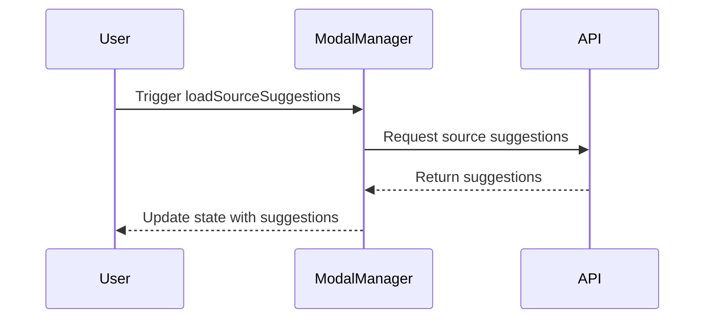

# Overview

Components in the Settings section are primarily styled elements that structure and organize the layout and navigation of the settings pages. This document will guide you through the key components and their functionalities.

# Layout Management

The `SettingsLayout` function manages the overall layout, including the visibility of the navigation menu on different screen sizes. This ensures a responsive design that adapts to various devices.

# Visual Structure

Styled components like `SettingsColumn`, `HeaderContent`, and `NavMenuToggle` are used to define the visual structure and behavior of the settings interface. These components help in maintaining a consistent look and feel across the settings pages.

# Navigation Handling

The `SettingsNavigation` class handles the rendering of navigation items, including hooks and configurations. This ensures a consistent navigation experience across different settings pages.

# Specific Functionalities

Other components, such as `ProjectItem` and `SettingsBreadcrumb`, provide specific functionalities like displaying project badges and breadcrumb navigation within the settings.

# Styled Components

The <SwmToken path="static/app/views/settings/components/teamSelect/teamSelectForMember.tsx" pos="147:2:2" line-data="    &lt;TeamPanelItem data-test-id=&quot;team-row-for-member&quot;&gt;">`TeamPanelItem`</SwmToken> is a styled component that uses <SwmToken path="static/app/views/settings/components/teamSelect/teamSelectForMember.tsx" pos="194:8:8" line-data="const TeamPanelItem = styled(PanelItem)`">`PanelItem`</SwmToken> as its base and applies additional styles such as <SwmToken path="static/app/views/settings/components/teamSelect/teamSelectForMember.tsx" pos="195:3:3" line-data="  ${GRID_TEMPLATE}">`GRID_TEMPLATE`</SwmToken> and padding.

<SwmSnippet path="/static/app/views/settings/components/teamSelect/teamSelectForMember.tsx" line="194">

---

The <SwmToken path="static/app/views/settings/components/teamSelect/teamSelectForMember.tsx" pos="194:2:2" line-data="const TeamPanelItem = styled(PanelItem)`">`TeamPanelItem`</SwmToken> component is defined with specific styles to ensure a consistent layout and appearance within the team selection interface.

```tsx
const TeamPanelItem = styled(PanelItem)`
  ${GRID_TEMPLATE}
  padding: ${space(2)};
`;
```

---

</SwmSnippet>

# Usage of <SwmToken path="static/app/views/settings/components/teamSelect/teamSelectForMember.tsx" pos="147:2:2" line-data="    &lt;TeamPanelItem data-test-id=&quot;team-row-for-member&quot;&gt;">`TeamPanelItem`</SwmToken>

<SwmToken path="static/app/views/settings/components/teamSelect/teamSelectForMember.tsx" pos="147:2:2" line-data="    &lt;TeamPanelItem data-test-id=&quot;team-row-for-member&quot;&gt;">`TeamPanelItem`</SwmToken> is used to wrap and style the content within the team selection interface, ensuring a consistent layout and appearance.

<SwmSnippet path="/static/app/views/settings/components/teamSelect/teamSelectForMember.tsx" line="146">

---

The <SwmToken path="static/app/views/settings/components/teamSelect/teamSelectForMember.tsx" pos="147:2:2" line-data="    &lt;TeamPanelItem data-test-id=&quot;team-row-for-member&quot;&gt;">`TeamPanelItem`</SwmToken> component is used here to wrap and style the content within the team selection interface.

```tsx
  return (
    <TeamPanelItem data-test-id="team-row-for-member">
      <div>
        <Link to={`/settings/${organization.slug}/teams/${team.slug}/`}>
          <TeamBadge team={team} />
        </Link>
      </div>

      <div>
        <TeamRoleSelect
          disabled={disabled}
          size="xs"
          organization={organization}
          team={team}
          member={member}
          onChangeTeamRole={newRole => onChangeTeamRole(team.slug, newRole)}
        />
      </div>

      <div>
        <Button
```

---

</SwmSnippet>

# Another Definition of <SwmToken path="static/app/views/settings/components/teamSelect/teamSelectForMember.tsx" pos="147:2:2" line-data="    &lt;TeamPanelItem data-test-id=&quot;team-row-for-member&quot;&gt;">`TeamPanelItem`</SwmToken>

Another instance of <SwmToken path="static/app/views/settings/components/teamSelect/teamSelectForMember.tsx" pos="147:2:2" line-data="    &lt;TeamPanelItem data-test-id=&quot;team-row-for-member&quot;&gt;">`TeamPanelItem`</SwmToken> is defined with different styles, such as center alignment and <SwmToken path="static/app/views/settings/components/teamSelect/teamSelectForProject.tsx" pos="153:6:8" line-data="  justify-content: space-between;">`space-between`</SwmToken> justification, to suit the project selection interface.

<SwmSnippet path="/static/app/views/settings/components/teamSelect/teamSelectForProject.tsx" line="150">

---

This instance of <SwmToken path="static/app/views/settings/components/teamSelect/teamSelectForProject.tsx" pos="150:2:2" line-data="const TeamPanelItem = styled(PanelItem)`">`TeamPanelItem`</SwmToken> is defined with styles that align items to the center and justify content with <SwmToken path="static/app/views/settings/components/teamSelect/teamSelectForProject.tsx" pos="153:6:8" line-data="  justify-content: space-between;">`space-between`</SwmToken>, suitable for the project selection interface.

```tsx
const TeamPanelItem = styled(PanelItem)`
  padding: ${space(2)};
  align-items: center;
  justify-content: space-between;
`;
```

---

</SwmSnippet>

# Components Endpoints

Components in the settings section also interact with various endpoints to perform specific actions. Below are some examples.

## <SwmToken path="static/app/views/settings/components/dataScrubbing/submitRules.tsx" pos="46:2:2" line-data="function submitRules(api: Client, endpoint: string, rules: Array&lt;Rule&gt;) {">`submitRules`</SwmToken>

The <SwmToken path="static/app/views/settings/components/dataScrubbing/submitRules.tsx" pos="46:2:2" line-data="function submitRules(api: Client, endpoint: string, rules: Array&lt;Rule&gt;) {">`submitRules`</SwmToken> function is used to submit data scrubbing rules to a specified endpoint. It formats the rules and sends them as a PUT request to the provided endpoint.

<SwmSnippet path="/static/app/views/settings/components/dataScrubbing/submitRules.tsx" line="46">

---

The <SwmToken path="static/app/views/settings/components/dataScrubbing/submitRules.tsx" pos="46:2:2" line-data="function submitRules(api: Client, endpoint: string, rules: Array&lt;Rule&gt;) {">`submitRules`</SwmToken> function formats the rules and sends them as a PUT request to the provided endpoint.

```tsx
function submitRules(api: Client, endpoint: string, rules: Array<Rule>) {
  const applications: Applications = {};
  const submitFormatRules: Record<string, PiiConfig> = {};

  for (let i = 0; i < rules.length; i++) {
    const rule = rules[i];
    const ruleId = String(i);
    submitFormatRules[ruleId] = getSubmitFormatRule(rule);

    if (!applications[rule.source]) {
      applications[rule.source] = [];
    }

    if (!applications[rule.source].includes(ruleId)) {
      applications[rule.source].push(ruleId);
    }
  }

  const piiConfig = {rules: submitFormatRules, applications};

  return api.requestPromise(endpoint, {
```

---

</SwmSnippet>

## <SwmToken path="static/app/views/settings/components/dataScrubbing/modals/modalManager.tsx" pos="112:3:3" line-data="  async loadSourceSuggestions() {">`loadSourceSuggestions`</SwmToken>

The <SwmToken path="static/app/views/settings/components/dataScrubbing/modals/modalManager.tsx" pos="112:3:3" line-data="  async loadSourceSuggestions() {">`loadSourceSuggestions`</SwmToken> function fetches source suggestions for data scrubbing based on the event ID and project ID. It sends a request to the `/organizations/{orgSlug}/data-scrubbing-selector-suggestions/` endpoint and updates the state with the fetched suggestions.

<SwmSnippet path="/static/app/views/settings/components/dataScrubbing/modals/modalManager.tsx" line="112">

---

The <SwmToken path="static/app/views/settings/components/dataScrubbing/modals/modalManager.tsx" pos="112:3:3" line-data="  async loadSourceSuggestions() {">`loadSourceSuggestions`</SwmToken> function sends a request to fetch source suggestions and updates the state with the fetched suggestions.

```tsx
  async loadSourceSuggestions() {
    const {orgSlug, projectId, api} = this.props;
    const {eventId} = this.state;

    if (!eventId.value) {
      this.setState(prevState => ({
        sourceSuggestions: valueSuggestions,
        eventId: {
          ...prevState.eventId,
          status: EventIdStatus.UNDEFINED,
        },
      }));
      return;
    }

    this.setState(prevState => ({
      sourceSuggestions: valueSuggestions,
      eventId: {
        ...prevState.eventId,
        status: EventIdStatus.LOADING,
      },
```

---

</SwmSnippet>

&nbsp;

*This is an auto-generated document by Swimm AI 🌊 and has not yet been verified by a human*

<SwmMeta version="3.0.0" repo-id="Z2l0aHViJTNBJTNBc2VudHJ5LWRlbW8tMSUzQSUzQVN3aW1tLURlbW8=" repo-name="sentry-demo-1" doc-type="overview"><sup>Powered by [Swimm](/)</sup></SwmMeta>
