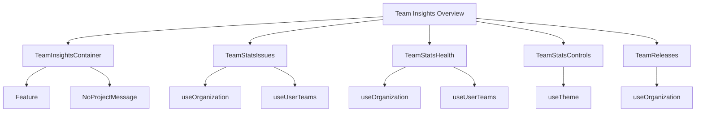

# Getting Started with Team Insights Overview

Team insights provide a detailed view of the performance and health of different teams within an organization. This includes metrics such as issues encountered, project health, and other relevant statistics.

## <SwmToken path="static/app/views/organizationStats/teamInsights/index.tsx" pos="13:2:2" line-data="function TeamInsightsContainer({children, organization}: Props) {">`TeamInsightsContainer`</SwmToken>

The <SwmToken path="static/app/views/organizationStats/teamInsights/index.tsx" pos="13:2:2" line-data="function TeamInsightsContainer({children, organization}: Props) {">`TeamInsightsContainer`</SwmToken> component is responsible for rendering the team insights feature. It ensures that the necessary features are enabled and that the appropriate project messages are displayed.

<SwmSnippet path="/static/app/views/organizationStats/teamInsights/index.tsx" line="13">

---

The <SwmToken path="static/app/views/organizationStats/teamInsights/index.tsx" pos="13:2:2" line-data="function TeamInsightsContainer({children, organization}: Props) {">`TeamInsightsContainer`</SwmToken> component uses the <SwmToken path="static/app/views/organizationStats/teamInsights/index.tsx" pos="15:2:2" line-data="    &lt;Feature organization={organization} features=&quot;team-insights&quot;&gt;">`Feature`</SwmToken> and <SwmToken path="static/app/views/organizationStats/teamInsights/index.tsx" pos="16:2:2" line-data="      &lt;NoProjectMessage organization={organization}&gt;">`NoProjectMessage`</SwmToken> components to render the team insights feature. It also ensures that the necessary features are enabled and that the appropriate project messages are displayed.

```tsx
function TeamInsightsContainer({children, organization}: Props) {
  return (
    <Feature organization={organization} features="team-insights">
      <NoProjectMessage organization={organization}>
        {children && isValidElement(children)
          ? cloneElement<any>(children, {
              organization,
            })
          : (children as React.ReactChild)}
      </NoProjectMessage>
    </Feature>
  );
}

export default withOrganization(TeamInsightsContainer);
```

---

</SwmSnippet>

## TeamStatsIssues

The `TeamStatsIssues` component fetches and displays issues related to the team. It uses the <SwmToken path="static/app/views/organizationStats/teamInsights/index.tsx" pos="13:8:8" line-data="function TeamInsightsContainer({children, organization}: Props) {">`organization`</SwmToken> context to retrieve the relevant data and stores the selected team ID in local storage.

<SwmSnippet path="/static/app/views/organizationStats/teamInsights/health.tsx" line="30">

---

The <SwmToken path="static/app/views/organizationStats/teamInsights/health.tsx" pos="29:2:2" line-data="function TeamStatsHealth({location, router}: Props) {">`TeamStatsHealth`</SwmToken> component provides an overview of the health of the team's projects. It uses the <SwmToken path="static/app/views/organizationStats/teamInsights/health.tsx" pos="30:3:3" line-data="  const organization = useOrganization();">`organization`</SwmToken> context and stores the selected team ID in local storage.

```tsx
  const organization = useOrganization();
  const {teams, isLoading, isError} = useUserTeams();

  useRouteAnalyticsEventNames('team_insights.viewed', 'Team Insights: Viewed');

  const query = location?.query ?? {};
  const localStorageKey = `teamInsightsSelectedTeamId:${organization.slug}`;

  let localTeamId: string | null | undefined =
    query.team ?? localStorage.getItem(localStorageKey);
  if (localTeamId && !teams.find(team => team.id === localTeamId)) {
    localTeamId = null;
  }
  const currentTeamId = localTeamId ?? teams[0]?.id;
  const currentTeam = teams.find(team => team.id === currentTeamId) as
    | TeamWithProjects
    | undefined;
  const projects = currentTeam?.projects ?? [];

  const {period, start, end, utc} = dataDatetime(query);
```

---

</SwmSnippet>

## <SwmToken path="static/app/views/organizationStats/teamInsights/health.tsx" pos="19:2:2" line-data="import TeamStatsControls from &#39;./controls&#39;;">`TeamStatsControls`</SwmToken>

The <SwmToken path="static/app/views/organizationStats/teamInsights/health.tsx" pos="19:2:2" line-data="import TeamStatsControls from &#39;./controls&#39;;">`TeamStatsControls`</SwmToken> component manages the controls for selecting teams and environments. It uses the <SwmToken path="static/app/views/organizationStats/teamInsights/index.tsx" pos="13:8:8" line-data="function TeamInsightsContainer({children, organization}: Props) {">`organization`</SwmToken> context to handle changes and updates the URL state accordingly.

<SwmSnippet path="/static/app/views/organizationStats/teamInsights/controls.tsx" line="65">

---

The <SwmToken path="static/app/views/organizationStats/teamInsights/health.tsx" pos="19:2:2" line-data="import TeamStatsControls from &#39;./controls&#39;;">`TeamStatsControls`</SwmToken> component manages the controls for selecting teams and environments. It uses the <SwmToken path="static/app/views/organizationStats/teamInsights/controls.tsx" pos="68:11:11" line-data="  const localStorageKey = `teamInsightsSelectedTeamId:${organization.slug}`;">`organization`</SwmToken> context to handle changes and updates the URL state accordingly.

```tsx
  const theme = useTheme();

  const query = location?.query ?? {};
  const localStorageKey = `teamInsightsSelectedTeamId:${organization.slug}`;

  function handleChangeTeam(teamId: string) {
    localStorage.setItem(localStorageKey, teamId);
    // TODO(workflow): Preserve environment if it exists for the new team
    setStateOnUrl({team: teamId, environment: undefined});
  }

  function handleEnvironmentChange({value}: {label: string; value: string}) {
    if (value === '') {
      setStateOnUrl({environment: undefined});
    } else {
      setStateOnUrl({environment: value});
    }
  }

  function handleUpdateDatetime(datetime: ChangeData): LocationDescriptorObject {
    const {start, end, relative, utc} = datetime;
```

---

</SwmSnippet>

## <SwmToken path="static/app/views/organizationStats/teamInsights/teamReleases.tsx" pos="40:2:2" line-data="function TeamReleases({">`TeamReleases`</SwmToken>

The <SwmToken path="static/app/views/organizationStats/teamInsights/teamReleases.tsx" pos="40:2:2" line-data="function TeamReleases({">`TeamReleases`</SwmToken> component displays release statistics for the team's projects. It uses the <SwmToken path="static/app/views/organizationStats/teamInsights/index.tsx" pos="13:8:8" line-data="function TeamInsightsContainer({children, organization}: Props) {">`organization`</SwmToken> context to fetch and display the relevant data.

<SwmSnippet path="/static/app/views/organizationStats/teamInsights/teamReleases.tsx" line="28">

---

The <SwmToken path="static/app/views/organizationStats/teamInsights/teamReleases.tsx" pos="40:2:2" line-data="function TeamReleases({">`TeamReleases`</SwmToken> component displays release statistics for the team's projects. It uses the <SwmToken path="static/app/views/organizationStats/teamInsights/teamReleases.tsx" pos="29:1:1" line-data="  organization: Organization;">`organization`</SwmToken> context to fetch and display the relevant data.

```tsx
interface TeamReleasesProps extends DateTimeObject {
  organization: Organization;
  projects: Project[];
  teamSlug: string;
}

export type ProjectReleaseCount = {
  last_week_totals: Record<string, number>;
  project_avgs: Record<string, number>;
  release_counts: Record<string, number>;
};

function TeamReleases({
  organization,
  projects,
  teamSlug,
  start,
  end,
  period,
  utc,
}: TeamReleasesProps) {
```

---

</SwmSnippet>

&nbsp;

*This is an auto-generated document by Swimm AI 🌊 and has not yet been verified by a human*

<SwmMeta version="3.0.0" repo-id="Z2l0aHViJTNBJTNBc2VudHJ5LWRlbW8tMSUzQSUzQVN3aW1tLURlbW8=" repo-name="sentry-demo-1" doc-type="overview"><sup>Powered by [Swimm](/)</sup></SwmMeta>
