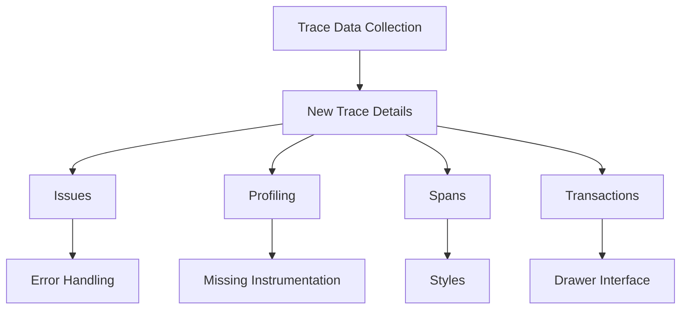

# Getting Started with Trace Details

New trace details provide an in-depth view of the performance data collected during the execution of a transaction. This includes various metrics and logs that help in identifying performance bottlenecks and errors.

## Organized Sections

The details are organized into different sections such as issues, profiling, spans, and transactions. Each section provides specific insights into different aspects of the trace.

## Utilities and Components

The trace details also include various utilities and components such as error handling, missing instrumentation warnings, and styles to enhance the user experience.

<SwmSnippet path="/static/app/views/performance/newTraceDetails/traceDrawer/details/error.tsx" line="1">

---

This file handles the error details within the trace drawer, providing insights into any errors encountered during the trace.

```tsx
import {useMemo} from 'react';
import {useTheme} from '@emotion/react';
import styled from '@emotion/styled';

import {LinkButton} from 'sentry/components/button';
import {
  getStacktrace,
  StackTracePreviewContent,
} from 'sentry/components/groupPreviewTooltip/stackTracePreview';
import LoadingIndicator from 'sentry/components/loadingIndicator';
```

---

</SwmSnippet>

<SwmSnippet path="/static/app/views/performance/newTraceDetails/traceDrawer/details/missingInstrumentation.tsx" line="1">

---

This file provides warnings for any missing instrumentation, helping users identify gaps in their performance monitoring setup.

```tsx
import {useTheme} from '@emotion/react';

import {IconSpan} from 'sentry/icons';
import {t} from 'sentry/locale';
import getDuration from 'sentry/utils/duration/getDuration';
import {generateProfileFlamechartRouteWithQuery} from 'sentry/utils/profiling/routes';
import useProjects from 'sentry/utils/useProjects';
import {ProfilePreview} from 'sentry/views/performance/newTraceDetails/traceDrawer/details/profiling/profilePreview';
import type {TraceTreeNodeDetailsProps} from 'sentry/views/performance/newTraceDetails/traceDrawer/tabs/traceTreeNodeDetails';
import {getTraceTabTitle} from 'sentry/views/performance/newTraceDetails/traceState/traceTabs';
```

---

</SwmSnippet>

# Trace Details Endpoints

Trace Details Endpoints

## <SwmToken path="static/app/views/performance/newTraceDetails/traceApi/useTrace.tsx" pos="20:4:4" line-data="export function fetchTrace(">`fetchTrace`</SwmToken>

The <SwmToken path="static/app/views/performance/newTraceDetails/traceApi/useTrace.tsx" pos="20:4:4" line-data="export function fetchTrace(">`fetchTrace`</SwmToken> function is used to fetch trace details for a specific trace ID. It constructs a URL using the organization slug and trace ID, and sends a GET request to retrieve the trace data.

<SwmSnippet path="/static/app/views/performance/newTraceDetails/traceApi/useTrace.tsx" line="20">

---

The <SwmToken path="static/app/views/performance/newTraceDetails/traceApi/useTrace.tsx" pos="20:4:4" line-data="export function fetchTrace(">`fetchTrace`</SwmToken> function constructs a URL using the organization slug and trace ID, and sends a GET request to retrieve the trace data.

```tsx
export function fetchTrace(
  api: Client,
  params: {
    orgSlug: string;
    query: string;
    traceId: string;
  }
): Promise<TraceSplitResults<TraceFullDetailed>> {
  return api.requestPromise(
    `/organizations/${params.orgSlug}/events-trace/${params.traceId}/?${params.query}`
  );
}
```

---

</SwmSnippet>

## <SwmToken path="static/app/views/performance/newTraceDetails/traceApi/useTraceMeta.tsx" pos="44:4:4" line-data="async function fetchSingleTraceMetaNew(">`fetchSingleTraceMetaNew`</SwmToken>

The <SwmToken path="static/app/views/performance/newTraceDetails/traceApi/useTraceMeta.tsx" pos="44:4:4" line-data="async function fetchSingleTraceMetaNew(">`fetchSingleTraceMetaNew`</SwmToken> function is used to fetch metadata for a single trace. It constructs a URL using the organization slug and trace slug, and sends a GET request to retrieve the trace metadata.

<SwmSnippet path="/static/app/views/performance/newTraceDetails/traceApi/useTraceMeta.tsx" line="44">

---

The <SwmToken path="static/app/views/performance/newTraceDetails/traceApi/useTraceMeta.tsx" pos="44:4:4" line-data="async function fetchSingleTraceMetaNew(">`fetchSingleTraceMetaNew`</SwmToken> function constructs a URL using the organization slug and trace slug, and sends a GET request to retrieve the trace metadata.

```tsx
async function fetchSingleTraceMetaNew(
  api: Client,
  organization: Organization,
  replayTrace: ReplayTrace,
  queryParams: any
) {
  const data = await api.requestPromise(
    `/organizations/${organization.slug}/events-trace-meta/${replayTrace.traceSlug}/`,
    {
      method: 'GET',
      data: queryParams,
    }
  );
  return data;
```

---

</SwmSnippet>

&nbsp;

*This is an auto-generated document by Swimm AI 🌊 and has not yet been verified by a human*

<SwmMeta version="3.0.0" repo-id="Z2l0aHViJTNBJTNBc2VudHJ5LWRlbW8tMSUzQSUzQVN3aW1tLURlbW8=" repo-name="sentry-demo-1" doc-type="overview"><sup>Powered by [Swimm](/)</sup></SwmMeta>
