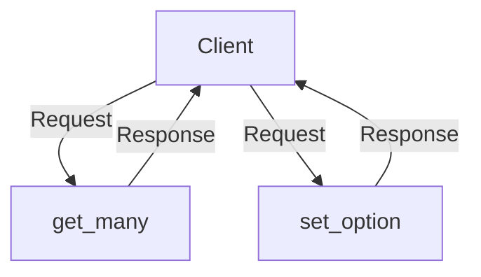

# Overview

Services in the Users module are responsible for handling user-related operations and business logic. They provide a layer of abstraction between the user data and the rest of the application.

# User Service Initialization

The <SwmToken path="src/sentry/users/services/user/service.py" pos="318:4:4" line-data="@back_with_silo_cache(&quot;user_service.get_user&quot;, SiloMode.REGION, RpcUser)">`user_service`</SwmToken> constant is created using the <SwmToken path="src/sentry/users/services/user/service.py" pos="331:4:8" line-data="user_service = UserService.create_delegation()">`UserService.create_delegation()`</SwmToken> method, which sets up the service for use throughout the module.

<SwmSnippet path="/src/sentry/users/services/user/service.py" line="331">

---

The <SwmToken path="src/sentry/users/services/user/service.py" pos="331:0:0" line-data="user_service = UserService.create_delegation()">`user_service`</SwmToken> constant is initialized here using the <SwmToken path="src/sentry/users/services/user/service.py" pos="331:4:8" line-data="user_service = UserService.create_delegation()">`UserService.create_delegation()`</SwmToken> method.

```python
user_service = UserService.create_delegation()
```

---

</SwmSnippet>

# Fetching User Details

The <SwmToken path="src/sentry/users/services/user/service.py" pos="318:6:6" line-data="@back_with_silo_cache(&quot;user_service.get_user&quot;, SiloMode.REGION, RpcUser)">`get_user`</SwmToken> function utilizes the <SwmToken path="src/sentry/users/services/user/service.py" pos="318:4:4" line-data="@back_with_silo_cache(&quot;user_service.get_user&quot;, SiloMode.REGION, RpcUser)">`user_service`</SwmToken> to fetch user details based on a given user ID. It uses caching mechanisms to improve performance and reduce database load.

<SwmSnippet path="/src/sentry/users/services/user/service.py" line="318">

---

The <SwmToken path="src/sentry/users/services/user/service.py" pos="318:6:6" line-data="@back_with_silo_cache(&quot;user_service.get_user&quot;, SiloMode.REGION, RpcUser)">`get_user`</SwmToken> function fetches user details using the <SwmToken path="src/sentry/users/services/user/service.py" pos="318:4:4" line-data="@back_with_silo_cache(&quot;user_service.get_user&quot;, SiloMode.REGION, RpcUser)">`user_service`</SwmToken> and implements caching to enhance performance.

```python
@back_with_silo_cache("user_service.get_user", SiloMode.REGION, RpcUser)
def get_user(user_id: int) -> RpcUser | None:
    users = user_service.get_many(filter={"user_ids": [user_id]})
    if len(users) > 0:
        return users[0]
    return None
```

---

</SwmSnippet>

# Retrieving Multiple Users

The <SwmToken path="src/sentry/users/services/user/service.py" pos="326:6:6" line-data="@back_with_silo_cache_many(&quot;user_service.get_many_by_id&quot;, SiloMode.REGION, RpcUser)">`get_many_by_id`</SwmToken> function retrieves multiple users based on a list of user <SwmToken path="src/sentry/users/services/user/service.py" pos="327:4:4" line-data="def get_many_by_id(ids: list[int]) -&gt; list[RpcUser]:">`ids`</SwmToken>, leveraging the <SwmToken path="src/sentry/users/services/user/service.py" pos="318:4:4" line-data="@back_with_silo_cache(&quot;user_service.get_user&quot;, SiloMode.REGION, RpcUser)">`user_service`</SwmToken> for data retrieval.

<SwmSnippet path="/src/sentry/users/services/user/service.py" line="326">

---

The <SwmToken path="src/sentry/users/services/user/service.py" pos="326:6:6" line-data="@back_with_silo_cache_many(&quot;user_service.get_many_by_id&quot;, SiloMode.REGION, RpcUser)">`get_many_by_id`</SwmToken> function retrieves multiple users using the <SwmToken path="src/sentry/users/services/user/service.py" pos="326:4:4" line-data="@back_with_silo_cache_many(&quot;user_service.get_many_by_id&quot;, SiloMode.REGION, RpcUser)">`user_service`</SwmToken>.

```python
@back_with_silo_cache_many("user_service.get_many_by_id", SiloMode.REGION, RpcUser)
def get_many_by_id(ids: list[int]) -> list[RpcUser]:
    return user_service.get_many(filter={"user_ids": ids})
```

---

</SwmSnippet>

# User Option APIs

User Option APIs provide functionalities to manage user-specific settings and preferences.

## <SwmToken path="src/sentry/users/services/user/service.py" pos="320:7:7" line-data="    users = user_service.get_many(filter={&quot;user_ids&quot;: [user_id]})">`get_many`</SwmToken>

The <SwmToken path="src/sentry/users/services/user/service.py" pos="320:7:7" line-data="    users = user_service.get_many(filter={&quot;user_ids&quot;: [user_id]})">`get_many`</SwmToken> function retrieves multiple user options based on the provided filter criteria. It returns a list of <SwmToken path="src/sentry/users/services/user_option/impl.py" pos="26:20:20" line-data="    def get_many(self, *, filter: UserOptionFilterArgs) -&gt; list[RpcUserOption]:">`RpcUserOption`</SwmToken> objects.

<SwmSnippet path="/src/sentry/users/services/user_option/impl.py" line="26">

---

The <SwmToken path="src/sentry/users/services/user_option/impl.py" pos="26:3:3" line-data="    def get_many(self, *, filter: UserOptionFilterArgs) -&gt; list[RpcUserOption]:">`get_many`</SwmToken> function retrieves multiple user options based on filter criteria.

```python
    def get_many(self, *, filter: UserOptionFilterArgs) -> list[RpcUserOption]:
        return self._FQ.get_many(filter)
```

---

</SwmSnippet>

## <SwmToken path="src/sentry/users/services/user_option/impl.py" pos="32:3:3" line-data="    def set_option(">`set_option`</SwmToken>

The <SwmToken path="src/sentry/users/services/user_option/impl.py" pos="32:3:3" line-data="    def set_option(">`set_option`</SwmToken> function sets a user option for a specific user. It takes parameters such as <SwmToken path="src/sentry/users/services/user/service.py" pos="319:4:4" line-data="def get_user(user_id: int) -&gt; RpcUser | None:">`user_id`</SwmToken>, <SwmToken path="src/sentry/users/services/user_option/impl.py" pos="36:1:1" line-data="        value: Any,">`value`</SwmToken>, <SwmToken path="src/sentry/users/services/user_option/impl.py" pos="37:1:1" line-data="        key: str,">`key`</SwmToken>, <SwmToken path="src/sentry/users/services/user_option/impl.py" pos="38:1:1" line-data="        project_id: int | None = None,">`project_id`</SwmToken>, and <SwmToken path="src/sentry/users/services/user_option/impl.py" pos="39:1:1" line-data="        organization_id: int | None = None,">`organization_id`</SwmToken> to set the option in the database.

<SwmSnippet path="/src/sentry/users/services/user_option/impl.py" line="32">

---

The <SwmToken path="src/sentry/users/services/user_option/impl.py" pos="32:3:3" line-data="    def set_option(">`set_option`</SwmToken> function sets a user option in the database for a specific user.

```python
    def set_option(
        self,
        *,
        user_id: int,
        value: Any,
        key: str,
        project_id: int | None = None,
        organization_id: int | None = None,
    ) -> None:
        UserOption.objects.set_value(
            user=user_id,
            key=key,
            value=value,
            project_id=project_id,
            organization_id=organization_id,
        )
```

---

</SwmSnippet>

&nbsp;

*This is an auto-generated document by Swimm AI 🌊 and has not yet been verified by a human*

<SwmMeta version="3.0.0" repo-id="Z2l0aHViJTNBJTNBc2VudHJ5LWRlbW8tMSUzQSUzQVN3aW1tLURlbW8=" repo-name="sentry-demo-1" doc-type="overview"><sup>Powered by [Swimm](/)</sup></SwmMeta>
