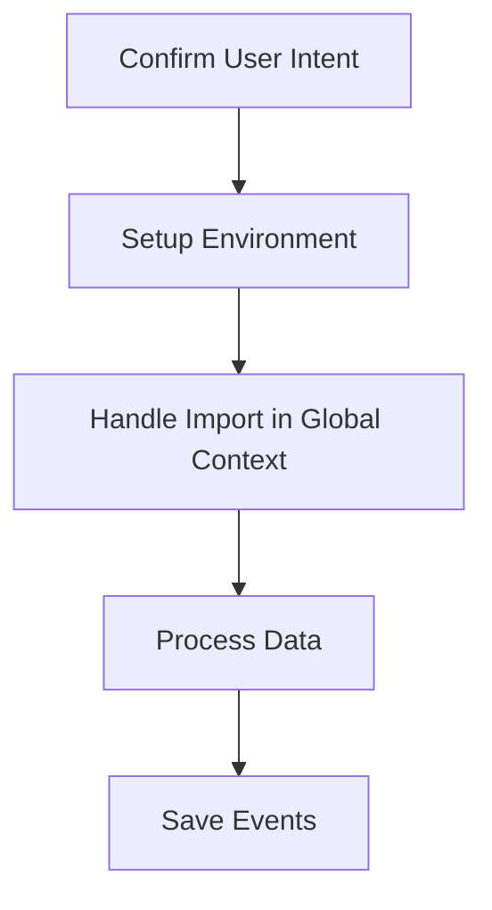

The process of importing data globally in the Sentry application involves several steps to ensure data integrity and proper handling. This document will cover:

1. Confirming user intent and setting up the environment
2. Handling the import in a global context
3. Processing the data
4. Saving the events

Technical document: <SwmLink doc-title="Global Data Import Process">[Global Data Import Process](/.swm/global-data-import-process.xakzhqsc.sw.md)</SwmLink>

# [Confirming User Intent and Setting Up the Environment](https://app.swimm.io/repos/Z2l0aHViJTNBJTNBc2VudHJ5LWRlbW8tMSUzQSUzQVN3aW1tLURlbW8=/docs/xakzhqsc#import_global)

The import process begins by confirming the user's intent to proceed with the data import. This is crucial to prevent accidental data loss, as the operation will irrecoverably delete all existing low-volume data. The user is prompted with a confirmation message, and only if they confirm, the process continues. This step ensures that the user is fully aware of the consequences of the import operation.

# [Handling the Import in a Global Context](https://app.swimm.io/repos/Z2l0aHViJTNBJTNBc2VudHJ5LWRlbW8tMSUzQSUzQVN3aW1tLURlbW8=/docs/xakzhqsc#import_in_global_scope)

Once the user's intent is confirmed, the import process is handled in a global context. This means that all models will be imported from the provided source file. The global context is particularly useful when restoring data to a fresh Sentry instance. During this step, superuser privileges are not sanitized, allowing for a 'pure' backup/restore process. This ensures that the data is imported exactly as it was exported, maintaining the integrity of the data.

# [Processing the Data](https://app.swimm.io/repos/Z2l0aHViJTNBJTNBc2VudHJ5LWRlbW8tMSUzQSUzQVN3aW1tLURlbW8=/docs/xakzhqsc#_import)

The data processing step involves deserializing the JSON content from the source file and saving it to the database. This step ensures that the data is correctly interpreted and stored in the appropriate format. The process includes handling various data models and ensuring that all dependencies are correctly managed. This step is critical for maintaining the consistency and accuracy of the imported data.

# [Saving the Events](https://app.swimm.io/repos/Z2l0aHViJTNBJTNBc2VudHJ5LWRlbW8tMSUzQSUzQVN3aW1tLURlbW8=/docs/xakzhqsc#save)

The final step in the import process is saving the events. This includes normalizing and processing the events to ensure they are correctly stored in the database. The process involves updating related models and ensuring that all event data is accurately recorded. This step is essential for maintaining the integrity of the event data and ensuring that it can be correctly retrieved and analyzed in the future.

&nbsp;

*This is an auto-generated document by Swimm AI 🌊 and has not yet been verified by a human*

<SwmMeta version="3.0.0" repo-id="Z2l0aHViJTNBJTNBc2VudHJ5LWRlbW8tMSUzQSUzQVN3aW1tLURlbW8=" repo-name="sentry-demo-1" doc-type="product-flows">Powered by [Swimm](/)</SwmMeta>
