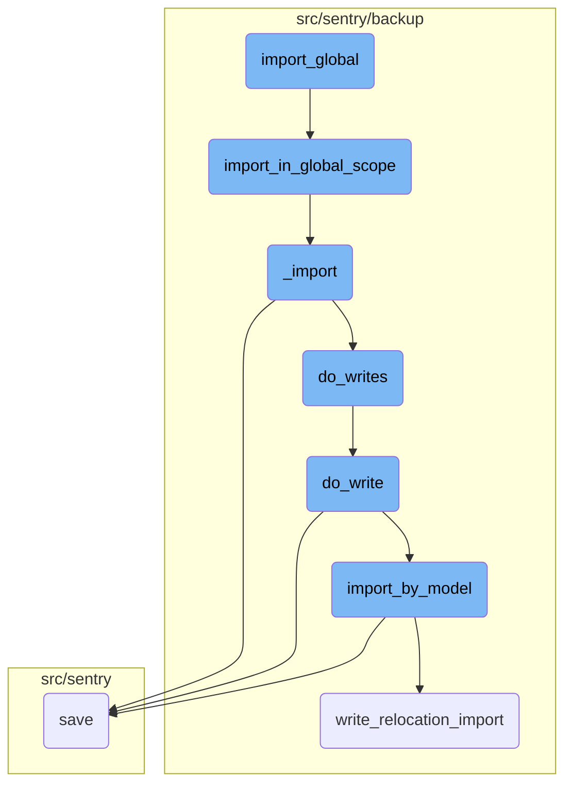
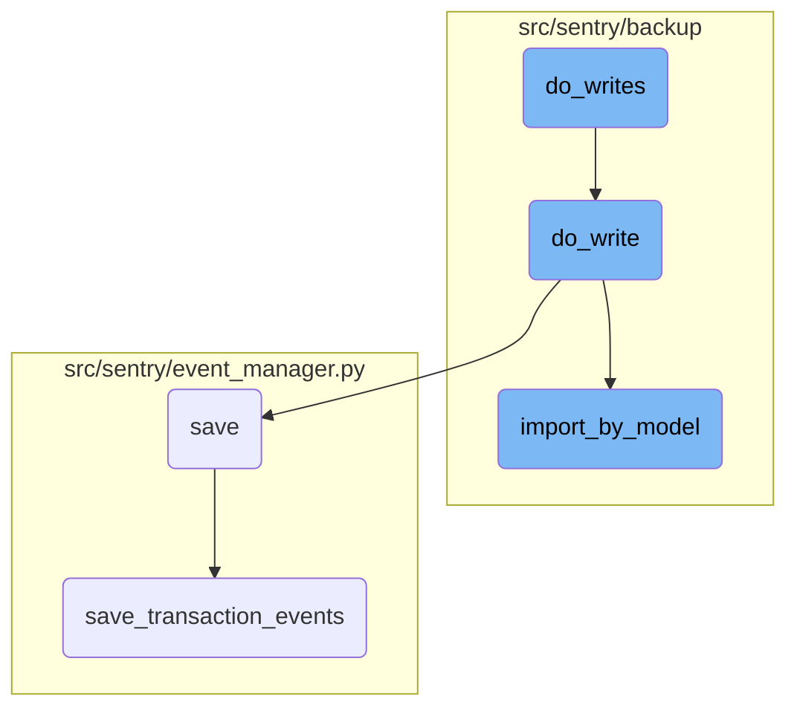

In this document, we will explain the process of importing data globally in the Sentry application. The process involves initiating the import, handling the import in a global context, processing the data, and saving the events.

The import process starts by confirming the user's intent and setting up the environment. Then, it handles the import in a global context, ensuring all models are imported from the source file. The data is processed by deserializing the JSON content and saving it to the database. Finally, the events are saved, including normalization and processing, ensuring all related data is correctly stored.

Here is a high level diagram of the flow, showing only the most important functions:



# Flow drill down

First, we'll zoom into this section of the flow:

```mermaid
graph TD;
      subgraph src/sentry
e06723878630eb0db87be626a23ee1ad89b6f2e738a729feff0bdf7ff892a38d(import_global):::mainFlowStyle --> c6eeb0b4305c767497cbf5bad6465c4c3b4ca5b6c9688d8b028c5b52a6264365(import_in_global_scope):::mainFlowStyle
end

subgraph src/sentry
c6eeb0b4305c767497cbf5bad6465c4c3b4ca5b6c9688d8b028c5b52a6264365(import_in_global_scope):::mainFlowStyle --> e51390835e25abe9700c58ce684275b91c592cbc3798916fccfb8d5e98213501(_import):::mainFlowStyle
end

subgraph src/sentry
e51390835e25abe9700c58ce684275b91c592cbc3798916fccfb8d5e98213501(_import):::mainFlowStyle --> 5086692df24257d76a0adf892eba843feac14033d92b4a32022b125d5a725f9b(save)
end

subgraph src/sentry
e51390835e25abe9700c58ce684275b91c592cbc3798916fccfb8d5e98213501(_import):::mainFlowStyle --> 26207a08d7fb570302a7c1ba260755115f33628088a15b2009f16110f8f0dae8(do_writes):::mainFlowStyle
end

subgraph src/sentry
26207a08d7fb570302a7c1ba260755115f33628088a15b2009f16110f8f0dae8(do_writes):::mainFlowStyle --> g7q54(...)
end

subgraph src/sentry
5086692df24257d76a0adf892eba843feac14033d92b4a32022b125d5a725f9b(save) --> b8052a0e9cf4dd2783dd9f9b401321908e36ff05fa95ad9dd7944757173348b4(save_transaction_events)
end


      classDef mainFlowStyle color:#000000,fill:#7CB9F4
classDef rootsStyle color:#000000,fill:#00FFF4
classDef Style1 color:#000000,fill:#00FFAA
classDef Style2 color:#000000,fill:#FFFF00
classDef Style3 color:#000000,fill:#AA7CB9

%% Swimm:
%% graph TD;
%%       subgraph <SwmPath>[src/sentry/](src/sentry/)</SwmPath>
%% e06723878630eb0db87be626a23ee1ad89b6f2e738a729feff0bdf7ff892a38d(import_global):::mainFlowStyle --> c6eeb0b4305c767497cbf5bad6465c4c3b4ca5b6c9688d8b028c5b52a6264365(import_in_global_scope):::mainFlowStyle
%% end
%% 
%% subgraph <SwmPath>[src/sentry/](src/sentry/)</SwmPath>
%% c6eeb0b4305c767497cbf5bad6465c4c3b4ca5b6c9688d8b028c5b52a6264365(import_in_global_scope):::mainFlowStyle --> e51390835e25abe9700c58ce684275b91c592cbc3798916fccfb8d5e98213501(_import):::mainFlowStyle
%% end
%% 
%% subgraph <SwmPath>[src/sentry/](src/sentry/)</SwmPath>
%% e51390835e25abe9700c58ce684275b91c592cbc3798916fccfb8d5e98213501(_import):::mainFlowStyle --> 5086692df24257d76a0adf892eba843feac14033d92b4a32022b125d5a725f9b(save)
%% end
%% 
%% subgraph <SwmPath>[src/sentry/](src/sentry/)</SwmPath>
%% e51390835e25abe9700c58ce684275b91c592cbc3798916fccfb8d5e98213501(_import):::mainFlowStyle --> 26207a08d7fb570302a7c1ba260755115f33628088a15b2009f16110f8f0dae8(do_writes):::mainFlowStyle
%% end
%% 
%% subgraph <SwmPath>[src/sentry/](src/sentry/)</SwmPath>
%% 26207a08d7fb570302a7c1ba260755115f33628088a15b2009f16110f8f0dae8(do_writes):::mainFlowStyle --> g7q54(...)
%% end
%% 
%% subgraph <SwmPath>[src/sentry/](src/sentry/)</SwmPath>
%% 5086692df24257d76a0adf892eba843feac14033d92b4a32022b125d5a725f9b(save) --> b8052a0e9cf4dd2783dd9f9b401321908e36ff05fa95ad9dd7944757173348b4(save_transaction_events)
%% end
%% 
%% 
%%       classDef mainFlowStyle color:#000000,fill:#7CB9F4
%% classDef rootsStyle color:#000000,fill:#00FFF4
%% classDef Style1 color:#000000,fill:#00FFAA
%% classDef Style2 color:#000000,fill:#FFFF00
%% classDef Style3 color:#000000,fill:#AA7CB9
```



<SwmSnippet path="/src/sentry/runner/commands/backup.py" line="869">

---

## <SwmToken path="src/sentry/runner/commands/backup.py" pos="869:2:2" line-data="def import_global(">`import_global`</SwmToken>

The <SwmToken path="src/sentry/runner/commands/backup.py" pos="869:2:2" line-data="def import_global(">`import_global`</SwmToken> function initiates the import process by confirming user intent and setting up the necessary environment. It uses the <SwmToken path="src/sentry/runner/commands/backup.py" pos="881:11:11" line-data="    from sentry.backup.imports import import_in_global_scope">`import_in_global_scope`</SwmToken> function to handle the actual import process.

```python
def import_global(
    src: IO[bytes],
    decrypt_with: IO[bytes],
    decrypt_with_gcp_kms: IO[bytes],
    findings_file: IO[str],
    no_prompt: bool,
    silent: bool,
) -> None:
    """
    Import all Sentry data from an exported JSON file.
    """

    from sentry.backup.imports import import_in_global_scope

    printer = get_printer(silent=silent, no_prompt=no_prompt)
    if SiloMode.get_current_mode() == SiloMode.MONOLITH and not is_split_db():
        confirmed = printer.confirm(
            """Proceeding with this operation will irrecoverably delete all existing
            low-volume data - are you sure want to continue?"""
        )
        if not confirmed:
```

---

</SwmSnippet>

<SwmSnippet path="/src/sentry/backup/imports.py" line="584">

---

## <SwmToken path="src/sentry/backup/imports.py" pos="584:2:2" line-data="def import_in_global_scope(">`import_in_global_scope`</SwmToken>

The <SwmToken path="src/sentry/backup/imports.py" pos="584:2:2" line-data="def import_in_global_scope(">`import_in_global_scope`</SwmToken> function performs the import in a global context, ensuring all models are imported from the provided source file. It calls the <SwmToken path="src/sentry/backup/imports.py" pos="599:3:3" line-data="    return _import(">`_import`</SwmToken> function to process the data.

```python
def import_in_global_scope(
    src: IO[bytes],
    *,
    decryptor: Decryptor | None = None,
    flags: ImportFlags | None = None,
    printer: Printer,
):
    """
    Perform an import in the `Global` scope, meaning that all models will be imported from the
    provided source file. Because a `Global` import is really only useful when restoring to a fresh
    Sentry instance, some behaviors in this scope are different from the others. In particular,
    superuser privileges are not sanitized. This method can be thought of as a "pure"
    backup/restore, simply serializing and deserializing a (partial) snapshot of the database state.
    """

    return _import(
```

---

</SwmSnippet>

<SwmSnippet path="/src/sentry/backup/imports.py" line="87">

---

## \_import

The <SwmToken path="src/sentry/backup/imports.py" pos="87:2:2" line-data="def _import(">`_import`</SwmToken> function processes the data by deserializing the JSON content and saving it to the database. It uses helper functions like <SwmToken path="src/sentry/backup/imports.py" pos="396:3:3" line-data="    def do_writes(pk_map: PrimaryKeyMap) -&gt; None:">`do_writes`</SwmToken> to handle the actual writing of data.

```python
def _import(
    src: IO[bytes],
    scope: ImportScope,
    *,
    decryptor: Decryptor | None = None,
    flags: ImportFlags | None = None,
    filter_by: Filter | None = None,
    printer: Printer,
):
    """
    Imports core data for a Sentry installation.

    It is generally preferable to avoid calling this function directly, as there are certain
    combinations of input parameters that should not be used together. Instead, use one of the other
    wrapper functions in this file, named `import_in_XXX_scope()`.
    """

    # Import here to prevent circular module resolutions.
    from sentry.models.organization import Organization
    from sentry.models.organizationmember import OrganizationMember
    from sentry.users.models.email import Email
```

---

</SwmSnippet>

<SwmSnippet path="/src/sentry/event_manager.py" line="448">

---

## save

The <SwmToken path="src/sentry/event_manager.py" pos="448:3:3" line-data="    def save(">`save`</SwmToken> function manages the saving of events, including normalization and processing. It ensures that events are correctly saved to the database and related models are updated.

```python
    def save(
        self,
        project_id: int | None,
        raw: bool = False,
        assume_normalized: bool = False,
        start_time: float | None = None,
        cache_key: str | None = None,
        skip_send_first_transaction: bool = False,
        has_attachments: bool = False,
    ) -> Event:
        """
        After normalizing and processing an event, save adjacent models such as
        releases and environments to postgres and write the event into
        eventstream. From there it will be picked up by Snuba and
        post-processing.

        We re-insert events with duplicate IDs into Snuba, which is responsible
        for deduplicating events. Since deduplication in Snuba is on the primary
        key (based on event ID, project ID and day), events with same IDs are only
        deduplicated if their timestamps fall on the same day. The latest event
        always wins and overwrites the value of events received earlier in that day.
```

---

</SwmSnippet>

<SwmSnippet path="/src/sentry/event_manager.py" line="3040">

---

## <SwmToken path="src/sentry/event_manager.py" pos="3040:2:2" line-data="def save_transaction_events(jobs: Sequence[Job], projects: ProjectsMapping) -&gt; Sequence[Job]:">`save_transaction_events`</SwmToken>

The <SwmToken path="src/sentry/event_manager.py" pos="3040:2:2" line-data="def save_transaction_events(jobs: Sequence[Job], projects: ProjectsMapping) -&gt; Sequence[Job]:">`save_transaction_events`</SwmToken> function handles the saving of transaction events, ensuring all related data is correctly stored. It performs various tasks like creating releases, deriving tags, and recording metrics.

```python
def save_transaction_events(jobs: Sequence[Job], projects: ProjectsMapping) -> Sequence[Job]:
    organization_ids = {project.organization_id for project in projects.values()}
    organizations = {o.id: o for o in Organization.objects.get_many_from_cache(organization_ids)}

    for project in projects.values():
        try:
            project.set_cached_field_value("organization", organizations[project.organization_id])
        except KeyError:
            continue

    set_measurement(measurement_name="jobs", value=len(jobs))
    set_measurement(measurement_name="projects", value=len(projects))

    _get_or_create_release_many(jobs, projects)
    _get_event_user_many(jobs, projects)
    _derive_plugin_tags_many(jobs, projects)
    _derive_interface_tags_many(jobs)
    _calculate_span_grouping(jobs, projects)
    _materialize_metadata_many(jobs)
    _get_or_create_environment_many(jobs, projects)
    _get_or_create_release_associated_models(jobs, projects)
```

---

</SwmSnippet>

Now, lets zoom into this section of the flow:



<SwmSnippet path="/src/sentry/backup/imports.py" line="393">

---

## Handling model writes and dependencies

The function <SwmToken path="src/sentry/backup/imports.py" pos="396:3:3" line-data="    def do_writes(pk_map: PrimaryKeyMap) -&gt; None:">`do_writes`</SwmToken> iterates over models and delegates the actual writing to <SwmToken path="src/sentry/backup/imports.py" pos="404:1:1" line-data="            do_write(import_write_context, pk_map, model_name, json_data, offset)">`do_write`</SwmToken>. It handles special cases like deferring organization authentication tokens.

```python
    # Extract some write logic into its own internal function, so that we may call it irrespective
    # of how we do atomicity: on a per-model (if using multiple dbs) or global (if using a single
    # db) basis.
    def do_writes(pk_map: PrimaryKeyMap) -> None:
        nonlocal deferred_org_auth_tokens, import_write_context

        for model_name, json_data, offset in yield_json_models(content):
            if model_name == org_auth_token_model_name:
                deferred_org_auth_tokens.append(json_data)
                continue

            do_write(import_write_context, pk_map, model_name, json_data, offset)
```

---

</SwmSnippet>

<SwmSnippet path="/src/sentry/backup/imports.py" line="296">

---

### Writing a single model

The function <SwmToken path="src/sentry/backup/imports.py" pos="297:3:3" line-data="    def do_write(">`do_write`</SwmToken> performs the write operation for a single model. It checks for model dependencies, logs the import request, and handles potential errors. It also ensures that the primary key map is updated and manages control silo replicas if necessary.

```python
    # Perform the write of a single model.
    def do_write(
        import_write_context: ImportWriteContext,
        pk_map: PrimaryKeyMap,
        model_name: NormalizedModelName,
        json_data: Any,
        offset: int,
    ) -> None:
        model_relations = import_write_context.dependencies.get(model_name)
        if not model_relations:
            return

        dep_models = {get_model_name(d) for d in model_relations.get_dependencies_for_relocation()}
        import_by_model = ImportExportService.get_importer_for_model(model_relations.model)
        model_name_str = str(model_name)
        min_ordinal = offset + 1

        extra = {
            "model_name": model_name_str,
            "import_uuid": flags.import_uuid,
            "min_ordinal": min_ordinal,
```

---

</SwmSnippet>

<SwmSnippet path="/src/sentry/backup/services/import_export/impl.py" line="106">

---

### Importing by model

The function <SwmToken path="src/sentry/backup/services/import_export/impl.py" pos="106:3:3" line-data="    def import_by_model(">`import_by_model`</SwmToken> is responsible for importing data for a specific model. It validates the input parameters, checks for existing import chunks to avoid duplicate work, and performs the actual database write. It also handles deserialization errors and database integrity issues.

```python
    def import_by_model(
        self,
        *,
        import_model_name: str = "",
        scope: RpcImportScope | None = None,
        flags: RpcImportFlags = DEFAULT_IMPORT_FLAGS,
        filter_by: list[RpcFilter],
        pk_map: RpcPrimaryKeyMap,
        json_data: str = "",
        min_ordinal: int,
    ) -> RpcImportResult:
        if min_ordinal < 1:
            return RpcImportError(
                kind=RpcImportErrorKind.InvalidMinOrdinal,
                on=InstanceID(import_model_name),
                reason=f"The model `{import_model_name}` was offset with an invalid `min_ordinal` of `{min_ordinal}`",
            )

        batch_model_name = NormalizedModelName(import_model_name)
        model = get_model(batch_model_name)
        if model is None:
```

---

</SwmSnippet>

&nbsp;

*This is an auto-generated document by Swimm AI 🌊 and has not yet been verified by a human*

<SwmMeta version="3.0.0" repo-id="Z2l0aHViJTNBJTNBc2VudHJ5LWRlbW8tMSUzQSUzQVN3aW1tLURlbW8=" repo-name="sentry-demo-1" doc-type="flows"><sup>Powered by [Swimm](/)</sup></SwmMeta>
