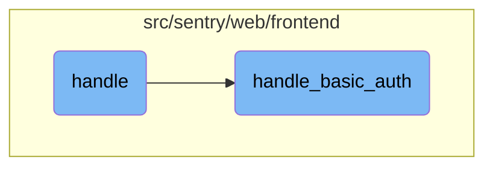

In this document, we will explain how the application handles authentication for users, including both basic authentication and Single <SwmToken path="src/sentry/web/frontend/auth_login.py" pos="47:27:29" line-data="ERR_NO_SSO = _(&quot;The organization does not exist or does not have Single Sign-On enabled.&quot;)">`Sign-On`</SwmToken> (SSO). The process involves retrieving the organization context, managing session details, and handling different authentication methods based on the organization's configuration.

The flow starts by retrieving the organization context using the provided slug. If the organization is not found, the user is redirected to the login page. A test cookie is set, and if the request method is POST, it handles multiple tabs. The application then tries to retrieve the authentication provider for the organization. If no provider is found, it uses basic authentication. Otherwise, it proceeds with SSO. Finally, it manages session expiration and returns the appropriate response.

# Flow drill down



<SwmSnippet path="/src/sentry/web/frontend/auth_organization_login.py" line="61">

---

## Handling Authentication

The <SwmToken path="src/sentry/web/frontend/auth_organization_login.py" pos="61:3:3" line-data="    def handle(self, request: Request, organization_slug) -&gt; HttpResponseBase:">`handle`</SwmToken> function is responsible for managing the authentication flow for an organization. It first retrieves the organization context based on the provided slug. If the organization is not found, it redirects to the login page. It then sets a test cookie and checks if the request method is POST to handle multiple tabs. The function attempts to retrieve the authentication provider for the organization. If no authentication provider is found, it calls <SwmToken path="src/sentry/web/frontend/auth_login.py" pos="558:3:3" line-data="    def handle_basic_auth(self, request: Request, **kwargs) -&gt; HttpResponseBase:">`handle_basic_auth`</SwmToken> to manage basic authentication. Otherwise, it proceeds with Single <SwmToken path="src/sentry/web/frontend/auth_login.py" pos="47:27:29" line-data="ERR_NO_SSO = _(&quot;The organization does not exist or does not have Single Sign-On enabled.&quot;)">`Sign-On`</SwmToken> (SSO) handling. Finally, it manages session expiration and returns the appropriate response.

```python
    def handle(self, request: Request, organization_slug) -> HttpResponseBase:
        org_context = organization_service.get_organization_by_slug(
            slug=organization_slug, only_visible=True
        )
        if org_context is None:
            return self.redirect(reverse("sentry-login"))
        organization = org_context.organization

        request.session.set_test_cookie()

        # check on POST to handle
        # multiple tabs case well now that we include redirect in url
        if request.method == "POST":
            referrer = None
            if request.session.get("_referrer") is not None:
                referrer = request.session.pop("_referrer")
            next_uri = self.get_next_uri(request)
            initiate_login(request, next_uri, referrer)

        try:
            auth_provider = AuthProvider.objects.get(organization_id=organization.id)
```

---

</SwmSnippet>

<SwmSnippet path="/src/sentry/web/frontend/auth_login.py" line="558">

---

### Handling Basic Authentication

The <SwmToken path="src/sentry/web/frontend/auth_login.py" pos="558:3:3" line-data="    def handle_basic_auth(self, request: Request, **kwargs) -&gt; HttpResponseBase:">`handle_basic_auth`</SwmToken> function is a legacy handler that manages both GET and POST requests for registration and login. For GET requests, it redirects to the appropriate URL if the subdomain exists. For POST requests, it handles user registration and login. If the registration form is valid, it saves the user, sends confirmation emails, and associates the user with the organization. For login attempts, it checks for rate limits and validates the login form. If the login is successful, it sets the active organization and redirects the user accordingly. The function also manages session details and context updates before rendering the login response.

```python
    def handle_basic_auth(self, request: Request, **kwargs) -> HttpResponseBase:
        """
        Legacy handler that handles GET and POST requests for registration and login.
        This is still here because it's used by OAuthAuthorizeView and AuthOrganizationLoginView.
        It will be removed once we decouple those classes from this method TODO(@EricHasegawa).
        """
        op = request.POST.get("op")
        organization = kwargs.pop("organization", None)

        if request.method == "GET" and request.subdomain and self.org_exists(request):
            urls = [
                reverse("sentry-auth-organization", args=[request.subdomain]),
                reverse("sentry-register"),
            ]
            # Only redirect if the URL is not register or login paths.
            if request.path_info not in urls:
                url_prefix = generate_organization_url(request.subdomain)
                url = absolute_uri(urls[0], url_prefix=url_prefix)
                if request.GET:
                    url = f"{url}?{request.GET.urlencode()}"
                return HttpResponseRedirect(url)
```

---

</SwmSnippet>

&nbsp;

*This is an auto-generated document by Swimm AI 🌊 and has not yet been verified by a human*

<SwmMeta version="3.0.0" repo-id="Z2l0aHViJTNBJTNBc2VudHJ5LWRlbW8tMSUzQSUzQVN3aW1tLURlbW8=" repo-name="sentry-demo-1" doc-type="flows"><sup>Powered by [Swimm](/)</sup></SwmMeta>
