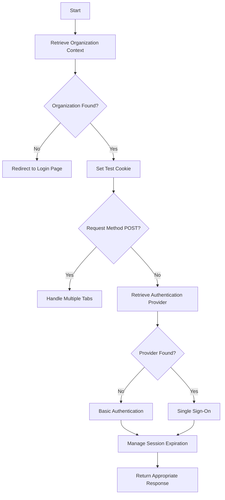

This document will cover the process of handling authentication in the application, including:

1. Retrieving the organization context
2. Managing session details
3. Handling different authentication methods based on the organization's configuration.

Technical document: <SwmLink doc-title="Handling Authentication">[Handling Authentication](/.swm/handling-authentication.72u6auwl.sw.md)</SwmLink>

# [Retrieving the Organization Context](https://app.swimm.io/repos/Z2l0aHViJTNBJTNBc2VudHJ5LWRlbW8tMSUzQSUzQVN3aW1tLURlbW8=/docs/72u6auwl#retrieving-the-organization-context)

The first step in the authentication process is to retrieve the organization context using the provided slug. This step is crucial because it determines whether the organization exists in the system. If the organization is not found, the user is redirected to the login page. This ensures that only users associated with a valid organization can proceed with the authentication process.

# [Managing Session Details](https://app.swimm.io/repos/Z2l0aHViJTNBJTNBc2VudHJ5LWRlbW8tMSUzQSUzQVN3aW1tLURlbW8=/docs/72u6auwl#managing-session-details)

Once the organization context is retrieved, the application sets a test cookie to manage session details. This step is important for maintaining the user's session state. If the request method is POST, the application handles multiple tabs by checking for a referrer and initiating the login process with the appropriate next URI. This ensures that the user can seamlessly continue their session even if they have multiple tabs open.

# [Handling Different Authentication Methods](https://app.swimm.io/repos/Z2l0aHViJTNBJTNBc2VudHJ5LWRlbW8tMSUzQSUzQVN3aW1tLURlbW8=/docs/72u6auwl#handling-different-authentication-methods-based-on-the-organizations-configuration)

The application then attempts to retrieve the authentication provider for the organization. If no provider is found, it defaults to basic authentication. Basic authentication involves handling both GET and POST requests for user registration and login. For GET requests, the application redirects to the appropriate URL if the subdomain exists. For POST requests, it handles user registration by saving the user, sending confirmation emails, and associating the user with the organization. For login attempts, it checks for rate limits and validates the login form. If the login is successful, it sets the active organization and redirects the user accordingly. If an authentication provider is found, the application proceeds with Single Sign-On (SSO) handling. SSO allows users to authenticate using their existing credentials from another service, providing a seamless login experience. Finally, the application manages session expiration and returns the appropriate response, ensuring that the user's session is properly maintained and that they are redirected to the correct page based on their authentication status.

&nbsp;

*This is an auto-generated document by Swimm AI 🌊 and has not yet been verified by a human*

<SwmMeta version="3.0.0" repo-id="Z2l0aHViJTNBJTNBc2VudHJ5LWRlbW8tMSUzQSUzQVN3aW1tLURlbW8=" repo-name="sentry-demo-1" doc-type="product-flows">Powered by [Swimm](/)</SwmMeta>
