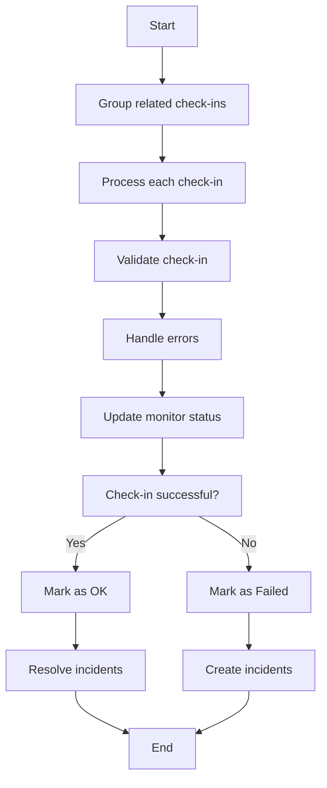

This document will cover the process of handling check-ins for a monitoring system. We'll cover:

1. Grouping related check-ins
2. Processing each check-in individually
3. Validating and handling errors
4. Updating the status of the monitor environment based on the outcome of the check-ins.

Technical document: <SwmLink doc-title="Handling Check-ins Flow">[Handling Check-ins Flow](/.swm/handling-check-ins-flow.goyp6ca9.sw.md)</SwmLink>

# [Grouping Related Check-ins](https://app.swimm.io/repos/Z2l0aHViJTNBJTNBc2VudHJ5LWRlbW8tMSUzQSUzQVN3aW1tLURlbW8=/docs/goyp6ca9#processing-check-in-group)

The process begins by grouping related check-ins. These check-ins are part of the same monitor and need to be processed together. Grouping ensures that all related check-ins are handled in a single batch, which helps in maintaining consistency and reducing processing time.

# [Processing Each Check-in](https://app.swimm.io/repos/Z2l0aHViJTNBJTNBc2VudHJ5LWRlbW8tMSUzQSUzQVN3aW1tLURlbW8=/docs/goyp6ca9#processing-individual-check-in)

Once the check-ins are grouped, each check-in is processed individually. This involves starting a transaction for each check-in to ensure that any changes made during the processing can be rolled back if an error occurs. This step is crucial for maintaining data integrity and ensuring that each check-in is handled correctly.

# [Validating Check-ins](https://app.swimm.io/repos/Z2l0aHViJTNBJTNBc2VudHJ5LWRlbW8tMSUzQSUzQVN3aW1tLURlbW8=/docs/goyp6ca9#validating-and-handling-check-ins)

During the processing of each check-in, validation is performed to ensure that the check-in data is correct and meets all necessary criteria. This includes checking for rate limits, quotas, and ensuring that the monitor and its environment are correctly configured. Validation helps in identifying any issues early in the process, preventing further complications.

# [Handling Errors](https://app.swimm.io/repos/Z2l0aHViJTNBJTNBc2VudHJ5LWRlbW8tMSUzQSUzQVN3aW1tLURlbW8=/docs/goyp6ca9#validating-and-handling-check-ins)

If any errors are encountered during the validation or processing of a check-in, they are handled appropriately. This involves logging the error and taking necessary actions to mitigate its impact. Proper error handling ensures that the system remains stable and that any issues are promptly addressed.

# [Updating Monitor Status](https://app.swimm.io/repos/Z2l0aHViJTNBJTNBc2VudHJ5LWRlbW8tMSUzQSUzQVN3aW1tLURlbW8=/docs/goyp6ca9#marking-check-in-as-ok)

After processing and validating a check-in, the status of the monitor environment is updated based on the outcome. If the check-in is successful, the status is marked as OK, and any active incidents are resolved. This step ensures that the monitor reflects the current state accurately and that any issues are promptly addressed.

# [Marking Check-in as Failed](https://app.swimm.io/repos/Z2l0aHViJTNBJTNBc2VudHJ5LWRlbW8tMSUzQSUzQVN3aW1tLURlbW8=/docs/goyp6ca9#marking-check-in-as-failed)

If the check-in fails, the status of the monitor environment is marked as failed. This triggers the creation of incidents and issues, which helps in identifying and addressing the problem. Marking a check-in as failed ensures that any issues are promptly flagged and addressed.

# [Resolving Incidents](https://app.swimm.io/repos/Z2l0aHViJTNBJTNBc2VudHJ5LWRlbW8tMSUzQSUzQVN3aW1tLURlbW8=/docs/goyp6ca9#resolving-incident-group)

When a check-in is marked as OK, any open incidents associated with the monitor are resolved. This involves producing a status change message to Kafka, which updates the status of the incidents. Resolving incidents ensures that the system accurately reflects the current state and that any resolved issues are promptly closed.

&nbsp;

*This is an auto-generated document by Swimm AI 🌊 and has not yet been verified by a human*

<SwmMeta version="3.0.0" repo-id="Z2l0aHViJTNBJTNBc2VudHJ5LWRlbW8tMSUzQSUzQVN3aW1tLURlbW8=" repo-name="sentry-demo-1" doc-type="product-flows">Powered by [Swimm](/)</SwmMeta>
