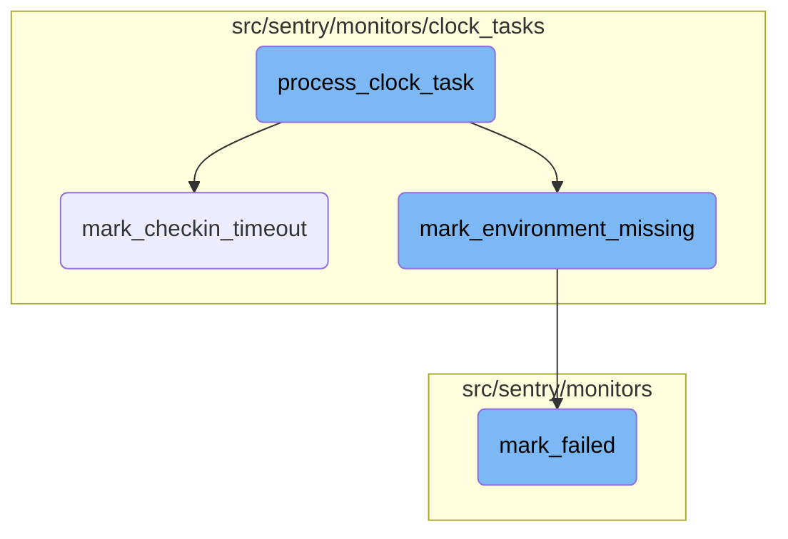

This document explains the flow of handling clock tasks. The process involves decoding the message payload, determining the type of task, and then calling the appropriate function to handle the task. The main tasks include marking a <SwmToken path="src/sentry/monitors/logic/mark_failed.py" pos="35:7:9" line-data="    Given a failing check-in, mark the monitor environment as failed and trigger">`check-in`</SwmToken> as timed out and marking a monitor environment as missing.

The flow starts with decoding the message payload to understand what kind of task needs to be processed. If the task is about a timeout, it marks the <SwmToken path="src/sentry/monitors/logic/mark_failed.py" pos="35:7:9" line-data="    Given a failing check-in, mark the monitor environment as failed and trigger">`check-in`</SwmToken> as timed out. If the task is about a missing environment, it marks the monitor environment as missing. Both of these tasks involve updating the status and computing the next expected <SwmToken path="src/sentry/monitors/logic/mark_failed.py" pos="35:7:9" line-data="    Given a failing check-in, mark the monitor environment as failed and trigger">`check-in`</SwmToken> time. Finally, it updates the monitor's state to reflect these changes.

# Flow drill down



<SwmSnippet path="/src/sentry/monitors/consumers/clock_tasks_consumer.py" line="37">

---

## Handling Clock Tasks

The <SwmToken path="src/sentry/monitors/consumers/clock_tasks_consumer.py" pos="37:2:2" line-data="def process_clock_task(message: Message[KafkaPayload | FilteredPayload]):">`process_clock_task`</SwmToken> function is responsible for handling clock tasks. It decodes the message payload and determines the type of task to process. If the task is a timeout, it calls <SwmToken path="src/sentry/monitors/consumers/clock_tasks_consumer.py" pos="46:1:1" line-data="            mark_checkin_timeout(int(wrapper[&quot;checkin_id&quot;]), ts)">`mark_checkin_timeout`</SwmToken>. If the task is a missing environment, it calls <SwmToken path="src/sentry/monitors/consumers/clock_tasks_consumer.py" pos="50:1:1" line-data="            mark_environment_missing(int(wrapper[&quot;monitor_environment_id&quot;]), ts)">`mark_environment_missing`</SwmToken>.

```python
def process_clock_task(message: Message[KafkaPayload | FilteredPayload]):
    assert not isinstance(message.payload, FilteredPayload)
    assert isinstance(message.value, BrokerValue)

    try:
        wrapper = MONITORS_CLOCK_TASKS_CODEC.decode(message.payload.value)
        ts = datetime.fromtimestamp(wrapper["ts"], tz=timezone.utc)

        if is_mark_timeout(wrapper):
            mark_checkin_timeout(int(wrapper["checkin_id"]), ts)
            return

        if is_mark_missing(wrapper):
            mark_environment_missing(int(wrapper["monitor_environment_id"]), ts)
            return

        logger.error("Unsupported clock-tick task type: %s", wrapper["type"])
    except Exception:
        logger.exception("Failed to process clock tick task")
```

---

</SwmSnippet>

<SwmSnippet path="/src/sentry/monitors/clock_tasks/check_timeout.py" line="64">

---

## Marking <SwmToken path="src/sentry/monitors/logic/mark_failed.py" pos="35:7:9" line-data="    Given a failing check-in, mark the monitor environment as failed and trigger">`check-in`</SwmToken> Timeout

The <SwmToken path="src/sentry/monitors/clock_tasks/check_timeout.py" pos="64:2:2" line-data="def mark_checkin_timeout(checkin_id: int, ts: datetime) -&gt; None:">`mark_checkin_timeout`</SwmToken> function handles the logic for marking a <SwmToken path="src/sentry/monitors/logic/mark_failed.py" pos="35:7:9" line-data="    Given a failing check-in, mark the monitor environment as failed and trigger">`check-in`</SwmToken> as timed out. It retrieves the <SwmToken path="src/sentry/monitors/logic/mark_failed.py" pos="35:7:9" line-data="    Given a failing check-in, mark the monitor environment as failed and trigger">`check-in`</SwmToken>, updates its status to TIMEOUT, and checks if a newer <SwmToken path="src/sentry/monitors/logic/mark_failed.py" pos="35:7:9" line-data="    Given a failing check-in, mark the monitor environment as failed and trigger">`check-in`</SwmToken> has already updated the monitor's state. If not, it computes the most recent expected <SwmToken path="src/sentry/monitors/logic/mark_failed.py" pos="35:7:9" line-data="    Given a failing check-in, mark the monitor environment as failed and trigger">`check-in`</SwmToken> time and calls <SwmToken path="src/sentry/monitors/logic/mark_failed.py" pos="29:2:2" line-data="def mark_failed(">`mark_failed`</SwmToken>.

```python
def mark_checkin_timeout(checkin_id: int, ts: datetime) -> None:
    logger.info("checkin_timeout", extra={"checkin_id": checkin_id})

    try:
        checkin = (
            MonitorCheckIn.objects.select_related("monitor_environment")
            .select_related("monitor_environment__monitor")
            .get(id=checkin_id)
        )
    except MonitorCheckIn.DoesNotExist:
        # The monitor may have been deleted or the timeout may have reached
        # it's retention period (less likely)
        metrics.incr("sentry.monitors.tasks.check_timeout.not_found")
        return

    if checkin.monitor_environment is None:
        return

    monitor_environment = checkin.monitor_environment
    monitor = monitor_environment.monitor

```

---

</SwmSnippet>

<SwmSnippet path="/src/sentry/monitors/clock_tasks/check_missed.py" line="90">

---

## Marking Environment as Missing

The <SwmToken path="src/sentry/monitors/clock_tasks/check_missed.py" pos="90:2:2" line-data="def mark_environment_missing(monitor_environment_id: int, ts: datetime):">`mark_environment_missing`</SwmToken> function handles the logic for marking a monitor environment as missing. It retrieves the monitor environment, creates a missed <SwmToken path="src/sentry/monitors/logic/mark_failed.py" pos="35:7:9" line-data="    Given a failing check-in, mark the monitor environment as failed and trigger">`check-in`</SwmToken>, and computes the most recent expected <SwmToken path="src/sentry/monitors/logic/mark_failed.py" pos="35:7:9" line-data="    Given a failing check-in, mark the monitor environment as failed and trigger">`check-in`</SwmToken> time. It then calls <SwmToken path="src/sentry/monitors/logic/mark_failed.py" pos="29:2:2" line-data="def mark_failed(">`mark_failed`</SwmToken> to update the monitor's state.

```python
def mark_environment_missing(monitor_environment_id: int, ts: datetime):
    logger.info("mark_missing", extra={"monitor_environment_id": monitor_environment_id})

    try:
        monitor_environment = MonitorEnvironment.objects.select_related("monitor").get(
            IGNORE_MONITORS,
            id=monitor_environment_id,
            # XXX(epurkhiser): Ensure a previous dispatch_check_missing task did
            # not already move the next_checkin_latest forward. This can happen
            # when the clock-ticks happen rapidly and we fire off
            # dispatch_check_missing rapidly (due to a backlog in the
            # ingest-monitors topic)
            next_checkin_latest__lte=ts,
        )
    except MonitorEnvironment.DoesNotExist:
        # Nothing to do. We already handled this miss in an earlier tasks
        # (or the environment was deleted)
        return

    monitor = monitor_environment.monitor
    # next_checkin must be set, since detecting this monitor as missed means
```

---

</SwmSnippet>

<SwmSnippet path="/src/sentry/monitors/logic/mark_failed.py" line="29">

---

## Marking as Failed

The <SwmToken path="src/sentry/monitors/logic/mark_failed.py" pos="29:2:2" line-data="def mark_failed(">`mark_failed`</SwmToken> function updates the monitor environment's state to failed and triggers side effects such as creating incidents and issues. It computes the next expected <SwmToken path="src/sentry/monitors/logic/mark_failed.py" pos="35:7:9" line-data="    Given a failing check-in, mark the monitor environment as failed and trigger">`check-in`</SwmToken> time and updates the monitor environment if there have been no newer <SwmToken path="src/sentry/monitors/clock_tasks/check_timeout.py" pos="27:15:17" line-data="    Given a clock tick timestamp determine which check-ins are past their">`check-ins`</SwmToken>.

```python
def mark_failed(
    failed_checkin: MonitorCheckIn,
    ts: datetime,
    received: datetime | None = None,
) -> bool:
    """
    Given a failing check-in, mark the monitor environment as failed and trigger
    side effects for creating monitor incidents and issues.

    The provided `ts` is the reference time for when the next check-in time is
    calculated from. This typically would be the failed check-in's `date_added`
    or completion time. Though for the missed and timedout tasks this may be
    computed based on the tasks reference time.
    """
    monitor_env = failed_checkin.monitor_environment

    if monitor_env is None:
        return False

    failure_issue_threshold = monitor_env.monitor.config.get("failure_issue_threshold", 1)
    if not failure_issue_threshold:
```

---

</SwmSnippet>

&nbsp;

*This is an auto-generated document by Swimm AI 🌊 and has not yet been verified by a human*

<SwmMeta version="3.0.0" repo-id="Z2l0aHViJTNBJTNBc2VudHJ5LWRlbW8tMSUzQSUzQVN3aW1tLURlbW8=" repo-name="sentry-demo-1" doc-type="flows"><sup>Powered by [Swimm](/)</sup></SwmMeta>
