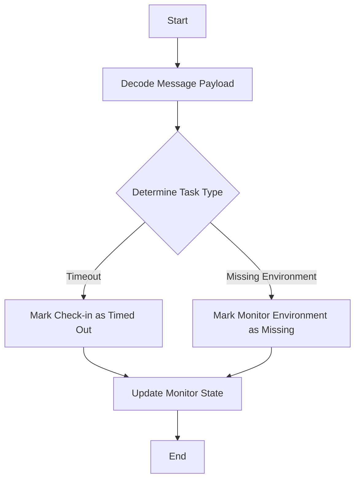

This document will cover the process of handling clock tasks, which includes:

1. Decoding the message payload
2. Determining the type of task
3. Marking a check-in as timed out
4. Marking a monitor environment as missing
5. Updating the monitor's state.

Technical document: <SwmLink doc-title="Handling Clock Tasks">[Handling Clock Tasks](/.swm/handling-clock-tasks.9bc7g9ee.sw.md)</SwmLink>

# [Decoding the Message Payload](https://app.swimm.io/repos/Z2l0aHViJTNBJTNBc2VudHJ5LWRlbW8tMSUzQSUzQVN3aW1tLURlbW8=/docs/9bc7g9ee#decoding-the-message-payload)

The process begins by decoding the message payload. This step is crucial as it helps to understand what kind of task needs to be processed. The payload contains information about the task type and relevant identifiers.

# [Determining the Type of Task](https://app.swimm.io/repos/Z2l0aHViJTNBJTNBc2VudHJ5LWRlbW8tMSUzQSUzQVN3aW1tLURlbW8=/docs/9bc7g9ee#determining-the-type-of-task)

Once the message payload is decoded, the next step is to determine the type of task. There are two main types of tasks: marking a check-in as timed out and marking a monitor environment as missing. This decision is based on the information decoded from the payload.

# [Marking a Check-in as Timed Out](https://app.swimm.io/repos/Z2l0aHViJTNBJTNBc2VudHJ5LWRlbW8tMSUzQSUzQVN3aW1tLURlbW8=/docs/9bc7g9ee#marking-check-in-timeout)

If the task is to mark a check-in as timed out, the system retrieves the check-in and updates its status to TIMEOUT. It then checks if a newer check-in has already updated the monitor's state. If not, it computes the most recent expected check-in time and proceeds to update the monitor's state. This ensures that the system accurately reflects the current status of the check-in and the monitor.

# [Marking a Monitor Environment as Missing](https://app.swimm.io/repos/Z2l0aHViJTNBJTNBc2VudHJ5LWRlbW8tMSUzQSUzQVN3aW1tLURlbW8=/docs/9bc7g9ee#marking-environment-as-missing)

If the task is to mark a monitor environment as missing, the system retrieves the monitor environment and creates a missed check-in. It then computes the most recent expected check-in time and updates the monitor's state accordingly. This step is important to ensure that any missing environments are accurately tracked and handled.

# [Updating the Monitor's State](https://app.swimm.io/repos/Z2l0aHViJTNBJTNBc2VudHJ5LWRlbW8tMSUzQSUzQVN3aW1tLURlbW8=/docs/9bc7g9ee#marking-as-failed)

The final step in the process is to update the monitor's state. This involves marking the monitor environment as failed and triggering side effects such as creating incidents and issues. The system computes the next expected check-in time and updates the monitor environment if there have been no newer check-ins. This ensures that the monitor's state is always up-to-date and accurately reflects the current status.

&nbsp;

*This is an auto-generated document by Swimm AI 🌊 and has not yet been verified by a human*

<SwmMeta version="3.0.0" repo-id="Z2l0aHViJTNBJTNBc2VudHJ5LWRlbW8tMSUzQSUzQVN3aW1tLURlbW8=" repo-name="sentry-demo-1" doc-type="product-flows">Powered by [Swimm](/)</SwmMeta>
