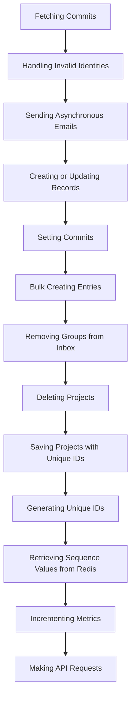

This document will cover the flow of handling commits, which includes:

 1. Fetching commits
 2. Handling invalid identities
 3. Sending asynchronous emails
 4. Creating or updating records
 5. Setting commits
 6. Bulk creating entries
 7. Removing groups from the inbox
 8. Deleting projects
 9. Saving projects with unique IDs
10. Generating unique IDs
11. Retrieving sequence values from Redis
12. Incrementing metrics
13. Making API requests.

Technical document: <SwmLink doc-title="Handling Commits Flow">[Handling Commits Flow](/.swm/handling-commits-flow.tvp209vd.sw.md)</SwmLink>

# [Fetching Commits](https://app.swimm.io/repos/Z2l0aHViJTNBJTNBc2VudHJ5LWRlbW8tMSUzQSUzQVN3aW1tLURlbW8=/docs/tvp209vd#fetching-commits)

The process begins with fetching commits, which involves retrieving commit data from the repository. This step ensures that all the latest changes are captured and ready for further processing.

# [Handling Invalid Identities](https://app.swimm.io/repos/Z2l0aHViJTNBJTNBc2VudHJ5LWRlbW8tMSUzQSUzQVN3aW1tLURlbW8=/docs/tvp209vd#handling-invalid-identities)

If an invalid identity is detected during the commit fetching process, an email is sent to the user to notify them of the issue. The invalid identity is then deleted to prevent any further complications. This step ensures that only valid identities are processed, maintaining the integrity of the data.

# [Sending Asynchronous Emails](https://app.swimm.io/repos/Z2l0aHViJTNBJTNBc2VudHJ5LWRlbW8tMSUzQSUzQVN3aW1tLURlbW8=/docs/tvp209vd#sending-asynchronous-emails)

Emails are sent asynchronously to avoid blocking the main execution flow. This means that while the email is being sent, other processes can continue running. This is crucial for maintaining the efficiency and responsiveness of the system.

# [Creating or Updating Records](https://app.swimm.io/repos/Z2l0aHViJTNBJTNBc2VudHJ5LWRlbW8tMSUzQSUzQVN3aW1tLURlbW8=/docs/tvp209vd#creating-or-updating-records)

This step involves either updating an existing record or creating a new one if it does not exist. This ensures that the database always reflects the latest state of the data without requiring manual checks for the existence of records.

# [Setting Commits](https://app.swimm.io/repos/Z2l0aHViJTNBJTNBc2VudHJ5LWRlbW8tMSUzQSUzQVN3aW1tLURlbW8=/docs/tvp209vd#setting-commits)

The commits are then set, which involves sorting and processing the commit list. This step includes creating necessary database entries for authors, repositories, and commits. It also updates the release with commit statistics and resolves any issues linked to the commits.

# [Bulk Creating Entries](https://app.swimm.io/repos/Z2l0aHViJTNBJTNBc2VudHJ5LWRlbW8tMSUzQSUzQVN3aW1tLURlbW8=/docs/tvp209vd#bulk-creating-entries)

Bulk creation is used to efficiently insert multiple objects into the database. This step converts the input iterable of objects into a tuple, checks if it is empty, and then performs the bulk creation. This method is efficient and ensures that the database is updated quickly.

# [Removing Groups from Inbox](https://app.swimm.io/repos/Z2l0aHViJTNBJTNBc2VudHJ5LWRlbW8tMSUzQSUzQVN3aW1tLURlbW8=/docs/tvp209vd#removing-groups-from-inbox)

This step involves removing a group from the inbox. If the group is found, it is deleted. Additionally, if the action is 'MARK_REVIEWED' and a user is provided, an activity record is created, and the group's history is updated to reflect that it has been reviewed.

# [Deleting Projects](https://app.swimm.io/repos/Z2l0aHViJTNBJTNBc2VudHJ5LWRlbW8tMSUzQSUzQVN3aW1tLURlbW8=/docs/tvp209vd#deleting-projects)

The deletion of a project involves manually cascading the deletion to related entities, removing notification settings for the project, and ensuring the deletion is performed within a transactional context. This ensures that all related data is properly cleaned up.

# [Saving Projects with Unique IDs](https://app.swimm.io/repos/Z2l0aHViJTNBJTNBc2VudHJ5LWRlbW8tMSUzQSUzQVN3aW1tLURlbW8=/docs/tvp209vd#saving-projects)

Before saving a project, it is ensured that the project has a unique slug. If the project uses Snowflake IDs, the saving process is delegated to a specialized function that handles Snowflake IDs. This step ensures that each project is uniquely identifiable.

# [Generating Unique IDs](https://app.swimm.io/repos/Z2l0aHViJTNBJTNBc2VudHJ5LWRlbW8tMSUzQSUzQVN3aW1tLURlbW8=/docs/tvp209vd#generating-snowflake-id)

Unique Snowflake IDs are generated based on various segments such as version, region, and timestamp. This ensures that each ID is valid and unique, which is crucial for maintaining data integrity.

# [Retrieving Sequence Values from Redis](https://app.swimm.io/repos/Z2l0aHViJTNBJTNBc2VudHJ5LWRlbW8tMSUzQSUzQVN3aW1tLURlbW8=/docs/tvp209vd#getting-sequence-value-from-redis)

Sequence values are retrieved from Redis for a given timestamp. This step ensures that the sequence value is within the allowed range and handles the expiration of old values. This is important for maintaining the consistency of the generated IDs.

# [Incrementing Metrics](https://app.swimm.io/repos/Z2l0aHViJTNBJTNBc2VudHJ5LWRlbW8tMSUzQSUzQVN3aW1tLURlbW8=/docs/tvp209vd#incrementing-metrics)

Metrics are incremented by a specified amount and queued to be processed asynchronously. This ensures that the system can track various metrics without impacting the main execution flow.

# [Making API Requests](https://app.swimm.io/repos/Z2l0aHViJTNBJTNBc2VudHJ5LWRlbW8tMSUzQSUzQVN3aW1tLURlbW8=/docs/tvp209vd#making-api-request)

API requests are constructed and sent, handling authentication, parameter encoding, and response validation. This step ensures that the system can communicate with external services reliably and securely.

&nbsp;

*This is an auto-generated document by Swimm AI 🌊 and has not yet been verified by a human*

<SwmMeta version="3.0.0" repo-id="Z2l0aHViJTNBJTNBc2VudHJ5LWRlbW8tMSUzQSUzQVN3aW1tLURlbW8=" repo-name="sentry-demo-1" doc-type="product-flows">Powered by [Swimm](/)</SwmMeta>
