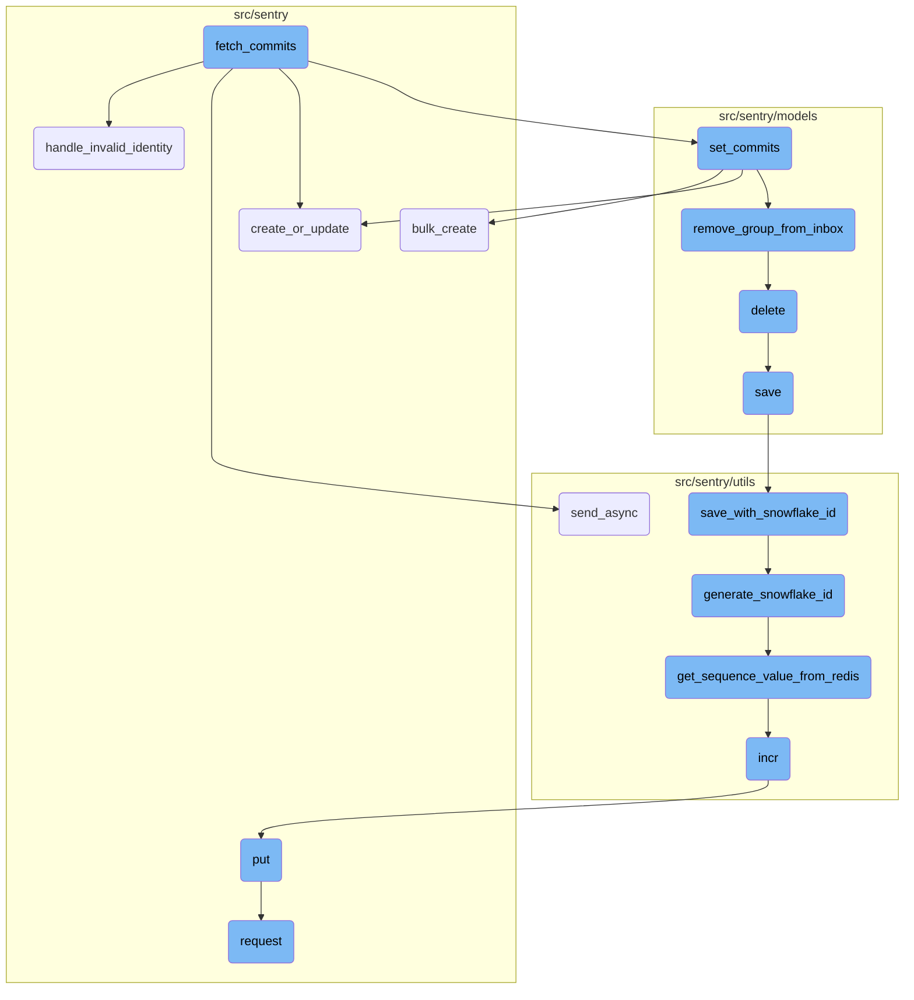
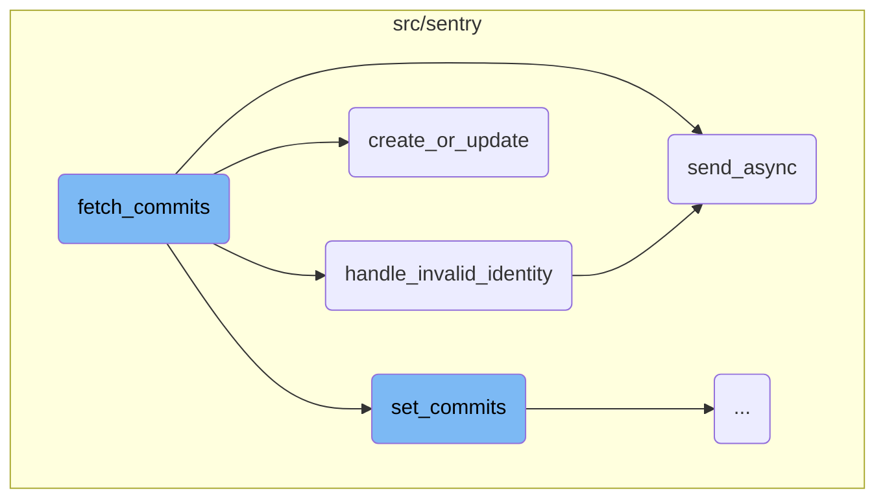
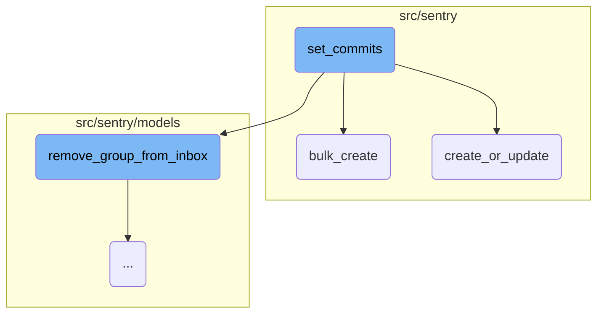

```mermaid
graph TD;
      subgraph src/sentry/models
79037f0d346a0dfdb7052158de2cb4e57b48da307a949ca8dd862880d9a3a1c3(remove_group_from_inbox):::mainFlowStyle --> b48d8e567c3071c40fb0a41cd3b4749edf659e57d1580c2cd7d686738dd2fa86(delete):::mainFlowStyle
end

subgraph src/sentry/models
b48d8e567c3071c40fb0a41cd3b4749edf659e57d1580c2cd7d686738dd2fa86(delete):::mainFlowStyle --> e428c3061e6be3bd5b6c2e853ddbf5de95dd22c84bdedc018937dc5f1548a2c3(save):::mainFlowStyle
end

subgraph src/sentry/utils
e428c3061e6be3bd5b6c2e853ddbf5de95dd22c84bdedc018937dc5f1548a2c3(save):::mainFlowStyle --> 030e147ffbd5089d45f3f5c3cde160cce5267b0806f5be94cc547a79b391d895(save_with_snowflake_id):::mainFlowStyle
end

subgraph src/sentry/utils
030e147ffbd5089d45f3f5c3cde160cce5267b0806f5be94cc547a79b391d895(save_with_snowflake_id):::mainFlowStyle --> 0b4d5d2efa041316eec36438537e6e9380a9cfbb3f3463557ca623bd4da1edd8(generate_snowflake_id):::mainFlowStyle
end

subgraph src/sentry/utils
0b4d5d2efa041316eec36438537e6e9380a9cfbb3f3463557ca623bd4da1edd8(generate_snowflake_id):::mainFlowStyle --> 138a96d4d3b8056e25f811bb93f0cf2580b835c87ccaed0af63c7280f05c19a8(get_sequence_value_from_redis):::mainFlowStyle
end

subgraph src/sentry/utils
138a96d4d3b8056e25f811bb93f0cf2580b835c87ccaed0af63c7280f05c19a8(get_sequence_value_from_redis):::mainFlowStyle --> 411e09b2a8fb05fb965aa689da087a4eb0afb53a22d1a0177a8dfd222ea23bac(incr):::mainFlowStyle
end

subgraph src/sentry/api/client.py
411e09b2a8fb05fb965aa689da087a4eb0afb53a22d1a0177a8dfd222ea23bac(incr):::mainFlowStyle --> 560768831e5caae094d399ce451ab0489318662774e26c007cf59ac610285662(put):::mainFlowStyle
end

subgraph src/sentry/api/client.py
560768831e5caae094d399ce451ab0489318662774e26c007cf59ac610285662(put):::mainFlowStyle --> f9a76a621506843e728c753bbfd65f5dee5fa0fc21993c46938d555bf01dd967(request):::mainFlowStyle
end


      classDef mainFlowStyle color:#000000,fill:#7CB9F4
classDef rootsStyle color:#000000,fill:#00FFF4
classDef Style1 color:#000000,fill:#00FFAA
classDef Style2 color:#000000,fill:#FFFF00
classDef Style3 color:#000000,fill:#AA7CB9

%% Swimm:
%% graph TD;
%%       subgraph <SwmPath>[src/sentry/models/](src/sentry/models/)</SwmPath>
%% 79037f0d346a0dfdb7052158de2cb4e57b48da307a949ca8dd862880d9a3a1c3(remove_group_from_inbox):::mainFlowStyle --> b48d8e567c3071c40fb0a41cd3b4749edf659e57d1580c2cd7d686738dd2fa86(delete):::mainFlowStyle
%% end
%% 
%% subgraph <SwmPath>[src/sentry/models/](src/sentry/models/)</SwmPath>
%% b48d8e567c3071c40fb0a41cd3b4749edf659e57d1580c2cd7d686738dd2fa86(delete):::mainFlowStyle --> e428c3061e6be3bd5b6c2e853ddbf5de95dd22c84bdedc018937dc5f1548a2c3(save):::mainFlowStyle
%% end
%% 
%% subgraph <SwmPath>[src/sentry/utils/](src/sentry/utils/)</SwmPath>
%% e428c3061e6be3bd5b6c2e853ddbf5de95dd22c84bdedc018937dc5f1548a2c3(save):::mainFlowStyle --> 030e147ffbd5089d45f3f5c3cde160cce5267b0806f5be94cc547a79b391d895(save_with_snowflake_id):::mainFlowStyle
%% end
%% 
%% subgraph <SwmPath>[src/sentry/utils/](src/sentry/utils/)</SwmPath>
%% 030e147ffbd5089d45f3f5c3cde160cce5267b0806f5be94cc547a79b391d895(save_with_snowflake_id):::mainFlowStyle --> 0b4d5d2efa041316eec36438537e6e9380a9cfbb3f3463557ca623bd4da1edd8(generate_snowflake_id):::mainFlowStyle
%% end
%% 
%% subgraph <SwmPath>[src/sentry/utils/](src/sentry/utils/)</SwmPath>
%% 0b4d5d2efa041316eec36438537e6e9380a9cfbb3f3463557ca623bd4da1edd8(generate_snowflake_id):::mainFlowStyle --> 138a96d4d3b8056e25f811bb93f0cf2580b835c87ccaed0af63c7280f05c19a8(get_sequence_value_from_redis):::mainFlowStyle
%% end
%% 
%% subgraph <SwmPath>[src/sentry/utils/](src/sentry/utils/)</SwmPath>
%% 138a96d4d3b8056e25f811bb93f0cf2580b835c87ccaed0af63c7280f05c19a8(get_sequence_value_from_redis):::mainFlowStyle --> 411e09b2a8fb05fb965aa689da087a4eb0afb53a22d1a0177a8dfd222ea23bac(incr):::mainFlowStyle
%% end
%% 
%% subgraph <SwmPath>[src/sentry/api/client.py](src/sentry/api/client.py)</SwmPath>
%% 411e09b2a8fb05fb965aa689da087a4eb0afb53a22d1a0177a8dfd222ea23bac(incr):::mainFlowStyle --> 560768831e5caae094d399ce451ab0489318662774e26c007cf59ac610285662(put):::mainFlowStyle
%% end
%% 
%% subgraph <SwmPath>[src/sentry/api/client.py](src/sentry/api/client.py)</SwmPath>
%% 560768831e5caae094d399ce451ab0489318662774e26c007cf59ac610285662(put):::mainFlowStyle --> f9a76a621506843e728c753bbfd65f5dee5fa0fc21993c46938d555bf01dd967(request):::mainFlowStyle
%% end
%% 
%% 
%%       classDef mainFlowStyle color:#000000,fill:#7CB9F4
%% classDef rootsStyle color:#000000,fill:#00FFF4
%% classDef Style1 color:#000000,fill:#00FFAA
%% classDef Style2 color:#000000,fill:#FFFF00
%% classDef Style3 color:#000000,fill:#AA7CB9
```

This document explains the flow of handling commits, focusing on the key functions involved in the process. The flow includes fetching commits, handling invalid identities, sending asynchronous emails, creating or updating records, setting commits, bulk creating entries, and more.

The flow starts with fetching commits, which involves retrieving commit data. If an invalid identity is detected, an email is sent to the user, and the invalid identity is deleted. The process continues with creating or updating records to ensure the latest state of data. Commits are then set, which involves sorting and processing the commit list, creating necessary database entries, and updating the release with commit statistics. Bulk creation is used to efficiently insert multiple objects into the database. The flow also includes removing groups from the inbox, deleting projects, saving projects with unique <SwmToken path="src/sentry/hybridcloud/outbox/base.py" pos="105:1:1" line-data="                ids = [i for i, in cursor.fetchall()]">`ids`</SwmToken>, generating unique <SwmToken path="src/sentry/hybridcloud/outbox/base.py" pos="105:1:1" line-data="                ids = [i for i, in cursor.fetchall()]">`ids`</SwmToken>, retrieving sequence values from Redis, incrementing metrics, and making API requests.

Here is a high level diagram of the flow, showing only the most important functions:



# Flow drill down

First, we'll zoom into this section of the flow:



<SwmSnippet path="/src/sentry/tasks/commits.py" line="60">

---

## Handling Invalid Identities

The function <SwmToken path="src/sentry/tasks/commits.py" pos="60:2:2" line-data="def handle_invalid_identity(identity, commit_failure=False):">`handle_invalid_identity`</SwmToken> is responsible for managing cases where an identity is found to be invalid. It sends an email to the user notifying them of the invalid identity and then deletes the identity to prevent further issues.

```python
def handle_invalid_identity(identity, commit_failure=False):
    # email the user
    msg = generate_invalid_identity_email(identity, commit_failure)
    msg.send_async(to=[identity.user.email])

    # now remove the identity, as its invalid
    identity.delete()
```

---

</SwmSnippet>

<SwmSnippet path="/src/sentry/utils/email/message_builder.py" line="232">

---

## Sending Asynchronous Emails

The function <SwmToken path="src/sentry/utils/email/message_builder.py" pos="232:3:3" line-data="    def send_async(">`send_async`</SwmToken> handles the process of sending emails asynchronously. It queues the email to be sent and logs the action. This function is crucial for ensuring that email notifications are sent without blocking the main execution flow.

```python
    def send_async(
        self,
        to: Iterable[str] | None = None,
        cc: Sequence[str] | None = None,
        bcc: Sequence[str] | None = None,
    ) -> None:
        from sentry.tasks.email import send_email, send_email_control

        fmt = options.get("system.logging-format")
        messages = self.get_built_messages(to, cc=cc, bcc=bcc)
        extra: MutableMapping[str, str | tuple[str]] = {"message_type": self.type}
        loggable = [v for k, v in self.context.items() if hasattr(v, "id")]
        for context in loggable:
            extra[f"{type(context).__name__.lower()}_id"] = context.id

        log_mail_queued = partial(logger.info, "mail.queued", extra=extra)
        for message in messages:
            send_email_task = send_email.delay
            if SiloMode.get_current_mode() == SiloMode.CONTROL:
                send_email_task = send_email_control.delay
            safe_execute(send_email_task, message=message)
```

---

</SwmSnippet>

<SwmSnippet path="/src/sentry/db/models/query.py" line="173">

---

## Creating or Updating Records

The function <SwmToken path="src/sentry/db/models/query.py" pos="173:2:2" line-data="def create_or_update(">`create_or_update`</SwmToken> is used to either update an existing record or create a new one if it does not exist. This is particularly useful for maintaining the latest state of data without having to manually check for the existence of records.

```python
def create_or_update(
    model: type[Model], using: str | None = None, **kwargs: Any
) -> tuple[int, Literal[False]] | tuple[Model, Literal[True]]:
    """
    Similar to get_or_create, either updates a row or creates it.

    In order to determine if the row exists, this searches on all of the kwargs
    besides `values` and `default`.

    If the row exists, it is updated with the data in `values`. If it
    doesn't, it is created with the data in `values`, `defaults`, and the remaining
    kwargs.

    The result will be (rows affected, False) if the row was not created,
    or (instance, True) if the object is new.

    >>> create_or_update(MyModel, key='value', values={
    >>>     'col_name': F('col_name') + 1,
    >>> }, defaults={'created_at': timezone.now()})
    """
    values = kwargs.pop("values", {})
```

---

</SwmSnippet>

Now, lets zoom into this section of the flow:



<SwmSnippet path="/src/sentry/models/release.py" line="655">

---

## Handling Commits

The <SwmToken path="src/sentry/models/release.py" pos="655:3:3" line-data="    def set_commits(self, commit_list):">`set_commits`</SwmToken> function is responsible for binding a list of commits to a release. It first sorts the commit list in reverse order and filters out any commits that should be ignored. It then acquires a lock to ensure that the operation is not performed concurrently. The function deletes any existing commit logs for the release and processes each commit in the list, creating or updating the necessary database entries for authors, repositories, and commits. It also handles the creation of <SwmToken path="src/sentry/models/release.py" pos="673:7:7" line-data="        from sentry.models.releasecommit import ReleaseCommit">`releasecommit`</SwmToken> and <SwmToken path="src/sentry/models/release.py" pos="674:7:7" line-data="        from sentry.models.releaseheadcommit import ReleaseHeadCommit">`releaseheadcommit`</SwmToken> entries, updates the release with commit statistics, and resolves any issues linked to the commits.

```python
    def set_commits(self, commit_list):
        """
        Bind a list of commits to this release.

        This will clear any existing commit log and replace it with the given
        commits.
        """

        # Sort commit list in reverse order
        commit_list.sort(key=lambda commit: commit.get("timestamp", 0), reverse=True)

        # TODO(dcramer): this function could use some cleanup/refactoring as it's a bit unwieldy
        from sentry.integrations.tasks.kick_off_status_syncs import kick_off_status_syncs
        from sentry.models.commit import Commit
        from sentry.models.group import Group, GroupStatus
        from sentry.models.grouplink import GroupLink
        from sentry.models.groupresolution import GroupResolution
        from sentry.models.pullrequest import PullRequest
        from sentry.models.releasecommit import ReleaseCommit
        from sentry.models.releaseheadcommit import ReleaseHeadCommit
        from sentry.models.repository import Repository
```

---

</SwmSnippet>

<SwmSnippet path="/src/sentry/hybridcloud/outbox/base.py" line="88">

---

## Bulk Creation

The <SwmToken path="src/sentry/hybridcloud/outbox/base.py" pos="88:3:3" line-data="    def bulk_create(self, objs: Iterable[_RM], *args: Any, **kwds: Any) -&gt; list[_RM]:">`bulk_create`</SwmToken> function is used to efficiently insert multiple objects into the database. It first converts the input iterable of objects into a tuple and checks if it is empty. If not, it determines the appropriate database to use and ensures that the model does not use snowflake <SwmToken path="src/sentry/hybridcloud/outbox/base.py" pos="105:1:1" line-data="                ids = [i for i, in cursor.fetchall()]">`ids`</SwmToken>. The function then generates new <SwmToken path="src/sentry/hybridcloud/outbox/base.py" pos="105:1:1" line-data="                ids = [i for i, in cursor.fetchall()]">`ids`</SwmToken> for the objects and creates outbox entries for each object. Finally, it performs the bulk creation of the outbox entries and the original objects.

```python
    def bulk_create(self, objs: Iterable[_RM], *args: Any, **kwds: Any) -> list[_RM]:
        from sentry.hybridcloud.models.outbox import outbox_context

        tuple_of_objs: tuple[_RM, ...] = tuple(objs)
        if not tuple_of_objs:
            return super().bulk_create(tuple_of_objs, *args, **kwds)

        model: type[_RM] = type(tuple_of_objs[0])
        using = router.db_for_write(model)

        assert not uses_snowflake_id(model), "bulk_create cannot work for snowflake models!"
        with outbox_context(transaction.atomic(using=using), flush=False):
            with connections[using].cursor() as cursor:
                cursor.execute(
                    "SELECT nextval(%s) FROM generate_series(1,%s);",
                    [f"{model._meta.db_table}_id_seq", len(tuple_of_objs)],
                )
                ids = [i for i, in cursor.fetchall()]

            outboxes: list[RegionOutboxBase] = []
            for row_id, obj in zip(ids, tuple_of_objs):
```

---

</SwmSnippet>

Now, lets zoom into this section of the flow:



<SwmSnippet path="/src/sentry/models/groupinbox.py" line="96">

---

## Removing Group from Inbox

The function <SwmToken path="src/sentry/models/groupinbox.py" pos="96:2:2" line-data="def remove_group_from_inbox(group, action=None, user=None, referrer=None):">`remove_group_from_inbox`</SwmToken> is responsible for removing a group from the inbox. It first attempts to retrieve the <SwmToken path="src/sentry/models/groupinbox.py" pos="98:5:5" line-data="        group_inbox = GroupInbox.objects.get(group=group)">`GroupInbox`</SwmToken> object associated with the given group. If found, it deletes the <SwmToken path="src/sentry/models/groupinbox.py" pos="98:5:5" line-data="        group_inbox = GroupInbox.objects.get(group=group)">`GroupInbox`</SwmToken> object. Additionally, if the action is <SwmToken path="src/sentry/models/groupinbox.py" pos="101:9:9" line-data="        if action is GroupInboxRemoveAction.MARK_REVIEWED and user is not None:">`MARK_REVIEWED`</SwmToken> and a user is provided, it creates an activity record and updates the group's history to reflect that it has been reviewed.

```python
def remove_group_from_inbox(group, action=None, user=None, referrer=None):
    try:
        group_inbox = GroupInbox.objects.get(group=group)
        group_inbox.delete()

        if action is GroupInboxRemoveAction.MARK_REVIEWED and user is not None:
            Activity.objects.create(
                project_id=group_inbox.group.project_id,
                group_id=group_inbox.group_id,
                type=ActivityType.MARK_REVIEWED.value,
                user_id=user.id,
            )
            record_group_history(group, GroupHistoryStatus.REVIEWED, actor=user)
    except GroupInbox.DoesNotExist:
        pass
```

---

</SwmSnippet>

<SwmSnippet path="/src/sentry/models/project.py" line="718">

---

## Deleting Project

The <SwmToken path="src/sentry/models/project.py" pos="718:3:3" line-data="    def delete(self, *args, **kwargs):">`delete`</SwmToken> function in <SwmPath>[src/sentry/models/project.py](src/sentry/models/project.py)</SwmPath> handles the deletion of a project. It manually cascades the deletion to related entities, removes notification settings for the project, and ensures the deletion is performed within a transactional context.

```python
    def delete(self, *args, **kwargs):
        # There is no foreign key relationship so we have to manually cascade.
        notifications_service.remove_notification_settings_for_project(project_id=self.id)

        with outbox_context(transaction.atomic(router.db_for_write(Project))):
            Project.outbox_for_update(self.id, self.organization_id).save()
            return super().delete(*args, **kwargs)
```

---

</SwmSnippet>

<SwmSnippet path="/src/sentry/models/project.py" line="365">

---

## Saving Project

The <SwmToken path="src/sentry/models/project.py" pos="365:3:3" line-data="    def save(self, *args, **kwargs):">`save`</SwmToken> function in <SwmPath>[src/sentry/models/project.py](src/sentry/models/project.py)</SwmPath> ensures that a project has a unique slug before saving. If the project uses Snowflake <SwmToken path="src/sentry/hybridcloud/outbox/base.py" pos="105:1:1" line-data="                ids = [i for i, in cursor.fetchall()]">`ids`</SwmToken>, it delegates the saving process to <SwmToken path="src/sentry/models/project.py" pos="381:1:1" line-data="            save_with_snowflake_id(">`save_with_snowflake_id`</SwmToken>.

```python
    def save(self, *args, **kwargs):
        if not self.slug:
            lock = locks.get(
                f"slug:project:{self.organization_id}", duration=5, name="project_slug"
            )
            with TimedRetryPolicy(10)(lock.acquire):
                slugify_instance(
                    self,
                    self.name,
                    organization=self.organization,
                    reserved=RESERVED_PROJECT_SLUGS,
                    max_length=50,
                )

        if SENTRY_USE_SNOWFLAKE:
            snowflake_redis_key = "project_snowflake_key"
            save_with_snowflake_id(
                instance=self,
                snowflake_redis_key=snowflake_redis_key,
                save_callback=lambda: super(Project, self).save(*args, **kwargs),
            )
```

---

</SwmSnippet>

<SwmSnippet path="/src/sentry/utils/snowflake.py" line="47">

---

### Saving with Snowflake ID

The <SwmToken path="src/sentry/utils/snowflake.py" pos="47:2:2" line-data="def save_with_snowflake_id(">`save_with_snowflake_id`</SwmToken> function ensures that the instance has a unique Snowflake ID before saving. It retries the saving process multiple times in case of integrity errors.

```python
def save_with_snowflake_id(
    instance: BaseModel, snowflake_redis_key: str, save_callback: Callable[[], object]
) -> None:
    assert uses_snowflake_id(
        instance.__class__
    ), "Only models decorated with uses_snowflake_id can be saved with save_with_snowflake_id()"

    for _ in range(settings.MAX_REDIS_SNOWFLAKE_RETRY_COUNTER):
        if not instance.id:
            instance.id = generate_snowflake_id(snowflake_redis_key)
        try:
            with enforce_constraints(transaction.atomic(using=router.db_for_write(type(instance)))):
                save_callback()
            return
        except IntegrityError:
            instance.id = None  # type: ignore[assignment]  # see typeddjango/django-stubs#2014
    raise MaxSnowflakeRetryError
```

---

</SwmSnippet>

<SwmSnippet path="/src/sentry/utils/snowflake.py" line="113">

---

### Generating Snowflake ID

The <SwmToken path="src/sentry/utils/snowflake.py" pos="113:2:2" line-data="def generate_snowflake_id(redis_key: str) -&gt; int:">`generate_snowflake_id`</SwmToken> function generates a unique Snowflake ID based on various segments such as version, region, and timestamp. It ensures the ID is valid and unique.

```python
def generate_snowflake_id(redis_key: str) -> int:
    segment_values = {}

    segment_values[VERSION_ID] = msb_0_ordering(settings.SNOWFLAKE_VERSION_ID, VERSION_ID.length)

    try:
        segment_values[REGION_ID] = get_local_region().snowflake_id
    except RegionContextError:  # expected if running in monolith mode
        segment_values[REGION_ID] = NULL_REGION_ID

    current_time = datetime.now().timestamp()
    # supports up to 130 years
    segment_values[TIME_DIFFERENCE] = int(current_time - settings.SENTRY_SNOWFLAKE_EPOCH_START)

    snowflake_id = 0
    (
        segment_values[TIME_DIFFERENCE],
        segment_values[REGION_SEQUENCE],
    ) = get_sequence_value_from_redis(redis_key, segment_values[TIME_DIFFERENCE])

    for segment in BIT_SEGMENT_SCHEMA:
```

---

</SwmSnippet>

<SwmSnippet path="/src/sentry/utils/snowflake.py" line="148">

---

### Getting Sequence Value from Redis

The <SwmToken path="src/sentry/utils/snowflake.py" pos="148:2:2" line-data="def get_sequence_value_from_redis(redis_key: str, starting_timestamp: int) -&gt; tuple[int, int]:">`get_sequence_value_from_redis`</SwmToken> function retrieves a sequence value from Redis for a given timestamp. It ensures the sequence value is within the allowed range and handles expiration of old values.

```python
def get_sequence_value_from_redis(redis_key: str, starting_timestamp: int) -> tuple[int, int]:
    cluster = get_redis_cluster(redis_key)

    # this is the amount we want to lookback for previous timestamps
    # the below is more of a safety net if starting_timestamp is ever
    # below 5 minutes, then we will change the lookback window accordingly
    time_range = min(starting_timestamp, int(_TTL.total_seconds()))

    for i in range(time_range):
        timestamp = starting_timestamp - i

        # We are decreasing the value by 1 each time since the incr operation in redis
        # initializes the counter at 1. For our region sequences, we want the value to
        # be from 0-15 and not 1-16
        sequence_value = cluster.incr(str(timestamp))
        sequence_value -= 1

        if sequence_value == 0:
            cluster.expire(str(timestamp), int(_TTL.total_seconds()))

        if sequence_value < MAX_AVAILABLE_REGION_SEQUENCES:
```

---

</SwmSnippet>

<SwmSnippet path="/src/sentry/utils/metrics.py" line="98">

---

### Incrementing Metrics

The <SwmToken path="src/sentry/utils/metrics.py" pos="98:3:3" line-data="    def incr(">`incr`</SwmToken> function increments a metric by a specified amount. It queues the increment operation to be processed asynchronously.

```python
    def incr(
        self,
        key: str,
        instance: str | None = None,
        tags: Tags | None = None,
        amount: int = 1,
        sample_rate: float = settings.SENTRY_METRICS_SAMPLE_RATE,
    ) -> None:
        if not self._started:
            self._start()
        self.q.put((key, instance, tags, amount, sample_rate))
```

---

</SwmSnippet>

<SwmSnippet path="/src/sentry/api/client.py" line="119">

---

### Making PUT Request

The <SwmToken path="src/sentry/api/client.py" pos="119:3:3" line-data="    def put(self, *args, **kwargs):">`put`</SwmToken> function in <SwmPath>[src/sentry/api/client.py](src/sentry/api/client.py)</SwmPath> makes a PUT request by delegating to the <SwmToken path="src/sentry/api/client.py" pos="120:5:5" line-data="        return self.request(&quot;PUT&quot;, *args, **kwargs)">`request`</SwmToken> function with the method set to PUT.

```python
    def put(self, *args, **kwargs):
        return self.request("PUT", *args, **kwargs)
```

---

</SwmSnippet>

<SwmSnippet path="/src/sentry/api/client.py" line="32">

---

### Making API Request

The <SwmToken path="src/sentry/api/client.py" pos="32:3:3" line-data="    def request(">`request`</SwmToken> function constructs and sends an API request. It handles authentication, parameter encoding, and response validation.

```python
    def request(
        self,
        method,
        path,
        user=None,
        auth=None,
        params=None,
        data=None,
        is_sudo=None,
        is_superuser=None,
        request=None,
    ):
        if self.prefix not in path:
            full_path = self.prefix + path
        else:
            full_path = path

        # we explicitly do not allow you to override the request *and* the user
        # as then other checks like is_superuser would need overwritten
        assert not (request and (user or auth)), "use either request or auth"

```

---

</SwmSnippet>

&nbsp;

*This is an auto-generated document by Swimm AI 🌊 and has not yet been verified by a human*

<SwmMeta version="3.0.0" repo-id="Z2l0aHViJTNBJTNBc2VudHJ5LWRlbW8tMSUzQSUzQVN3aW1tLURlbW8=" repo-name="sentry-demo-1" doc-type="flows"><sup>Powered by [Swimm](/)</sup></SwmMeta>
