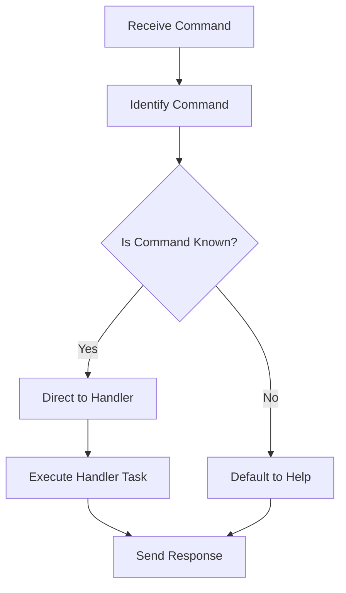

This document will cover the process of handling Discord commands, which includes:

1. Identifying the command
2. Directing it to the appropriate handler
3. Managing the response.

Technical document: <SwmLink doc-title="Handling Discord Commands">[Handling Discord Commands](/.swm/handling-discord-commands.srdioo7b.sw.md)</SwmLink>

# [Identifying the Command](https://app.swimm.io/repos/Z2l0aHViJTNBJTNBc2VudHJ5LWRlbW8tMSUzQSUzQVN3aW1tLURlbW8=/docs/srdioo7b#handling-discord-commands)

When a command is received from Discord, the system first identifies the command name from the request. This step is crucial as it determines the subsequent flow of actions. The command name is extracted and logged for tracking purposes.

# [Directing to the Appropriate Handler](https://app.swimm.io/repos/Z2l0aHViJTNBJTNBc2VudHJ5LWRlbW8tMSUzQSUzQVN3aW1tLURlbW8=/docs/srdioo7b#handling-discord-commands)

Once the command is identified, it is directed to the appropriate handler function. The handlers include `link_user`, `unlink_user`, and `help`. Each handler is responsible for executing specific tasks based on the command. If the command is unknown, the system defaults to the `help` function, ensuring that the user receives guidance on available commands.

# [Managing the Response](https://app.swimm.io/repos/Z2l0aHViJTNBJTNBc2VudHJ5LWRlbW8tMSUzQSUzQVN3aW1tLURlbW8=/docs/srdioo7b#handling-discord-commands)

After the handler function completes its task, a response is sent back to the user. The response management involves constructing a message that informs the user about the outcome of their command. For instance, if a user is linked successfully, a confirmation message is sent. If the command is unknown, a help message is provided. This ensures that users are always informed about the status of their commands and can take appropriate actions.

# [Unlinking a User](https://app.swimm.io/repos/Z2l0aHViJTNBJTNBc2VudHJ5LWRlbW8tMSUzQSUzQVN3aW1tLURlbW8=/docs/srdioo7b#unlinking-a-user)

The `unlink_user` function handles the unlinking of a user from the Discord integration. It first checks if the user has an identity linked. If not, it sends a message indicating that the user is not linked. If the user is linked, it builds an unlinking URL and sends a message with the URL to the user. This ensures that users can easily unlink their accounts if needed.

# [Providing Help](https://app.swimm.io/repos/Z2l0aHViJTNBJTNBc2VudHJ5LWRlbW8tMSUzQSUzQVN3aW1tLURlbW8=/docs/srdioo7b#providing-help)

The `help` function sends a help message to the user. This function is called when the `help` command is received or when an unknown command is encountered. The help message provides users with information on available commands and how to use them, ensuring they can navigate the system effectively.

# [Linking User](https://app.swimm.io/repos/Z2l0aHViJTNBJTNBc2VudHJ5LWRlbW8tMSUzQSUzQVN3aW1tLURlbW8=/docs/srdioo7b#linking-user)

The `link_user` function is responsible for linking a Discord user to the application. It first checks if the user already has an identity linked. If so, it sends a message indicating that the user is already linked. If the required integration or user ID is missing, it logs a warning and sends a message indicating the missing data. Otherwise, it builds a linking URL and sends a message with the link for the user to complete the linking process. This ensures that users can easily link their accounts and start using the integration.

# [Sending Message](https://app.swimm.io/repos/Z2l0aHViJTNBJTNBc2VudHJ5LWRlbW8tMSUzQSUzQVN3aW1tLURlbW8=/docs/srdioo7b#sending-message)

The `send_message` function is used to send a message to the Discord user. It determines the type of response based on whether the message is an update or a new message. If the message is a string, it converts it into a `DiscordMessageBuilder` object and sets it as ephemeral. Finally, it returns a response with the built message data. This ensures that users receive timely and appropriate feedback for their commands.

&nbsp;

*This is an auto-generated document by Swimm AI 🌊 and has not yet been verified by a human*

<SwmMeta version="3.0.0" repo-id="Z2l0aHViJTNBJTNBc2VudHJ5LWRlbW8tMSUzQSUzQVN3aW1tLURlbW8=" repo-name="sentry-demo-1" doc-type="product-flows">Powered by [Swimm](/)</SwmMeta>
