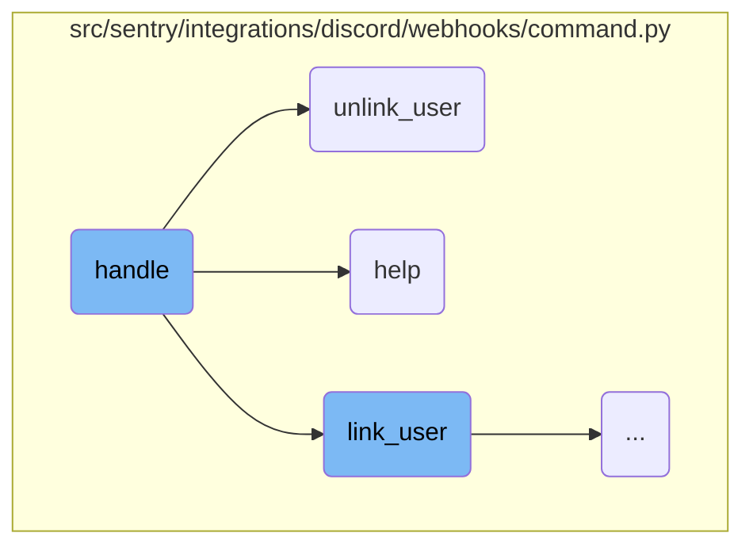

In this document, we will explain the process of handling Discord commands. The process involves identifying the command, directing it to the appropriate handler, and managing the response.

The flow starts with receiving a command from Discord. The <SwmToken path="src/sentry/integrations/discord/webhooks/command.py" pos="38:3:3" line-data="    def handle(self) -&gt; Response:">`handle`</SwmToken> function identifies the command and directs it to the appropriate handler function such as <SwmToken path="src/sentry/integrations/discord/webhooks/command.py" pos="43:5:5" line-data="            return self.link_user()">`link_user`</SwmToken>, <SwmToken path="src/sentry/integrations/discord/webhooks/command.py" pos="45:5:5" line-data="            return self.unlink_user()">`unlink_user`</SwmToken>, or <SwmToken path="src/sentry/integrations/discord/webhooks/command.py" pos="46:9:9" line-data="        elif command_name == DiscordCommandNames.HELP:">`HELP`</SwmToken>. If the command is unknown, it defaults to the <SwmToken path="src/sentry/integrations/discord/webhooks/command.py" pos="46:9:9" line-data="        elif command_name == DiscordCommandNames.HELP:">`HELP`</SwmToken> function. Each handler function then performs its specific task, like linking or unlinking a user, and sends a response back to the user.

Here is a high level diagram of the flow, showing only the most important functions:

```mermaid
graph TD;
      subgraph src/sentry/integrations/discord/webhooks
4c98e353c82760880fdfadab60dff9784d27e81103294b27818e715e014b5249(handle):::mainFlowStyle --> 5e5d6ece4eedafe0efe809a94cb65a2b2e848c79deed91ae6e70358d0b286c44(unlink_user)
end

subgraph src/sentry/integrations/discord/webhooks
4c98e353c82760880fdfadab60dff9784d27e81103294b27818e715e014b5249(handle):::mainFlowStyle --> a366d6291a9257381dfd511a4021f2ce4860d620e5a31eb506eed8879605232f(help)
end

subgraph src/sentry/integrations/discord/webhooks
4c98e353c82760880fdfadab60dff9784d27e81103294b27818e715e014b5249(handle):::mainFlowStyle --> 8945016aaabfe046d3b2265f0e46870d8047330ac01860d7bac3b83d7e8d5b87(link_user):::mainFlowStyle
end

subgraph src/sentry/integrations/discord/webhooks
8945016aaabfe046d3b2265f0e46870d8047330ac01860d7bac3b83d7e8d5b87(link_user):::mainFlowStyle --> 5abb0782c5d50dc9bb2caef009ed5c564204afbedcccbd9f32c823400ee85c55(send_message):::mainFlowStyle
end

subgraph src/sentry/integrations/discord/message_builder/metric_alerts.py
5abb0782c5d50dc9bb2caef009ed5c564204afbedcccbd9f32c823400ee85c55(send_message):::mainFlowStyle --> 1f8306bb1a9d8dbc94ea95d0527252c90482dd9bdd90491a44b6a9a3520ebacb(build):::mainFlowStyle
end

subgraph src/sentry/integrations/metric_alerts.py
1f8306bb1a9d8dbc94ea95d0527252c90482dd9bdd90491a44b6a9a3520ebacb(build):::mainFlowStyle --> 3ee555c81a9fffdaaf4187ef89a239bd2f1a32ed12dcd08bc228cdfdea655eca(metric_alert_attachment_info):::mainFlowStyle
end

subgraph src/sentry/integrations/metric_alerts.py
3ee555c81a9fffdaaf4187ef89a239bd2f1a32ed12dcd08bc228cdfdea655eca(metric_alert_attachment_info):::mainFlowStyle --> 260663063916df0ea3d72ae3c0c9ec154104a071985d9de81a5283f22a186b85(get_metric_count_from_incident):::mainFlowStyle
end

subgraph src/sentry
260663063916df0ea3d72ae3c0c9ec154104a071985d9de81a5283f22a186b85(get_metric_count_from_incident):::mainFlowStyle --> 94dbc6e3afb8bee885412faa44c97543dbcb8401730543f292eec9a3244e3d91(get_incident_aggregates):::mainFlowStyle
end

subgraph src/sentry
94dbc6e3afb8bee885412faa44c97543dbcb8401730543f292eec9a3244e3d91(get_incident_aggregates):::mainFlowStyle --> 0855223e36ac882841bbf2e0ef2fb632f98281c9458dac000c15db12ffb5feef(run_query):::mainFlowStyle
end

subgraph src/sentry
0855223e36ac882841bbf2e0ef2fb632f98281c9458dac000c15db12ffb5feef(run_query):::mainFlowStyle --> bf51ad13267b0a966b2f78892bc9022bf6d0ea51971125b7eca85fe6a433e525(bulk_run_query):::mainFlowStyle
end

subgraph src/sentry
bf51ad13267b0a966b2f78892bc9022bf6d0ea51971125b7eca85fe6a433e525(bulk_run_query):::mainFlowStyle --> afa26eb3bcd732ed408aeef284bae8b24d15a01fc92344a09b40589f8d4801c0(_resolve_metrics_query):::mainFlowStyle
end

subgraph src/sentry
afa26eb3bcd732ed408aeef284bae8b24d15a01fc92344a09b40589f8d4801c0(_resolve_metrics_query):::mainFlowStyle --> 1d3614071269a61836ba62a83fa4234bce0f250a3733a501066af92cf030bc5a(_lookup_indexer_resolve)
end

subgraph src/sentry
afa26eb3bcd732ed408aeef284bae8b24d15a01fc92344a09b40589f8d4801c0(_resolve_metrics_query):::mainFlowStyle --> 6a277fe7c0cc01093d1b577ff3ab42c24481442497f437a04de3caa10040371d(_resolve_query_metadata):::mainFlowStyle
end


      classDef mainFlowStyle color:#000000,fill:#7CB9F4
classDef rootsStyle color:#000000,fill:#00FFF4
classDef Style1 color:#000000,fill:#00FFAA
classDef Style2 color:#000000,fill:#FFFF00
classDef Style3 color:#000000,fill:#AA7CB9

%% Swimm:
%% graph TD;
%%       subgraph <SwmPath>[src/sentry/integrations/discord/webhooks/](src/sentry/integrations/discord/webhooks/)</SwmPath>
%% 4c98e353c82760880fdfadab60dff9784d27e81103294b27818e715e014b5249(handle):::mainFlowStyle --> 5e5d6ece4eedafe0efe809a94cb65a2b2e848c79deed91ae6e70358d0b286c44(unlink_user)
%% end
%% 
%% subgraph <SwmPath>[src/sentry/integrations/discord/webhooks/](src/sentry/integrations/discord/webhooks/)</SwmPath>
%% 4c98e353c82760880fdfadab60dff9784d27e81103294b27818e715e014b5249(handle):::mainFlowStyle --> a366d6291a9257381dfd511a4021f2ce4860d620e5a31eb506eed8879605232f(help)
%% end
%% 
%% subgraph <SwmPath>[src/sentry/integrations/discord/webhooks/](src/sentry/integrations/discord/webhooks/)</SwmPath>
%% 4c98e353c82760880fdfadab60dff9784d27e81103294b27818e715e014b5249(handle):::mainFlowStyle --> 8945016aaabfe046d3b2265f0e46870d8047330ac01860d7bac3b83d7e8d5b87(link_user):::mainFlowStyle
%% end
%% 
%% subgraph <SwmPath>[src/sentry/integrations/discord/webhooks/](src/sentry/integrations/discord/webhooks/)</SwmPath>
%% 8945016aaabfe046d3b2265f0e46870d8047330ac01860d7bac3b83d7e8d5b87(link_user):::mainFlowStyle --> 5abb0782c5d50dc9bb2caef009ed5c564204afbedcccbd9f32c823400ee85c55(send_message):::mainFlowStyle
%% end
%% 
%% subgraph <SwmPath>[src/sentry/integrations/discord/message_builder/metric_alerts.py](src/sentry/integrations/discord/message_builder/metric_alerts.py)</SwmPath>
%% 5abb0782c5d50dc9bb2caef009ed5c564204afbedcccbd9f32c823400ee85c55(send_message):::mainFlowStyle --> 1f8306bb1a9d8dbc94ea95d0527252c90482dd9bdd90491a44b6a9a3520ebacb(build):::mainFlowStyle
%% end
%% 
%% subgraph <SwmPath>[src/sentry/integrations/metric_alerts.py](src/sentry/integrations/metric_alerts.py)</SwmPath>
%% 1f8306bb1a9d8dbc94ea95d0527252c90482dd9bdd90491a44b6a9a3520ebacb(build):::mainFlowStyle --> 3ee555c81a9fffdaaf4187ef89a239bd2f1a32ed12dcd08bc228cdfdea655eca(metric_alert_attachment_info):::mainFlowStyle
%% end
%% 
%% subgraph <SwmPath>[src/sentry/integrations/metric_alerts.py](src/sentry/integrations/metric_alerts.py)</SwmPath>
%% 3ee555c81a9fffdaaf4187ef89a239bd2f1a32ed12dcd08bc228cdfdea655eca(metric_alert_attachment_info):::mainFlowStyle --> 260663063916df0ea3d72ae3c0c9ec154104a071985d9de81a5283f22a186b85(get_metric_count_from_incident):::mainFlowStyle
%% end
%% 
%% subgraph <SwmPath>[src/sentry/](src/sentry/)</SwmPath>
%% 260663063916df0ea3d72ae3c0c9ec154104a071985d9de81a5283f22a186b85(get_metric_count_from_incident):::mainFlowStyle --> 94dbc6e3afb8bee885412faa44c97543dbcb8401730543f292eec9a3244e3d91(get_incident_aggregates):::mainFlowStyle
%% end
%% 
%% subgraph <SwmPath>[src/sentry/](src/sentry/)</SwmPath>
%% 94dbc6e3afb8bee885412faa44c97543dbcb8401730543f292eec9a3244e3d91(get_incident_aggregates):::mainFlowStyle --> 0855223e36ac882841bbf2e0ef2fb632f98281c9458dac000c15db12ffb5feef(run_query):::mainFlowStyle
%% end
%% 
%% subgraph <SwmPath>[src/sentry/](src/sentry/)</SwmPath>
%% 0855223e36ac882841bbf2e0ef2fb632f98281c9458dac000c15db12ffb5feef(run_query):::mainFlowStyle --> bf51ad13267b0a966b2f78892bc9022bf6d0ea51971125b7eca85fe6a433e525(bulk_run_query):::mainFlowStyle
%% end
%% 
%% subgraph <SwmPath>[src/sentry/](src/sentry/)</SwmPath>
%% bf51ad13267b0a966b2f78892bc9022bf6d0ea51971125b7eca85fe6a433e525(bulk_run_query):::mainFlowStyle --> afa26eb3bcd732ed408aeef284bae8b24d15a01fc92344a09b40589f8d4801c0(_resolve_metrics_query):::mainFlowStyle
%% end
%% 
%% subgraph <SwmPath>[src/sentry/](src/sentry/)</SwmPath>
%% afa26eb3bcd732ed408aeef284bae8b24d15a01fc92344a09b40589f8d4801c0(_resolve_metrics_query):::mainFlowStyle --> 1d3614071269a61836ba62a83fa4234bce0f250a3733a501066af92cf030bc5a(_lookup_indexer_resolve)
%% end
%% 
%% subgraph <SwmPath>[src/sentry/](src/sentry/)</SwmPath>
%% afa26eb3bcd732ed408aeef284bae8b24d15a01fc92344a09b40589f8d4801c0(_resolve_metrics_query):::mainFlowStyle --> 6a277fe7c0cc01093d1b577ff3ab42c24481442497f437a04de3caa10040371d(_resolve_query_metadata):::mainFlowStyle
%% end
%% 
%% 
%%       classDef mainFlowStyle color:#000000,fill:#7CB9F4
%% classDef rootsStyle color:#000000,fill:#00FFF4
%% classDef Style1 color:#000000,fill:#00FFAA
%% classDef Style2 color:#000000,fill:#FFFF00
%% classDef Style3 color:#000000,fill:#AA7CB9
```



# Flow drill down

First, we'll zoom into this section of the flow:



<SwmSnippet path="/src/sentry/integrations/discord/webhooks/command.py" line="38">

---

## Handling Discord Commands

The <SwmToken path="src/sentry/integrations/discord/webhooks/command.py" pos="38:3:3" line-data="    def handle(self) -&gt; Response:">`handle`</SwmToken> function is responsible for processing incoming Discord commands. It retrieves the command name from the request and directs the flow to the appropriate handler function (<SwmToken path="src/sentry/integrations/discord/webhooks/command.py" pos="43:5:5" line-data="            return self.link_user()">`link_user`</SwmToken>, <SwmToken path="src/sentry/integrations/discord/webhooks/command.py" pos="45:5:5" line-data="            return self.unlink_user()">`unlink_user`</SwmToken>, or <SwmToken path="src/sentry/integrations/discord/webhooks/command.py" pos="46:9:9" line-data="        elif command_name == DiscordCommandNames.HELP:">`HELP`</SwmToken>) based on the command. If the command is unknown, it logs a warning and defaults to the <SwmToken path="src/sentry/integrations/discord/webhooks/command.py" pos="46:9:9" line-data="        elif command_name == DiscordCommandNames.HELP:">`HELP`</SwmToken> function.

```python
    def handle(self) -> Response:
        command_name = self.request.get_command_name()
        logging_data = self.request.logging_data

        if command_name == DiscordCommandNames.LINK:
            return self.link_user()
        elif command_name == DiscordCommandNames.UNLINK:
            return self.unlink_user()
        elif command_name == DiscordCommandNames.HELP:
            return self.help()

        logger.warning(
            "discord.interaction.command.unknown", extra={"command": command_name, **logging_data}
        )
        return self.help()
```

---

</SwmSnippet>

<SwmSnippet path="/src/sentry/integrations/discord/webhooks/command.py" line="77">

---

### Unlinking a User

The <SwmToken path="src/sentry/integrations/discord/webhooks/command.py" pos="77:3:3" line-data="    def unlink_user(self) -&gt; Response:">`unlink_user`</SwmToken> function handles the unlinking of a user from the Discord integration. It first checks if the user has an identity linked. If not, it sends a message indicating that the user is not linked. If the user is linked, it builds an unlinking URL and sends a message with the URL to the user.

```python
    def unlink_user(self) -> Response:
        if not self.request.has_identity():
            return self.send_message(NOT_LINKED_MESSAGE)

        # if self.request.has_identity() then these must not be None
        assert self.request.integration is not None
        assert self.request.user_id is not None

        unlink_url = build_unlinking_url(
            integration=self.request.integration,
            discord_id=self.request.user_id,
        )

        return self.send_message(UNLINK_USER_MESSAGE.format(url=unlink_url))
```

---

</SwmSnippet>

<SwmSnippet path="/src/sentry/integrations/discord/webhooks/command.py" line="92">

---

### Providing Help

The <SwmToken path="src/sentry/integrations/discord/webhooks/command.py" pos="92:3:3" line-data="    def help(self) -&gt; Response:">`help`</SwmToken> function sends a help message to the user. This function is called when the <SwmToken path="src/sentry/integrations/discord/webhooks/command.py" pos="92:3:3" line-data="    def help(self) -&gt; Response:">`help`</SwmToken> command is received or when an unknown command is encountered.

```python
    def help(self) -> Response:
        return self.send_message(HELP_MESSAGE)
```

---

</SwmSnippet>

Now, lets zoom into this section of the flow:

```mermaid
graph TD;
      subgraph src/sentry/integrations/discord/webhooks
8945016aaabfe046d3b2265f0e46870d8047330ac01860d7bac3b83d7e8d5b87(link_user):::mainFlowStyle --> 5abb0782c5d50dc9bb2caef009ed5c564204afbedcccbd9f32c823400ee85c55(send_message):::mainFlowStyle
end

subgraph src/sentry/integrations/discord/message_builder/metric_alerts.py
5abb0782c5d50dc9bb2caef009ed5c564204afbedcccbd9f32c823400ee85c55(send_message):::mainFlowStyle --> 1f8306bb1a9d8dbc94ea95d0527252c90482dd9bdd90491a44b6a9a3520ebacb(build):::mainFlowStyle
end

subgraph src/sentry/integrations/metric_alerts.py
1f8306bb1a9d8dbc94ea95d0527252c90482dd9bdd90491a44b6a9a3520ebacb(build):::mainFlowStyle --> 3ee555c81a9fffdaaf4187ef89a239bd2f1a32ed12dcd08bc228cdfdea655eca(metric_alert_attachment_info):::mainFlowStyle
end

subgraph src/sentry/integrations/metric_alerts.py
3ee555c81a9fffdaaf4187ef89a239bd2f1a32ed12dcd08bc228cdfdea655eca(metric_alert_attachment_info):::mainFlowStyle --> 260663063916df0ea3d72ae3c0c9ec154104a071985d9de81a5283f22a186b85(get_metric_count_from_incident):::mainFlowStyle
end

subgraph src/sentry
260663063916df0ea3d72ae3c0c9ec154104a071985d9de81a5283f22a186b85(get_metric_count_from_incident):::mainFlowStyle --> 94dbc6e3afb8bee885412faa44c97543dbcb8401730543f292eec9a3244e3d91(get_incident_aggregates):::mainFlowStyle
end

subgraph src/sentry
94dbc6e3afb8bee885412faa44c97543dbcb8401730543f292eec9a3244e3d91(get_incident_aggregates):::mainFlowStyle --> 0855223e36ac882841bbf2e0ef2fb632f98281c9458dac000c15db12ffb5feef(run_query):::mainFlowStyle
end

subgraph src/sentry
0855223e36ac882841bbf2e0ef2fb632f98281c9458dac000c15db12ffb5feef(run_query):::mainFlowStyle --> bf51ad13267b0a966b2f78892bc9022bf6d0ea51971125b7eca85fe6a433e525(bulk_run_query):::mainFlowStyle
end

subgraph src/sentry
bf51ad13267b0a966b2f78892bc9022bf6d0ea51971125b7eca85fe6a433e525(bulk_run_query):::mainFlowStyle --> afa26eb3bcd732ed408aeef284bae8b24d15a01fc92344a09b40589f8d4801c0(_resolve_metrics_query):::mainFlowStyle
end

subgraph src/sentry
afa26eb3bcd732ed408aeef284bae8b24d15a01fc92344a09b40589f8d4801c0(_resolve_metrics_query):::mainFlowStyle --> 1d3614071269a61836ba62a83fa4234bce0f250a3733a501066af92cf030bc5a(_lookup_indexer_resolve)
end

subgraph src/sentry
afa26eb3bcd732ed408aeef284bae8b24d15a01fc92344a09b40589f8d4801c0(_resolve_metrics_query):::mainFlowStyle --> 6a277fe7c0cc01093d1b577ff3ab42c24481442497f437a04de3caa10040371d(_resolve_query_metadata):::mainFlowStyle
end

subgraph src/sentry
1d3614071269a61836ba62a83fa4234bce0f250a3733a501066af92cf030bc5a(_lookup_indexer_resolve) --> 9feba02f7a756e7911be847fa1baa7a3e1cd8bde3767144ba9c172f60dd737d0(_lookup_indexer_resolve_exp)
end


      classDef mainFlowStyle color:#000000,fill:#7CB9F4
classDef rootsStyle color:#000000,fill:#00FFF4
classDef Style1 color:#000000,fill:#00FFAA
classDef Style2 color:#000000,fill:#FFFF00
classDef Style3 color:#000000,fill:#AA7CB9

%% Swimm:
%% graph TD;
%%       subgraph <SwmPath>[src/sentry/integrations/discord/webhooks/](src/sentry/integrations/discord/webhooks/)</SwmPath>
%% 8945016aaabfe046d3b2265f0e46870d8047330ac01860d7bac3b83d7e8d5b87(link_user):::mainFlowStyle --> 5abb0782c5d50dc9bb2caef009ed5c564204afbedcccbd9f32c823400ee85c55(send_message):::mainFlowStyle
%% end
%% 
%% subgraph <SwmPath>[src/sentry/integrations/discord/message_builder/metric_alerts.py](src/sentry/integrations/discord/message_builder/metric_alerts.py)</SwmPath>
%% 5abb0782c5d50dc9bb2caef009ed5c564204afbedcccbd9f32c823400ee85c55(send_message):::mainFlowStyle --> 1f8306bb1a9d8dbc94ea95d0527252c90482dd9bdd90491a44b6a9a3520ebacb(build):::mainFlowStyle
%% end
%% 
%% subgraph <SwmPath>[src/sentry/integrations/metric_alerts.py](src/sentry/integrations/metric_alerts.py)</SwmPath>
%% 1f8306bb1a9d8dbc94ea95d0527252c90482dd9bdd90491a44b6a9a3520ebacb(build):::mainFlowStyle --> 3ee555c81a9fffdaaf4187ef89a239bd2f1a32ed12dcd08bc228cdfdea655eca(metric_alert_attachment_info):::mainFlowStyle
%% end
%% 
%% subgraph <SwmPath>[src/sentry/integrations/metric_alerts.py](src/sentry/integrations/metric_alerts.py)</SwmPath>
%% 3ee555c81a9fffdaaf4187ef89a239bd2f1a32ed12dcd08bc228cdfdea655eca(metric_alert_attachment_info):::mainFlowStyle --> 260663063916df0ea3d72ae3c0c9ec154104a071985d9de81a5283f22a186b85(get_metric_count_from_incident):::mainFlowStyle
%% end
%% 
%% subgraph <SwmPath>[src/sentry/](src/sentry/)</SwmPath>
%% 260663063916df0ea3d72ae3c0c9ec154104a071985d9de81a5283f22a186b85(get_metric_count_from_incident):::mainFlowStyle --> 94dbc6e3afb8bee885412faa44c97543dbcb8401730543f292eec9a3244e3d91(get_incident_aggregates):::mainFlowStyle
%% end
%% 
%% subgraph <SwmPath>[src/sentry/](src/sentry/)</SwmPath>
%% 94dbc6e3afb8bee885412faa44c97543dbcb8401730543f292eec9a3244e3d91(get_incident_aggregates):::mainFlowStyle --> 0855223e36ac882841bbf2e0ef2fb632f98281c9458dac000c15db12ffb5feef(run_query):::mainFlowStyle
%% end
%% 
%% subgraph <SwmPath>[src/sentry/](src/sentry/)</SwmPath>
%% 0855223e36ac882841bbf2e0ef2fb632f98281c9458dac000c15db12ffb5feef(run_query):::mainFlowStyle --> bf51ad13267b0a966b2f78892bc9022bf6d0ea51971125b7eca85fe6a433e525(bulk_run_query):::mainFlowStyle
%% end
%% 
%% subgraph <SwmPath>[src/sentry/](src/sentry/)</SwmPath>
%% bf51ad13267b0a966b2f78892bc9022bf6d0ea51971125b7eca85fe6a433e525(bulk_run_query):::mainFlowStyle --> afa26eb3bcd732ed408aeef284bae8b24d15a01fc92344a09b40589f8d4801c0(_resolve_metrics_query):::mainFlowStyle
%% end
%% 
%% subgraph <SwmPath>[src/sentry/](src/sentry/)</SwmPath>
%% afa26eb3bcd732ed408aeef284bae8b24d15a01fc92344a09b40589f8d4801c0(_resolve_metrics_query):::mainFlowStyle --> 1d3614071269a61836ba62a83fa4234bce0f250a3733a501066af92cf030bc5a(_lookup_indexer_resolve)
%% end
%% 
%% subgraph <SwmPath>[src/sentry/](src/sentry/)</SwmPath>
%% afa26eb3bcd732ed408aeef284bae8b24d15a01fc92344a09b40589f8d4801c0(_resolve_metrics_query):::mainFlowStyle --> 6a277fe7c0cc01093d1b577ff3ab42c24481442497f437a04de3caa10040371d(_resolve_query_metadata):::mainFlowStyle
%% end
%% 
%% subgraph <SwmPath>[src/sentry/](src/sentry/)</SwmPath>
%% 1d3614071269a61836ba62a83fa4234bce0f250a3733a501066af92cf030bc5a(_lookup_indexer_resolve) --> 9feba02f7a756e7911be847fa1baa7a3e1cd8bde3767144ba9c172f60dd737d0(_lookup_indexer_resolve_exp)
%% end
%% 
%% 
%%       classDef mainFlowStyle color:#000000,fill:#7CB9F4
%% classDef rootsStyle color:#000000,fill:#00FFF4
%% classDef Style1 color:#000000,fill:#00FFAA
%% classDef Style2 color:#000000,fill:#FFFF00
%% classDef Style3 color:#000000,fill:#AA7CB9
```



<SwmSnippet path="/src/sentry/integrations/discord/webhooks/command.py" line="55">

---

## Linking User

The <SwmToken path="src/sentry/integrations/discord/webhooks/command.py" pos="43:5:5" line-data="            return self.link_user()">`link_user`</SwmToken> function is responsible for linking a Discord user to the application. It first checks if the user already has an identity linked. If so, it sends a message indicating that the user is already linked. If the required integration or user ID is missing, it logs a warning and sends a message indicating the missing data. Otherwise, it builds a linking URL and sends a message with the link for the user to complete the linking process.

```python
        if self.request.has_identity():
            return self.send_message(
                ALREADY_LINKED_MESSAGE.format(email=self.request.get_identity_str())
            )

        if not self.request.integration or not self.request.user_id:
            logger.warning(
                "discord.interaction.command.missing.integration",
                extra={
                    "hasIntegration": bool(self.request.integration),
                    "hasUserId": self.request.user_id,
                },
            )
            return self.send_message(MISSING_DATA_MESSAGE)

        link_url = build_linking_url(
            integration=self.request.integration,
            discord_id=self.request.user_id,
        )

        return self.send_message(LINK_USER_MESSAGE.format(url=link_url))
```

---

</SwmSnippet>

<SwmSnippet path="/src/sentry/integrations/discord/webhooks/handler.py" line="24">

---

### Sending Message

The <SwmToken path="src/sentry/integrations/discord/webhooks/handler.py" pos="24:3:3" line-data="    def send_message(self, message: str | DiscordMessageBuilder, update: bool = False) -&gt; Response:">`send_message`</SwmToken> function is used to send a message to the Discord user. It determines the type of response based on whether the message is an update or a new message. If the message is a string, it converts it into a <SwmToken path="src/sentry/integrations/discord/webhooks/handler.py" pos="24:15:15" line-data="    def send_message(self, message: str | DiscordMessageBuilder, update: bool = False) -&gt; Response:">`DiscordMessageBuilder`</SwmToken> object and sets it as ephemeral. Finally, it returns a response with the built message data.

```python
    def send_message(self, message: str | DiscordMessageBuilder, update: bool = False) -> Response:
        """Sends a new follow up message."""
        response_type = DiscordResponseTypes.UPDATE if update else DiscordResponseTypes.MESSAGE

        if isinstance(message, str):
            message = DiscordMessageBuilder(
                content=message, flags=DiscordMessageFlags().set_ephemeral()
            )
        return Response(
            {
                "type": response_type,
                "data": message.build(),
            },
            status=200,
        )
```

---

</SwmSnippet>

&nbsp;

*This is an auto-generated document by Swimm AI 🌊 and has not yet been verified by a human*

<SwmMeta version="3.0.0" repo-id="Z2l0aHViJTNBJTNBc2VudHJ5LWRlbW8tMSUzQSUzQVN3aW1tLURlbW8=" repo-name="sentry-demo-1" doc-type="flows"><sup>Powered by [Swimm](/)</sup></SwmMeta>
