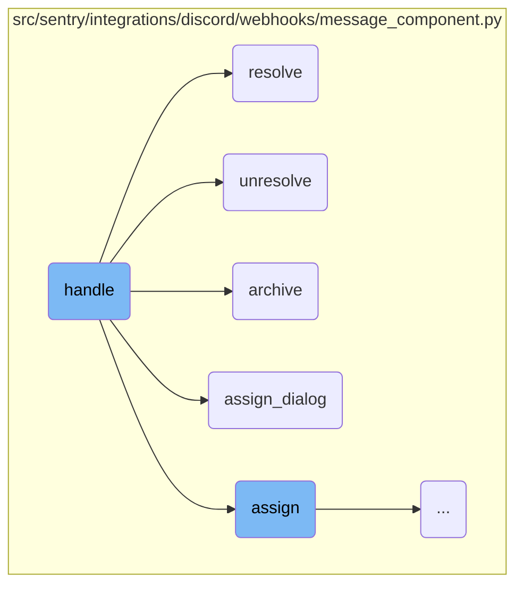

This document explains how the <SwmToken path="src/sentry/integrations/discord/webhooks/message_component.py" pos="70:3:3" line-data="    def handle(self) -&gt; Response:">`handle`</SwmToken> function processes incoming Discord interactions. It covers the initial authentication checks, routing based on interaction types, and the subsequent handling of different interaction types such as resolving, unresolving, archiving, and assigning issues.

When a Discord interaction comes in, the <SwmToken path="src/sentry/integrations/discord/webhooks/message_component.py" pos="70:3:3" line-data="    def handle(self) -&gt; Response:">`handle`</SwmToken> function first checks if the user is authenticated and if the group ID is valid. Depending on the type of interaction, it routes the request to the appropriate handler. For example, if the interaction is to resolve an issue, it updates the issue status to resolved and sends a confirmation message. Similarly, it can unresolve, archive, or assign issues based on the interaction type.

Here is a high level diagram of the flow, showing only the most important functions:

```mermaid
graph TD;
      subgraph src/sentry/integrations/discord/webhooks
b300f49459c51c97888368f92b31c87e0d42d4c171e4444b1365f179855dcd3e(handle):::mainFlowStyle --> 891fab5491e5251815d0354548b3c4fd1825c82b69e036c9f9cc30c3da1f4772(resolve)
end

subgraph src/sentry/integrations/discord/webhooks
b300f49459c51c97888368f92b31c87e0d42d4c171e4444b1365f179855dcd3e(handle):::mainFlowStyle --> c67e422f45cbc4ee59df0a566f36953078e6b08409ffc1e3998d20311aad2b71(unresolve)
end

subgraph src/sentry/integrations/discord/webhooks
b300f49459c51c97888368f92b31c87e0d42d4c171e4444b1365f179855dcd3e(handle):::mainFlowStyle --> 7b987fb9c40dcb300a866527a91f67a24c72c7ad437bc8c1dd90155ceb886cdf(archive)
end

subgraph src/sentry/integrations/discord/webhooks
b300f49459c51c97888368f92b31c87e0d42d4c171e4444b1365f179855dcd3e(handle):::mainFlowStyle --> 05f29eaba921e1e30bafb00cacedc3bf849a456841556614a59fadea46a078a3(assign_dialog)
end

subgraph src/sentry/integrations/discord/webhooks
b300f49459c51c97888368f92b31c87e0d42d4c171e4444b1365f179855dcd3e(handle):::mainFlowStyle --> 56621b0838f35e2e3d298b3ec08199d7d5798cf4ceebb767aed231b8ab67c192(assign):::mainFlowStyle
end

subgraph src/sentry/integrations/discord/webhooks
56621b0838f35e2e3d298b3ec08199d7d5798cf4ceebb767aed231b8ab67c192(assign):::mainFlowStyle --> 5abb0782c5d50dc9bb2caef009ed5c564204afbedcccbd9f32c823400ee85c55(send_message):::mainFlowStyle
end

subgraph src/sentry/integrations/discord/message_builder/metric_alerts.py
5abb0782c5d50dc9bb2caef009ed5c564204afbedcccbd9f32c823400ee85c55(send_message):::mainFlowStyle --> 1f8306bb1a9d8dbc94ea95d0527252c90482dd9bdd90491a44b6a9a3520ebacb(build):::mainFlowStyle
end

subgraph src/sentry/integrations/metric_alerts.py
1f8306bb1a9d8dbc94ea95d0527252c90482dd9bdd90491a44b6a9a3520ebacb(build):::mainFlowStyle --> 3ee555c81a9fffdaaf4187ef89a239bd2f1a32ed12dcd08bc228cdfdea655eca(metric_alert_attachment_info):::mainFlowStyle
end

subgraph src/sentry/integrations/metric_alerts.py
3ee555c81a9fffdaaf4187ef89a239bd2f1a32ed12dcd08bc228cdfdea655eca(metric_alert_attachment_info):::mainFlowStyle --> 260663063916df0ea3d72ae3c0c9ec154104a071985d9de81a5283f22a186b85(get_metric_count_from_incident):::mainFlowStyle
end

subgraph src/sentry
260663063916df0ea3d72ae3c0c9ec154104a071985d9de81a5283f22a186b85(get_metric_count_from_incident):::mainFlowStyle --> 94dbc6e3afb8bee885412faa44c97543dbcb8401730543f292eec9a3244e3d91(get_incident_aggregates):::mainFlowStyle
end

subgraph src/sentry
94dbc6e3afb8bee885412faa44c97543dbcb8401730543f292eec9a3244e3d91(get_incident_aggregates):::mainFlowStyle --> 0855223e36ac882841bbf2e0ef2fb632f98281c9458dac000c15db12ffb5feef(run_query):::mainFlowStyle
end

subgraph src/sentry
0855223e36ac882841bbf2e0ef2fb632f98281c9458dac000c15db12ffb5feef(run_query):::mainFlowStyle --> bf51ad13267b0a966b2f78892bc9022bf6d0ea51971125b7eca85fe6a433e525(bulk_run_query):::mainFlowStyle
end

subgraph src/sentry
bf51ad13267b0a966b2f78892bc9022bf6d0ea51971125b7eca85fe6a433e525(bulk_run_query):::mainFlowStyle --> afa26eb3bcd732ed408aeef284bae8b24d15a01fc92344a09b40589f8d4801c0(_resolve_metrics_query):::mainFlowStyle
end


      classDef mainFlowStyle color:#000000,fill:#7CB9F4
classDef rootsStyle color:#000000,fill:#00FFF4
classDef Style1 color:#000000,fill:#00FFAA
classDef Style2 color:#000000,fill:#FFFF00
classDef Style3 color:#000000,fill:#AA7CB9

%% Swimm:
%% graph TD;
%%       subgraph <SwmPath>[src/sentry/integrations/discord/webhooks/](src/sentry/integrations/discord/webhooks/)</SwmPath>
%% b300f49459c51c97888368f92b31c87e0d42d4c171e4444b1365f179855dcd3e(handle):::mainFlowStyle --> 891fab5491e5251815d0354548b3c4fd1825c82b69e036c9f9cc30c3da1f4772(resolve)
%% end
%% 
%% subgraph <SwmPath>[src/sentry/integrations/discord/webhooks/](src/sentry/integrations/discord/webhooks/)</SwmPath>
%% b300f49459c51c97888368f92b31c87e0d42d4c171e4444b1365f179855dcd3e(handle):::mainFlowStyle --> c67e422f45cbc4ee59df0a566f36953078e6b08409ffc1e3998d20311aad2b71(unresolve)
%% end
%% 
%% subgraph <SwmPath>[src/sentry/integrations/discord/webhooks/](src/sentry/integrations/discord/webhooks/)</SwmPath>
%% b300f49459c51c97888368f92b31c87e0d42d4c171e4444b1365f179855dcd3e(handle):::mainFlowStyle --> 7b987fb9c40dcb300a866527a91f67a24c72c7ad437bc8c1dd90155ceb886cdf(archive)
%% end
%% 
%% subgraph <SwmPath>[src/sentry/integrations/discord/webhooks/](src/sentry/integrations/discord/webhooks/)</SwmPath>
%% b300f49459c51c97888368f92b31c87e0d42d4c171e4444b1365f179855dcd3e(handle):::mainFlowStyle --> 05f29eaba921e1e30bafb00cacedc3bf849a456841556614a59fadea46a078a3(assign_dialog)
%% end
%% 
%% subgraph <SwmPath>[src/sentry/integrations/discord/webhooks/](src/sentry/integrations/discord/webhooks/)</SwmPath>
%% b300f49459c51c97888368f92b31c87e0d42d4c171e4444b1365f179855dcd3e(handle):::mainFlowStyle --> 56621b0838f35e2e3d298b3ec08199d7d5798cf4ceebb767aed231b8ab67c192(assign):::mainFlowStyle
%% end
%% 
%% subgraph <SwmPath>[src/sentry/integrations/discord/webhooks/](src/sentry/integrations/discord/webhooks/)</SwmPath>
%% 56621b0838f35e2e3d298b3ec08199d7d5798cf4ceebb767aed231b8ab67c192(assign):::mainFlowStyle --> 5abb0782c5d50dc9bb2caef009ed5c564204afbedcccbd9f32c823400ee85c55(send_message):::mainFlowStyle
%% end
%% 
%% subgraph <SwmPath>[src/sentry/integrations/discord/message_builder/metric_alerts.py](src/sentry/integrations/discord/message_builder/metric_alerts.py)</SwmPath>
%% 5abb0782c5d50dc9bb2caef009ed5c564204afbedcccbd9f32c823400ee85c55(send_message):::mainFlowStyle --> 1f8306bb1a9d8dbc94ea95d0527252c90482dd9bdd90491a44b6a9a3520ebacb(build):::mainFlowStyle
%% end
%% 
%% subgraph <SwmPath>[src/sentry/integrations/metric_alerts.py](src/sentry/integrations/metric_alerts.py)</SwmPath>
%% 1f8306bb1a9d8dbc94ea95d0527252c90482dd9bdd90491a44b6a9a3520ebacb(build):::mainFlowStyle --> 3ee555c81a9fffdaaf4187ef89a239bd2f1a32ed12dcd08bc228cdfdea655eca(metric_alert_attachment_info):::mainFlowStyle
%% end
%% 
%% subgraph <SwmPath>[src/sentry/integrations/metric_alerts.py](src/sentry/integrations/metric_alerts.py)</SwmPath>
%% 3ee555c81a9fffdaaf4187ef89a239bd2f1a32ed12dcd08bc228cdfdea655eca(metric_alert_attachment_info):::mainFlowStyle --> 260663063916df0ea3d72ae3c0c9ec154104a071985d9de81a5283f22a186b85(get_metric_count_from_incident):::mainFlowStyle
%% end
%% 
%% subgraph <SwmPath>[src/sentry/](src/sentry/)</SwmPath>
%% 260663063916df0ea3d72ae3c0c9ec154104a071985d9de81a5283f22a186b85(get_metric_count_from_incident):::mainFlowStyle --> 94dbc6e3afb8bee885412faa44c97543dbcb8401730543f292eec9a3244e3d91(get_incident_aggregates):::mainFlowStyle
%% end
%% 
%% subgraph <SwmPath>[src/sentry/](src/sentry/)</SwmPath>
%% 94dbc6e3afb8bee885412faa44c97543dbcb8401730543f292eec9a3244e3d91(get_incident_aggregates):::mainFlowStyle --> 0855223e36ac882841bbf2e0ef2fb632f98281c9458dac000c15db12ffb5feef(run_query):::mainFlowStyle
%% end
%% 
%% subgraph <SwmPath>[src/sentry/](src/sentry/)</SwmPath>
%% 0855223e36ac882841bbf2e0ef2fb632f98281c9458dac000c15db12ffb5feef(run_query):::mainFlowStyle --> bf51ad13267b0a966b2f78892bc9022bf6d0ea51971125b7eca85fe6a433e525(bulk_run_query):::mainFlowStyle
%% end
%% 
%% subgraph <SwmPath>[src/sentry/](src/sentry/)</SwmPath>
%% bf51ad13267b0a966b2f78892bc9022bf6d0ea51971125b7eca85fe6a433e525(bulk_run_query):::mainFlowStyle --> afa26eb3bcd732ed408aeef284bae8b24d15a01fc92344a09b40589f8d4801c0(_resolve_metrics_query):::mainFlowStyle
%% end
%% 
%% 
%%       classDef mainFlowStyle color:#000000,fill:#7CB9F4
%% classDef rootsStyle color:#000000,fill:#00FFF4
%% classDef Style1 color:#000000,fill:#00FFAA
%% classDef Style2 color:#000000,fill:#FFFF00
%% classDef Style3 color:#000000,fill:#AA7CB9
```



# Flow drill down

First, we'll zoom into this section of the flow:



<SwmSnippet path="/src/sentry/integrations/discord/webhooks/message_component.py" line="70">

---

## Handling Discord interactions

The <SwmToken path="src/sentry/integrations/discord/webhooks/message_component.py" pos="70:3:3" line-data="    def handle(self) -&gt; Response:">`handle`</SwmToken> function processes incoming Discord interactions. It first checks if the user is authenticated and if the group ID is valid. Depending on the <SwmToken path="src/sentry/integrations/discord/webhooks/message_component.py" pos="88:5:5" line-data="        if self.custom_id.startswith(CustomIds.ASSIGN_DIALOG):">`custom_id`</SwmToken> of the interaction, it routes the request to the appropriate handler function such as <SwmToken path="src/sentry/integrations/discord/webhooks/message_component.py" pos="88:11:11" line-data="        if self.custom_id.startswith(CustomIds.ASSIGN_DIALOG):">`ASSIGN_DIALOG`</SwmToken>, <SwmToken path="src/sentry/integrations/discord/webhooks/message_component.py" pos="127:8:8" line-data="            custom_id=f&quot;{CustomIds.ASSIGN}:{self.group_id}&quot;,">`ASSIGN`</SwmToken>, <SwmToken path="src/sentry/integrations/discord/webhooks/message_component.py" pos="180:3:3" line-data="    def resolve(self) -&gt; Response:">`resolve`</SwmToken>, <SwmToken path="src/sentry/integrations/discord/webhooks/message_component.py" pos="200:3:3" line-data="    def unresolve(self, from_mark_ongoing: bool = False) -&gt; Response:">`unresolve`</SwmToken>, or <SwmToken path="src/sentry/integrations/discord/webhooks/message_component.py" pos="212:3:3" line-data="    def archive(self) -&gt; Response:">`archive`</SwmToken>.

```python
    def handle(self) -> Response:
        logging_data = self.request.logging_data

        if self.request.user is None:
            logger.warning("discord.interaction.component.not_linked", extra={**logging_data})
            return self.send_message(NO_IDENTITY)
        self.user = self.request.user

        if (not self.group_id) or (not self.group):
            return self.send_message(INVALID_GROUP_ID)

        if not self.group.organization.has_access(self.user):
            logger.warning(
                "discord.interaction.component.not_in_org",
                extra={"org_slug": self.group.organization.slug, **logging_data},
            )
            return self.send_message(NOT_IN_ORG)

        if self.custom_id.startswith(CustomIds.ASSIGN_DIALOG):
            logger.info("discord.interaction.component.assign_dialog", extra={**logging_data})
            return self.assign_dialog()
```

---

</SwmSnippet>

<SwmSnippet path="/src/sentry/integrations/discord/webhooks/message_component.py" line="180">

---

### Resolving issues

The <SwmToken path="src/sentry/integrations/discord/webhooks/message_component.py" pos="180:3:3" line-data="    def resolve(self) -&gt; Response:">`resolve`</SwmToken> function updates the status of an issue to resolved. It checks if the resolution is for the next release or the current release and updates the status details accordingly. Finally, it sends a message indicating the issue has been resolved.

```python
    def resolve(self) -> Response:
        status: dict[str, object] = {
            "status": STATUS_TO_STRING_LOOKUP[GroupHistoryStatus.RESOLVED],
        }
        message = RESOLVED

        selected_option = ""
        if self.request.is_select_component():
            selected_option = self.request.get_selected_options()[0]

        if selected_option == "inNextRelease":
            status["statusDetails"] = {"inNextRelease": True}
            message = RESOLVED_IN_NEXT_RELEASE
        elif selected_option == "inCurrentRelease":
            status["statusDetails"] = {"inRelease": "latest"}
            message = RESOLVED_IN_CURRENT_RELEASE

        self.update_group(status)
        return self.send_message(message, update=self.request.is_select_component())
```

---

</SwmSnippet>

<SwmSnippet path="/src/sentry/integrations/discord/webhooks/message_component.py" line="200">

---

### Unresolving issues

The <SwmToken path="src/sentry/integrations/discord/webhooks/message_component.py" pos="200:3:3" line-data="    def unresolve(self, from_mark_ongoing: bool = False) -&gt; Response:">`unresolve`</SwmToken> function changes the status of an issue to unresolved. If the issue is being marked as ongoing, it sends a message indicating this; otherwise, it sends a message indicating the issue has been unresolved.

```python
    def unresolve(self, from_mark_ongoing: bool = False) -> Response:
        self.update_group(
            {
                "status": STATUS_TO_STRING_LOOKUP[GroupHistoryStatus.UNRESOLVED],
                "substatus": SUBSTATUS_TO_STR[GroupSubStatus.ONGOING],
            }
        )

        if from_mark_ongoing:
            return self.send_message(MARKED_ONGOING)
        return self.send_message(UNRESOLVED)
```

---

</SwmSnippet>

<SwmSnippet path="/src/sentry/integrations/discord/webhooks/message_component.py" line="212">

---

### Archiving issues

The <SwmToken path="src/sentry/integrations/discord/webhooks/message_component.py" pos="212:3:3" line-data="    def archive(self) -&gt; Response:">`archive`</SwmToken> function updates the status of an issue to ignored and sets the substatus to 'until escalating'. It then sends a message indicating the issue has been archived until it escalates.

```python
    def archive(self) -> Response:
        self.update_group(
            {
                "status": STATUS_TO_STRING_LOOKUP[GroupHistoryStatus.IGNORED],
                "substatus": SUBSTATUS_TO_STR[GroupSubStatus.UNTIL_ESCALATING],
            }
        )
        return self.send_message(ARCHIVE_UNTIL_ESCALATES)
```

---

</SwmSnippet>

<SwmSnippet path="/src/sentry/integrations/discord/webhooks/message_component.py" line="122">

---

### Assigning issues

The <SwmToken path="src/sentry/integrations/discord/webhooks/message_component.py" pos="122:3:3" line-data="    def assign_dialog(self) -&gt; Response:">`assign_dialog`</SwmToken> function creates a dialog for assigning an issue to a user. It builds a Discord select menu with options for assignees and sends this as a message.

```python
    def assign_dialog(self) -> Response:
        if (not self.group_id) or (not self.group):
            return self.send_message(INVALID_GROUP_ID)

        assign_selector = DiscordSelectMenu(
            custom_id=f"{CustomIds.ASSIGN}:{self.group_id}",
            placeholder="Select Assignee...",
            options=get_assign_selector_options(self.group),
        )
        message = DiscordMessageBuilder(
            components=[DiscordActionRow([assign_selector])],
            flags=DiscordMessageFlags().set_ephemeral(),
        )
        return self.send_message(message)
```

---

</SwmSnippet>

Now, lets zoom into this section of the flow:

```mermaid
graph TD;
      subgraph src/sentry/integrations/discord/webhooks
56621b0838f35e2e3d298b3ec08199d7d5798cf4ceebb767aed231b8ab67c192(assign):::mainFlowStyle --> 5abb0782c5d50dc9bb2caef009ed5c564204afbedcccbd9f32c823400ee85c55(send_message):::mainFlowStyle
end

subgraph src/sentry/integrations/discord/message_builder/metric_alerts.py
5abb0782c5d50dc9bb2caef009ed5c564204afbedcccbd9f32c823400ee85c55(send_message):::mainFlowStyle --> 1f8306bb1a9d8dbc94ea95d0527252c90482dd9bdd90491a44b6a9a3520ebacb(build):::mainFlowStyle
end

subgraph src/sentry/integrations/metric_alerts.py
1f8306bb1a9d8dbc94ea95d0527252c90482dd9bdd90491a44b6a9a3520ebacb(build):::mainFlowStyle --> 3ee555c81a9fffdaaf4187ef89a239bd2f1a32ed12dcd08bc228cdfdea655eca(metric_alert_attachment_info):::mainFlowStyle
end

subgraph src/sentry/integrations/metric_alerts.py
3ee555c81a9fffdaaf4187ef89a239bd2f1a32ed12dcd08bc228cdfdea655eca(metric_alert_attachment_info):::mainFlowStyle --> 260663063916df0ea3d72ae3c0c9ec154104a071985d9de81a5283f22a186b85(get_metric_count_from_incident):::mainFlowStyle
end

subgraph src/sentry
260663063916df0ea3d72ae3c0c9ec154104a071985d9de81a5283f22a186b85(get_metric_count_from_incident):::mainFlowStyle --> 94dbc6e3afb8bee885412faa44c97543dbcb8401730543f292eec9a3244e3d91(get_incident_aggregates):::mainFlowStyle
end

subgraph src/sentry
94dbc6e3afb8bee885412faa44c97543dbcb8401730543f292eec9a3244e3d91(get_incident_aggregates):::mainFlowStyle --> 0855223e36ac882841bbf2e0ef2fb632f98281c9458dac000c15db12ffb5feef(run_query):::mainFlowStyle
end

subgraph src/sentry
0855223e36ac882841bbf2e0ef2fb632f98281c9458dac000c15db12ffb5feef(run_query):::mainFlowStyle --> bf51ad13267b0a966b2f78892bc9022bf6d0ea51971125b7eca85fe6a433e525(bulk_run_query):::mainFlowStyle
end

subgraph src/sentry
bf51ad13267b0a966b2f78892bc9022bf6d0ea51971125b7eca85fe6a433e525(bulk_run_query):::mainFlowStyle --> afa26eb3bcd732ed408aeef284bae8b24d15a01fc92344a09b40589f8d4801c0(_resolve_metrics_query):::mainFlowStyle
end


      classDef mainFlowStyle color:#000000,fill:#7CB9F4
classDef rootsStyle color:#000000,fill:#00FFF4
classDef Style1 color:#000000,fill:#00FFAA
classDef Style2 color:#000000,fill:#FFFF00
classDef Style3 color:#000000,fill:#AA7CB9

%% Swimm:
%% graph TD;
%%       subgraph <SwmPath>[src/sentry/integrations/discord/webhooks/](src/sentry/integrations/discord/webhooks/)</SwmPath>
%% 56621b0838f35e2e3d298b3ec08199d7d5798cf4ceebb767aed231b8ab67c192(assign):::mainFlowStyle --> 5abb0782c5d50dc9bb2caef009ed5c564204afbedcccbd9f32c823400ee85c55(send_message):::mainFlowStyle
%% end
%% 
%% subgraph <SwmPath>[src/sentry/integrations/discord/message_builder/metric_alerts.py](src/sentry/integrations/discord/message_builder/metric_alerts.py)</SwmPath>
%% 5abb0782c5d50dc9bb2caef009ed5c564204afbedcccbd9f32c823400ee85c55(send_message):::mainFlowStyle --> 1f8306bb1a9d8dbc94ea95d0527252c90482dd9bdd90491a44b6a9a3520ebacb(build):::mainFlowStyle
%% end
%% 
%% subgraph <SwmPath>[src/sentry/integrations/metric_alerts.py](src/sentry/integrations/metric_alerts.py)</SwmPath>
%% 1f8306bb1a9d8dbc94ea95d0527252c90482dd9bdd90491a44b6a9a3520ebacb(build):::mainFlowStyle --> 3ee555c81a9fffdaaf4187ef89a239bd2f1a32ed12dcd08bc228cdfdea655eca(metric_alert_attachment_info):::mainFlowStyle
%% end
%% 
%% subgraph <SwmPath>[src/sentry/integrations/metric_alerts.py](src/sentry/integrations/metric_alerts.py)</SwmPath>
%% 3ee555c81a9fffdaaf4187ef89a239bd2f1a32ed12dcd08bc228cdfdea655eca(metric_alert_attachment_info):::mainFlowStyle --> 260663063916df0ea3d72ae3c0c9ec154104a071985d9de81a5283f22a186b85(get_metric_count_from_incident):::mainFlowStyle
%% end
%% 
%% subgraph <SwmPath>[src/sentry/](src/sentry/)</SwmPath>
%% 260663063916df0ea3d72ae3c0c9ec154104a071985d9de81a5283f22a186b85(get_metric_count_from_incident):::mainFlowStyle --> 94dbc6e3afb8bee885412faa44c97543dbcb8401730543f292eec9a3244e3d91(get_incident_aggregates):::mainFlowStyle
%% end
%% 
%% subgraph <SwmPath>[src/sentry/](src/sentry/)</SwmPath>
%% 94dbc6e3afb8bee885412faa44c97543dbcb8401730543f292eec9a3244e3d91(get_incident_aggregates):::mainFlowStyle --> 0855223e36ac882841bbf2e0ef2fb632f98281c9458dac000c15db12ffb5feef(run_query):::mainFlowStyle
%% end
%% 
%% subgraph <SwmPath>[src/sentry/](src/sentry/)</SwmPath>
%% 0855223e36ac882841bbf2e0ef2fb632f98281c9458dac000c15db12ffb5feef(run_query):::mainFlowStyle --> bf51ad13267b0a966b2f78892bc9022bf6d0ea51971125b7eca85fe6a433e525(bulk_run_query):::mainFlowStyle
%% end
%% 
%% subgraph <SwmPath>[src/sentry/](src/sentry/)</SwmPath>
%% bf51ad13267b0a966b2f78892bc9022bf6d0ea51971125b7eca85fe6a433e525(bulk_run_query):::mainFlowStyle --> afa26eb3bcd732ed408aeef284bae8b24d15a01fc92344a09b40589f8d4801c0(_resolve_metrics_query):::mainFlowStyle
%% end
%% 
%% 
%%       classDef mainFlowStyle color:#000000,fill:#7CB9F4
%% classDef rootsStyle color:#000000,fill:#00FFF4
%% classDef Style1 color:#000000,fill:#00FFAA
%% classDef Style2 color:#000000,fill:#FFFF00
%% classDef Style3 color:#000000,fill:#AA7CB9
```



<SwmSnippet path="/src/sentry/integrations/discord/webhooks/message_component.py" line="138">

---

## Assigning and sending messages

The <SwmToken path="src/sentry/integrations/discord/webhooks/message_component.py" pos="148:4:4" line-data="            &quot;discord.assign.dialog&quot;,">`assign`</SwmToken> function assigns a user to a task and logs the assignment. It then sends a message to the Discord channel to notify about the assignment. This function is crucial for updating task assignments and ensuring that the relevant parties are informed.

```python
        assignee = self.request.get_selected_options()[0]

        self.update_group(
            {
                "assignedTo": assignee,
                "integration": ActivityIntegration.DISCORD.value,
            }
        )

        logger.info(
            "discord.assign.dialog",
            extra={
                "assignee": assignee,
                "user": self.request.user,
            },
        )

        assert self.request.user is not None

        analytics.record(
            "integrations.discord.assign",
```

---

</SwmSnippet>

<SwmSnippet path="/src/sentry/integrations/discord/webhooks/handler.py" line="24">

---

### Sending the assignment message

The <SwmToken path="src/sentry/integrations/discord/webhooks/handler.py" pos="24:3:3" line-data="    def send_message(self, message: str | DiscordMessageBuilder, update: bool = False) -&gt; Response:">`send_message`</SwmToken> function is responsible for sending messages to the Discord channel. It constructs the message and determines whether it should update an existing message or send a new one. This function is called by <SwmToken path="src/sentry/integrations/discord/webhooks/message_component.py" pos="127:8:8" line-data="            custom_id=f&quot;{CustomIds.ASSIGN}:{self.group_id}&quot;,">`ASSIGN`</SwmToken> to notify about the new assignment.

```python
    def send_message(self, message: str | DiscordMessageBuilder, update: bool = False) -> Response:
        """Sends a new follow up message."""
        response_type = DiscordResponseTypes.UPDATE if update else DiscordResponseTypes.MESSAGE

        if isinstance(message, str):
            message = DiscordMessageBuilder(
                content=message, flags=DiscordMessageFlags().set_ephemeral()
            )
        return Response(
            {
                "type": response_type,
                "data": message.build(),
            },
            status=200,
        )
```

---

</SwmSnippet>

&nbsp;

*This is an auto-generated document by Swimm AI 🌊 and has not yet been verified by a human*

<SwmMeta version="3.0.0" repo-id="Z2l0aHViJTNBJTNBc2VudHJ5LWRlbW8tMSUzQSUzQVN3aW1tLURlbW8=" repo-name="sentry-demo-1" doc-type="flows"><sup>Powered by [Swimm](/)</sup></SwmMeta>
