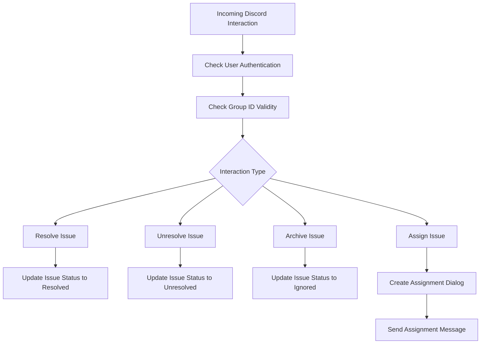

This document will cover the process of handling Discord interactions, which includes:

1. Initial authentication checks
2. Routing based on interaction types
3. Handling different interaction types such as resolving, unresolving, archiving, and assigning issues.

Technical document: <SwmLink doc-title="Handling Discord Interactions">[Handling Discord Interactions](/.swm/handling-discord-interactions.ini5zklv.sw.md)</SwmLink>

# [Initial Authentication Checks](https://app.swimm.io/repos/Z2l0aHViJTNBJTNBc2VudHJ5LWRlbW8tMSUzQSUzQVN3aW1tLURlbW8=/docs/ini5zklv#initial-authentication-checks)

When a Discord interaction is received, the system first verifies if the user is authenticated. This ensures that only authorized users can interact with the system. If the user is not authenticated, a warning is logged, and a message is sent back indicating that the user is not linked.

# [Check Group ID Validity](https://app.swimm.io/repos/Z2l0aHViJTNBJTNBc2VudHJ5LWRlbW8tMSUzQSUzQVN3aW1tLURlbW8=/docs/ini5zklv#check-group-id-validity)

The system then checks if the group ID associated with the interaction is valid. This step ensures that the interaction is associated with a recognized group. If the group ID is invalid, a message is sent back indicating the invalid group ID.

# [Routing Based on Interaction Types](https://app.swimm.io/repos/Z2l0aHViJTNBJTNBc2VudHJ5LWRlbW8tMSUzQSUzQVN3aW1tLURlbW8=/docs/ini5zklv#routing-based-on-interaction-types)

Depending on the type of interaction, the system routes the request to the appropriate handler. This routing is based on the `custom_id` of the interaction. For example, interactions can be routed to resolve, unresolve, archive, or assign issues.

# [Resolving Issues](https://app.swimm.io/repos/Z2l0aHViJTNBJTNBc2VudHJ5LWRlbW8tMSUzQSUzQVN3aW1tLURlbW8=/docs/ini5zklv#resolving-issues)

When an interaction is to resolve an issue, the system updates the issue status to resolved. It checks if the resolution is for the next release or the current release and updates the status details accordingly. A confirmation message is then sent to indicate that the issue has been resolved.

# [Unresolving Issues](https://app.swimm.io/repos/Z2l0aHViJTNBJTNBc2VudHJ5LWRlbW8tMSUzQSUzQVN3aW1tLURlbW8=/docs/ini5zklv#unresolving-issues)

For interactions that unresolve an issue, the system changes the status of the issue to unresolved. If the issue is being marked as ongoing, a message is sent indicating this; otherwise, a message is sent indicating that the issue has been unresolved.

# [Archiving Issues](https://app.swimm.io/repos/Z2l0aHViJTNBJTNBc2VudHJ5LWRlbW8tMSUzQSUzQVN3aW1tLURlbW8=/docs/ini5zklv#archiving-issues)

When an interaction is to archive an issue, the system updates the status of the issue to ignored and sets the substatus to 'until escalating'. A message is then sent indicating that the issue has been archived until it escalates.

# [Assigning Issues](https://app.swimm.io/repos/Z2l0aHViJTNBJTNBc2VudHJ5LWRlbW8tMSUzQSUzQVN3aW1tLURlbW8=/docs/ini5zklv#assigning-issues)

For interactions that assign an issue, the system creates a dialog for assigning the issue to a user. It builds a Discord select menu with options for assignees and sends this as a message. This allows users to select an assignee from the provided options.

# [Sending Assignment Messages](https://app.swimm.io/repos/Z2l0aHViJTNBJTNBc2VudHJ5LWRlbW8tMSUzQSUzQVN3aW1tLURlbW8=/docs/ini5zklv#sending-the-assignment-message)

Once an issue is assigned, the system sends a message to the Discord channel to notify about the assignment. This ensures that all relevant parties are informed about the new assignment.

&nbsp;

*This is an auto-generated document by Swimm AI 🌊 and has not yet been verified by a human*

<SwmMeta version="3.0.0" repo-id="Z2l0aHViJTNBJTNBc2VudHJ5LWRlbW8tMSUzQSUzQVN3aW1tLURlbW8=" repo-name="sentry-demo-1" doc-type="product-flows">Powered by [Swimm](/)</SwmMeta>
