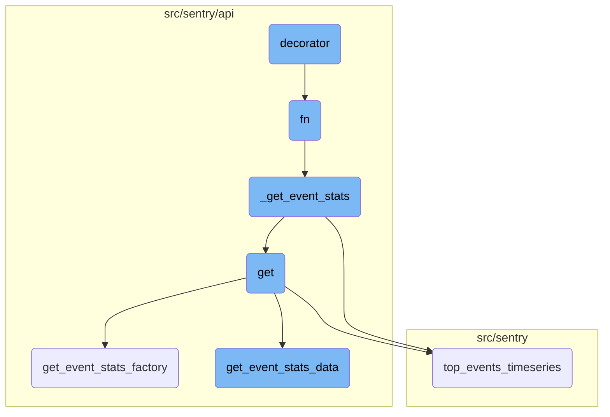
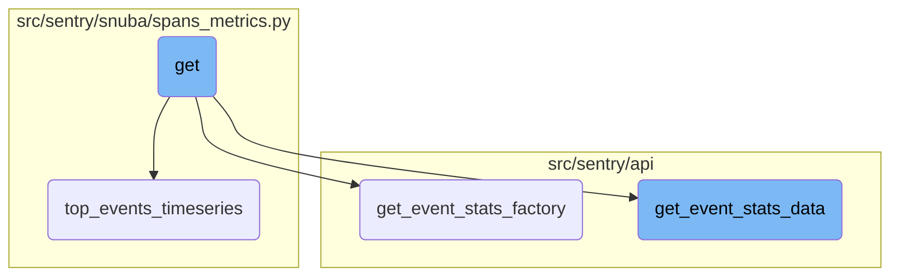

In this document, we will explain what a decorator is and how it is used to handle exceptions in the codebase. The decorator function is responsible for catching various exceptions that might occur during the execution of another function and returning appropriate error responses.

A decorator is a function that wraps another function to extend its behavior. In this case, the decorator is used to handle exceptions. When the wrapped function runs, if it encounters specific errors, the decorator catches these errors and returns a suitable error message. This helps in managing errors gracefully without crashing the application.

Here is a high level diagram of the flow, showing only the most important functions:



# Flow drill down

First, we'll zoom into this section of the flow:

```mermaid
graph TD;
      subgraph src/sentry
f9f63f336b5eba8d9307978e4639b4dc2a51cf261380e19d908e92f89571cb59(decorator):::mainFlowStyle --> 780bcbb7f1ba504427a19b761ba7a3bd49ed1d66d66daa8ef3d67ccaf80a796b(fn):::mainFlowStyle
end

subgraph src/sentry
780bcbb7f1ba504427a19b761ba7a3bd49ed1d66d66daa8ef3d67ccaf80a796b(fn):::mainFlowStyle --> ad78852d294414355cc4c1d586c85e1393b026807c627189ee95bfe783a81e9d(_get_event_stats):::mainFlowStyle
end

subgraph src/sentry
ad78852d294414355cc4c1d586c85e1393b026807c627189ee95bfe783a81e9d(_get_event_stats):::mainFlowStyle --> bc6d31d72bc18284a8d977c0ed48626395c14e576180df10f123120acbdabb9b(top_events_timeseries)
end

subgraph src/sentry
ad78852d294414355cc4c1d586c85e1393b026807c627189ee95bfe783a81e9d(_get_event_stats):::mainFlowStyle --> abc6480ff9e6702434a01780407f1b1b353e9678808b51b4270e726788e2f826(get):::mainFlowStyle
end

subgraph src/sentry
abc6480ff9e6702434a01780407f1b1b353e9678808b51b4270e726788e2f826(get):::mainFlowStyle --> xy4iw(...)
end


      classDef mainFlowStyle color:#000000,fill:#7CB9F4
classDef rootsStyle color:#000000,fill:#00FFF4
classDef Style1 color:#000000,fill:#00FFAA
classDef Style2 color:#000000,fill:#FFFF00
classDef Style3 color:#000000,fill:#AA7CB9

%% Swimm:
%% graph TD;
%%       subgraph <SwmPath>[src/sentry/](src/sentry/)</SwmPath>
%% f9f63f336b5eba8d9307978e4639b4dc2a51cf261380e19d908e92f89571cb59(decorator):::mainFlowStyle --> 780bcbb7f1ba504427a19b761ba7a3bd49ed1d66d66daa8ef3d67ccaf80a796b(fn):::mainFlowStyle
%% end
%% 
%% subgraph <SwmPath>[src/sentry/](src/sentry/)</SwmPath>
%% 780bcbb7f1ba504427a19b761ba7a3bd49ed1d66d66daa8ef3d67ccaf80a796b(fn):::mainFlowStyle --> ad78852d294414355cc4c1d586c85e1393b026807c627189ee95bfe783a81e9d(_get_event_stats):::mainFlowStyle
%% end
%% 
%% subgraph <SwmPath>[src/sentry/](src/sentry/)</SwmPath>
%% ad78852d294414355cc4c1d586c85e1393b026807c627189ee95bfe783a81e9d(_get_event_stats):::mainFlowStyle --> bc6d31d72bc18284a8d977c0ed48626395c14e576180df10f123120acbdabb9b(top_events_timeseries)
%% end
%% 
%% subgraph <SwmPath>[src/sentry/](src/sentry/)</SwmPath>
%% ad78852d294414355cc4c1d586c85e1393b026807c627189ee95bfe783a81e9d(_get_event_stats):::mainFlowStyle --> abc6480ff9e6702434a01780407f1b1b353e9678808b51b4270e726788e2f826(get):::mainFlowStyle
%% end
%% 
%% subgraph <SwmPath>[src/sentry/](src/sentry/)</SwmPath>
%% abc6480ff9e6702434a01780407f1b1b353e9678808b51b4270e726788e2f826(get):::mainFlowStyle --> xy4iw(...)
%% end
%% 
%% 
%%       classDef mainFlowStyle color:#000000,fill:#7CB9F4
%% classDef rootsStyle color:#000000,fill:#00FFF4
%% classDef Style1 color:#000000,fill:#00FFAA
%% classDef Style2 color:#000000,fill:#FFFF00
%% classDef Style3 color:#000000,fill:#AA7CB9
```



<SwmSnippet path="/src/sentry/replays/usecases/errors.py" line="23">

---

## Handling Exceptions

The <SwmToken path="src/sentry/replays/usecases/errors.py" pos="23:3:3" line-data="    def decorator(*args, **kwargs):">`decorator`</SwmToken> function is responsible for handling various exceptions that might occur during the execution of the <SwmToken path="src/sentry/replays/usecases/errors.py" pos="25:3:3" line-data="            return fn(*args, **kwargs)">`fn`</SwmToken> function. It catches specific exceptions like <SwmToken path="src/sentry/replays/usecases/errors.py" pos="26:3:3" line-data="        except DatasetSelectionError as exc:">`DatasetSelectionError`</SwmToken>, <SwmToken path="src/sentry/replays/usecases/errors.py" pos="28:3:3" line-data="        except QueryConnectionFailed as exc:">`QueryConnectionFailed`</SwmToken>, and others, and returns appropriate error responses using the <SwmToken path="src/sentry/replays/usecases/errors.py" pos="27:3:3" line-data="            return respond_logged(ENGINEER_ERROR, exc, status=500)">`respond_logged`</SwmToken> function.

```python
    def decorator(*args, **kwargs):
        try:
            return fn(*args, **kwargs)
        except DatasetSelectionError as exc:
            return respond_logged(ENGINEER_ERROR, exc, status=500)
        except QueryConnectionFailed as exc:
            return respond_logged("Server unavailable. Please try again.", exc, status=400)
        except QueryExecutionTimeMaximum as exc:
            return respond_logged(RESOURCE_LIMIT, exc, status=400)
        except QueryIllegalTypeOfArgument as exc:
            return respond_logged(ENGINEER_ERROR, exc, status=500)
        except QueryMemoryLimitExceeded as exc:
            return respond_logged(RESOURCE_LIMIT, exc, status=400)
        except QueryMissingColumn as exc:
            return respond_logged(ENGINEER_ERROR, exc, status=500)
        except QuerySizeExceeded as exc:
            return respond_logged(ENGINEER_ERROR, exc, status=500)
        except QueryTooManySimultaneous as exc:
            return respond_logged("Server overloaded. Please try again.", exc, status=400)
```

---

</SwmSnippet>

<SwmSnippet path="/src/sentry/api/endpoints/organization_events_stats.py" line="340">

---

## Querying Event Statistics

The <SwmToken path="src/sentry/api/endpoints/organization_events_stats.py" pos="340:3:3" line-data="            def fn(">`fn`</SwmToken> function is a complex function that queries event statistics based on various parameters. It first checks if metrics are enhanced and if a dashboard widget ID is provided. Depending on these conditions, it either calls <SwmToken path="src/sentry/api/endpoints/organization_events_stats.py" pos="350:3:3" line-data="                    return _get_event_stats(">`_get_event_stats`</SwmToken> directly or performs additional logic to handle widget splits and error checking. The function ensures that the correct dataset is queried and handles different types of data like errors and transactions.

```python
            def fn(
                query_columns: Sequence[str],
                query: str,
                snuba_params: SnubaParams,
                rollup: int,
                zerofill_results: bool,
                comparison_delta: datetime | None,
            ) -> SnubaTSResult | dict[str, SnubaTSResult]:

                if not (metrics_enhanced and dashboard_widget_id):
                    return _get_event_stats(
                        scoped_dataset,
                        query_columns,
                        query,
                        snuba_params,
                        rollup,
                        zerofill_results,
                        comparison_delta,
                    )

                try:
```

---

</SwmSnippet>

<SwmSnippet path="/src/sentry/api/endpoints/organization_events_stats.py" line="276">

---

### Fetching Event Statistics

The <SwmToken path="src/sentry/api/endpoints/organization_events_stats.py" pos="276:3:3" line-data="        def _get_event_stats(">`_get_event_stats`</SwmToken> function fetches event statistics from the scoped dataset. It either calls <SwmToken path="src/sentry/api/endpoints/organization_events_stats.py" pos="286:5:5" line-data="                return scoped_dataset.top_events_timeseries(">`top_events_timeseries`</SwmToken> if the <SwmToken path="src/sentry/api/endpoints/organization_events_stats.py" pos="285:3:3" line-data="            if top_events &gt; 0:">`top_events`</SwmToken> parameter is greater than zero or performs a timeseries query. This function is crucial for retrieving the necessary event data based on the provided query parameters.

```python
        def _get_event_stats(
            scoped_dataset: Any,
            query_columns: Sequence[str],
            query: str,
            snuba_params: SnubaParams,
            rollup: int,
            zerofill_results: bool,
            comparison_delta: datetime | None,
        ) -> SnubaTSResult | dict[str, SnubaTSResult]:
            if top_events > 0:
                return scoped_dataset.top_events_timeseries(
                    timeseries_columns=query_columns,
                    selected_columns=self.get_field_list(organization, request),
                    equations=self.get_equation_list(organization, request),
                    user_query=query,
                    snuba_params=snuba_params,
                    orderby=self.get_orderby(request),
                    rollup=rollup,
                    limit=top_events,
                    organization=organization,
                    referrer=referrer + ".find-topn",
```

---

</SwmSnippet>

<SwmSnippet path="/src/sentry/snuba/spans_metrics.py" line="144">

---

### Top Events Timeseries

The <SwmToken path="src/sentry/snuba/spans_metrics.py" pos="144:2:2" line-data="def top_events_timeseries(">`top_events_timeseries`</SwmToken> function is a <SwmToken path="src/sentry/snuba/spans_metrics.py" pos="97:1:3" line-data="    High-level API for doing arbitrary user timeseries queries against events.">`High-level`</SwmToken> API for performing timeseries queries for a limited number of top events. It returns a dictionary of <SwmToken path="src/sentry/api/endpoints/organization_events_stats.py" pos="284:5:5" line-data="        ) -&gt; SnubaTSResult | dict[str, SnubaTSResult]:">`SnubaTSResult`</SwmToken> objects, which are zerofilled in case of gaps. This function is essential for generating timeseries data for top events based on user queries and other parameters.

```python
def top_events_timeseries(
    timeseries_columns,
    selected_columns,
    user_query,
    snuba_params,
    orderby,
    rollup,
    limit,
    organization,
    equations=None,
    referrer=None,
    top_events=None,
    allow_empty=True,
    zerofill_results=True,
    include_other=False,
    functions_acl=None,
    on_demand_metrics_enabled=False,
    on_demand_metrics_type: MetricSpecType | None = None,
    query_source: QuerySource | None = None,
):
    """
```

---

</SwmSnippet>

Now, lets zoom into this section of the flow:



<SwmSnippet path="/src/sentry/api/endpoints/organization_events_stats.py" line="183">

---

## Handling Event Statistics

The <SwmToken path="src/sentry/api/endpoints/organization_events_stats.py" pos="183:3:3" line-data="    def get(self, request: Request, organization: Organization) -&gt; Response:">`get`</SwmToken> function is responsible for handling the main logic of fetching event statistics. It orchestrates the flow by calling helper functions like <SwmToken path="src/sentry/api/endpoints/organization_events_stats.py" pos="331:3:3" line-data="        def get_event_stats_factory(scoped_dataset):">`get_event_stats_factory`</SwmToken> and <SwmToken path="src/sentry/api/bases/organization_events.py" pos="388:3:3" line-data="    def get_event_stats_data(">`get_event_stats_data`</SwmToken> to process and retrieve the required data.

```python
    def get(self, request: Request, organization: Organization) -> Response:
        query_source = self.get_request_source(request)
        with sentry_sdk.start_span(op="discover.endpoint", description="filter_params") as span:
            span.set_data("organization", organization)

            top_events = 0

            if "topEvents" in request.GET:
                try:
                    top_events = int(request.GET.get("topEvents", 0))
                except ValueError:
                    return Response({"detail": "topEvents must be an integer"}, status=400)
                if top_events > MAX_TOP_EVENTS:
                    return Response(
                        {"detail": f"Can only get up to {MAX_TOP_EVENTS} top events"},
                        status=400,
                    )
                elif top_events <= 0:
                    return Response({"detail": "If topEvents needs to be at least 1"}, status=400)

            comparison_delta = None
```

---

</SwmSnippet>

<SwmSnippet path="/src/sentry/api/endpoints/organization_events_stats.py" line="331">

---

### Event Stats Factory

The <SwmToken path="src/sentry/api/endpoints/organization_events_stats.py" pos="331:3:3" line-data="        def get_event_stats_factory(scoped_dataset):">`get_event_stats_factory`</SwmToken> function creates a closure over the dataset to make additional requests to the errors dataset if the request is from a dashboard widget. It handles various conditions to determine whether to split the dataset and fetch data accordingly.

```python
        def get_event_stats_factory(scoped_dataset):
            """
            This factory closes over dataset in order to make an additional request to the errors dataset
            in the case that this request is from a dashboard widget and we're trying to split their discover dataset.

            This should be removed once the discover dataset is completely split in dashboards.
            """
            dashboard_widget_id = request.GET.get("dashboardWidgetId", None)

            def fn(
                query_columns: Sequence[str],
                query: str,
                snuba_params: SnubaParams,
                rollup: int,
                zerofill_results: bool,
                comparison_delta: datetime | None,
            ) -> SnubaTSResult | dict[str, SnubaTSResult]:

                if not (metrics_enhanced and dashboard_widget_id):
                    return _get_event_stats(
                        scoped_dataset,
```

---

</SwmSnippet>

<SwmSnippet path="/src/sentry/api/bases/organization_events.py" line="388">

---

### Fetching Event Stats Data

The <SwmToken path="src/sentry/api/bases/organization_events.py" pos="388:3:3" line-data="    def get_event_stats_data(">`get_event_stats_data`</SwmToken> function is responsible for fetching the event statistics data. It processes the request parameters, constructs the query, and retrieves the data from the Snuba dataset. It also handles serialization and formatting of the results.

```python
    def get_event_stats_data(
        self,
        request: Request,
        organization: Organization,
        get_event_stats: Callable[
            [Sequence[str], str, SnubaParams, int, bool, timedelta | None], SnubaTSResult
        ],
        top_events: int = 0,
        query_column: str = "count()",
        snuba_params: SnubaParams | None = None,
        query: str | None = None,
        allow_partial_buckets: bool = False,
        zerofill_results: bool = True,
        comparison_delta: timedelta | None = None,
        additional_query_column: str | None = None,
        dataset: Any | None = None,
    ) -> dict[str, Any]:
        with handle_query_errors():
            with sentry_sdk.start_span(
                op="discover.endpoint", description="base.stats_query_creation"
            ):
```

---

</SwmSnippet>

&nbsp;

*This is an auto-generated document by Swimm AI 🌊 and has not yet been verified by a human*

<SwmMeta version="3.0.0" repo-id="Z2l0aHViJTNBJTNBc2VudHJ5LWRlbW8tMSUzQSUzQVN3aW1tLURlbW8=" repo-name="sentry-demo-1" doc-type="flows"><sup>Powered by [Swimm](/)</sup></SwmMeta>
