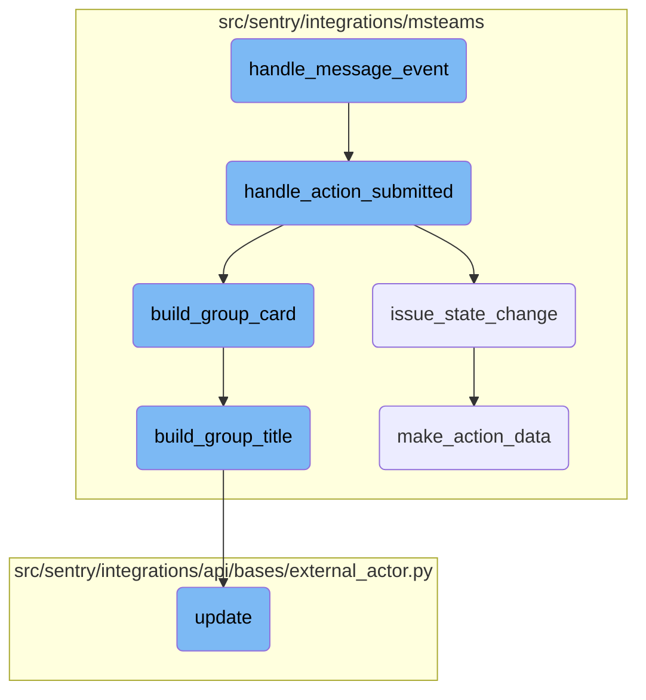

This document explains how message events are handled within the Microsoft Teams integration. It covers the steps from receiving a message event to processing user actions and updating issue states.

When a message event is received, the system first checks the type of conversation and whether the event is a user action on a card. If it is, the event is passed to another function to handle the action. Depending on the type of action, the issue state is updated, and a new card is built and sent back to the user. If the event is not a user action, it is handled as either a channel or personal message.

# Flow drill down



<SwmSnippet path="/src/sentry/integrations/msteams/webhook.py" line="339">

---

## Handling Message Events

The <SwmToken path="src/sentry/integrations/msteams/webhook.py" pos="339:3:3" line-data="    def handle_message_event(self, request: HttpRequest) -&gt; HttpResponse:">`handle_message_event`</SwmToken> function processes incoming message events. It first extracts the conversation type and checks if the event is a user action on a card. If so, it delegates to <SwmToken path="src/sentry/integrations/msteams/webhook.py" pos="351:5:5" line-data="            return self.handle_action_submitted(request)">`handle_action_submitted`</SwmToken>. Otherwise, it handles channel or personal messages accordingly.

```python
    def handle_message_event(self, request: HttpRequest) -> HttpResponse:
        data = request.data
        conversation = data.get("conversation", {})
        conversation_type = conversation.get("conversationType")

        # the only message events we care about are those which
        # are from a user submitting an option on a card, which
        # will always contain an "payload.actionType" in the data.
        if data.get("value", {}).get("payload", {}).get("actionType"):
            # Processing card actions can only occur in the Region silo.
            if SiloMode.get_current_mode() == SiloMode.CONTROL:
                return self.respond(status=400)
            return self.handle_action_submitted(request)
        elif conversation_type == "channel":
            return self.handle_channel_message(request)

        return self.handle_personal_message(request)
```

---

</SwmSnippet>

<SwmSnippet path="/src/sentry/integrations/msteams/webhook.py" line="555">

---

## Handling Action Submissions

The <SwmToken path="src/sentry/integrations/msteams/webhook.py" pos="555:3:3" line-data="    def handle_action_submitted(self, request: HttpRequest):">`handle_action_submitted`</SwmToken> function processes actions submitted by users. It extracts necessary data from the request, validates the integration, and updates the issue state. If the issue is valid, it builds and sends an updated card to the user.

```python
    def handle_action_submitted(self, request: HttpRequest):
        # pull out parameters
        data = request.data
        channel_data = data["channelData"]
        tenant_id = channel_data["tenant"]["id"]
        payload = data["value"]["payload"]
        group_id = payload["groupId"]
        integration_id = payload["integrationId"]
        user_id = data["from"]["id"]
        activity_id = data["replyToId"]
        conversation = data["conversation"]
        if conversation["conversationType"] == "personal":
            conversation_id = conversation["id"]
        else:
            conversation_id = channel_data["channel"]["id"]

        integration = self.get_integration_from_card_action(data=data)
        if integration is None:
            logger.info(
                "msteams.action.missing-integration", extra={"integration_id": integration_id}
            )
```

---

</SwmSnippet>

<SwmSnippet path="/src/sentry/integrations/msteams/webhook.py" line="524">

---

### Issue State Change

The <SwmToken path="src/sentry/integrations/msteams/webhook.py" pos="524:3:3" line-data="    def issue_state_change(self, group: Group, identity: RpcIdentity, data):">`issue_state_change`</SwmToken> function updates the state of an issue based on the action type. It records the action for analytics and sends a request to update the issue in the project.

```python
    def issue_state_change(self, group: Group, identity: RpcIdentity, data):
        event_write_key = ApiKey(
            organization_id=group.project.organization_id, scope_list=["event:write"]
        )

        # undoing the enum structure of ACTION_TYPE to
        # get a more sensible analytics_event
        action_types = {
            ACTION_TYPE.RESOLVE: "resolve",
            ACTION_TYPE.IGNORE: "ignore",
            ACTION_TYPE.ASSIGN: "assign",
            ACTION_TYPE.UNRESOLVE: "unresolve",
            ACTION_TYPE.UNASSIGN: "unassign",
        }
        action_data = self.make_action_data(data, identity.user_id)
        status = action_types[data["payload"]["actionType"]]
        analytics_event = f"integrations.msteams.{status}"
        analytics.record(
            analytics_event,
            actor_id=identity.user_id,
            organization_id=group.project.organization.id,
```

---

</SwmSnippet>

<SwmSnippet path="/src/sentry/integrations/msteams/card_builder/issues.py" line="265">

---

## Building Group Card

The <SwmToken path="src/sentry/integrations/msteams/card_builder/issues.py" pos="265:3:3" line-data="    def build_group_card(self, notification_uuid: str | None = None) -&gt; AdaptiveCard:">`build_group_card`</SwmToken> function constructs a card representing an issue. It includes the issue title, description, footer, assignee details, and action buttons for resolving, ignoring, or assigning the issue.

```python
    def build_group_card(self, notification_uuid: str | None = None) -> AdaptiveCard:
        """
        The issue (group) card has the following components stacked vertically,
        1. The issue title which links to the issue.
        2. A description of the issue if it is available. (Optional)
        3. A footer block, which again has 3 components stacked horizontally,
            3a. The short id of the group.
            3b. The alert rule(s) that fired this notification.
            3c. The date and time of the event.
        4. Details of the assignee if the issue is assigned to an actor. (Optional)
        5. A set of three actions, resolve, ignore and assign which can
            futher reveal cards with dropdowns for selecting options.
        """
        # Explicit typing to satisfy mypy.
        fields: list[Block | None] = [
            self.build_group_descr(),
            self.build_group_footer(),
            self.build_assignee_note(),
            self.build_group_actions(),
        ]

```

---

</SwmSnippet>

<SwmSnippet path="/src/sentry/integrations/msteams/card_builder/issues.py" line="76">

---

### Building Group Title

The <SwmToken path="src/sentry/integrations/msteams/card_builder/issues.py" pos="76:3:3" line-data="    def build_group_title(self, notification_uuid: str | None = None) -&gt; TextBlock:">`build_group_title`</SwmToken> function creates the title block for the issue card. It generates a link to the issue and formats the title text.

```python
    def build_group_title(self, notification_uuid: str | None = None) -> TextBlock:
        text = build_attachment_title(self.group)
        params = {"referrer": "msteams"}
        if notification_uuid:
            params.update({"notification_uuid": notification_uuid})
        link = self.group.get_absolute_url(params=params)

        title_text = f"[{text}]({link})"
        return create_text_block(
            title_text,
            size=TextSize.LARGE,
            weight=TextWeight.BOLDER,
        )
```

---

</SwmSnippet>

<SwmSnippet path="/src/sentry/integrations/msteams/webhook.py" line="492">

---

### Making Action Data

The <SwmToken path="src/sentry/integrations/msteams/webhook.py" pos="492:3:3" line-data="    def make_action_data(self, data, user_id):">`make_action_data`</SwmToken> function prepares the data needed to update the issue state based on the action type. It handles different action types like resolve, ignore, assign, and unassign.

```python
    def make_action_data(self, data, user_id):
        action_data = {}
        action_type = data["payload"]["actionType"]
        if action_type == ACTION_TYPE.UNRESOLVE:
            action_data = {"status": "unresolved"}
        elif action_type == ACTION_TYPE.RESOLVE:
            status = data.get("resolveInput")
            if status:
                # status might look something like "resolved:inCurrentRelease" or just "resolved"
                status_data = status.split(":", 1)
                resolve_type = status_data[-1]

                action_data = {"status": "resolved"}
                if resolve_type == "inNextRelease":
                    action_data.update({"statusDetails": {"inNextRelease": True}})
                elif resolve_type == "inCurrentRelease":
                    action_data.update({"statusDetails": {"inRelease": "latest"}})
        elif action_type == ACTION_TYPE.IGNORE:
            ignore_count = data.get("ignoreInput")
            if ignore_count:
                action_data = {"status": "ignored"}
```

---

</SwmSnippet>

<SwmSnippet path="/src/sentry/integrations/api/bases/external_actor.py" line="102">

---

## Updating External Actor

The <SwmToken path="src/sentry/integrations/api/bases/external_actor.py" pos="102:3:3" line-data="    def update(">`update`</SwmToken> function updates an <SwmToken path="src/sentry/integrations/api/bases/external_actor.py" pos="103:7:7" line-data="        self, instance: ExternalActor, validated_data: MutableMapping[str, Any]">`ExternalActor`</SwmToken> instance with validated data. It ensures the instance type is correct and saves the updated instance, handling any integrity errors.

```python
    def update(
        self, instance: ExternalActor, validated_data: MutableMapping[str, Any]
    ) -> ExternalActor:
        # Discard the object ID passed by the API.
        if "id" in validated_data:
            validated_data.pop("id")

        if self._actor_key in validated_data:
            validated_data.update(self.get_actor_params({**validated_data}))

        for key, value in validated_data.items():
            setattr(self.instance, key, value)
        try:
            assert type(self.instance) is ExternalActor, "Instance type must be ExternalActor"
            self.instance.save()
            return self.instance
        except IntegrityError:
            raise serializers.ValidationError(
                "There already exists an external association with this external_name and provider."
            )
```

---

</SwmSnippet>

&nbsp;

*This is an auto-generated document by Swimm AI 🌊 and has not yet been verified by a human*

<SwmMeta version="3.0.0" repo-id="Z2l0aHViJTNBJTNBc2VudHJ5LWRlbW8tMSUzQSUzQVN3aW1tLURlbW8=" repo-name="sentry-demo-1" doc-type="flows"><sup>Powered by [Swimm](/)</sup></SwmMeta>
