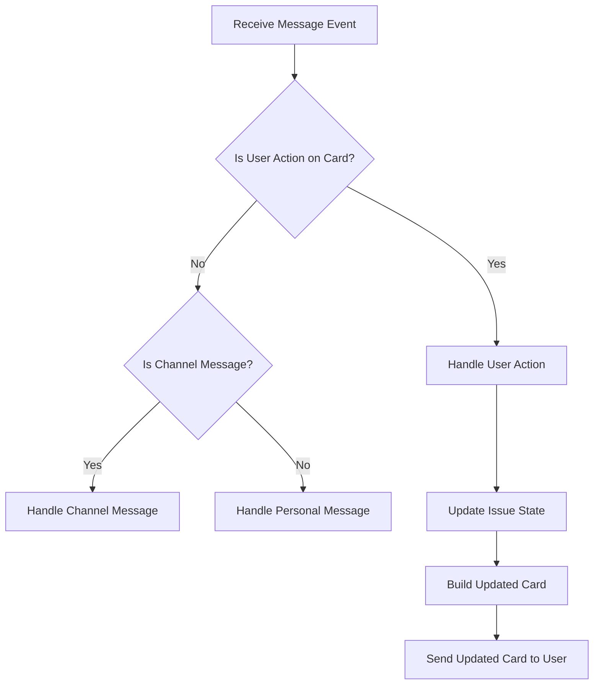

This document will cover the process of handling message events within the Microsoft Teams integration. We'll cover:

1. Receiving and categorizing message events
2. Handling user actions on cards
3. Updating issue states
4. Building and sending updated cards

Technical document: <SwmLink doc-title="Handling Message Events">[Handling Message Events](/.swm/handling-message-events.jemqdizi.sw.md)</SwmLink>

# [Receiving and Categorizing Message Events](https://app.swimm.io/repos/Z2l0aHViJTNBJTNBc2VudHJ5LWRlbW8tMSUzQSUzQVN3aW1tLURlbW8=/docs/jemqdizi#handling-message-events)

When a message event is received, the system first extracts the type of conversation from the event data. It then checks if the event is a user action on a card. User actions on cards are identified by the presence of a specific action type in the event data. If the event is a user action, it is passed to a function that handles these actions. If it is not a user action, the system determines whether the event is a channel message or a personal message and handles it accordingly.

# [Handling User Actions on Cards](https://app.swimm.io/repos/Z2l0aHViJTNBJTNBc2VudHJ5LWRlbW8tMSUzQSUzQVN3aW1tLURlbW8=/docs/jemqdizi#handling-action-submissions)

When a user interacts with a card, such as by clicking a button, the system processes this action by extracting necessary data from the event. This includes details like the tenant ID, group ID, integration ID, user ID, and conversation ID. The system then validates the integration associated with the action. If the integration is valid, the system proceeds to update the state of the related issue.

# [Updating Issue States](https://app.swimm.io/repos/Z2l0aHViJTNBJTNBc2VudHJ5LWRlbW8tMSUzQSUzQVN3aW1tLURlbW8=/docs/jemqdizi#issue-state-change)

The system updates the state of an issue based on the type of action performed by the user. For example, actions can include resolving, ignoring, or assigning an issue. The system records the action for analytics purposes and sends a request to update the issue in the project. This ensures that the issue's current state is accurately reflected in the system.

# [Building and Sending Updated Cards](https://app.swimm.io/repos/Z2l0aHViJTNBJTNBc2VudHJ5LWRlbW8tMSUzQSUzQVN3aW1tLURlbW8=/docs/jemqdizi#building-group-card)

After updating the issue state, the system constructs a new card to reflect the updated state of the issue. This card includes various components such as the issue title, description, footer, assignee details, and action buttons for further interactions. The updated card is then sent back to the user, providing them with the latest information and options for further actions.

&nbsp;

*This is an auto-generated document by Swimm AI 🌊 and has not yet been verified by a human*

<SwmMeta version="3.0.0" repo-id="Z2l0aHViJTNBJTNBc2VudHJ5LWRlbW8tMSUzQSUzQVN3aW1tLURlbW8=" repo-name="sentry-demo-1" doc-type="product-flows">Powered by [Swimm](/)</SwmMeta>
