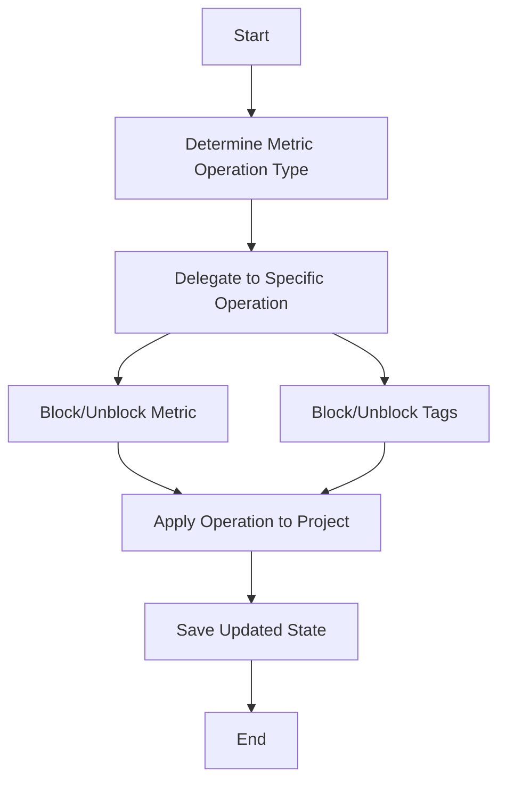

This document will cover the process of handling metric operations, which includes:

1. Determining the type of metric operation
2. Delegating to specific operations
3. Blocking and unblocking metrics and their tags
4. Applying the operation to the project's metrics.

Technical document: <SwmLink doc-title="Handling Metric Operations">[Handling Metric Operations](/.swm/handling-metric-operations.w1o0vl60.sw.md)</SwmLink>

# [Determining the Type of Metric Operation](https://app.swimm.io/repos/Z2l0aHViJTNBJTNBc2VudHJ5LWRlbW8tMSUzQSUzQVN3aW1tLURlbW8=/docs/w1o0vl60#handling-metric-operations)

The process begins by determining the type of metric operation required based on the request. This involves extracting the operation type from the request data. If the operation type is invalid, an error is raised, and the process is halted. This step ensures that only valid operations are processed, maintaining the integrity of the system.

# [Delegating to Specific Operations](https://app.swimm.io/repos/Z2l0aHViJTNBJTNBc2VudHJ5LWRlbW8tMSUzQSUzQVN3aW1tLURlbW8=/docs/w1o0vl60#delegating-to-specific-operations)

Once the operation type is determined, the request is delegated to a specific function that handles the operation. This function validates the metric identifier (MRI) and performs the appropriate action, such as blocking or unblocking a metric or its tags. This delegation ensures that each type of operation is handled by a specialized function, improving modularity and maintainability.

# [Blocking and Unblocking Metrics](https://app.swimm.io/repos/Z2l0aHViJTNBJTNBc2VudHJ5LWRlbW8tMSUzQSUzQVN3aW1tLURlbW8=/docs/w1o0vl60#blocking-a-metric)

Blocking a metric involves marking it as blocked for a list of projects. This action is logged, and a counter for blocked metrics is incremented. Unblocking a metric reverses this action, marking the metric as unblocked and incrementing a counter for unblocked metrics. These operations ensure that metrics can be dynamically controlled based on project requirements.

# [Blocking and Unblocking Tags](https://app.swimm.io/repos/Z2l0aHViJTNBJTNBc2VudHJ5LWRlbW8tMSUzQSUzQVN3aW1tLURlbW8=/docs/w1o0vl60#blocking-tags-of-a-metric)

Blocking tags of a metric involves marking specific tags as blocked for a metric. This action is logged, and a counter for blocked metric tags is incremented. Unblocking tags reverses this action, marking the tags as unblocked and incrementing a counter for unblocked metric tags. These operations allow for granular control over metric data.

# [Applying the Operation to the Project's Metrics](https://app.swimm.io/repos/Z2l0aHViJTNBJTNBc2VudHJ5LWRlbW8tMSUzQSUzQVN3aW1tLURlbW8=/docs/w1o0vl60#applying-the-operation)

The final step involves applying the blocking or unblocking operation to the project's metrics. This includes loading the current blocking state from the project's options, applying the operation, and saving the updated state back to the project. This step ensures that the changes are persisted and take effect immediately, maintaining the accuracy of the project's metrics.

&nbsp;

*This is an auto-generated document by Swimm AI 🌊 and has not yet been verified by a human*

<SwmMeta version="3.0.0" repo-id="Z2l0aHViJTNBJTNBc2VudHJ5LWRlbW8tMSUzQSUzQVN3aW1tLURlbW8=" repo-name="sentry-demo-1" doc-type="product-flows">Powered by [Swimm](/)</SwmMeta>
