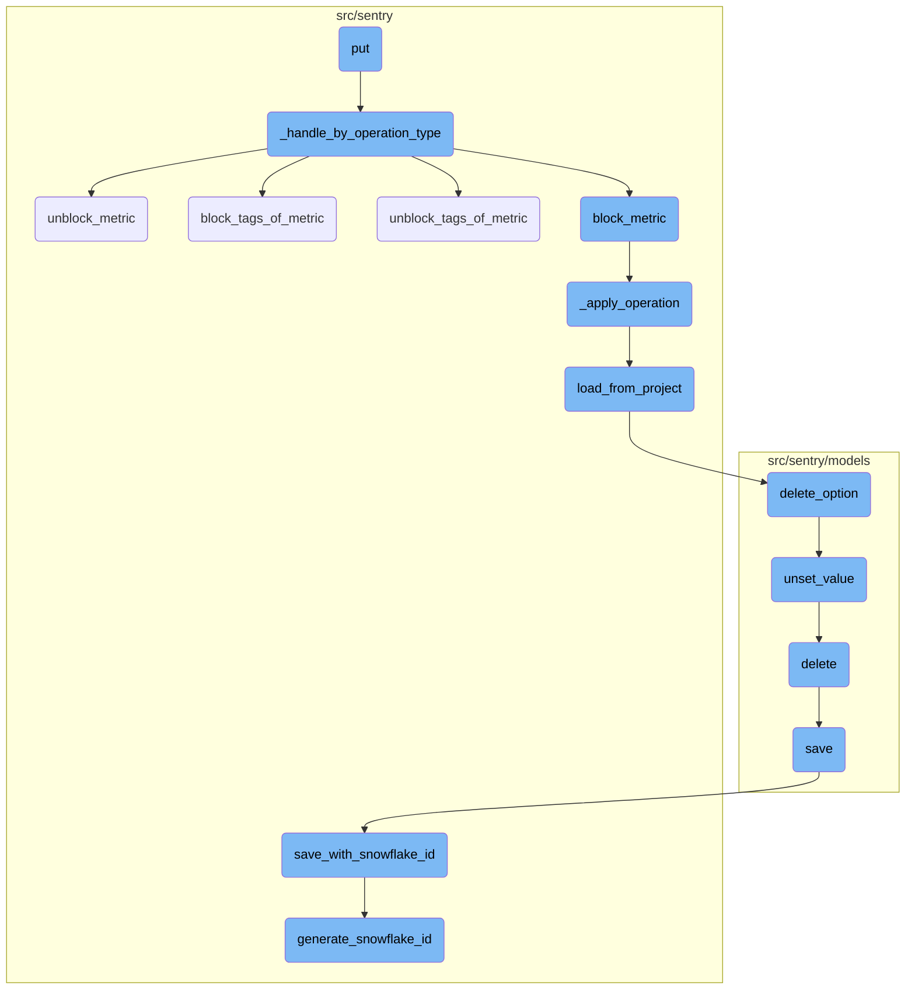
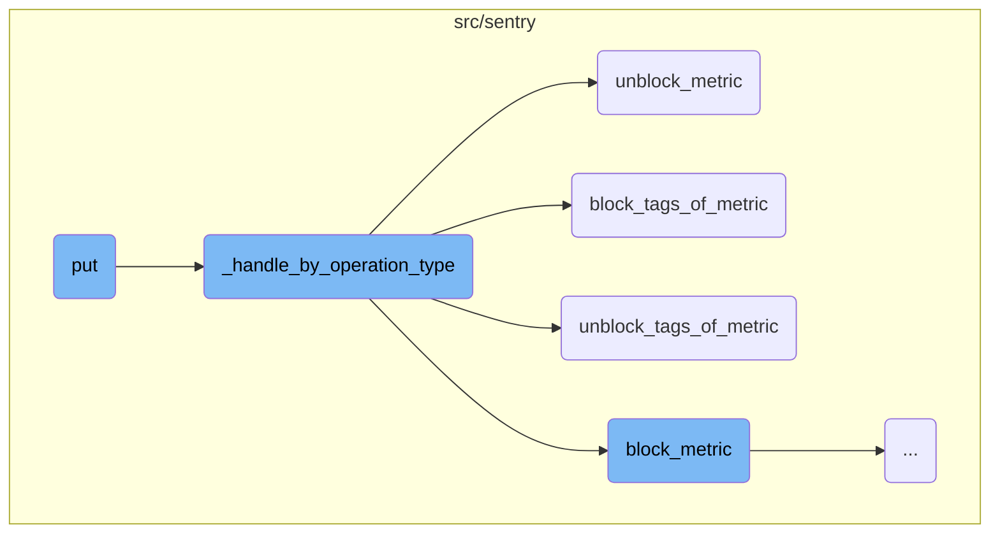
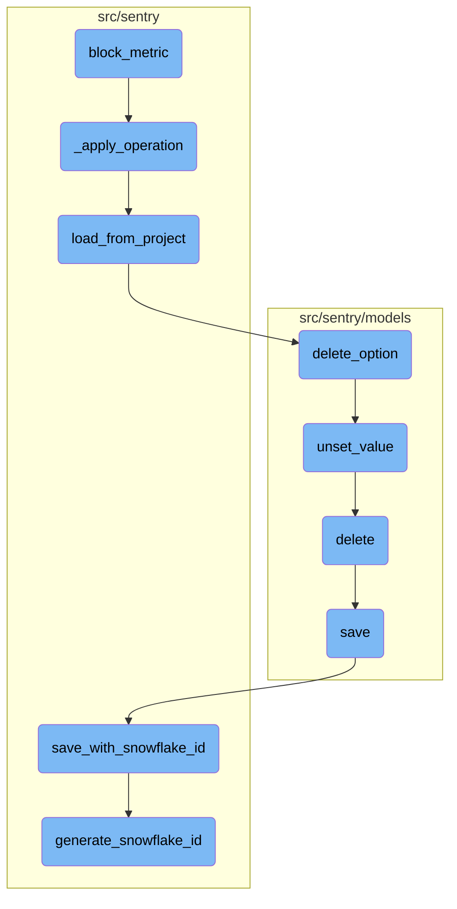

This document explains the <SwmToken path="src/sentry/api/endpoints/project_metrics.py" pos="113:3:3" line-data="    def put(self, request: Request, project: Project) -&gt; Response:">`put`</SwmToken> function, which is responsible for handling metric operations based on the request. It determines the type of metric operation and delegates the handling to specific functions based on the operation type. The document also covers the flow of blocking and unblocking metrics and their tags, as well as the underlying operations involved.

The <SwmToken path="src/sentry/api/endpoints/project_metrics.py" pos="113:3:3" line-data="    def put(self, request: Request, project: Project) -&gt; Response:">`put`</SwmToken> function starts by figuring out what kind of metric operation is needed from the request. If the operation type is valid, it passes the request to another function that handles the specific operation, like blocking or unblocking a metric or its tags. If the operation type is invalid, it raises an error. If any metric fails to be inserted, it returns a failure response. The document also explains how these operations are applied to the project's metrics and saved back to the project.

Here is a high level diagram of the flow, showing only the most important functions:



# Flow drill down

First, we'll zoom into this section of the flow:



<SwmSnippet path="/src/sentry/api/endpoints/project_metrics.py" line="113">

---

## Handling Metric Operations

The <SwmToken path="src/sentry/api/endpoints/project_metrics.py" pos="113:3:3" line-data="    def put(self, request: Request, project: Project) -&gt; Response:">`put`</SwmToken> function is responsible for handling metric operations based on the request. It first determines the type of metric operation from the request and then delegates the handling to <SwmToken path="src/sentry/api/endpoints/project_metrics.py" pos="121:7:7" line-data="            patched_metric = self._handle_by_operation_type(request, project, metric_operation_type)">`_handle_by_operation_type`</SwmToken>. If the operation type is invalid, it raises an error. If any metric fails to be inserted, it returns a response indicating the failure.

```python
    def put(self, request: Request, project: Project) -> Response:
        metric_operation_type = MetricOperationType.from_request(request)
        if not metric_operation_type:
            raise InvalidParams(
                f"You must supply a valid operation, which must be one of {MetricOperationType.available_ops()}"
            )

        try:
            patched_metric = self._handle_by_operation_type(request, project, metric_operation_type)
        except MalformedBlockedMetricsPayloadError:
            # In case one metric fails to be inserted, we abort the entire insertion since the project options are
            # likely to be corrupted.
            return Response(
                {"detail": "The blocked metrics settings are corrupted, try again"}, status=500
            )

        return Response(
            serialize(patched_metric, request.user, MetricBlockingSerializer()), status=200
        )
```

---

</SwmSnippet>

<SwmSnippet path="/src/sentry/api/endpoints/project_metrics.py" line="80">

---

### Delegating to Specific Operations

The <SwmToken path="src/sentry/api/endpoints/project_metrics.py" pos="80:3:3" line-data="    def _handle_by_operation_type(">`_handle_by_operation_type`</SwmToken> function processes the metric operation based on its type. It validates the metric MRI and then performs the appropriate operation such as blocking or unblocking a metric or its tags. It also logs the operation and increments a metric counter.

```python
    def _handle_by_operation_type(
        self, request: Request, project: Project, metric_operation_type: MetricOperationType
    ) -> MetricBlocking:
        metric_mri = request.data.get("metricMri")
        if not is_mri(metric_mri):
            raise InvalidParams("You must supply a valid metric mri")

        metric_mri = cast(str, metric_mri)
        patched_metrics: Mapping[int, MetricBlocking] = {}

        if metric_operation_type == MetricOperationType.BLOCK_METRIC:
            patched_metrics = block_metric(metric_mri, [project])
            self._create_audit_log_entry("METRIC_BLOCK", metric_mri, None, project)
        elif metric_operation_type == MetricOperationType.UNBLOCK_METRIC:
            patched_metrics = unblock_metric(metric_mri, [project])
            self._create_audit_log_entry("METRIC_UNBLOCK", metric_mri, None, project)
        elif metric_operation_type == MetricOperationType.BLOCK_TAGS:
            tags = self._get_sanitized_tags(request)
            patched_metrics = block_tags_of_metric(metric_mri, set(tags), [project])
            self._create_audit_log_entry("METRIC_TAGS_BLOCK", metric_mri, tags, project)
        elif metric_operation_type == MetricOperationType.UNBLOCK_TAGS:
```

---

</SwmSnippet>

<SwmSnippet path="/src/sentry/sentry_metrics/visibility/metrics_blocking.py" line="183">

---

### Unblocking a Metric

The <SwmToken path="src/sentry/sentry_metrics/visibility/metrics_blocking.py" pos="183:2:2" line-data="def unblock_metric(metric_mri: str, projects: Sequence[Project]) -&gt; Mapping[int, MetricBlocking]:">`unblock_metric`</SwmToken> function unblocks a metric by calling <SwmToken path="src/sentry/sentry_metrics/visibility/metrics_blocking.py" pos="185:3:3" line-data="    return _apply_operation(">`_apply_operation`</SwmToken> with the appropriate parameters. It also increments a counter for unblocked metrics.

```python
def unblock_metric(metric_mri: str, projects: Sequence[Project]) -> Mapping[int, MetricBlocking]:
    metrics.incr("ddm.metrics_api.unblocked_metrics_count")
    return _apply_operation(
        MetricOperation(
            metric_mri=metric_mri, block_metric=False, block_tags=set(), unblock_tags=set()
        ),
        projects,
    )
```

---

</SwmSnippet>

<SwmSnippet path="/src/sentry/sentry_metrics/visibility/metrics_blocking.py" line="193">

---

### Blocking Tags of a Metric

The <SwmToken path="src/sentry/sentry_metrics/visibility/metrics_blocking.py" pos="193:2:2" line-data="def block_tags_of_metric(">`block_tags_of_metric`</SwmToken> function blocks specific tags of a metric by calling <SwmToken path="src/sentry/sentry_metrics/visibility/metrics_blocking.py" pos="197:3:3" line-data="    return _apply_operation(">`_apply_operation`</SwmToken> with the appropriate parameters. It also increments a counter for blocked metric tags.

```python
def block_tags_of_metric(
    metric_mri: str, tags: set[str], projects: Sequence[Project]
) -> Mapping[int, MetricBlocking]:
    metrics.incr("ddm.metrics_api.blocked_metric_tags_count")
    return _apply_operation(
        MetricOperation(metric_mri=metric_mri, block_tags=tags, unblock_tags=set()), projects
    )
```

---

</SwmSnippet>

<SwmSnippet path="/src/sentry/sentry_metrics/visibility/metrics_blocking.py" line="202">

---

### Unblocking Tags of a Metric

The <SwmToken path="src/sentry/sentry_metrics/visibility/metrics_blocking.py" pos="202:2:2" line-data="def unblock_tags_of_metric(">`unblock_tags_of_metric`</SwmToken> function unblocks specific tags of a metric by calling <SwmToken path="src/sentry/sentry_metrics/visibility/metrics_blocking.py" pos="206:3:3" line-data="    return _apply_operation(">`_apply_operation`</SwmToken> with the appropriate parameters. It also increments a counter for unblocked metric tags.

```python
def unblock_tags_of_metric(
    metric_mri: str, tags: set[str], projects: Sequence[Project]
) -> Mapping[int, MetricBlocking]:
    metrics.incr("ddm.metrics_api.unblocked_metric_tags_count")
    return _apply_operation(
        MetricOperation(metric_mri=metric_mri, block_tags=set(), unblock_tags=tags), projects
    )
```

---

</SwmSnippet>

Now, lets zoom into this section of the flow:



<SwmSnippet path="/src/sentry/sentry_metrics/visibility/metrics_blocking.py" line="173">

---

## Blocking a Metric

The <SwmToken path="src/sentry/sentry_metrics/visibility/metrics_blocking.py" pos="173:2:2" line-data="def block_metric(metric_mri: str, projects: Sequence[Project]) -&gt; Mapping[int, MetricBlocking]:">`block_metric`</SwmToken> function is responsible for blocking a specific metric for a list of projects. It increments a metric counter and then calls the <SwmToken path="src/sentry/sentry_metrics/visibility/metrics_blocking.py" pos="175:3:3" line-data="    return _apply_operation(">`_apply_operation`</SwmToken> function to apply the blocking operation to each project.

```python
def block_metric(metric_mri: str, projects: Sequence[Project]) -> Mapping[int, MetricBlocking]:
    metrics.incr("ddm.metrics_api.blocked_metrics_count")
    return _apply_operation(
        MetricOperation(
            metric_mri=metric_mri, block_metric=True, block_tags=set(), unblock_tags=set()
        ),
        projects,
    )
```

---

</SwmSnippet>

<SwmSnippet path="/src/sentry/sentry_metrics/visibility/metrics_blocking.py" line="149">

---

## Applying the Operation

The <SwmToken path="src/sentry/sentry_metrics/visibility/metrics_blocking.py" pos="149:2:2" line-data="def _apply_operation(">`_apply_operation`</SwmToken> function applies the metric blocking operation to each project. It loads the current blocking state from the project, applies the operation, and then saves the updated state back to the project. It also schedules an invalidation of the project configuration to ensure the changes take effect.

```python
def _apply_operation(
    metric_operation: MetricOperation, projects: Sequence[Project]
) -> Mapping[int, MetricBlocking]:
    patched_metrics = {}

    for project in projects:
        metrics_blocking_state = MetricsBlockingState.load_from_project(
            project=project, repair=True
        )
        patched_blocking_metric = metrics_blocking_state.apply_metric_operation(
            metric_operation=metric_operation
        )
        metrics_blocking_state.save_to_project(project=project)

        # We store the newly patched state, or we default to empty state in case of an unblocking.
        patched_metrics[project.id] = patched_blocking_metric or MetricBlocking.empty(
            metric_mri=metric_operation.metric_mri
        )
        # We invalidate the project configuration once the updated settings were stored.
        schedule_invalidate_project_config(project_id=project.id, trigger="metrics_blocking")

```

---

</SwmSnippet>

<SwmSnippet path="/src/sentry/sentry_metrics/visibility/metrics_blocking.py" line="86">

---

### Loading from Project

The <SwmToken path="src/sentry/sentry_metrics/visibility/metrics_blocking.py" pos="86:3:3" line-data="    def load_from_project(cls, project: Project, repair: bool = False) -&gt; &quot;MetricsBlockingState&quot;:">`load_from_project`</SwmToken> function loads the current metrics blocking state from the project's options. If the state is malformed and repair is enabled, it deletes the invalid option. It returns a <SwmToken path="src/sentry/sentry_metrics/visibility/metrics_blocking.py" pos="86:27:27" line-data="    def load_from_project(cls, project: Project, repair: bool = False) -&gt; &quot;MetricsBlockingState&quot;:">`MetricsBlockingState`</SwmToken> object representing the current state.

```python
    def load_from_project(cls, project: Project, repair: bool = False) -> "MetricsBlockingState":
        json_payload = project.get_option(METRICS_BLOCKING_STATE_PROJECT_OPTION_KEY)
        if not json_payload:
            return MetricsBlockingState(metrics={})

        try:
            metrics_blocking_state_payload = json.loads(json_payload)
        except ValueError:
            if repair:
                project.delete_option(METRICS_BLOCKING_STATE_PROJECT_OPTION_KEY)

            raise MalformedBlockedMetricsPayloadError(
                f"Invalid metrics blocking state payload for project {project.id}"
            )

        if not isinstance(metrics_blocking_state_payload, list):
            if repair:
                project.delete_option(METRICS_BLOCKING_STATE_PROJECT_OPTION_KEY)

            raise MalformedBlockedMetricsPayloadError(
                f"The metrics blocking state payload is not a list for project {project.id}"
```

---

</SwmSnippet>

<SwmSnippet path="/src/sentry/models/project.py" line="428">

---

### Deleting an Option

The <SwmToken path="src/sentry/models/project.py" pos="428:3:3" line-data="    def delete_option(self, key: str) -&gt; None:">`delete_option`</SwmToken> function deletes a specific option from the project's options. It calls the <SwmToken path="src/sentry/models/project.py" pos="429:5:5" line-data="        self.option_manager.unset_value(self, key)">`unset_value`</SwmToken> function to perform the deletion.

```python
    def delete_option(self, key: str) -> None:
        self.option_manager.unset_value(self, key)
```

---

</SwmSnippet>

<SwmSnippet path="/src/sentry/models/groupmeta.py" line="76">

---

### Unsetting a Value

The <SwmToken path="src/sentry/models/groupmeta.py" pos="76:3:3" line-data="    def unset_value(self, instance, key):">`unset_value`</SwmToken> function removes a key-value pair from the group's metadata. It deletes the entry from the database and removes it from the cache.

```python
    def unset_value(self, instance, key):
        self.filter(group=instance, key=key).delete()
        try:
            del self.__cache[instance.id][key]
        except KeyError:
            pass
```

---

</SwmSnippet>

<SwmSnippet path="/src/sentry/models/project.py" line="718">

---

### Deleting a Project

The <SwmToken path="src/sentry/models/project.py" pos="718:3:3" line-data="    def delete(self, *args, **kwargs):">`delete`</SwmToken> function removes a project from the database. It also cascades the deletion to related notification settings and updates the project's outbox.

```python
    def delete(self, *args, **kwargs):
        # There is no foreign key relationship so we have to manually cascade.
        notifications_service.remove_notification_settings_for_project(project_id=self.id)

        with outbox_context(transaction.atomic(router.db_for_write(Project))):
            Project.outbox_for_update(self.id, self.organization_id).save()
            return super().delete(*args, **kwargs)
```

---

</SwmSnippet>

<SwmSnippet path="/src/sentry/models/project.py" line="365">

---

### Saving a Project

The <SwmToken path="src/sentry/models/project.py" pos="365:3:3" line-data="    def save(self, *args, **kwargs):">`save`</SwmToken> function saves the project's state to the database. If the project uses a snowflake ID, it calls <SwmToken path="src/sentry/models/project.py" pos="381:1:1" line-data="            save_with_snowflake_id(">`save_with_snowflake_id`</SwmToken> to generate and save the ID.

```python
    def save(self, *args, **kwargs):
        if not self.slug:
            lock = locks.get(
                f"slug:project:{self.organization_id}", duration=5, name="project_slug"
            )
            with TimedRetryPolicy(10)(lock.acquire):
                slugify_instance(
                    self,
                    self.name,
                    organization=self.organization,
                    reserved=RESERVED_PROJECT_SLUGS,
                    max_length=50,
                )

        if SENTRY_USE_SNOWFLAKE:
            snowflake_redis_key = "project_snowflake_key"
            save_with_snowflake_id(
                instance=self,
                snowflake_redis_key=snowflake_redis_key,
                save_callback=lambda: super(Project, self).save(*args, **kwargs),
            )
```

---

</SwmSnippet>

<SwmSnippet path="/src/sentry/utils/snowflake.py" line="47">

---

### Saving with Snowflake ID

The <SwmToken path="src/sentry/utils/snowflake.py" pos="47:2:2" line-data="def save_with_snowflake_id(">`save_with_snowflake_id`</SwmToken> function generates a unique snowflake ID for the project and saves it to the database. It retries the operation if there is an integrity error.

```python
def save_with_snowflake_id(
    instance: BaseModel, snowflake_redis_key: str, save_callback: Callable[[], object]
) -> None:
    assert uses_snowflake_id(
        instance.__class__
    ), "Only models decorated with uses_snowflake_id can be saved with save_with_snowflake_id()"

    for _ in range(settings.MAX_REDIS_SNOWFLAKE_RETRY_COUNTER):
        if not instance.id:
            instance.id = generate_snowflake_id(snowflake_redis_key)
        try:
            with enforce_constraints(transaction.atomic(using=router.db_for_write(type(instance)))):
                save_callback()
            return
        except IntegrityError:
            instance.id = None  # type: ignore[assignment]  # see typeddjango/django-stubs#2014
    raise MaxSnowflakeRetryError
```

---

</SwmSnippet>

<SwmSnippet path="/src/sentry/utils/snowflake.py" line="113">

---

### Generating Snowflake ID

The <SwmToken path="src/sentry/utils/snowflake.py" pos="113:2:2" line-data="def generate_snowflake_id(redis_key: str) -&gt; int:">`generate_snowflake_id`</SwmToken> function generates a unique snowflake ID based on the current time and region. It validates the generated ID and returns it.

```python
def generate_snowflake_id(redis_key: str) -> int:
    segment_values = {}

    segment_values[VERSION_ID] = msb_0_ordering(settings.SNOWFLAKE_VERSION_ID, VERSION_ID.length)

    try:
        segment_values[REGION_ID] = get_local_region().snowflake_id
    except RegionContextError:  # expected if running in monolith mode
        segment_values[REGION_ID] = NULL_REGION_ID

    current_time = datetime.now().timestamp()
    # supports up to 130 years
    segment_values[TIME_DIFFERENCE] = int(current_time - settings.SENTRY_SNOWFLAKE_EPOCH_START)

    snowflake_id = 0
    (
        segment_values[TIME_DIFFERENCE],
        segment_values[REGION_SEQUENCE],
    ) = get_sequence_value_from_redis(redis_key, segment_values[TIME_DIFFERENCE])

    for segment in BIT_SEGMENT_SCHEMA:
```

---

</SwmSnippet>

&nbsp;

*This is an auto-generated document by Swimm AI 🌊 and has not yet been verified by a human*

<SwmMeta version="3.0.0" repo-id="Z2l0aHViJTNBJTNBc2VudHJ5LWRlbW8tMSUzQSUzQVN3aW1tLURlbW8=" repo-name="sentry-demo-1" doc-type="flows"><sup>Powered by [Swimm](/)</sup></SwmMeta>
