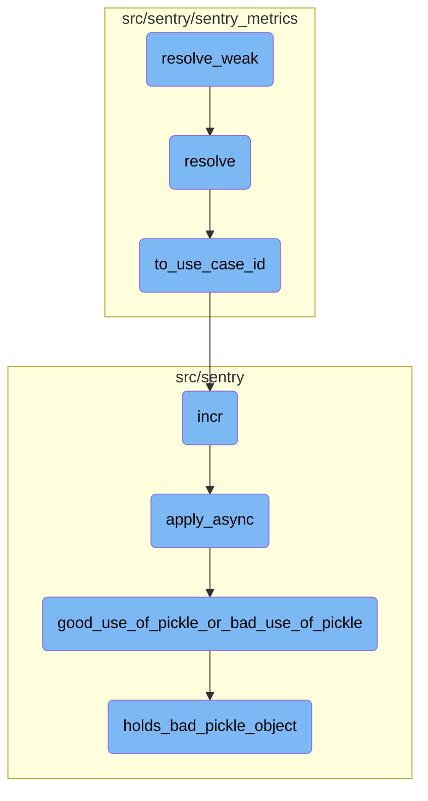

This document explains the purpose and functionality of the <SwmToken path="src/sentry/sentry_metrics/utils.py" pos="173:2:2" line-data="def resolve_weak(use_case_id: UseCaseID | UseCaseKey, org_id: int, string: str) -&gt; int:">`resolve_weak`</SwmToken> function. It also covers the related functions and their roles in the overall flow.

The <SwmToken path="src/sentry/sentry_metrics/utils.py" pos="173:2:2" line-data="def resolve_weak(use_case_id: UseCaseID | UseCaseKey, org_id: int, string: str) -&gt; int:">`resolve_weak`</SwmToken> function is used to convert a metric string into an ID. If it can't find the ID, it returns -1 instead of causing an error. This is helpful when creating database queries that need to handle missing values without breaking. The process starts by converting a use case identifier to its corresponding ID, then attempts to resolve the metric string. If the resolution fails, it returns -1. This flow is used in various parts of the codebase to ensure smooth handling of missing values.

# Flow drill down



<SwmSnippet path="/src/sentry/sentry_metrics/utils.py" line="173">

---

## <SwmToken path="src/sentry/sentry_metrics/utils.py" pos="173:2:2" line-data="def resolve_weak(use_case_id: UseCaseID | UseCaseKey, org_id: int, string: str) -&gt; int:">`resolve_weak`</SwmToken>

The <SwmToken path="src/sentry/sentry_metrics/utils.py" pos="173:2:2" line-data="def resolve_weak(use_case_id: UseCaseID | UseCaseKey, org_id: int, string: str) -&gt; int:">`resolve_weak`</SwmToken> function attempts to resolve a metric string to an ID. If the resolution fails, it returns -1 instead of raising an exception. This is useful for creating SQL WHERE-clauses that can handle missing values gracefully.

```python
def resolve_weak(use_case_id: UseCaseID | UseCaseKey, org_id: int, string: str) -> int:
    """
    A version of `resolve` that returns -1 for missing values.

    When using `resolve_weak` to produce a WHERE-clause, it is quite
    useful to make the WHERE-clause "impossible" with `WHERE x = -1` instead of
    explicitly handling that exception.
    """
    use_case_id = to_use_case_id(use_case_id)
    resolved = indexer.resolve(use_case_id, org_id, string)
    if resolved is None:
        return STRING_NOT_FOUND

    return resolved
```

---

</SwmSnippet>

<SwmSnippet path="/src/sentry/sentry_metrics/utils.py" line="128">

---

## resolve

The <SwmToken path="src/sentry/sentry_metrics/utils.py" pos="128:2:2" line-data="def resolve(">`resolve`</SwmToken> function converts a use case identifier to its corresponding ID and attempts to resolve a metric string to an ID. If the resolution fails, it raises a <SwmToken path="src/sentry/sentry_metrics/utils.py" pos="136:3:3" line-data="        raise MetricIndexNotFound(f&quot;Unknown string: {string!r}&quot;)">`MetricIndexNotFound`</SwmToken> exception.

```python
def resolve(
    use_case_id: UseCaseID | UseCaseKey,
    org_id: int,
    string: str,
) -> int:
    use_case_id = to_use_case_id(use_case_id)
    resolved = indexer.resolve(use_case_id, org_id, string)
    if resolved is None:
        raise MetricIndexNotFound(f"Unknown string: {string!r}")

    return resolved
```

---

</SwmSnippet>

<SwmSnippet path="/src/sentry/sentry_metrics/indexer/base.py" line="388">

---

## <SwmToken path="src/sentry/sentry_metrics/indexer/base.py" pos="388:2:2" line-data="def to_use_case_id(use_case: UseCaseID | UseCaseKey) -&gt; UseCaseID:">`to_use_case_id`</SwmToken>

The <SwmToken path="src/sentry/sentry_metrics/indexer/base.py" pos="388:2:2" line-data="def to_use_case_id(use_case: UseCaseID | UseCaseKey) -&gt; UseCaseID:">`to_use_case_id`</SwmToken> function converts a <SwmToken path="src/sentry/sentry_metrics/indexer/base.py" pos="388:11:11" line-data="def to_use_case_id(use_case: UseCaseID | UseCaseKey) -&gt; UseCaseID:">`UseCaseKey`</SwmToken> to a <SwmToken path="src/sentry/sentry_metrics/indexer/base.py" pos="388:7:7" line-data="def to_use_case_id(use_case: UseCaseID | UseCaseKey) -&gt; UseCaseID:">`UseCaseID`</SwmToken>. It also increments a metric to track unsafe reverse resolutions.

```python
def to_use_case_id(use_case: UseCaseID | UseCaseKey) -> UseCaseID:
    if isinstance(use_case, UseCaseKey):
        use_case = REVERSE_METRIC_PATH_MAPPING[use_case]
        metrics.incr("sentry_metrics.indexer.unsafe_rev_resolve")
    return use_case
```

---

</SwmSnippet>

<SwmSnippet path="/src/sentry/buffer/base.py" line="97">

---

## incr

The <SwmToken path="src/sentry/buffer/base.py" pos="97:3:3" line-data="    def incr(">`incr`</SwmToken> function increments specified columns in a database model based on given filters. It can also signal additional processing before writing to the database.

```python
    def incr(
        self,
        model: type[models.Model],
        columns: dict[str, int],
        filters: dict[str, models.Model | str | int],
        extra: dict[str, Any] | None = None,
        signal_only: bool | None = None,
    ) -> None:
        """
        >>> incr(Group, columns={'times_seen': 1}, filters={'pk': group.pk})
        signal_only - added to indicate that `process` should only call the complete
        signal handler with the updated model and skip creates/updates in the database. this
        is useful in cases where we need to do additional processing before writing to the
        database and opt to do it in a `buffer_incr_complete` receiver.
        """
        process_incr.apply_async(
            kwargs={
                "model": model,
                "columns": columns,
                "filters": filters,
                "extra": extra,
```

---

</SwmSnippet>

<SwmSnippet path="/src/sentry/celery.py" line="103">

---

## <SwmToken path="src/sentry/celery.py" pos="103:3:3" line-data="    def apply_async(self, *args, **kwargs):">`apply_async`</SwmToken>

The <SwmToken path="src/sentry/celery.py" pos="103:3:3" line-data="    def apply_async(self, *args, **kwargs):">`apply_async`</SwmToken> function adds metadata to a task and checks for bad uses of pickle. If bad uses are detected, it raises an error. It then schedules the task for asynchronous execution.

```python
    def apply_async(self, *args, **kwargs):
        self._add_metadata(kwargs)
        # If intended detect bad uses of pickle and make the tasks fail in tests.  This should
        # in theory pick up a lot of bad uses without accidentally failing tasks in prod.
        if (
            settings.CELERY_COMPLAIN_ABOUT_BAD_USE_OF_PICKLE
            and self.name not in LEGACY_PICKLE_TASKS
        ):
            good_use_of_pickle_or_bad_use_of_pickle(self, args, kwargs)

        with metrics.timer("jobs.delay", instance=self.name):
            return Task.apply_async(self, *args, **kwargs)
```

---

</SwmSnippet>

<SwmSnippet path="/src/sentry/celery.py" line="61">

---

## <SwmToken path="src/sentry/celery.py" pos="61:2:2" line-data="def good_use_of_pickle_or_bad_use_of_pickle(task, args, kwargs):">`good_use_of_pickle_or_bad_use_of_pickle`</SwmToken>

The <SwmToken path="src/sentry/celery.py" pos="61:2:2" line-data="def good_use_of_pickle_or_bad_use_of_pickle(task, args, kwargs):">`good_use_of_pickle_or_bad_use_of_pickle`</SwmToken> function checks if any arguments passed to a task contain objects that should not be pickled. If such objects are found, it raises a <SwmToken path="src/sentry/celery.py" pos="68:3:3" line-data="            raise TypeError(">`TypeError`</SwmToken>.

```python
def good_use_of_pickle_or_bad_use_of_pickle(task, args, kwargs):
    argiter = chain(enumerate(args), kwargs.items())

    for name, value in argiter:
        bad = holds_bad_pickle_object(value)
        if bad is not None:
            bad_object, reason = bad
            raise TypeError(
                "Task %r was invoked with an object that we do not want "
                "to pass via pickle (%r, reason is %s) in argument %s"
                % (task, bad_object, reason, name)
            )
```

---

</SwmSnippet>

<SwmSnippet path="/src/sentry/celery.py" line="29">

---

## <SwmToken path="src/sentry/celery.py" pos="29:2:2" line-data="def holds_bad_pickle_object(value, memo=None):">`holds_bad_pickle_object`</SwmToken>

The <SwmToken path="src/sentry/celery.py" pos="29:2:2" line-data="def holds_bad_pickle_object(value, memo=None):">`holds_bad_pickle_object`</SwmToken> function recursively checks if a value or any of its nested elements are objects that should not be pickled. It returns the problematic object and a reason if found.

```python
def holds_bad_pickle_object(value, memo=None):
    if memo is None:
        memo = {}

    value_id = id(value)
    if value_id in memo:
        return
    memo[value_id] = value

    if isinstance(value, (tuple, list)):
        for item in value:
            bad_object = holds_bad_pickle_object(item)
            if bad_object is not None:
                return bad_object
    elif isinstance(value, dict):
        for item in value.values():
            bad_object = holds_bad_pickle_object(item)
            if bad_object is not None:
                return bad_object

    if isinstance(value, models.Model):
```

---

</SwmSnippet>

# Where is this flow used?

This flow is used multiple times in the codebase as represented in the following diagram:

(Note - these are only some of the entry points of this flow)

```mermaid
graph TD;
      subgraph src/sentry
1571ed62c6f5f79519526436dae00505e4e6d2af207430cfe2327a092fece9ed(get_release_health_data_overview):::rootsStyle --> 519378a9cbca7e75d358bf036979b6f85f977feebec79158140bdf7168fa8484(get_release_adoption)
end

subgraph src/sentry
519378a9cbca7e75d358bf036979b6f85f977feebec79158140bdf7168fa8484(get_release_adoption) --> ffec8104f8a82a115a5f8cdbcd25f76c67490c9628fced21872887f724a4fc43(_get_release_adoption_impl)
end

subgraph src/sentry
ffec8104f8a82a115a5f8cdbcd25f76c67490c9628fced21872887f724a4fc43(_get_release_adoption_impl) --> fd6c034ac36f8d8853479771cb8e6a55a09650175360aae5efbf79a7c0d6d591(_count_sessions)
end

subgraph src/sentry/snuba/metrics
fd6c034ac36f8d8853479771cb8e6a55a09650175360aae5efbf79a7c0d6d591(_count_sessions) --> 8b7dfb2384b18eb86c6bd433cfe8281dcfd665cd038938bba5731a71caad3d38(get_series)
end

subgraph src/sentry/snuba/metrics
8b7dfb2384b18eb86c6bd433cfe8281dcfd665cd038938bba5731a71caad3d38(get_series) --> 35d12040966934efdd76bd3363426bc13b8433a48d9753f7f3250c37f1369ff1(get_snuba_queries)
end

subgraph src/sentry/snuba/metrics
35d12040966934efdd76bd3363426bc13b8433a48d9753f7f3250c37f1369ff1(get_snuba_queries) --> dd50acca96d1e3a1ae2d2011b036d89846801b7b4ae558f3ed316ea8663f70e7(_build_where)
end

subgraph src/sentry/snuba/metrics
dd50acca96d1e3a1ae2d2011b036d89846801b7b4ae558f3ed316ea8663f70e7(_build_where) --> f451826f5d7a344a3fe736ada0e8b6b981b247d2b89941999c81508d7358f2b0(resolve_tags)
end

subgraph src/sentry/snuba/metrics
f451826f5d7a344a3fe736ada0e8b6b981b247d2b89941999c81508d7358f2b0(resolve_tags) --> da7cba782bbe317a13ec92c87f7d3cc85adcc8f0f11dbf92143dee410e04a4f1(transform_null_transaction_to_unparameterized)
end

subgraph src/sentry
da7cba782bbe317a13ec92c87f7d3cc85adcc8f0f11dbf92143dee410e04a4f1(transform_null_transaction_to_unparameterized) --> e2e12e7b1e6e34ef6f2bf8d9fdeb4758fbf775b65f6069cb8cfdd0dd911348ee(resolve_tag_value)
end

subgraph src/sentry
e2e12e7b1e6e34ef6f2bf8d9fdeb4758fbf775b65f6069cb8cfdd0dd911348ee(resolve_tag_value) --> a69943080a147a68a7f3e9c6732b652222fd00545cb2e0f3cd0ec7478afe0a90(resolve_weak):::mainFlowStyle
end

subgraph src/sentry/integrations/discord/webhooks
643f9b67d6cae256457a31c4ef3224806b408e8a43de81b563f28505362bfbac(handle):::rootsStyle --> 56621b0838f35e2e3d298b3ec08199d7d5798cf4ceebb767aed231b8ab67c192(assign)
end

subgraph src/sentry/integrations/discord/webhooks
56621b0838f35e2e3d298b3ec08199d7d5798cf4ceebb767aed231b8ab67c192(assign) --> 5abb0782c5d50dc9bb2caef009ed5c564204afbedcccbd9f32c823400ee85c55(send_message)
end

subgraph src/sentry/integrations/discord/message_builder/metric_alerts.py
5abb0782c5d50dc9bb2caef009ed5c564204afbedcccbd9f32c823400ee85c55(send_message) --> 1f8306bb1a9d8dbc94ea95d0527252c90482dd9bdd90491a44b6a9a3520ebacb(build)
end

subgraph src/sentry/integrations/metric_alerts.py
1f8306bb1a9d8dbc94ea95d0527252c90482dd9bdd90491a44b6a9a3520ebacb(build) --> 3ee555c81a9fffdaaf4187ef89a239bd2f1a32ed12dcd08bc228cdfdea655eca(metric_alert_attachment_info)
end

subgraph src/sentry/integrations/metric_alerts.py
3ee555c81a9fffdaaf4187ef89a239bd2f1a32ed12dcd08bc228cdfdea655eca(metric_alert_attachment_info) --> 260663063916df0ea3d72ae3c0c9ec154104a071985d9de81a5283f22a186b85(get_metric_count_from_incident)
end

subgraph src/sentry
260663063916df0ea3d72ae3c0c9ec154104a071985d9de81a5283f22a186b85(get_metric_count_from_incident) --> 94dbc6e3afb8bee885412faa44c97543dbcb8401730543f292eec9a3244e3d91(get_incident_aggregates)
end

subgraph src/sentry/snuba/metrics_layer/query.py
94dbc6e3afb8bee885412faa44c97543dbcb8401730543f292eec9a3244e3d91(get_incident_aggregates) --> 0855223e36ac882841bbf2e0ef2fb632f98281c9458dac000c15db12ffb5feef(run_query)
end

subgraph src/sentry/snuba/metrics_layer/query.py
0855223e36ac882841bbf2e0ef2fb632f98281c9458dac000c15db12ffb5feef(run_query) --> bf51ad13267b0a966b2f78892bc9022bf6d0ea51971125b7eca85fe6a433e525(bulk_run_query)
end

subgraph src/sentry/snuba/metrics_layer/query.py
bf51ad13267b0a966b2f78892bc9022bf6d0ea51971125b7eca85fe6a433e525(bulk_run_query) --> afa26eb3bcd732ed408aeef284bae8b24d15a01fc92344a09b40589f8d4801c0(_resolve_metrics_query)
end

subgraph src/sentry/snuba/metrics_layer/query.py
afa26eb3bcd732ed408aeef284bae8b24d15a01fc92344a09b40589f8d4801c0(_resolve_metrics_query) --> 6a277fe7c0cc01093d1b577ff3ab42c24481442497f437a04de3caa10040371d(_resolve_query_metadata)
end

subgraph src/sentry/snuba/metrics_layer/query.py
6a277fe7c0cc01093d1b577ff3ab42c24481442497f437a04de3caa10040371d(_resolve_query_metadata) --> 9e4a240bd6a5ff1a4fa0ba914a4edf318f5edba10f1ccafd432ec5b104d78184(_resolve_formula_metadata)
end

subgraph src/sentry/snuba/metrics_layer/query.py
9e4a240bd6a5ff1a4fa0ba914a4edf318f5edba10f1ccafd432ec5b104d78184(_resolve_formula_metadata) --> 7340b914f89e0ddd1e440d35540714dc5bb06b0ad6d7ba1d5c014bb5402ce2a9(_resolve_timeseries_metadata)
end

subgraph src/sentry
7340b914f89e0ddd1e440d35540714dc5bb06b0ad6d7ba1d5c014bb5402ce2a9(_resolve_timeseries_metadata) --> a69943080a147a68a7f3e9c6732b652222fd00545cb2e0f3cd0ec7478afe0a90(resolve_weak):::mainFlowStyle
end

subgraph src/sentry/api/endpoints
49b300112e72e8ce618b9b4ef53dbe0df0012d77cbe8310c43d96b92f8bb4115(__init__):::rootsStyle --> deaa6096d91915f41f76a4a011a221133d1fff163b18cf6154f0a4c02bc88aa5(load_performance_issues)
end

subgraph src/sentry/api/endpoints
deaa6096d91915f41f76a4a011a221133d1fff163b18cf6154f0a4c02bc88aa5(load_performance_issues) --> 3da7767b5222652e93f261724fdf130b96c0b8288cb4e36bbf4a3c9e5437aa42(get)
end

subgraph src/sentry/api/endpoints
3da7767b5222652e93f261724fdf130b96c0b8288cb4e36bbf4a3c9e5437aa42(get) --> a6eada0bdf28a3123cbd3ae32fc333c6da9d7cbe7dd4799e0de128983768aca5(augment_transactions_with_spans)
end

subgraph src/sentry/snuba/metrics_layer/query.py
a6eada0bdf28a3123cbd3ae32fc333c6da9d7cbe7dd4799e0de128983768aca5(augment_transactions_with_spans) --> 0855223e36ac882841bbf2e0ef2fb632f98281c9458dac000c15db12ffb5feef(run_query)
end

subgraph src/sentry/api/endpoints
24e2b071b9c829e43659b6d0a3be54eb54b3e288cc214de95f0c13ccfed498e4(serialize_with_spans):::rootsStyle --> 1bf886269020d30f1bc7faf916b6ac987a5fcd21a0401b1f600dfce03c0bddf5(full_dict)
end

subgraph src/sentry/api/endpoints
1bf886269020d30f1bc7faf916b6ac987a5fcd21a0401b1f600dfce03c0bddf5(full_dict) --> 3da7767b5222652e93f261724fdf130b96c0b8288cb4e36bbf4a3c9e5437aa42(get)
end

subgraph src/sentry/api/endpoints
1dce6bbfad949e3653c65b43c6911ab3d420991a8caedbd0b73679c2365bea07(get_result):::rootsStyle --> 41cc12395ce176f3abd1605ec3b59c474cfa8089284309a69157467dc53ca726(get)
end

subgraph src/sentry/snuba/metrics
41cc12395ce176f3abd1605ec3b59c474cfa8089284309a69157467dc53ca726(get) --> 8b7dfb2384b18eb86c6bd433cfe8281dcfd665cd038938bba5731a71caad3d38(get_series)
end


      classDef mainFlowStyle color:#000000,fill:#7CB9F4
classDef rootsStyle color:#000000,fill:#00FFF4
classDef Style1 color:#000000,fill:#00FFAA
classDef Style2 color:#000000,fill:#FFFF00
classDef Style3 color:#000000,fill:#AA7CB9

%% Swimm:
%% graph TD;
%%       subgraph <SwmPath>[src/sentry/](src/sentry/)</SwmPath>
%% 1571ed62c6f5f79519526436dae00505e4e6d2af207430cfe2327a092fece9ed(get_release_health_data_overview):::rootsStyle --> 519378a9cbca7e75d358bf036979b6f85f977feebec79158140bdf7168fa8484(get_release_adoption)
%% end
%% 
%% subgraph <SwmPath>[src/sentry/](src/sentry/)</SwmPath>
%% 519378a9cbca7e75d358bf036979b6f85f977feebec79158140bdf7168fa8484(get_release_adoption) --> ffec8104f8a82a115a5f8cdbcd25f76c67490c9628fced21872887f724a4fc43(_get_release_adoption_impl)
%% end
%% 
%% subgraph <SwmPath>[src/sentry/](src/sentry/)</SwmPath>
%% ffec8104f8a82a115a5f8cdbcd25f76c67490c9628fced21872887f724a4fc43(_get_release_adoption_impl) --> fd6c034ac36f8d8853479771cb8e6a55a09650175360aae5efbf79a7c0d6d591(_count_sessions)
%% end
%% 
%% subgraph <SwmPath>[src/sentry/snuba/metrics/](src/sentry/snuba/metrics/)</SwmPath>
%% fd6c034ac36f8d8853479771cb8e6a55a09650175360aae5efbf79a7c0d6d591(_count_sessions) --> 8b7dfb2384b18eb86c6bd433cfe8281dcfd665cd038938bba5731a71caad3d38(get_series)
%% end
%% 
%% subgraph <SwmPath>[src/sentry/snuba/metrics/](src/sentry/snuba/metrics/)</SwmPath>
%% 8b7dfb2384b18eb86c6bd433cfe8281dcfd665cd038938bba5731a71caad3d38(get_series) --> 35d12040966934efdd76bd3363426bc13b8433a48d9753f7f3250c37f1369ff1(get_snuba_queries)
%% end
%% 
%% subgraph <SwmPath>[src/sentry/snuba/metrics/](src/sentry/snuba/metrics/)</SwmPath>
%% 35d12040966934efdd76bd3363426bc13b8433a48d9753f7f3250c37f1369ff1(get_snuba_queries) --> dd50acca96d1e3a1ae2d2011b036d89846801b7b4ae558f3ed316ea8663f70e7(_build_where)
%% end
%% 
%% subgraph <SwmPath>[src/sentry/snuba/metrics/](src/sentry/snuba/metrics/)</SwmPath>
%% dd50acca96d1e3a1ae2d2011b036d89846801b7b4ae558f3ed316ea8663f70e7(_build_where) --> f451826f5d7a344a3fe736ada0e8b6b981b247d2b89941999c81508d7358f2b0(resolve_tags)
%% end
%% 
%% subgraph <SwmPath>[src/sentry/snuba/metrics/](src/sentry/snuba/metrics/)</SwmPath>
%% f451826f5d7a344a3fe736ada0e8b6b981b247d2b89941999c81508d7358f2b0(resolve_tags) --> da7cba782bbe317a13ec92c87f7d3cc85adcc8f0f11dbf92143dee410e04a4f1(transform_null_transaction_to_unparameterized)
%% end
%% 
%% subgraph <SwmPath>[src/sentry/](src/sentry/)</SwmPath>
%% da7cba782bbe317a13ec92c87f7d3cc85adcc8f0f11dbf92143dee410e04a4f1(transform_null_transaction_to_unparameterized) --> e2e12e7b1e6e34ef6f2bf8d9fdeb4758fbf775b65f6069cb8cfdd0dd911348ee(resolve_tag_value)
%% end
%% 
%% subgraph <SwmPath>[src/sentry/](src/sentry/)</SwmPath>
%% e2e12e7b1e6e34ef6f2bf8d9fdeb4758fbf775b65f6069cb8cfdd0dd911348ee(resolve_tag_value) --> a69943080a147a68a7f3e9c6732b652222fd00545cb2e0f3cd0ec7478afe0a90(resolve_weak):::mainFlowStyle
%% end
%% 
%% subgraph <SwmPath>[src/sentry/integrations/discord/webhooks/](src/sentry/integrations/discord/webhooks/)</SwmPath>
%% 643f9b67d6cae256457a31c4ef3224806b408e8a43de81b563f28505362bfbac(handle):::rootsStyle --> 56621b0838f35e2e3d298b3ec08199d7d5798cf4ceebb767aed231b8ab67c192(assign)
%% end
%% 
%% subgraph <SwmPath>[src/sentry/integrations/discord/webhooks/](src/sentry/integrations/discord/webhooks/)</SwmPath>
%% 56621b0838f35e2e3d298b3ec08199d7d5798cf4ceebb767aed231b8ab67c192(assign) --> 5abb0782c5d50dc9bb2caef009ed5c564204afbedcccbd9f32c823400ee85c55(send_message)
%% end
%% 
%% subgraph <SwmPath>[src/sentry/integrations/discord/message_builder/metric_alerts.py](src/sentry/integrations/discord/message_builder/metric_alerts.py)</SwmPath>
%% 5abb0782c5d50dc9bb2caef009ed5c564204afbedcccbd9f32c823400ee85c55(send_message) --> 1f8306bb1a9d8dbc94ea95d0527252c90482dd9bdd90491a44b6a9a3520ebacb(build)
%% end
%% 
%% subgraph <SwmPath>[src/sentry/integrations/metric_alerts.py](src/sentry/integrations/metric_alerts.py)</SwmPath>
%% 1f8306bb1a9d8dbc94ea95d0527252c90482dd9bdd90491a44b6a9a3520ebacb(build) --> 3ee555c81a9fffdaaf4187ef89a239bd2f1a32ed12dcd08bc228cdfdea655eca(metric_alert_attachment_info)
%% end
%% 
%% subgraph <SwmPath>[src/sentry/integrations/metric_alerts.py](src/sentry/integrations/metric_alerts.py)</SwmPath>
%% 3ee555c81a9fffdaaf4187ef89a239bd2f1a32ed12dcd08bc228cdfdea655eca(metric_alert_attachment_info) --> 260663063916df0ea3d72ae3c0c9ec154104a071985d9de81a5283f22a186b85(get_metric_count_from_incident)
%% end
%% 
%% subgraph <SwmPath>[src/sentry/](src/sentry/)</SwmPath>
%% 260663063916df0ea3d72ae3c0c9ec154104a071985d9de81a5283f22a186b85(get_metric_count_from_incident) --> 94dbc6e3afb8bee885412faa44c97543dbcb8401730543f292eec9a3244e3d91(get_incident_aggregates)
%% end
%% 
%% subgraph <SwmPath>[src/sentry/snuba/metrics_layer/query.py](src/sentry/snuba/metrics_layer/query.py)</SwmPath>
%% 94dbc6e3afb8bee885412faa44c97543dbcb8401730543f292eec9a3244e3d91(get_incident_aggregates) --> 0855223e36ac882841bbf2e0ef2fb632f98281c9458dac000c15db12ffb5feef(run_query)
%% end
%% 
%% subgraph <SwmPath>[src/sentry/snuba/metrics_layer/query.py](src/sentry/snuba/metrics_layer/query.py)</SwmPath>
%% 0855223e36ac882841bbf2e0ef2fb632f98281c9458dac000c15db12ffb5feef(run_query) --> bf51ad13267b0a966b2f78892bc9022bf6d0ea51971125b7eca85fe6a433e525(bulk_run_query)
%% end
%% 
%% subgraph <SwmPath>[src/sentry/snuba/metrics_layer/query.py](src/sentry/snuba/metrics_layer/query.py)</SwmPath>
%% bf51ad13267b0a966b2f78892bc9022bf6d0ea51971125b7eca85fe6a433e525(bulk_run_query) --> afa26eb3bcd732ed408aeef284bae8b24d15a01fc92344a09b40589f8d4801c0(_resolve_metrics_query)
%% end
%% 
%% subgraph <SwmPath>[src/sentry/snuba/metrics_layer/query.py](src/sentry/snuba/metrics_layer/query.py)</SwmPath>
%% afa26eb3bcd732ed408aeef284bae8b24d15a01fc92344a09b40589f8d4801c0(_resolve_metrics_query) --> 6a277fe7c0cc01093d1b577ff3ab42c24481442497f437a04de3caa10040371d(_resolve_query_metadata)
%% end
%% 
%% subgraph <SwmPath>[src/sentry/snuba/metrics_layer/query.py](src/sentry/snuba/metrics_layer/query.py)</SwmPath>
%% 6a277fe7c0cc01093d1b577ff3ab42c24481442497f437a04de3caa10040371d(_resolve_query_metadata) --> 9e4a240bd6a5ff1a4fa0ba914a4edf318f5edba10f1ccafd432ec5b104d78184(_resolve_formula_metadata)
%% end
%% 
%% subgraph <SwmPath>[src/sentry/snuba/metrics_layer/query.py](src/sentry/snuba/metrics_layer/query.py)</SwmPath>
%% 9e4a240bd6a5ff1a4fa0ba914a4edf318f5edba10f1ccafd432ec5b104d78184(_resolve_formula_metadata) --> 7340b914f89e0ddd1e440d35540714dc5bb06b0ad6d7ba1d5c014bb5402ce2a9(_resolve_timeseries_metadata)
%% end
%% 
%% subgraph <SwmPath>[src/sentry/](src/sentry/)</SwmPath>
%% 7340b914f89e0ddd1e440d35540714dc5bb06b0ad6d7ba1d5c014bb5402ce2a9(_resolve_timeseries_metadata) --> a69943080a147a68a7f3e9c6732b652222fd00545cb2e0f3cd0ec7478afe0a90(resolve_weak):::mainFlowStyle
%% end
%% 
%% subgraph <SwmPath>[src/sentry/api/endpoints/](src/sentry/api/endpoints/)</SwmPath>
%% 49b300112e72e8ce618b9b4ef53dbe0df0012d77cbe8310c43d96b92f8bb4115(__init__):::rootsStyle --> deaa6096d91915f41f76a4a011a221133d1fff163b18cf6154f0a4c02bc88aa5(load_performance_issues)
%% end
%% 
%% subgraph <SwmPath>[src/sentry/api/endpoints/](src/sentry/api/endpoints/)</SwmPath>
%% deaa6096d91915f41f76a4a011a221133d1fff163b18cf6154f0a4c02bc88aa5(load_performance_issues) --> 3da7767b5222652e93f261724fdf130b96c0b8288cb4e36bbf4a3c9e5437aa42(get)
%% end
%% 
%% subgraph <SwmPath>[src/sentry/api/endpoints/](src/sentry/api/endpoints/)</SwmPath>
%% 3da7767b5222652e93f261724fdf130b96c0b8288cb4e36bbf4a3c9e5437aa42(get) --> a6eada0bdf28a3123cbd3ae32fc333c6da9d7cbe7dd4799e0de128983768aca5(augment_transactions_with_spans)
%% end
%% 
%% subgraph <SwmPath>[src/sentry/snuba/metrics_layer/query.py](src/sentry/snuba/metrics_layer/query.py)</SwmPath>
%% a6eada0bdf28a3123cbd3ae32fc333c6da9d7cbe7dd4799e0de128983768aca5(augment_transactions_with_spans) --> 0855223e36ac882841bbf2e0ef2fb632f98281c9458dac000c15db12ffb5feef(run_query)
%% end
%% 
%% subgraph <SwmPath>[src/sentry/api/endpoints/](src/sentry/api/endpoints/)</SwmPath>
%% 24e2b071b9c829e43659b6d0a3be54eb54b3e288cc214de95f0c13ccfed498e4(serialize_with_spans):::rootsStyle --> 1bf886269020d30f1bc7faf916b6ac987a5fcd21a0401b1f600dfce03c0bddf5(full_dict)
%% end
%% 
%% subgraph <SwmPath>[src/sentry/api/endpoints/](src/sentry/api/endpoints/)</SwmPath>
%% 1bf886269020d30f1bc7faf916b6ac987a5fcd21a0401b1f600dfce03c0bddf5(full_dict) --> 3da7767b5222652e93f261724fdf130b96c0b8288cb4e36bbf4a3c9e5437aa42(get)
%% end
%% 
%% subgraph <SwmPath>[src/sentry/api/endpoints/](src/sentry/api/endpoints/)</SwmPath>
%% 1dce6bbfad949e3653c65b43c6911ab3d420991a8caedbd0b73679c2365bea07(get_result):::rootsStyle --> 41cc12395ce176f3abd1605ec3b59c474cfa8089284309a69157467dc53ca726(get)
%% end
%% 
%% subgraph <SwmPath>[src/sentry/snuba/metrics/](src/sentry/snuba/metrics/)</SwmPath>
%% 41cc12395ce176f3abd1605ec3b59c474cfa8089284309a69157467dc53ca726(get) --> 8b7dfb2384b18eb86c6bd433cfe8281dcfd665cd038938bba5731a71caad3d38(get_series)
%% end
%% 
%% 
%%       classDef mainFlowStyle color:#000000,fill:#7CB9F4
%% classDef rootsStyle color:#000000,fill:#00FFF4
%% classDef Style1 color:#000000,fill:#00FFAA
%% classDef Style2 color:#000000,fill:#FFFF00
%% classDef Style3 color:#000000,fill:#AA7CB9
```



&nbsp;

*This is an auto-generated document by Swimm AI 🌊 and has not yet been verified by a human*

<SwmMeta version="3.0.0" repo-id="Z2l0aHViJTNBJTNBc2VudHJ5LWRlbW8tMSUzQSUzQVN3aW1tLURlbW8=" repo-name="sentry-demo-1" doc-type="flows"><sup>Powered by [Swimm](/)</sup></SwmMeta>
