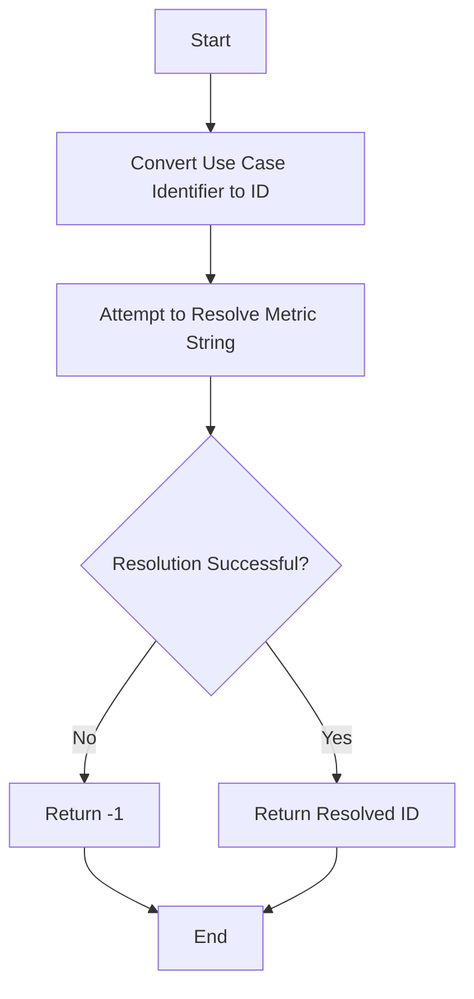

This document will cover the process of handling missing values using the resolve_weak function. We'll cover:

1. Purpose of resolve_weak
2. Flow of handling missing values
3. Impact on end users

Technical document: <SwmLink doc-title="Handling Missing Values with resolve_weak">[Handling Missing Values with resolve_weak](/.swm/handling-missing-values-with-resolve_weak.jayh5bmv.sw.md)</SwmLink>

# [Purpose of resolve_weak](https://app.swimm.io/repos/Z2l0aHViJTNBJTNBc2VudHJ5LWRlbW8tMSUzQSUzQVN3aW1tLURlbW8=/docs/jayh5bmv#resolve_weak)

The resolve_weak function is designed to handle scenarios where a metric string needs to be converted into an ID. If the function cannot find the corresponding ID, it returns -1 instead of causing an error. This approach is particularly useful for creating database queries that need to handle missing values gracefully. By returning -1, the function ensures that the query does not break and can continue to execute smoothly.

# [Flow of handling missing values](https://app.swimm.io/repos/Z2l0aHViJTNBJTNBc2VudHJ5LWRlbW8tMSUzQSUzQVN3aW1tLURlbW8=/docs/jayh5bmv#flow-drill-down)

The flow of handling missing values using resolve_weak involves several steps:

1. **Convert Use Case Identifier to ID**: The process begins by converting a use case identifier into its corresponding ID. This step ensures that the identifier is in a format that can be used for further processing.

2. **Attempt to Resolve Metric String**: The next step is to attempt to resolve the metric string to an ID. This involves checking if the metric string exists in the database and retrieving its corresponding ID.

3. **Check Resolution Success**: The function then checks if the resolution was successful. If the metric string was found and resolved to an ID, the function returns the resolved ID.

4. **Handle Missing Values**: If the resolution fails (i.e., the metric string is not found), the function returns -1. This ensures that the query can handle missing values without breaking.

# [Impact on end users](https://app.swimm.io/repos/Z2l0aHViJTNBJTNBc2VudHJ5LWRlbW8tMSUzQSUzQVN3aW1tLURlbW8=/docs/jayh5bmv#resolve_weak)

The resolve_weak function has a significant impact on end users by ensuring that database queries can handle missing values gracefully. This means that users will experience fewer errors and interruptions when interacting with the application. By returning -1 for missing values, the function allows the application to continue functioning smoothly even when some data is missing. This improves the overall user experience by providing a more robust and reliable application.

&nbsp;

*This is an auto-generated document by Swimm AI 🌊 and has not yet been verified by a human*

<SwmMeta version="3.0.0" repo-id="Z2l0aHViJTNBJTNBc2VudHJ5LWRlbW8tMSUzQSUzQVN3aW1tLURlbW8=" repo-name="sentry-demo-1" doc-type="product-flows">Powered by [Swimm](/)</SwmMeta>
