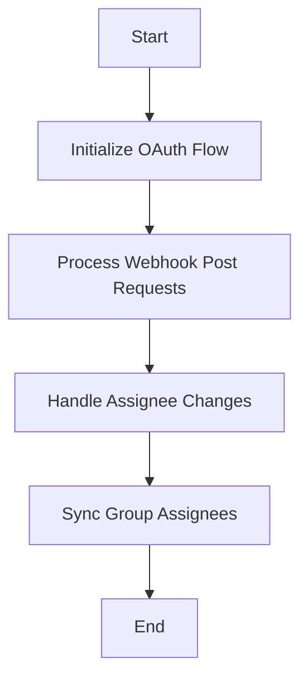

This document will cover the process of handling OAuth and Webhook requests, which includes:

1. Initializing the OAuth flow
2. Processing webhook post requests
3. Handling assignee changes
4. Synchronizing group assignees.

Technical document: <SwmLink doc-title="Handling OAuth and Webhook Requests">[Handling OAuth and Webhook Requests](/.swm/handling-oauth-and-webhook-requests.naptzvbp.sw.md)</SwmLink>

# [Initializing the OAuth Flow](https://app.swimm.io/repos/Z2l0aHViJTNBJTNBc2VudHJ5LWRlbW8tMSUzQSUzQVN3aW1tLURlbW8=/docs/naptzvbp#oauth-flow-initialization)

The OAuth flow begins with obtaining a request token from the Jira server. This token is essential for verifying the user's identity and allowing them to authenticate with the system. The request token is a temporary credential used to initiate the OAuth process, ensuring that the user is who they claim to be before proceeding with further actions.

# [Processing Webhook Post Requests](https://app.swimm.io/repos/Z2l0aHViJTNBJTNBc2VudHJ5LWRlbW8tMSUzQSUzQVN3aW1tLURlbW8=/docs/naptzvbp#handling-webhook-post-requests)

When a webhook post request is received from Jira, it is first validated to ensure the token is correct. This step is crucial to prevent unauthorized access. The system then checks for the presence of a changelog in the request data. The changelog contains information about any changes made to the issue, such as updates to the assignee field. If the changelog is missing, the request is considered incomplete and is not processed further.

# [Handling Assignee Changes](https://app.swimm.io/repos/Z2l0aHViJTNBJTNBc2VudHJ5LWRlbW8tMSUzQSUzQVN3aW1tLURlbW8=/docs/naptzvbp#handling-assignee-changes)

If the changelog indicates that the assignee field has changed, the system updates the issue's assignee information. This involves either assigning the issue to a new user or unassigning it if the assignee field is empty. The new assignee's email is retrieved to ensure accurate synchronization with the system's user data.

# [Synchronizing Group Assignees](https://app.swimm.io/repos/Z2l0aHViJTNBJTNBc2VudHJ5LWRlbW8tMSUzQSUzQVN3aW1tLURlbW8=/docs/naptzvbp#synchronizing-group-assignees)

The final step involves synchronizing the assignee information with the corresponding groups in the system. This ensures that the correct users are assigned to the appropriate groups based on the updated assignee data. The system checks project membership to verify that the user is part of the relevant project before making any changes. This synchronization helps maintain consistency and accuracy in user assignments across the system.

&nbsp;

*This is an auto-generated document by Swimm AI 🌊 and has not yet been verified by a human*

<SwmMeta version="3.0.0" repo-id="Z2l0aHViJTNBJTNBc2VudHJ5LWRlbW8tMSUzQSUzQVN3aW1tLURlbW8=" repo-name="sentry-demo-1" doc-type="product-flows">Powered by [Swimm](/)</SwmMeta>
