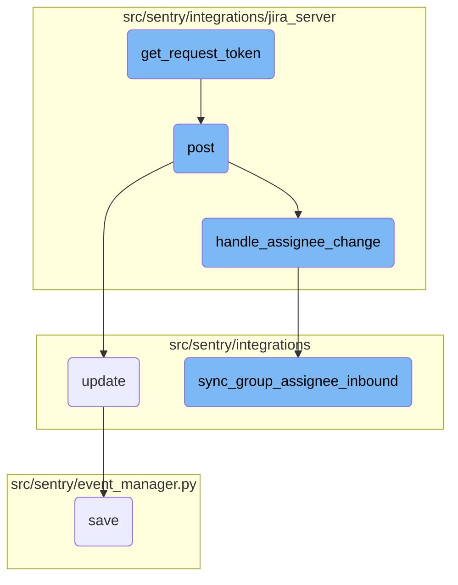

This document explains the process of handling <SwmToken path="src/sentry/integrations/jira_server/client.py" pos="227:22:22" line-data="    Jira OAuth1 docs: https://developer.atlassian.com/server/jira/platform/oauth/">`oauth`</SwmToken> initialization, processing webhook post requests, managing assignee changes, and synchronizing group assignees. It covers the steps involved in obtaining a request token, validating incoming webhook requests, handling changes in the assignee field, and updating group assignments based on the assignee data.

The flow starts with obtaining a request token to initiate the <SwmToken path="src/sentry/integrations/jira_server/client.py" pos="227:22:22" line-data="    Jira OAuth1 docs: https://developer.atlassian.com/server/jira/platform/oauth/">`oauth`</SwmToken> process. When a webhook post request is received, it is validated and checked for changes in the assignee field. If there are changes, the assignee information is updated, and the corresponding groups are synchronized to reflect the new assignee data.

# Flow drill down



<SwmSnippet path="/src/sentry/integrations/jira_server/client.py" line="247">

---

## <SwmToken path="src/sentry/integrations/jira_server/client.py" pos="227:22:22" line-data="    Jira OAuth1 docs: https://developer.atlassian.com/server/jira/platform/oauth/">`oauth`</SwmToken> Flow Initialization

The function <SwmToken path="src/sentry/integrations/jira_server/client.py" pos="242:3:3" line-data="    def get_request_token(self):">`get_request_token`</SwmToken> initiates the <SwmToken path="src/sentry/integrations/jira_server/client.py" pos="227:22:22" line-data="    Jira OAuth1 docs: https://developer.atlassian.com/server/jira/platform/oauth/">`oauth`</SwmToken> flow by obtaining a request token from the Jira server. This token is necessary for the user to verify their identity.

```python
        url = self.request_token_url.format(self.base_url)
        resp = self.post(url, allow_text=True)
        return dict(parse_qsl(resp.text))
```

---

</SwmSnippet>

<SwmSnippet path="/src/sentry/integrations/jira_server/webhooks.py" line="64">

---

## Handling Webhook Post Requests

The function <SwmToken path="src/sentry/integrations/jira_server/webhooks.py" pos="64:3:3" line-data="    def post(self, request: Request, token, *args, **kwargs) -&gt; Response:">`post`</SwmToken> processes incoming webhook requests from Jira. It validates the token, checks for the presence of a changelog, and then calls <SwmToken path="src/sentry/integrations/jira_server/utils/api.py" pos="25:2:2" line-data="def handle_assignee_change(">`handle_assignee_change`</SwmToken> to manage any changes in the assignee field.

```python
    def post(self, request: Request, token, *args, **kwargs) -> Response:
        clear_tags_and_context()
        extra: dict[str, object] = {}
        try:
            integration = get_integration_from_token(token)
            extra["integration_id"] = integration.id
        except ValueError as err:
            extra.update({"token": token, "error": str(err)})
            logger.warning("token-validation-error", extra=extra)
            metrics.incr("jira_server.webhook.invalid_token")
            return self.respond(status=400)

        data = request.data

        # Note: If we ever process more webhooks from jira server
        # we also need to update JiraServerRequestParser
        if not data.get("changelog"):
            logger.info("missing-changelog", extra=extra)
            return self.respond()

        try:
```

---

</SwmSnippet>

<SwmSnippet path="/src/sentry/integrations/jira_server/utils/api.py" line="25">

---

### Handling Assignee Changes

The function <SwmToken path="src/sentry/integrations/jira_server/utils/api.py" pos="25:2:2" line-data="def handle_assignee_change(">`handle_assignee_change`</SwmToken> checks if the assignee field has changed in the incoming data. If it has, it either assigns or unassigns the issue to a user based on the new assignee information.

```python
def handle_assignee_change(
    integration: RpcIntegration | Integration,
    data: Mapping[str, Any],
) -> None:
    assignee_changed = any(
        item for item in data["changelog"]["items"] if item["field"] == "assignee"
    )
    if not assignee_changed:
        return

    fields = data["issue"]["fields"]

    # If there is no assignee, assume it was unassigned.
    assignee = fields.get("assignee")
    issue_key = data["issue"]["key"]

    if assignee is None:
        sync_group_assignee_inbound(integration, None, issue_key, assign=False)
        return

    email = get_assignee_email(integration, assignee)
```

---

</SwmSnippet>

<SwmSnippet path="/src/sentry/integrations/utils/sync.py" line="64">

---

### Synchronizing Group Assignees

The function <SwmToken path="src/sentry/integrations/utils/sync.py" pos="64:2:2" line-data="def sync_group_assignee_inbound(">`sync_group_assignee_inbound`</SwmToken> synchronizes the assignee information from Jira with the corresponding groups in the system. It assigns or deassigns users to groups based on the assignee data.

```python
def sync_group_assignee_inbound(
    integration: RpcIntegration,
    email: str | None,
    external_issue_key: str,
    assign: bool = True,
) -> Sequence[Group]:
    """
    Given an integration, user email address and an external issue key,
    assign linked groups to matching users. Checks project membership.
    Returns a list of groups that were successfully assigned.
    """

    logger = logging.getLogger(f"sentry.integrations.{integration.provider}")

    orgs_with_sync_enabled = where_should_sync(integration, "inbound_assignee")
    affected_groups = Group.objects.get_groups_by_external_issue(
        integration,
        orgs_with_sync_enabled,
        external_issue_key,
    )
    log_context = {
```

---

</SwmSnippet>

&nbsp;

*This is an auto-generated document by Swimm AI 🌊 and has not yet been verified by a human*

<SwmMeta version="3.0.0" repo-id="Z2l0aHViJTNBJTNBc2VudHJ5LWRlbW8tMSUzQSUzQVN3aW1tLURlbW8=" repo-name="sentry-demo-1" doc-type="flows"><sup>Powered by [Swimm](/)</sup></SwmMeta>
