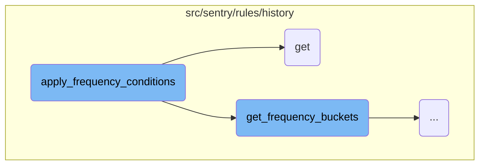
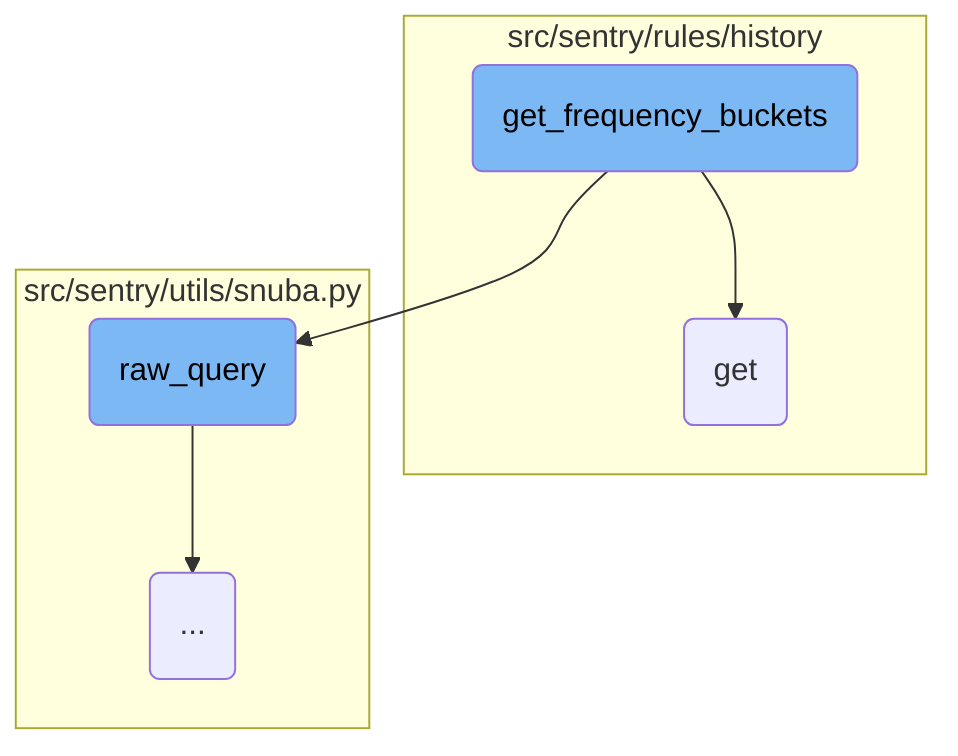
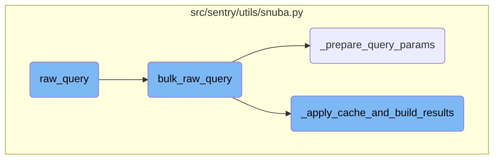

This document explains the <SwmToken path="src/sentry/api/endpoints/project_rule_preview.py" pos="29:5:5" line-data="    # a post endpoint because it&#39;s too hard to pass a list of objects from the frontend">`post`</SwmToken> function, which handles incoming requests to retrieve a list of alert triggers for the past two weeks based on specified rules. It validates the request data and, if valid, calls the <SwmToken path="src/sentry/rules/history/preview.py" pos="62:2:2" line-data="def preview(">`preview`</SwmToken> function to get the groups that would have triggered the given conditions and filters.

The <SwmToken path="src/sentry/api/endpoints/project_rule_preview.py" pos="29:5:5" line-data="    # a post endpoint because it&#39;s too hard to pass a list of objects from the frontend">`post`</SwmToken> function starts by validating the incoming request data. If the data is valid, it proceeds to call the <SwmToken path="src/sentry/rules/history/preview.py" pos="62:2:2" line-data="def preview(">`preview`</SwmToken> function. The <SwmToken path="src/sentry/rules/history/preview.py" pos="62:2:2" line-data="def preview(">`preview`</SwmToken> function then determines which groups would have triggered the specified conditions and filters over the past two weeks. It categorizes the conditions, retrieves relevant group activities, and applies the conditions to filter the groups. Finally, it returns the groups that match the conditions.

Here is a high level diagram of the flow, showing only the most important functions:

```mermaid
graph TD;
      subgraph src/sentry/rules/history
c81eb41dcf46dbb999ff7b29dc9dbb5dff1c140f687691e7c818cac9f55340d9(post):::mainFlowStyle --> ba49e1cade23c66e68bae05dd1c243fe9ee41d50b1a4da255b03a70aff4c5ecd(preview):::mainFlowStyle
end

subgraph src/sentry/rules/history
ba49e1cade23c66e68bae05dd1c243fe9ee41d50b1a4da255b03a70aff4c5ecd(preview):::mainFlowStyle --> aa2d4c2ec5754dcff57e66c9eb78bf852c6d165a37d2b384121cecf036f78f0c(get_events)
end

subgraph src/sentry/rules/history
ba49e1cade23c66e68bae05dd1c243fe9ee41d50b1a4da255b03a70aff4c5ecd(preview):::mainFlowStyle --> a79568a3b22828ec92902c960490b6a786dc3abc6073be6fae1f9647cdfe4d6f(get_top_groups)
end

subgraph src/sentry/rules/history
ba49e1cade23c66e68bae05dd1c243fe9ee41d50b1a4da255b03a70aff4c5ecd(preview):::mainFlowStyle --> 412134ce0db1efc350fe8416bffa88f23a6618a98f3f8eb1b4b71a48def171d9(get_filters)
end

subgraph src/sentry/rules/history
ba49e1cade23c66e68bae05dd1c243fe9ee41d50b1a4da255b03a70aff4c5ecd(preview):::mainFlowStyle --> 90728b418759f8854a520a3626e64359a071e167f47acffeff3f663bb9160af7(get_issue_state_activity)
end

subgraph src/sentry/rules/history
ba49e1cade23c66e68bae05dd1c243fe9ee41d50b1a4da255b03a70aff4c5ecd(preview):::mainFlowStyle --> 11a6bb00161be1ef3874025cf0c546a8d2b9852743bcbdf1e973560f5fd54d28(apply_frequency_conditions):::mainFlowStyle
end

subgraph src/sentry/rules/history
11a6bb00161be1ef3874025cf0c546a8d2b9852743bcbdf1e973560f5fd54d28(apply_frequency_conditions):::mainFlowStyle --> 151248606af29285dacf41fde409877e2712d7ab4978faa2c0504eccddac961b(get)
end

subgraph src/sentry/rules/history
11a6bb00161be1ef3874025cf0c546a8d2b9852743bcbdf1e973560f5fd54d28(apply_frequency_conditions):::mainFlowStyle --> 6a2c24486b1757c628fc6a290390d0ca9d53513abf546fe28a48d8a8e040b393(get_frequency_buckets):::mainFlowStyle
end

subgraph src/sentry/rules/history
6a2c24486b1757c628fc6a290390d0ca9d53513abf546fe28a48d8a8e040b393(get_frequency_buckets):::mainFlowStyle --> 151248606af29285dacf41fde409877e2712d7ab4978faa2c0504eccddac961b(get)
end

subgraph src/sentry
6a2c24486b1757c628fc6a290390d0ca9d53513abf546fe28a48d8a8e040b393(get_frequency_buckets):::mainFlowStyle --> 9e7271ad0c817bc7beb2e7483b4bfd667fbb5ef81afffec4ead5ea943e43fb58(raw_query):::mainFlowStyle
end

subgraph src/sentry
9e7271ad0c817bc7beb2e7483b4bfd667fbb5ef81afffec4ead5ea943e43fb58(raw_query):::mainFlowStyle --> 49e51d450ec84ff76919fd729ec4bc5fdd023594be9ea2b5131815c3be2c800e(bulk_raw_query):::mainFlowStyle
end

subgraph src/sentry
49e51d450ec84ff76919fd729ec4bc5fdd023594be9ea2b5131815c3be2c800e(bulk_raw_query):::mainFlowStyle --> beecaf8faaad1c65344d2110f3b0c9e38456bb670bdc218b51bb23b3e88615b5(_prepare_query_params)
end

subgraph src/sentry
49e51d450ec84ff76919fd729ec4bc5fdd023594be9ea2b5131815c3be2c800e(bulk_raw_query):::mainFlowStyle --> 7452ae8d5bb6a7cbd1beb6c2510ba33d7becd5a3351391bbea29966551c8dd5e(_apply_cache_and_build_results):::mainFlowStyle
end


      classDef mainFlowStyle color:#000000,fill:#7CB9F4
classDef rootsStyle color:#000000,fill:#00FFF4
classDef Style1 color:#000000,fill:#00FFAA
classDef Style2 color:#000000,fill:#FFFF00
classDef Style3 color:#000000,fill:#AA7CB9

%% Swimm:
%% graph TD;
%%       subgraph <SwmPath>[src/sentry/rules/history/](src/sentry/rules/history/)</SwmPath>
%% c81eb41dcf46dbb999ff7b29dc9dbb5dff1c140f687691e7c818cac9f55340d9(post):::mainFlowStyle --> ba49e1cade23c66e68bae05dd1c243fe9ee41d50b1a4da255b03a70aff4c5ecd(preview):::mainFlowStyle
%% end
%% 
%% subgraph <SwmPath>[src/sentry/rules/history/](src/sentry/rules/history/)</SwmPath>
%% ba49e1cade23c66e68bae05dd1c243fe9ee41d50b1a4da255b03a70aff4c5ecd(preview):::mainFlowStyle --> aa2d4c2ec5754dcff57e66c9eb78bf852c6d165a37d2b384121cecf036f78f0c(get_events)
%% end
%% 
%% subgraph <SwmPath>[src/sentry/rules/history/](src/sentry/rules/history/)</SwmPath>
%% ba49e1cade23c66e68bae05dd1c243fe9ee41d50b1a4da255b03a70aff4c5ecd(preview):::mainFlowStyle --> a79568a3b22828ec92902c960490b6a786dc3abc6073be6fae1f9647cdfe4d6f(get_top_groups)
%% end
%% 
%% subgraph <SwmPath>[src/sentry/rules/history/](src/sentry/rules/history/)</SwmPath>
%% ba49e1cade23c66e68bae05dd1c243fe9ee41d50b1a4da255b03a70aff4c5ecd(preview):::mainFlowStyle --> 412134ce0db1efc350fe8416bffa88f23a6618a98f3f8eb1b4b71a48def171d9(get_filters)
%% end
%% 
%% subgraph <SwmPath>[src/sentry/rules/history/](src/sentry/rules/history/)</SwmPath>
%% ba49e1cade23c66e68bae05dd1c243fe9ee41d50b1a4da255b03a70aff4c5ecd(preview):::mainFlowStyle --> 90728b418759f8854a520a3626e64359a071e167f47acffeff3f663bb9160af7(get_issue_state_activity)
%% end
%% 
%% subgraph <SwmPath>[src/sentry/rules/history/](src/sentry/rules/history/)</SwmPath>
%% ba49e1cade23c66e68bae05dd1c243fe9ee41d50b1a4da255b03a70aff4c5ecd(preview):::mainFlowStyle --> 11a6bb00161be1ef3874025cf0c546a8d2b9852743bcbdf1e973560f5fd54d28(apply_frequency_conditions):::mainFlowStyle
%% end
%% 
%% subgraph <SwmPath>[src/sentry/rules/history/](src/sentry/rules/history/)</SwmPath>
%% 11a6bb00161be1ef3874025cf0c546a8d2b9852743bcbdf1e973560f5fd54d28(apply_frequency_conditions):::mainFlowStyle --> 151248606af29285dacf41fde409877e2712d7ab4978faa2c0504eccddac961b(get)
%% end
%% 
%% subgraph <SwmPath>[src/sentry/rules/history/](src/sentry/rules/history/)</SwmPath>
%% 11a6bb00161be1ef3874025cf0c546a8d2b9852743bcbdf1e973560f5fd54d28(apply_frequency_conditions):::mainFlowStyle --> 6a2c24486b1757c628fc6a290390d0ca9d53513abf546fe28a48d8a8e040b393(get_frequency_buckets):::mainFlowStyle
%% end
%% 
%% subgraph <SwmPath>[src/sentry/rules/history/](src/sentry/rules/history/)</SwmPath>
%% 6a2c24486b1757c628fc6a290390d0ca9d53513abf546fe28a48d8a8e040b393(get_frequency_buckets):::mainFlowStyle --> 151248606af29285dacf41fde409877e2712d7ab4978faa2c0504eccddac961b(get)
%% end
%% 
%% subgraph <SwmPath>[src/sentry/](src/sentry/)</SwmPath>
%% 6a2c24486b1757c628fc6a290390d0ca9d53513abf546fe28a48d8a8e040b393(get_frequency_buckets):::mainFlowStyle --> 9e7271ad0c817bc7beb2e7483b4bfd667fbb5ef81afffec4ead5ea943e43fb58(raw_query):::mainFlowStyle
%% end
%% 
%% subgraph <SwmPath>[src/sentry/](src/sentry/)</SwmPath>
%% 9e7271ad0c817bc7beb2e7483b4bfd667fbb5ef81afffec4ead5ea943e43fb58(raw_query):::mainFlowStyle --> 49e51d450ec84ff76919fd729ec4bc5fdd023594be9ea2b5131815c3be2c800e(bulk_raw_query):::mainFlowStyle
%% end
%% 
%% subgraph <SwmPath>[src/sentry/](src/sentry/)</SwmPath>
%% 49e51d450ec84ff76919fd729ec4bc5fdd023594be9ea2b5131815c3be2c800e(bulk_raw_query):::mainFlowStyle --> beecaf8faaad1c65344d2110f3b0c9e38456bb670bdc218b51bb23b3e88615b5(_prepare_query_params)
%% end
%% 
%% subgraph <SwmPath>[src/sentry/](src/sentry/)</SwmPath>
%% 49e51d450ec84ff76919fd729ec4bc5fdd023594be9ea2b5131815c3be2c800e(bulk_raw_query):::mainFlowStyle --> 7452ae8d5bb6a7cbd1beb6c2510ba33d7becd5a3351391bbea29966551c8dd5e(_apply_cache_and_build_results):::mainFlowStyle
%% end
%% 
%% 
%%       classDef mainFlowStyle color:#000000,fill:#7CB9F4
%% classDef rootsStyle color:#000000,fill:#00FFF4
%% classDef Style1 color:#000000,fill:#00FFAA
%% classDef Style2 color:#000000,fill:#FFFF00
%% classDef Style3 color:#000000,fill:#AA7CB9
```



# Flow drill down

First, we'll zoom into this section of the flow:

```mermaid
graph TD;
      subgraph src/sentry/rules/history
c81eb41dcf46dbb999ff7b29dc9dbb5dff1c140f687691e7c818cac9f55340d9(post):::mainFlowStyle --> ba49e1cade23c66e68bae05dd1c243fe9ee41d50b1a4da255b03a70aff4c5ecd(preview):::mainFlowStyle
end

subgraph src/sentry/rules/history
ba49e1cade23c66e68bae05dd1c243fe9ee41d50b1a4da255b03a70aff4c5ecd(preview):::mainFlowStyle --> aa2d4c2ec5754dcff57e66c9eb78bf852c6d165a37d2b384121cecf036f78f0c(get_events)
end

subgraph src/sentry/rules/history
ba49e1cade23c66e68bae05dd1c243fe9ee41d50b1a4da255b03a70aff4c5ecd(preview):::mainFlowStyle --> a79568a3b22828ec92902c960490b6a786dc3abc6073be6fae1f9647cdfe4d6f(get_top_groups)
end

subgraph src/sentry/rules/history
ba49e1cade23c66e68bae05dd1c243fe9ee41d50b1a4da255b03a70aff4c5ecd(preview):::mainFlowStyle --> 412134ce0db1efc350fe8416bffa88f23a6618a98f3f8eb1b4b71a48def171d9(get_filters)
end

subgraph src/sentry/rules/history
ba49e1cade23c66e68bae05dd1c243fe9ee41d50b1a4da255b03a70aff4c5ecd(preview):::mainFlowStyle --> 90728b418759f8854a520a3626e64359a071e167f47acffeff3f663bb9160af7(get_issue_state_activity)
end

subgraph src/sentry/rules/history
ba49e1cade23c66e68bae05dd1c243fe9ee41d50b1a4da255b03a70aff4c5ecd(preview):::mainFlowStyle --> 11a6bb00161be1ef3874025cf0c546a8d2b9852743bcbdf1e973560f5fd54d28(apply_frequency_conditions):::mainFlowStyle
end

subgraph src/sentry/rules/history
11a6bb00161be1ef3874025cf0c546a8d2b9852743bcbdf1e973560f5fd54d28(apply_frequency_conditions):::mainFlowStyle --> b8rf1(...)
end

subgraph src/sentry/rules/history
90728b418759f8854a520a3626e64359a071e167f47acffeff3f663bb9160af7(get_issue_state_activity) --> 151248606af29285dacf41fde409877e2712d7ab4978faa2c0504eccddac961b(get)
end

subgraph src/sentry/rules/history
412134ce0db1efc350fe8416bffa88f23a6618a98f3f8eb1b4b71a48def171d9(get_filters) --> 151248606af29285dacf41fde409877e2712d7ab4978faa2c0504eccddac961b(get)
end

subgraph src/sentry/rules/history
a79568a3b22828ec92902c960490b6a786dc3abc6073be6fae1f9647cdfe4d6f(get_top_groups) --> 5621f99b292ce6bb9f90d09b60812b1491665f5010db43903c3c789fddc0f0c9(get_group_dataset)
end

subgraph src/sentry/rules/history
a79568a3b22828ec92902c960490b6a786dc3abc6073be6fae1f9647cdfe4d6f(get_top_groups) --> 151248606af29285dacf41fde409877e2712d7ab4978faa2c0504eccddac961b(get)
end

subgraph src/sentry/rules/history
aa2d4c2ec5754dcff57e66c9eb78bf852c6d165a37d2b384121cecf036f78f0c(get_events) --> 5621f99b292ce6bb9f90d09b60812b1491665f5010db43903c3c789fddc0f0c9(get_group_dataset)
end

subgraph src/sentry/rules/history
aa2d4c2ec5754dcff57e66c9eb78bf852c6d165a37d2b384121cecf036f78f0c(get_events) --> 151248606af29285dacf41fde409877e2712d7ab4978faa2c0504eccddac961b(get)
end


      classDef mainFlowStyle color:#000000,fill:#7CB9F4
classDef rootsStyle color:#000000,fill:#00FFF4
classDef Style1 color:#000000,fill:#00FFAA
classDef Style2 color:#000000,fill:#FFFF00
classDef Style3 color:#000000,fill:#AA7CB9

%% Swimm:
%% graph TD;
%%       subgraph <SwmPath>[src/sentry/rules/history/](src/sentry/rules/history/)</SwmPath>
%% c81eb41dcf46dbb999ff7b29dc9dbb5dff1c140f687691e7c818cac9f55340d9(post):::mainFlowStyle --> ba49e1cade23c66e68bae05dd1c243fe9ee41d50b1a4da255b03a70aff4c5ecd(preview):::mainFlowStyle
%% end
%% 
%% subgraph <SwmPath>[src/sentry/rules/history/](src/sentry/rules/history/)</SwmPath>
%% ba49e1cade23c66e68bae05dd1c243fe9ee41d50b1a4da255b03a70aff4c5ecd(preview):::mainFlowStyle --> aa2d4c2ec5754dcff57e66c9eb78bf852c6d165a37d2b384121cecf036f78f0c(get_events)
%% end
%% 
%% subgraph <SwmPath>[src/sentry/rules/history/](src/sentry/rules/history/)</SwmPath>
%% ba49e1cade23c66e68bae05dd1c243fe9ee41d50b1a4da255b03a70aff4c5ecd(preview):::mainFlowStyle --> a79568a3b22828ec92902c960490b6a786dc3abc6073be6fae1f9647cdfe4d6f(get_top_groups)
%% end
%% 
%% subgraph <SwmPath>[src/sentry/rules/history/](src/sentry/rules/history/)</SwmPath>
%% ba49e1cade23c66e68bae05dd1c243fe9ee41d50b1a4da255b03a70aff4c5ecd(preview):::mainFlowStyle --> 412134ce0db1efc350fe8416bffa88f23a6618a98f3f8eb1b4b71a48def171d9(get_filters)
%% end
%% 
%% subgraph <SwmPath>[src/sentry/rules/history/](src/sentry/rules/history/)</SwmPath>
%% ba49e1cade23c66e68bae05dd1c243fe9ee41d50b1a4da255b03a70aff4c5ecd(preview):::mainFlowStyle --> 90728b418759f8854a520a3626e64359a071e167f47acffeff3f663bb9160af7(get_issue_state_activity)
%% end
%% 
%% subgraph <SwmPath>[src/sentry/rules/history/](src/sentry/rules/history/)</SwmPath>
%% ba49e1cade23c66e68bae05dd1c243fe9ee41d50b1a4da255b03a70aff4c5ecd(preview):::mainFlowStyle --> 11a6bb00161be1ef3874025cf0c546a8d2b9852743bcbdf1e973560f5fd54d28(apply_frequency_conditions):::mainFlowStyle
%% end
%% 
%% subgraph <SwmPath>[src/sentry/rules/history/](src/sentry/rules/history/)</SwmPath>
%% 11a6bb00161be1ef3874025cf0c546a8d2b9852743bcbdf1e973560f5fd54d28(apply_frequency_conditions):::mainFlowStyle --> b8rf1(...)
%% end
%% 
%% subgraph <SwmPath>[src/sentry/rules/history/](src/sentry/rules/history/)</SwmPath>
%% 90728b418759f8854a520a3626e64359a071e167f47acffeff3f663bb9160af7(get_issue_state_activity) --> 151248606af29285dacf41fde409877e2712d7ab4978faa2c0504eccddac961b(get)
%% end
%% 
%% subgraph <SwmPath>[src/sentry/rules/history/](src/sentry/rules/history/)</SwmPath>
%% 412134ce0db1efc350fe8416bffa88f23a6618a98f3f8eb1b4b71a48def171d9(get_filters) --> 151248606af29285dacf41fde409877e2712d7ab4978faa2c0504eccddac961b(get)
%% end
%% 
%% subgraph <SwmPath>[src/sentry/rules/history/](src/sentry/rules/history/)</SwmPath>
%% a79568a3b22828ec92902c960490b6a786dc3abc6073be6fae1f9647cdfe4d6f(get_top_groups) --> 5621f99b292ce6bb9f90d09b60812b1491665f5010db43903c3c789fddc0f0c9(get_group_dataset)
%% end
%% 
%% subgraph <SwmPath>[src/sentry/rules/history/](src/sentry/rules/history/)</SwmPath>
%% a79568a3b22828ec92902c960490b6a786dc3abc6073be6fae1f9647cdfe4d6f(get_top_groups) --> 151248606af29285dacf41fde409877e2712d7ab4978faa2c0504eccddac961b(get)
%% end
%% 
%% subgraph <SwmPath>[src/sentry/rules/history/](src/sentry/rules/history/)</SwmPath>
%% aa2d4c2ec5754dcff57e66c9eb78bf852c6d165a37d2b384121cecf036f78f0c(get_events) --> 5621f99b292ce6bb9f90d09b60812b1491665f5010db43903c3c789fddc0f0c9(get_group_dataset)
%% end
%% 
%% subgraph <SwmPath>[src/sentry/rules/history/](src/sentry/rules/history/)</SwmPath>
%% aa2d4c2ec5754dcff57e66c9eb78bf852c6d165a37d2b384121cecf036f78f0c(get_events) --> 151248606af29285dacf41fde409877e2712d7ab4978faa2c0504eccddac961b(get)
%% end
%% 
%% 
%%       classDef mainFlowStyle color:#000000,fill:#7CB9F4
%% classDef rootsStyle color:#000000,fill:#00FFF4
%% classDef Style1 color:#000000,fill:#00FFAA
%% classDef Style2 color:#000000,fill:#FFFF00
%% classDef Style3 color:#000000,fill:#AA7CB9
```



<SwmSnippet path="/src/sentry/api/endpoints/project_rule_preview.py" line="29">

---

## The <SwmToken path="src/sentry/api/endpoints/project_rule_preview.py" pos="29:5:5" line-data="    # a post endpoint because it&#39;s too hard to pass a list of objects from the frontend">`post`</SwmToken> function

The <SwmToken path="src/sentry/api/endpoints/project_rule_preview.py" pos="29:5:5" line-data="    # a post endpoint because it&#39;s too hard to pass a list of objects from the frontend">`post`</SwmToken> function handles the incoming request to get a list of alert triggers for the past two weeks based on given rules. It first validates the request data using <SwmToken path="src/sentry/api/endpoints/project_rule_preview.py" pos="45:5:5" line-data="        serializer = RulePreviewSerializer(">`RulePreviewSerializer`</SwmToken>. If the data is valid, it calls the <SwmToken path="src/sentry/rules/history/preview.py" pos="62:2:2" line-data="def preview(">`preview`</SwmToken> function with the project and the validated data to get the groups that would have triggered the given conditions and filters.

```python
    # a post endpoint because it's too hard to pass a list of objects from the frontend
    def post(self, request: Request, project) -> Response:
        """
        Get a list of alert triggers in past 2 weeks for given rules

            {method} {path}
            {{
                "conditions": [],
                "filters": [],
                "actionMatch": "all",
                "filterMatch": "all",
                "frequency": 60,
                "endpoint": datetime or None
            }}

        """
        serializer = RulePreviewSerializer(
            context={"project": project, "organization": project.organization}, data=request.data
        )

        if not serializer.is_valid():
```

---

</SwmSnippet>

<SwmSnippet path="/src/sentry/rules/history/preview.py" line="62">

---

## The <SwmToken path="src/sentry/rules/history/preview.py" pos="62:2:2" line-data="def preview(">`preview`</SwmToken> function

The <SwmToken path="src/sentry/rules/history/preview.py" pos="62:2:2" line-data="def preview(">`preview`</SwmToken> function is responsible for determining which groups would have triggered the given conditions and filters in the past two weeks. It categorizes the conditions into issue state conditions and frequency conditions, retrieves the relevant group activities, and applies the conditions to filter the groups. It then returns the groups that match the conditions.

```python
def preview(
    project: Project,
    conditions: Conditions,
    filters: Conditions,
    condition_match: str,
    filter_match: str,
    frequency_minutes: int,
    end: datetime | None = None,
) -> dict[int, datetime] | None:
    """
    Returns groups that would have triggered the given conditions and filters in the past 2 weeks
    """
    issue_state_conditions, frequency_conditions = categorize_conditions(conditions)
    # must have at least one condition to filter activity
    if not issue_state_conditions and not frequency_conditions:
        return None
    elif len(issue_state_conditions) > 1 and condition_match == "all":
        # Of the supported conditions, any more than two would be mutually exclusive
        if len(issue_state_conditions) > 2:
            return {}

```

---

</SwmSnippet>

<SwmSnippet path="/src/sentry/rules/history/preview.py" line="317">

---

### Retrieving Events

The <SwmToken path="src/sentry/rules/history/preview.py" pos="317:2:2" line-data="def get_events(">`get_events`</SwmToken> function retrieves events that have caused issue state changes. It queries the events based on group <SwmToken path="src/sentry/rules/history/preview.py" pos="223:7:7" line-data="    Returns the group ids of activities that pass the filters and the last fire of each group">`ids`</SwmToken> and event <SwmToken path="src/sentry/rules/history/preview.py" pos="223:7:7" line-data="    Returns the group ids of activities that pass the filters and the last fire of each group">`ids`</SwmToken>, and returns a dictionary mapping event <SwmToken path="src/sentry/rules/history/preview.py" pos="223:7:7" line-data="    Returns the group ids of activities that pass the filters and the last fire of each group">`ids`</SwmToken> to event data.

```python
def get_events(
    project: Project,
    group_activity: GroupActivityMap,
    columns: dict[Dataset, list[str]],
    start: datetime,
    end: datetime,
) -> dict[str, Any]:
    """
    Returns events that have caused issue state changes.
    """
    group_ids = defaultdict(list)
    event_ids = defaultdict(list)
    dataset_map = get_group_dataset(list(group_activity.keys()))
    for group, activities in group_activity.items():
        dataset = dataset_map[group]
        for activity in activities:
            if activity.type == ConditionActivityType.CREATE_ISSUE:
                group_ids[dataset].append(activity.group_id)
            elif activity.type in (
                ConditionActivityType.REGRESSION,
                ConditionActivityType.REAPPEARED,
```

---

</SwmSnippet>

<SwmSnippet path="/src/sentry/rules/history/preview.py" line="240">

---

### Filtering Groups

The <SwmToken path="src/sentry/rules/history/preview.py" pos="240:2:2" line-data="def get_top_groups(">`get_top_groups`</SwmToken> function filters the activity to contain only groups that have the most events in the past two weeks. It queries each dataset for the top groups and returns a dictionary mapping group <SwmToken path="src/sentry/rules/history/preview.py" pos="223:7:7" line-data="    Returns the group ids of activities that pass the filters and the last fire of each group">`ids`</SwmToken> to their activities.

```python
def get_top_groups(
    project: Project,
    start: datetime,
    end: datetime,
    condition_activity: GroupActivityMap,
    dataset_map: dict[int, Dataset],
    has_issue_state_condition: bool = True,
) -> GroupActivityMap:
    """
    Filters the activity to contain only groups that have the most events (out of the given groups) in the past 2 weeks.
    If no groups are provided because there are no issue state change conditions, returns the top groups overall.

    Since frequency conditions require snuba query(s), we need to limit the number groups we process.
    """
    if has_issue_state_condition:
        datasets = {dataset_map.get(group) for group in condition_activity.keys()}
    else:
        # condition_activity will be empty because there are no issue state conditions.
        # So, we look to find top groups over all datasets
        datasets = set(DATASET_TO_COLUMN_NAME.keys())
    group_ids = list(condition_activity.keys())
```

---

</SwmSnippet>

<SwmSnippet path="/src/sentry/rules/history/preview.py" line="186">

---

### Applying Filters

The <SwmToken path="src/sentry/rules/history/preview.py" pos="186:2:2" line-data="def get_filters(">`get_filters`</SwmToken> function returns instantiated filter objects, the filter match function, and relevant columns used for answering event filters. It processes the filters and retrieves the necessary columns for querying events.

```python
def get_filters(
    project: Project, filters: Conditions, filter_match: str
) -> tuple[Sequence[RuleBase], ConditionFunc, dict[Dataset, list[str]]]:
    """
    Returns instantiated filter objects, the filter match function, and relevant snuba columns used for answering event filters
    """
    filter_objects = []
    event_columns = defaultdict(list)
    for filter in filters:
        filter_cls = rules.get(filter["id"])
        if filter_cls is None:
            raise PreviewException
        filter_object = filter_cls(project, data=filter)
        filter_objects.append(filter_object)
        try:
            for dataset, columns in filter_object.get_event_columns().items():
                event_columns[dataset].extend(columns)
        except NotImplementedError:
            raise PreviewException

    filter_func = get_match_function(filter_match)
```

---

</SwmSnippet>

<SwmSnippet path="/src/sentry/rules/history/preview.py" line="160">

---

### Retrieving Issue State Activity

The <SwmToken path="src/sentry/rules/history/preview.py" pos="160:2:2" line-data="def get_issue_state_activity(">`get_issue_state_activity`</SwmToken> function returns a list of issue state change activities for each active group in the given time range. It retrieves activities related to the given conditions and sorts them by timestamp.

```python
def get_issue_state_activity(
    project: Project, conditions: Conditions, start: datetime, end: datetime
) -> GroupActivityMap:
    """
    Returns a list of issue state change activities for each active group in the given time range
    """
    group_activity = defaultdict(list)
    for condition in conditions:
        condition_cls = rules.get(condition["id"])
        if condition_cls is None:
            raise PreviewException
        # instantiates a EventCondition subclass and retrieves activities related to it
        condition_inst = condition_cls(project=project, data=condition)
        try:
            activities = condition_inst.get_activity(start, end, CONDITION_ACTIVITY_LIMIT)
            for activity in activities:
                group_activity[activity.group_id].append(activity)
        except NotImplementedError:
            raise PreviewException

    for activities in group_activity.values():
```

---

</SwmSnippet>

<SwmSnippet path="/src/sentry/rules/history/preview.py" line="301">

---

### Fetching Group Dataset

The <SwmToken path="src/sentry/rules/history/preview.py" pos="301:2:2" line-data="def get_group_dataset(group_ids: Sequence[int]) -&gt; dict[int, Dataset]:">`get_group_dataset`</SwmToken> function returns a dictionary that maps each group to its dataset. It retrieves the dataset for each group based on its type and organization.

```python
def get_group_dataset(group_ids: Sequence[int]) -> dict[int, Dataset]:
    """
    Returns a dict that maps each group to its dataset. Assumes each group is mapped to a single dataset.
    If the dataset is not found/supported, it is mapped to None.
    """
    group_categories = list(Group.objects.filter(id__in=group_ids).values_list("id", "type"))
    if not group_categories:
        return {}
    org = Organization.objects.get(project__group__id=group_categories[0][0])

    return {
        group_id: get_dataset_from_category(get_group_type_by_type_id(group_type).category, org)
        for group_id, group_type in group_categories
    }
```

---

</SwmSnippet>

Now, lets zoom into this section of the flow:



<SwmSnippet path="/src/sentry/rules/history/preview.py" line="425">

---

## Applying frequency conditions to issue state activity

The function <SwmToken path="src/sentry/rules/history/preview.py" pos="117:5:5" line-data="            group_activity = apply_frequency_conditions(">`apply_frequency_conditions`</SwmToken> begins by organizing the frequency conditions into a dictionary called <SwmToken path="src/sentry/rules/history/preview.py" pos="425:1:1" line-data="    condition_types = defaultdict(list)">`condition_types`</SwmToken>. This dictionary groups conditions by their <SwmToken path="src/sentry/rules/history/preview.py" pos="223:7:7" line-data="    Returns the group ids of activities that pass the filters and the last fire of each group">`ids`</SwmToken>, making it easier to apply them later.

```python
    condition_types = defaultdict(list)
    for condition_data in frequency_conditions:
        condition_cls = rules.get(condition_data["id"])
        if condition_cls is None:
            raise PreviewException
        condition_types[condition_data["id"]].append(
            condition_cls(project=project, data=condition_data)
        )

```

---

</SwmSnippet>

<SwmSnippet path="/src/sentry/rules/history/preview.py" line="435">

---

### Handling 'all' condition match

When the <SwmToken path="src/sentry/rules/history/preview.py" pos="435:3:3" line-data="    if condition_match == &quot;all&quot;:">`condition_match`</SwmToken> is set to 'all', the function iterates over each group and its activities. It initializes an array <SwmToken path="src/sentry/rules/history/preview.py" pos="438:1:1" line-data="            passes = [True] * len(activities)">`passes`</SwmToken> to keep track of which activities pass the conditions. For each condition type, it retrieves frequency buckets and checks if the activities meet the conditions. If they do, the activities are added to the <SwmToken path="src/sentry/rules/history/preview.py" pos="434:1:1" line-data="    filtered_activity = defaultdict(list)">`filtered_activity`</SwmToken> dictionary.

```python
    if condition_match == "all":
        for group, activities in group_activity.items():
            init_activities_from_freq_cond = False
            passes = [True] * len(activities)
            for conditions in condition_types.values():
                # reuse frequency buckets for conditions of the same type
                try:
                    buckets = get_frequency_buckets(
                        project,
                        start,
                        end,
                        group,
                        dataset_map[group],
                        conditions[0].get_preview_aggregate(),
                    )
                except NotImplementedError:
                    raise PreviewException
                skip_first = False
                if not has_issue_state_condition and not init_activities_from_freq_cond:
                    # If there are no issue state change conditions, then we won't have any initial activities
                    # to base our frequency condition queries off of. Instead, we take the first frequency condition and
```

---

</SwmSnippet>

<SwmSnippet path="/src/sentry/rules/history/preview.py" line="486">

---

### Handling 'any' condition match

When the <SwmToken path="src/sentry/rules/history/preview.py" pos="486:3:3" line-data="    elif condition_match == &quot;any&quot;:">`condition_match`</SwmToken> is set to 'any', the function looks for buckets that pass at least one condition. It creates condition activities from these buckets and adds them to the group's activities. The activities are then sorted by timestamp before returning the updated <SwmToken path="src/sentry/rules/history/preview.py" pos="488:10:10" line-data="        for group, activities in group_activity.items():">`group_activity`</SwmToken>.

```python
    elif condition_match == "any":
        # Find buckets that pass at least one condition, and create condition activity from it
        for group, activities in group_activity.items():
            pass_buckets = set()
            for conditions in condition_types.values():
                try:
                    buckets = get_frequency_buckets(
                        project,
                        start,
                        end,
                        group,
                        dataset_map[group],
                        conditions[0].get_preview_aggregate(),
                    )
                except NotImplementedError:
                    raise PreviewException
                for condition in conditions:
                    for bucket_time in buckets.keys():
                        activity = ConditionActivity(
                            group,
                            ConditionActivityType.FREQUENCY_CONDITION,
```

---

</SwmSnippet>

Now, lets zoom into this section of the flow:



<SwmSnippet path="/src/sentry/rules/history/preview.py" line="537">

---

## <SwmToken path="src/sentry/rules/history/preview.py" pos="442:5:5" line-data="                    buckets = get_frequency_buckets(">`get_frequency_buckets`</SwmToken>

The function <SwmToken path="src/sentry/rules/history/preview.py" pos="442:5:5" line-data="                    buckets = get_frequency_buckets(">`get_frequency_buckets`</SwmToken> is responsible for aggregating event data into time-based buckets and returning the counts for each bucket. It first constructs query parameters using <SwmToken path="src/sentry/rules/history/preview.py" pos="537:5:5" line-data="    kwargs = get_update_kwargs_for_group(">`get_update_kwargs_for_group`</SwmToken> to filter and aggregate the event data. The <SwmToken path="src/sentry/rules/history/preview.py" pos="555:5:5" line-data="    bucket_counts = raw_query(">`raw_query`</SwmToken> function is then called with these parameters to fetch the data. The function processes the results to ensure all time buckets are represented, even those with zero events, and accumulates the event counts over time.

```python
    kwargs = get_update_kwargs_for_group(
        dataset,
        group_id,
        {
            "dataset": dataset,
            "start": start,
            "end": end,
            "filter_keys": {"project_id": [project.id]},
            "aggregations": [
                ("toStartOfFiveMinute", "timestamp", "roundedTime"),
                (*aggregate, "bucketCount"),
            ],
            "orderby": ["-roundedTime"],
            "groupby": ["roundedTime"],
            "selected_columns": ["roundedTime", "bucketCount"],
            "limit": PREVIEW_TIME_RANGE // FREQUENCY_CONDITION_BUCKET_SIZE + 1,  # at most ~4k
        },
    )
    bucket_counts = raw_query(
        **kwargs,
        use_cache=True,
```

---

</SwmSnippet>

Now, lets zoom into this section of the flow:



<SwmSnippet path="/src/sentry/utils/snuba.py" line="846">

---

## <SwmToken path="src/sentry/utils/snuba.py" pos="846:2:2" line-data="def raw_query(">`raw_query`</SwmToken>

The <SwmToken path="src/sentry/utils/snuba.py" pos="846:2:2" line-data="def raw_query(">`raw_query`</SwmToken> function is responsible for sending a query to Snuba. It constructs a <SwmToken path="src/sentry/utils/snuba.py" pos="861:15:15" line-data="    Sends a query to snuba.  See `SnubaQueryParams` docstring for param">`SnubaQueryParams`</SwmToken> object with the provided parameters and then calls the <SwmToken path="src/sentry/utils/snuba.py" pos="995:2:2" line-data="def bulk_raw_query(">`bulk_raw_query`</SwmToken> function to execute the query. This function is essential for preparing the query parameters and ensuring they are correctly formatted before being sent to Snuba.

```python
def raw_query(
    dataset=None,
    start=None,
    end=None,
    groupby=None,
    conditions=None,
    filter_keys=None,
    aggregations=None,
    rollup=None,
    referrer=None,
    is_grouprelease=False,
    use_cache=False,
    **kwargs,
) -> Mapping[str, Any]:
    """
    Sends a query to snuba.  See `SnubaQueryParams` docstring for param
    descriptions.
    """

    if referrer:
        kwargs["tenant_ids"] = kwargs.get("tenant_ids") or dict()
```

---

</SwmSnippet>

<SwmSnippet path="/src/sentry/utils/snuba.py" line="995">

---

## <SwmToken path="src/sentry/utils/snuba.py" pos="995:2:2" line-data="def bulk_raw_query(">`bulk_raw_query`</SwmToken>

The <SwmToken path="src/sentry/utils/snuba.py" pos="995:2:2" line-data="def bulk_raw_query(">`bulk_raw_query`</SwmToken> function handles the execution of multiple Snuba queries. It first prepares the query parameters using the <SwmToken path="src/sentry/utils/snuba.py" pos="1004:6:6" line-data="    params = [_prepare_query_params(param, referrer) for param in snuba_param_list]">`_prepare_query_params`</SwmToken> function, converts them to <SwmToken path="src/sentry/utils/snuba.py" pos="1002:9:9" line-data="    will be converted to SnQL queries before being sent to Snuba.">`SnQL`</SwmToken> format, and then sends them to Snuba. This function is crucial for managing and executing multiple queries efficiently.

```python
def bulk_raw_query(
    snuba_param_list: Sequence[SnubaQueryParams],
    referrer: str | None = None,
    use_cache: bool | None = False,
) -> ResultSet:
    """
    Used to make queries using the (very) old JSON format for Snuba queries. Queries submitted here
    will be converted to SnQL queries before being sent to Snuba.
    """
    params = [_prepare_query_params(param, referrer) for param in snuba_param_list]
    snuba_requests = [
        SnubaRequest(
            request=json_to_snql(query, query["dataset"]),
            referrer=referrer,
            forward=forward,
            reverse=reverse,
        )
        for query, forward, reverse in params
    ]
    return _apply_cache_and_build_results(snuba_requests, use_cache=use_cache)
```

---

</SwmSnippet>

<SwmSnippet path="/src/sentry/utils/snuba.py" line="719">

---

### Preparing Query Parameters

The <SwmToken path="src/sentry/utils/snuba.py" pos="719:2:2" line-data="def _prepare_query_params(query_params: SnubaQueryParams, referrer: str | None = None):">`_prepare_query_params`</SwmToken> function is used to prepare and transform the query parameters into a format suitable for Snuba. It handles various datasets and ensures that the query conditions and filters are correctly applied. This function is vital for transforming the input parameters into a valid Snuba query.

```python
def _prepare_query_params(query_params: SnubaQueryParams, referrer: str | None = None):
    kwargs = deepcopy(query_params.kwargs)
    query_params_conditions = deepcopy(query_params.conditions)

    with timer("get_snuba_map"):
        forward, reverse = get_snuba_translators(
            query_params.filter_keys, is_grouprelease=query_params.is_grouprelease
        )

    if query_params.dataset in [
        Dataset.Events,
        Dataset.Discover,
        Dataset.Sessions,
        Dataset.Transactions,
        Dataset.Replays,
        Dataset.IssuePlatform,
    ]:
        (organization_id, params_to_update) = get_query_params_to_update_for_projects(
            query_params, with_org=query_params.dataset == Dataset.Sessions
        )
    elif query_params.dataset in [Dataset.Outcomes, Dataset.OutcomesRaw]:
```

---

</SwmSnippet>

<SwmSnippet path="/src/sentry/utils/snuba.py" line="1027">

---

### Applying Cache and Building Results

The <SwmToken path="src/sentry/utils/snuba.py" pos="1027:2:2" line-data="def _apply_cache_and_build_results(">`_apply_cache_and_build_results`</SwmToken> function is responsible for applying caching mechanisms to the Snuba queries and building the final results. It checks if the query results are available in the cache and retrieves them if possible. If not, it executes the queries and stores the results in the cache. This function is essential for optimizing query performance and reducing redundant queries.

```python
def _apply_cache_and_build_results(
    snuba_requests: Sequence[SnubaRequest],
    use_cache: bool | None = False,
) -> ResultSet:
    parent_api: str = "<missing>"
    scope = sentry_sdk.Scope.get_current_scope()
    if scope.transaction:
        parent_api = scope.transaction.name

    # Store the original position of the query so that we can maintain the order
    snuba_requests_list: list[tuple[int, SnubaRequest]] = []
    for i, snuba_request in enumerate(snuba_requests):
        snuba_request.request.parent_api = parent_api
        snuba_requests_list.append((i, snuba_request))

    results = []

    to_query: list[tuple[int, SnubaRequest, str | None]] = []

    if use_cache:
        cache_keys = [
```

---

</SwmSnippet>

&nbsp;

*This is an auto-generated document by Swimm AI 🌊 and has not yet been verified by a human*

<SwmMeta version="3.0.0" repo-id="Z2l0aHViJTNBJTNBc2VudHJ5LWRlbW8tMSUzQSUzQVN3aW1tLURlbW8=" repo-name="sentry-demo-1" doc-type="flows"><sup>Powered by [Swimm](/)</sup></SwmMeta>
