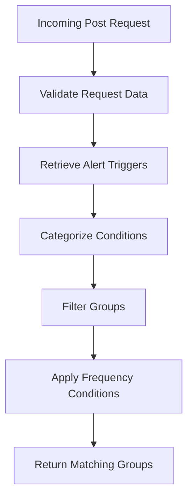

This document will cover the process of handling post requests for alert triggers. We'll cover:

1. Validating incoming request data
2. Retrieving alert triggers based on specified rules
3. Categorizing conditions and filtering groups
4. Applying frequency conditions

Technical document: <SwmLink doc-title="Handling Post Requests for Alert Triggers">[Handling Post Requests for Alert Triggers](/.swm/handling-post-requests-for-alert-triggers.8xwvvl8e.sw.md)</SwmLink>

# [Validating Incoming Request Data](https://app.swimm.io/repos/Z2l0aHViJTNBJTNBc2VudHJ5LWRlbW8tMSUzQSUzQVN3aW1tLURlbW8=/docs/8xwvvl8e#the-post-function)

When a post request is received to retrieve alert triggers, the first step is to validate the incoming request data. This ensures that the data provided by the user is in the correct format and contains all necessary information. If the data is not valid, an error response is returned to the user, indicating what needs to be corrected.

# [Retrieving Alert Triggers Based on Specified Rules](https://app.swimm.io/repos/Z2l0aHViJTNBJTNBc2VudHJ5LWRlbW8tMSUzQSUzQVN3aW1tLURlbW8=/docs/8xwvvl8e#the-post-function)

Once the request data is validated, the system proceeds to retrieve alert triggers based on the specified rules. This involves calling a function that processes the validated data and determines which groups would have triggered the given conditions and filters over the past two weeks. The goal is to provide the user with a preview of potential alerts that match their criteria.

# [Categorizing Conditions and Filtering Groups](https://app.swimm.io/repos/Z2l0aHViJTNBJTNBc2VudHJ5LWRlbW8tMSUzQSUzQVN3aW1tLURlbW8=/docs/8xwvvl8e#the-preview-function)

The next step is to categorize the conditions into issue state conditions and frequency conditions. Issue state conditions are related to changes in the state of issues, such as creation or resolution, while frequency conditions are related to the frequency of events. The system retrieves relevant group activities and applies the conditions to filter the groups. This ensures that only the groups that meet the specified conditions are considered for alert triggers.

# [Applying Frequency Conditions](https://app.swimm.io/repos/Z2l0aHViJTNBJTNBc2VudHJ5LWRlbW8tMSUzQSUzQVN3aW1tLURlbW8=/docs/8xwvvl8e#applying-frequency-conditions-to-issue-state-activity)

Finally, the system applies frequency conditions to the filtered groups. Frequency conditions are used to determine if the activities within a group meet certain frequency criteria, such as the number of events within a specific time frame. The system organizes the frequency conditions and checks if the activities pass these conditions. If they do, the activities are added to the list of potential alert triggers. The system then returns the groups that match all the specified conditions and frequency criteria.

&nbsp;

*This is an auto-generated document by Swimm AI 🌊 and has not yet been verified by a human*

<SwmMeta version="3.0.0" repo-id="Z2l0aHViJTNBJTNBc2VudHJ5LWRlbW8tMSUzQSUzQVN3aW1tLURlbW8=" repo-name="sentry-demo-1" doc-type="product-flows">Powered by [Swimm](/)</SwmMeta>
