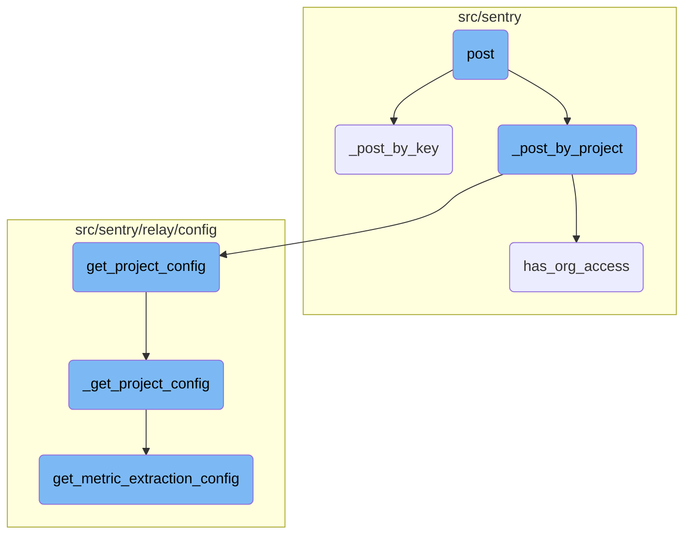
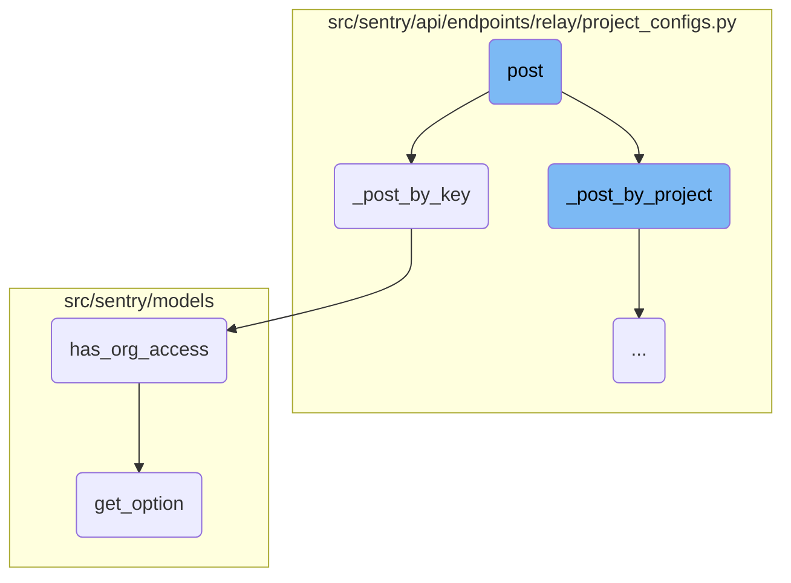
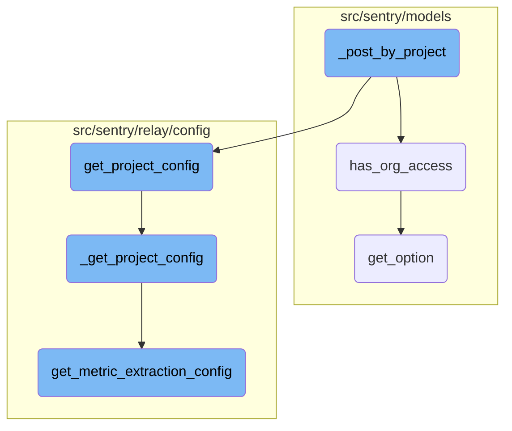

This document explains the <SwmToken path="src/sentry/api/endpoints/relay/project_configs.py" pos="41:3:3" line-data="    def post(self, request: Request):">`post`</SwmToken> function, which handles incoming POST requests. It checks if the relay is internal and authorized to fetch configuration information. Depending on the version specified in the request, it either schedules a full configuration computation or fetches configurations by key or project.

The <SwmToken path="src/sentry/api/endpoints/relay/project_configs.py" pos="41:3:3" line-data="    def post(self, request: Request):">`post`</SwmToken> function starts by checking if the relay making the request is internal and authorized. If it is, the function then looks at the version specified in the request. Based on this version, it decides whether to compute the full configuration or fetch configurations by key or project. The function <SwmToken path="src/sentry/api/endpoints/relay/project_configs.py" pos="146:3:3" line-data="    def _post_by_key(self, request: Request) -&gt; MutableMapping[str, ProjectConfig]:">`_post_by_key`</SwmToken> fetches project configurations based on public keys, ensuring only active keys and accessible organizations are considered. The function <SwmToken path="src/sentry/api/endpoints/relay/project_configs.py" pos="64:12:12" line-data="            response[&quot;configs&quot;] = self._post_by_project(request=request)">`_post_by_project`</SwmToken> fetches project and organization data, constructs project configurations, and ensures that the necessary configurations are retrieved and cached.

Here is a high level diagram of the flow, showing only the most important functions:



# Flow drill down

First, we'll zoom into this section of the flow:



<SwmSnippet path="/src/sentry/api/endpoints/relay/project_configs.py" line="41">

---

## Handling the post request

The <SwmToken path="src/sentry/api/endpoints/relay/project_configs.py" pos="41:3:3" line-data="    def post(self, request: Request):">`post`</SwmToken> function handles incoming POST requests. It first checks if the relay is internal and authorized to fetch configuration information. Depending on the version specified in the request, it either schedules a full configuration computation or fetches configurations by key or project.

```python
    def post(self, request: Request):
        relay = request.relay
        assert relay is not None  # should be provided during Authentication
        response = {}

        if not relay.is_internal:
            return Response("Relay unauthorized for config information", status=403)

        version = request.GET.get("version") or "1"
        set_tag("relay_protocol_version", version)

        if version == "3" and request.relay_request_data.get("global"):
            response["global"] = get_global_config()
            response["global_status"] = "ready"

        if self._should_post_or_schedule(version, request):
            # Always compute the full config. It's invalid to send partial
            # configs to processing relays, and these validate the requests they
            # get with permissions and trim configs down accordingly.
            response.update(self._post_or_schedule_by_key(request))
        elif version in ["2", "3"]:
```

---

</SwmSnippet>

<SwmSnippet path="/src/sentry/api/endpoints/relay/project_configs.py" line="146">

---

## Fetching configurations by key

The <SwmToken path="src/sentry/api/endpoints/relay/project_configs.py" pos="146:3:3" line-data="    def _post_by_key(self, request: Request) -&gt; MutableMapping[str, ProjectConfig]:">`_post_by_key`</SwmToken> function fetches project configurations based on public keys. It retrieves project keys, projects, and organizations from the cache, ensuring that only active keys and accessible organizations are considered. It then computes the project configuration for each public key and caches the results.

```python
    def _post_by_key(self, request: Request) -> MutableMapping[str, ProjectConfig]:
        public_keys = request.relay_request_data.get("publicKeys")
        public_keys = set(public_keys or ())

        project_keys: MutableMapping[str, ProjectKey] = {}
        project_ids: set[int] = set()

        with start_span(op="relay_fetch_keys"):
            with metrics.timer("relay_project_configs.fetching_keys.duration"):
                for key in ProjectKey.objects.get_many_from_cache(public_keys, key="public_key"):
                    if key.status != ProjectKeyStatus.ACTIVE:
                        continue

                    project_keys[key.public_key] = key
                    project_ids.add(key.project_id)

        projects: MutableMapping[int, Project] = {}
        organization_ids: set[int] = set()

        with start_span(op="relay_fetch_projects"):
            with metrics.timer("relay_project_configs.fetching_projects.duration"):
```

---

</SwmSnippet>

<SwmSnippet path="/src/sentry/models/relay.py" line="63">

---

### Checking organization access

The <SwmToken path="src/sentry/models/relay.py" pos="63:3:3" line-data="    def has_org_access(self, org):">`has_org_access`</SwmToken> function checks if a relay has access to a given organization. Internal relays always have access, while external relays must be listed in the organization's trusted relays.

```python
    def has_org_access(self, org):
        # Internal relays always have access
        if self.is_internal:
            return True

        trusted_relays = org.get_option("sentry:trusted-relays", [])
        key = str(self.public_key_object)

        for relay_info in trusted_relays:
            if relay_info is not None and relay_info.get("public_key") == key:
                return True

        return False
```

---

</SwmSnippet>

<SwmSnippet path="/src/sentry/models/project.py" line="416">

---

### Retrieving organization options

The <SwmToken path="src/sentry/models/project.py" pos="416:3:3" line-data="    def get_option(">`get_option`</SwmToken> function retrieves a specified option for an organization. If the option is not set, it checks the organization's template for a default value.

```python
    def get_option(
        self, key: str, default: Any | None = None, validate: Callable[[object], bool] | None = None
    ) -> Any:
        # if the option is not set, check the template
        if not self.option_manager.isset(self, key) and self.template is not None:
            return self.template_manager.get_value(self.template, key, default, validate)

        return self.option_manager.get_value(self, key, default, validate)
```

---

</SwmSnippet>

Now, lets zoom into this section of the flow:



<SwmSnippet path="/src/sentry/api/endpoints/relay/project_configs.py" line="224">

---

## Fetching Projects and Organizations

The <SwmToken path="src/sentry/api/endpoints/relay/project_configs.py" pos="64:12:12" line-data="            response[&quot;configs&quot;] = self._post_by_project(request=request)">`_post_by_project`</SwmToken> function begins by fetching the project and organization data. It retrieves project <SwmToken path="src/sentry/api/endpoints/relay/project_configs.py" pos="25:10:10" line-data="# We&#39;ll log project IDS if their config size is larger than this value">`IDS`</SwmToken> from the request and uses them to fetch project objects from the cache. Similarly, it fetches organization objects and their options to avoid repeated database access.

```python
        project_ids = set(request.relay_request_data.get("projects") or ())

        with start_span(op="relay_fetch_projects"):
            if project_ids:
                with metrics.timer("relay_project_configs.fetching_projects.duration"):
                    projects = {p.id: p for p in Project.objects.get_many_from_cache(project_ids)}
            else:
                projects = {}

        with start_span(op="relay_fetch_orgs"):
            # Preload all organizations and their options to prevent repeated
            # database access when computing the project configuration.
            org_ids: set[int] = {project.organization_id for project in projects.values()}
            if org_ids:
                with metrics.timer("relay_project_configs.fetching_orgs.duration"):
                    orgs_seq = Organization.objects.get_many_from_cache(org_ids)
                    orgs = {o.id: o for o in orgs_seq if request.relay.has_org_access(o)}
            else:
                orgs = {}
```

---

</SwmSnippet>

<SwmSnippet path="/src/sentry/api/endpoints/relay/project_configs.py" line="257">

---

## Constructing Project Configurations

The function then constructs the project configurations. For each project, it checks if the project and its organization exist. If they do, it fetches the project configuration using the <SwmToken path="src/sentry/api/endpoints/relay/project_configs.py" pos="274:7:7" line-data="                    project_config = config.get_project_config(">`get_project_config`</SwmToken> function and stores it in the <SwmToken path="src/sentry/api/endpoints/relay/project_configs.py" pos="257:1:1" line-data="        configs: MutableMapping[str, ProjectConfig] = {}">`configs`</SwmToken> dictionary.

```python
        configs: MutableMapping[str, ProjectConfig] = {}
        for project_id in project_ids:
            configs[str(project_id)] = {"disabled": True}

            project = projects.get(int(project_id))
            if project is None:
                continue

            organization = orgs.get(project.organization_id)
            if organization is None:
                continue

            # Prevent organization from being fetched again in quotas.
            project.set_cached_field_value("organization", organization)

            with start_span(op="get_config"):
                with metrics.timer("relay_project_configs.get_config.duration"):
                    project_config = config.get_project_config(
                        project,
                        project_keys=project_keys.get(project.id) or [],
                    )
```

---

</SwmSnippet>

<SwmSnippet path="/src/sentry/relay/config/__init__.py" line="283">

---

## Getting Project Configuration

The <SwmToken path="src/sentry/relay/config/__init__.py" pos="283:2:2" line-data="def get_project_config(">`get_project_config`</SwmToken> function constructs the <SwmToken path="src/sentry/relay/config/__init__.py" pos="285:4:4" line-data=") -&gt; ProjectConfig:">`ProjectConfig`</SwmToken> information. It starts a transaction and a timer for performance monitoring and then calls the <SwmToken path="src/sentry/relay/config/__init__.py" pos="302:3:3" line-data="            return _get_project_config(project, project_keys=project_keys)">`_get_project_config`</SwmToken> function to get the actual configuration.

```python
def get_project_config(
    project: Project, project_keys: Iterable[ProjectKey] | None = None
) -> ProjectConfig:
    """Constructs the ProjectConfig information.
    :param project: The project to load configuration for. Ensure that
        organization is bound on this object; otherwise it will be loaded from
        the database.
    :param project_keys: Pre-fetched project keys for performance. However, if
        no project keys are provided it is assumed that the config does not
        need to contain auth information (this is the case when used in
        python's StoreView)
    :return: a ProjectConfig object for the given project
    """
    with sentry_sdk.isolation_scope() as scope:
        scope.set_tag("project", project.id)
        with (
            sentry_sdk.start_transaction(name="get_project_config"),
            metrics.timer("relay.config.get_project_config.duration"),
        ):
            return _get_project_config(project, project_keys=project_keys)
```

---

</SwmSnippet>

<SwmSnippet path="/src/sentry/relay/config/__init__.py" line="1003">

---

## Constructing Detailed Project Configuration

The <SwmToken path="src/sentry/relay/config/__init__.py" pos="1003:2:2" line-data="def _get_project_config(">`_get_project_config`</SwmToken> function constructs a detailed project configuration. It includes various settings such as public keys, allowed domains, trusted relays, PII configurations, and more. It also adds experimental configurations and metrics settings if applicable.

```python
def _get_project_config(
    project: Project, project_keys: Iterable[ProjectKey] | None = None
) -> ProjectConfig:
    if project.status != ObjectStatus.ACTIVE:
        return ProjectConfig(project, disabled=True)

    public_keys = get_public_key_configs(project_keys=project_keys)

    with sentry_sdk.start_span(op="get_public_config"):
        now = datetime.now(timezone.utc)
        cfg = {
            "disabled": False,
            "slug": project.slug,
            "lastFetch": now,
            "lastChange": now,
            "rev": uuid.uuid4().hex,
            "publicKeys": public_keys,
            "config": {
                "allowedDomains": list(get_origins(project)),
                "trustedRelays": [
                    r["public_key"]
```

---

</SwmSnippet>

<SwmSnippet path="/src/sentry/relay/config/metric_extraction.py" line="101">

---

## Metric Extraction Configuration

The <SwmToken path="src/sentry/relay/config/metric_extraction.py" pos="101:2:2" line-data="def get_metric_extraction_config(project: Project) -&gt; MetricExtractionConfig | None:">`get_metric_extraction_config`</SwmToken> function returns the metric extraction configuration for a given project. It checks for feature flags and builds configurations for <SwmToken path="src/sentry/relay/config/metric_extraction.py" pos="108:3:5" line-data="     - On-demand metrics widgets.">`On-demand`</SwmToken> metrics, span attributes, and extrapolation if applicable.

```python
def get_metric_extraction_config(project: Project) -> MetricExtractionConfig | None:
    """
    Returns generic metric extraction config for the given project.

    This requires respective feature flags to be enabled. At the moment, metrics
    for the following models are extracted:
     - Performance alert rules with advanced filter expressions.
     - On-demand metrics widgets.
    """
    # For efficiency purposes, we fetch the flags in batch and propagate them downstream.
    sentry_sdk.set_tag("organization_id", project.organization_id)

    with sentry_sdk.start_span(op="get_on_demand_metric_specs"):
        alert_specs, widget_specs = build_safe_config(
            "on_demand_metric_specs", get_on_demand_metric_specs, project
        ) or ([], [])
    with sentry_sdk.start_span(op="generate_span_attribute_specs"):
        span_attr_specs = (
            build_safe_config("span_attribute_specs", _generate_span_attribute_specs, project) or []
        )
    with sentry_sdk.start_span(op="merge_metric_specs"):
```

---

</SwmSnippet>

&nbsp;

*This is an auto-generated document by Swimm AI 🌊 and has not yet been verified by a human*

<SwmMeta version="3.0.0" repo-id="Z2l0aHViJTNBJTNBc2VudHJ5LWRlbW8tMSUzQSUzQVN3aW1tLURlbW8=" repo-name="sentry-demo-1" doc-type="flows"><sup>Powered by [Swimm](/)</sup></SwmMeta>
